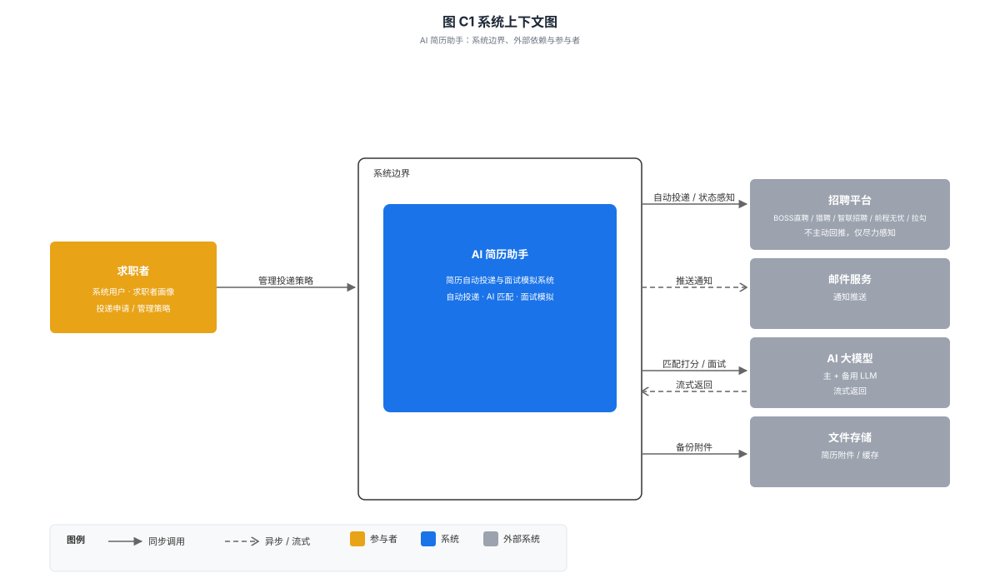
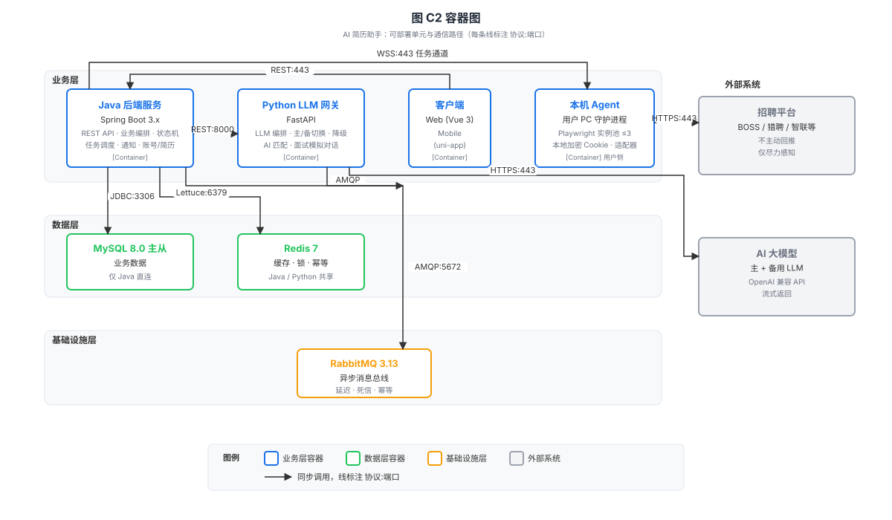
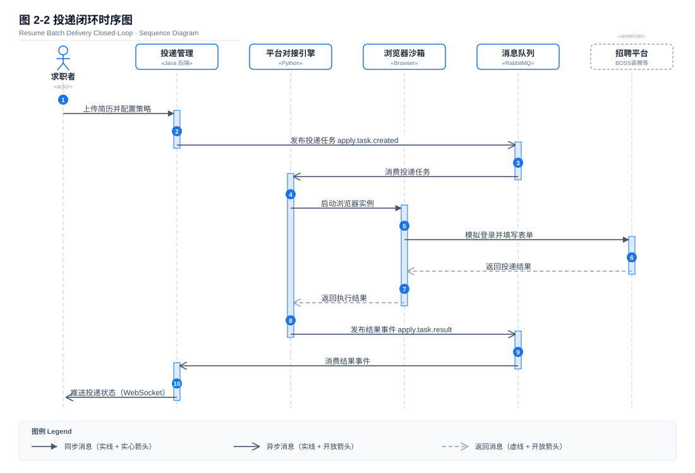
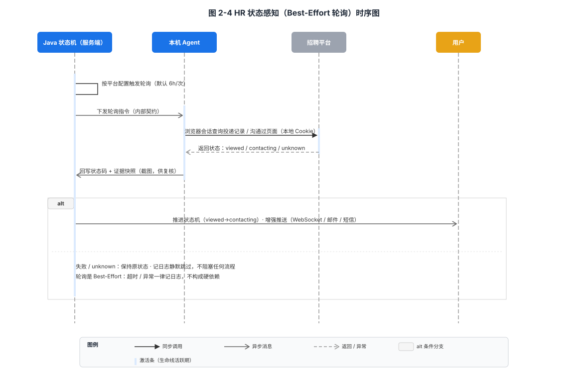
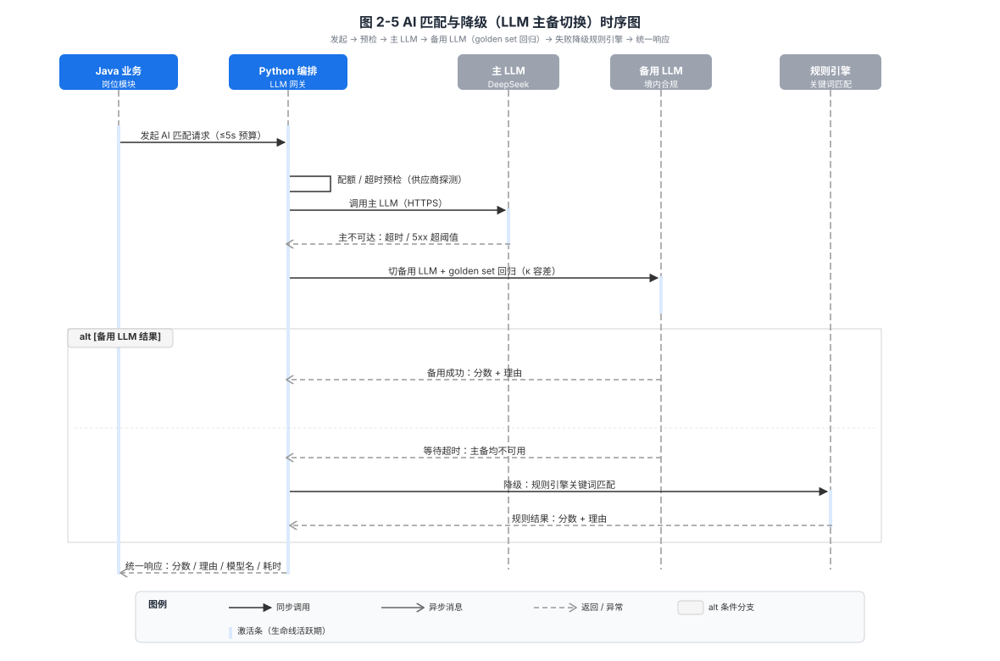
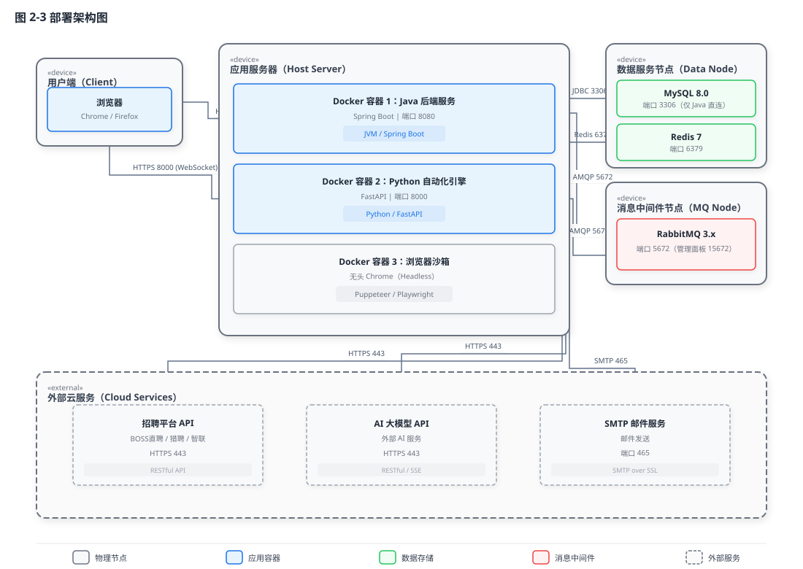
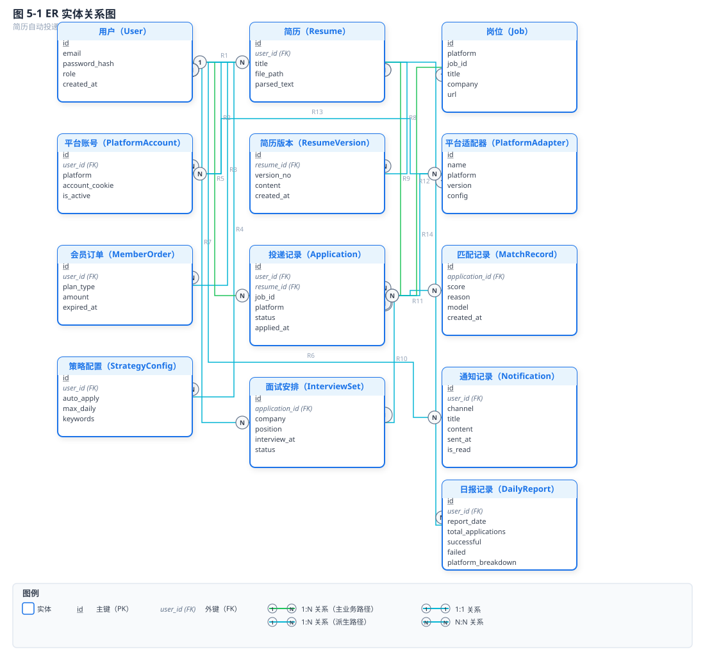

# 概要设计文档（HLD）：AI 简历助手 — 自动投递与面试模拟

> 2026-08-16 · **v3.17（AI 编排服务 LLD v1.0：B01–B05 机器可读契约闭环）**：AI 编排服务（服务端 Python LLM 网关）模块 LLD 落地，闭合 HLD §9.4 残余「B01–B05 AI 编排内部契约补机器可读 schema」。新增机器可读契约 `b01-match`/`b02-questions`/`b03-evaluate`/`b04-optimize`/`b05-ats`（各 request/response 独立 schema）+ `ai-result.event.schema.json`（`ai.task.result` 异步回写事件）+ `ai-orchestrator.registry`（五个方法注册表，contractVersion 1.0.0）；全部纳入 `design/contracts/` 校验器（schema 24 / 注册表 5 全绿）。LLD 详述三级降级链/模型路由 golden set κ 回归/内容安全/匹配度模型/配额超时/R-10 幻觉硬熔断默认阈值（显式登记待决项）。
> 2026-08-16 · **v3.16（接口完整性收口：#110/#111）**：适配器模块 LLD v1.0 落地，闭合 HLD §9.4 残余「B07/B09 字段 schema」「searchJobs/getJobDetail 采集路径入 B 系列」(#111) 与「22/25 外部 API 补详细契约」(#110)。新增机器可读契约 `b07-task-result`/`b09-health`/`b10-search-jobs`/`b11-get-job-detail`/`crawler-result` schema + `adapter-facade.registry`（统一 PlatformAdapter 门面）+ `external-api.registry`（A 层 25 端点全枚举，A09/A11/A14/A21 全详 + 其余字段大纲）；新增 B10/B11 采集触发端点与事件 `crawler.job.discovered`；全部纳入 `design/contracts/` 校验器（双闸门）。R-15 覆盖率长尾收窄，剩余 [LLD 细化] 为业务子域（解析/退款/PIPL 等）。
> 2026-08-15 · **v3.15（契约测试基础设施落地）**：接口契约从"纸面"升级为"机器可校验"——新增 `design/contracts/`：统一错误信封 / 事件信封 / RPC 信封 JSON Schema、错误码注册表、本机 Agent↔服务端 RPC 注册表，以及零依赖校验器 `validate_contracts.py`（正向样本通过 + 反向样本证伪 + 注册表自洽 + 错误码唯一）；并接入 GitHub Actions CI 与 pre-commit 双闸门，使核心链路契约可机器校验（支撑 R-15 缓解；R-15 覆盖率长尾仍 [LLD 细化]）。
> 2026-08-15 · **v3.14（接口完整性补全）**：接口设计章（§4）全面契约化——§4.7 升级为权威错误注册表（统一信封 + retryable/user_action + 双向对账）、§4.6 事件逐类型化 payload + 顺序/去重/重放/DLQ、新增 §4.8 接口契约总规范（基线：版本化/幂等/鉴权/分页/限流/SLA/异步）、§4.9 本机 Agent↔服务端 RPC 契约（传输/设备令牌生命周期/双向 RPC 方法清单/握手协商）、§4.10 支付渠道回调契约（签名验签+幂等+对账）、B01–B05 字段 schema。契约级覆盖率由 ~30% 提升至核心链路全覆盖。
> 2026-08-15 · **v3.11（本轮修复）**：修复 fig-c2-container.svg 标签白底遮挡箭头（REST:8000、HTTPS:443，缩窄白底至刚好包住文本）；修复 fig-2-4-hr-status.svg / fig-2-5-ai-match.svg alt 分支背景遮挡激活条（片段背景移至激活条之前绘制）；统一所有时序图底部图例格式（背景框 + 五项说明）；同步更新作图-01-通用规范.md（新增 §2.4.6 ST-16 标签白底矩形不遮挡规则 + 图例色板 `#D1D5DB`/`#F9FAFB`）和作图-04-UML时序图.md（新增 §3.3.8 渲染顺序与图例规范）。
> 
> 2026-08-15 · v3.10（九审 R-02 §2 章节跳号与结构债修复：§2.2 改名 C4 静态结构、新增 §2.3 关键流程时序图收容三张时序图、§2.5→§2.4 / §2.6→§2.5 重编号并订正 11 处正向引用；继承 v3.9 设计深度，对齐 PRD v4.5）
> 上游文档：[PRD v4.5 最终版](../prd/PRD-简历自动投递与面试模拟-最终版.md)
> 关联 ADR：001/002/003/004/006/008/009/010/011/012/014/015/016/017/018/021/022/023
>
> **⚠ 重大架构修订（v1.1 → v2.0）**：本版将执行模型从「服务端集中式浏览器自动化」重构为「用户本机 Agent 执行」，对齐 PRD §15.1（核心决策：本机 Agent 执行）与 §C.1（本机执行）/ §C.5（Cookie 本地化不上云）。原 HLD v1.1 中「服务端执行投递 + 服务端加密存储 Cookie」两处表述（记为 **C1 / C2 矛盾**）于本版消解。
> **⚠ 重导出修订（v2.0 → v3.0）**：v2.0 仅消解 C1/C2，正文仍为 PRD v3.0 时代框架，导致 PRD v4.x 新增的「生产事故防线」（§17–§35）在 HLD 整体缺席（§1.2 追溯矩阵也停在 v3.0 章节集）。本版**基于 PRD v4.5 全文重导出**：扩展 §6（新增 §6.5–§6.10）将 PRD §17–§35 的事故预防/可靠性/本机 Agent 安全/发布治理机制落成 HLD 设计决策，并刷新 §1.2 追溯矩阵至全覆盖。对齐经 `check_prd_hld_traceability.py` 门禁校验（见 `PRD-HLD-对齐规范.md`）。
> - **C1（执行模型）**：浏览器自动化（Playwright 投递/采集/面试模拟浏览器动作）不再部署在服务端 Python 引擎，下沉到用户本机 Agent（桌面守护进程）。
> - **C2（Cookie）**：用户平台 Cookie 不再以密文存储于服务端数据库，改为仅本机 Agent 本地加密（信封加密）、不上传、不备份云端。
> - **图状态（本轮修复, 2026-08-15）**：4 张 SVG 文件完成修复：fig-c2-container.svg 标签白底缩窄不遮挡箭头；fig-2-4-hr-status.svg / fig-2-5-ai-match.svg alt 片段提前绘制不遮挡激活条；三张时序图（fig-2-2-apply-flow / fig-2-4-hr-status / fig-2-5-ai-match）底部图例统一增强（背景框 + 五项说明）。lint + geometry 双验证 11 张图均 0 错误 0 警告。同步更新作图-01-通用规范.md（§2.4.6 ST-16 + 图例色板）和作图-04-UML时序图.md（§3.3.8 渲染顺序与图例规范）。

---

## 1. 设计概览

### 1.1 目的与范围

本文档描述"AI 简历助手 — 自动投递与面试模拟"系统的**概要设计（HLD）**，回答"如何架构与契约"：系统模块如何拆分、模块间如何交互、对外与对内的接口契约、数据模型概要、运行时与部署形态、非功能设计以及错误处理策略。

**本设计覆盖**：PC 端 + 移动端的全部 9 个功能模块（简历工作台、岗位浏览与投递、投递策略引擎、平台适配器、面试备战、AI 面试模拟、投递联动、用户与多端同步、每日日报与推送），以及会员支付、通知推送等支撑能力。

**本设计不覆盖**（属于 LLD / 后续文档）：
- 各模块类级别的实现细节（类图、方法签名）→ LLD
- 逐表 DDL 与索引定义 → 数据库设计文档
- 前端组件规范与页面级交互 → 前端设计文档
- 测试计划、部署运维手册 → P2 交付项

### 1.2 需求追溯矩阵

| 设计目标 | 来源（PRD） | 落地位置（本文档） |
|---------|-------------|-------------------|
| 每日批量投递 80-100 份（含移动端确认） | §3 指标 / 模块 2、3 | §2 架构 / §3.3 投递链路 / §4.5 批量投递接口 |
| 自动投递成功率 ≥ 90%，幂等不重复 | §11 验收 / 模块 3 | §3.4 执行层 / §5 幂等键 / §7.4 |
| 新平台接入 ≤ 2 人天 | §11 验收 / 模块 4 | §3.6 适配器框架 / §4.5 适配器接口 |
| AI 匹配度 / 面试题 / 作答评估 | §7 AI 专项 / 模块 5、6 | §3.5 AI 服务 / §4.6 AI 契约 |
| 投递成功 5 分钟内联动生成面试题 | §11 验收 / 模块 7 | §3.7 联动流程 / §5.6 异步事件 |
| HR 状态感知为 Best-Effort，不阻塞主流程 | 模块 7 消除歧义 / distill-002 | §3.7 getApplicationStatus() 轮询 / §7.2 兜底 |
| 移动端浏览、确认、通知、轻量备战 | §5.2 场景 6-10 | §2.5 多端架构 / §4 接口分层 |
| 摄像头本地画中画，不评估不录制不上传 | 模块 6 消除歧义 / distill-002 | §3.5.3 摄像头约束 |
| 高级版"优先支持"SLA 可量化 | 模块 8 消除歧义 / distill-002 | §3.2 用户与权限 / §4.1 工单契约 |
| 角色权限矩阵（免费/专业/高级/管理员） | 模块 8 | §3.1 / §4.3 鉴权设计 |
| 并发浏览器实例 ≤ 3，OOM/崩溃可恢复 | 模块 3 全局异常 | §3.4.3 实例池 / §7.3 |
| LLM 全场景降级链 | §7.3 / 模块 3 全局异常 | §7.1 |
| 支付异常（24h 有效/对账/宽限期） | §12 全局异常 | §3.8 / §7.5 |
| 每日 20:00 自动生成投递日报并推送 | §5.3 场景十一 / 模块 9 | §3.12 日报模块 / §5.7 日报数据 |
| 日报推送失败时站内消息 + 邮件重试兜底 | 模块 9 边界与异常 | §3.12 边界 / §7.4 降级 |
| 合规应急 / 最坏情况 / 泄露通报（PIPL 57） | §17 / §24.4 / §24.8 | §6.2 安全 / §6.6 事件响应 / §6.8 密钥 |
| 非功能需求 NFR（含 deadman / SLI） | §18.4 | §6.4 可观测性 / §6.5 / §6.9（deadman、SLI/SLO） |
| 范围外与待定项登记 | §19 | §9.4 / §9.6（延后项显式登记） |
| 系统核心实体与数据模型 | §20 | §5 数据设计 / §6.8 密钥与凭证 |
| 系统基建（采集/限流/灾备） | §21.3 | §6.5 F 弱网/配置 / §6.7 本地库 corruption / §6.5 O 支付双源 |
| 岗位采集与数据源策略 | §21.1 | §6.12 G1（采集架构决策：数据源/频率/平台限流友好/与投递节奏耦合） |
| 服务端限流与配额（非 LLM） | §21.2 | §6.5 L（LLM 配额双闸）/ §6.12 G4（通用 API 限流配额 + 采集容量模型） |
| 系统缺口补足（环境/支付/审计/缓存/资源） | §22 | §6.2 限流 / §6.5 O 依赖韧性 / §6.9 审计 |
| 系统韧性、兼容与安全（S1–S13） | §23 | §6.5 A–K（版本兼容/安全模型/迁移/DR/配置/fail-closed/弱网/混沌/日志/缓存/冲突/A-B） |
| 事件响应与韧性运营（P1–P11） | §24 | §6.6（分级/Runbook/误投撤回/泄露/kill switch/复盘/状态页/Game day） |
| 新手激活与产品细节 | §25 | §3.1 / §4 / §6.7（兼容与签名） |
| AI 产品细节（Prompt 回归/价值观/ASR） | §26 | §3.8 / §3.9 / §6.9（Prompt 版本管理与回归） |
| 增长、可观测性与多端细节 | §27 | §5.3 离线冲突 / §6.5 J 配置冲突 / §6.5 O 依赖韧性 |
| 生产事故预防补全（护栏/门禁） | §28 | §6.5 L（LLM 双闸/熔断/诈骗/发布门禁） |
| 本机 Agent 事故预防（A–F） | §29 | §6.5 M（看门狗/凭证/自更新/留痕/睡眠/不确定就停）/ §6.7 |
| 生产事故最小化兜底（Q1–Q12） | §30 | §6.5 A 最小版本 / N（fail-closed/UTC+8/离线锁/break-glass/硬上限/脱敏/资源感知） |
| 系统工程补充（R1–R12） | §31 | §6.5 O/P/Q / §6.6 guardrail / §6.8 / §6.9 |
| 资深 PM 工程补充（上线前因素） | §34 | §6.7（EV 签名/功耗/兼容）/ §6.9 / §6.5 |
| 发布治理与运营闭环 | §35.1 / §35.2 | §6.10（OSS 合规 / Beta 计划） |
| 数据与指标 | §10 | §6.4 可观测性 / §6.9（SLI/SLO、合成监控、埋点对齐） |
| 系统架构与执行模型决策 | §15 | §2 架构（本机 Agent 执行模型）/ §4.5 内部契约 / 全文对齐 |
| 商业化测算与单位经济 | §16 | §1.3 容量与成本基线 / §6.5 L（LLM 成本双闸）/ §6.9（成本护栏） |
| 设计深度补强（语义检索 / 埋点 schema / 多环境 / 权益矩阵 / 匹配度模型 / 内容安全 / 离线同步） | §7.5 / §10.2 / §10.3 / §12 / §22.1 / §26.4 / §27.2 / §31.2 | §6.11（B1–B7 逐项落成）/ §3.1（权益矩阵） |
| **不在本档范围（产品/商业/背景类，有意排除）** | §1 需求分类 / §2 背景 / §3 目标 / §4 竞品 / §13 引导 / §14 术语 / §32 商业论证 / §33 北极星增长 | 商业论证、增长模型、竞品调研、术语表属产品/运营职责，不纳入技术设计；§35.3–§35.6/§35.8 运营闭环同此 |

### 1.3 设计目标与约束

**目标**：

| 目标 | 度量 | 证据 |
|------|------|------|
| 投递可靠性 | 单任务成功率 ≥ 90%（排除网络与平台限流） | [Data-backed] PRD §11 |
| 写操作幂等 | 同一 idempotency_key 不产生重复投递 | [Data-backed] PRD §11 |
| 平台扩展效率 | 新平台适配器 ≤ 2 人天 | [Data-backed] PRD §11 |
| AI 交互及时性 | 匹配度 ≤5s、作答评估 ≤3s、联动 ≤5min | [Data-backed] PRD §7.4 |
| 推送时效 | 面试邀请通知 ≤ 10s 触达 | [Data-backed] PRD §11 |
| 容量基线 | 当前定位单用户自用/极早期小规模；架构可平滑演进至 500 DAU（届时再拆服务，触发线非起步承诺）；浏览器池"≤3"为单 Agent 进程约束 | [Data-backed] ADR-009 / 修订说明 |

**约束**：

| 约束 | 说明 | 证据 |
|------|------|------|
| 模块化单体 | 用户过万前不拆微服务，模块边界必须清晰 | [Expert judgment] ADR-001 |
| 双语言异构 | Java(Spring Boot) 业务 + Python(FastAPI) AI/自动化 | [Expert judgment] ADR-002 |
| 数据库 | MySQL 8.0 主从 + Redis 7；不引入 PostgreSQL/Mongo | [Expert judgment] ADR-003 |
| 异步基础 | RabbitMQ 承载异步任务/幂等/延迟队列 | [Expert judgment] ADR-004 |
| 状态机 | 10 状态投递状态机，单向不可逆 | [Expert judgment] ADR-008 |
| 反风控 | 三阶段：指纹随机化 → 代理 IP → 日上限 | [Expert judgment] ADR-018 |
| 隐私 | 系统不存储平台账号密码，仅加密 Cookie | [Data-backed] PRD §8.1 |

### 1.4 关键术语

| 术语 | 定义 |
|------|------|
| 投递任务（ApplicationTask） | 一次原子投递动作的单元，携带全局唯一 idempotency_key |
| 投递记录（Application） | 用户视角的投递业务实体，走 10 状态机 |
| 适配器（PlatformAdapter） | 实现统一接口契约的单平台插件 |
| 浏览器实例池 | Python 侧管理 ≤3 个并发放浏览器实例的资源池 |
| 尽力感知（Best-Effort） | HR 查看状态通过轮询/通知解析获取，失败不阻塞主流程 |
| PoC | 关键风险前置验证：先行单平台投递闭环试验 |

---

## 1.5 架构决策记录（ADR）

> **本节是文档从"信息/清单"转向"设计"的核心。** 一份合格的软件工程设计文档必须记录**"为什么选 A 而非 B"**——即架构决策。此前 HLD 多处仅以 `ADR-00x` 标签引用、或以"补强"小节散落若干决策点，缺少统一结构。本条把它们正式落为决策记录，每条遵循：**背景与问题 → 候选方案 → 决策 → 决策理由 → 后果（正面 / 负面 / 风险） → 关联**。下游 LLD 与实现分工以本节为"为何如此设计"的权威来源。

### ADR-001 部署形态：模块化单体（Java 业务侧）+ 独立 Python LLM 服务
- **背景与问题**：AI 匹配/评分是主成本与迭代热点，但与业务强耦合，需决定部署边界。
- **候选方案**：① 纯单体（全 Java）；② 全微服务；③ 模块化单体 + 独立 LLM 服务（**决策**）。
- **决策理由**：单用户自用定位，过早微服务引入分布式事务与运维成本；LLM 独立便于模型迭代、成本双闸隔离、按 §2.5⑤ 演进路径先拆。
- **后果**：+ 演进清晰、LLM 故障可降级链隔离；− 跨语言契约需 consumer-driven 测试（§6.13.4）。

### ADR-002 AI 编排与岗位采集归属服务端 Python（非本机 Agent）
- **背景与问题**：LLM 调用与采集管道放本机还是服务端？
- **候选方案**：① 全本机；② 全服务端（**决策**）；③ 混合。
- **决策理由**：LLM 密钥/配额集中管控；采集结果可共享候选池；本机 Agent 不持业务库（§C.1）。
- **后果**：+ 安全边界清晰；− 本机 Agent 经任务通道与服务端交互，需设备级鉴权（§4.5 B06–B09）。

### ADR-003 浏览器自动化执行侧 = 用户本机 Agent（非服务端云浏览器）
- **背景与问题**：投递/采集的浏览器操作在哪跑？
- **候选方案**：① 服务端云浏览器集群；② 用户本机 Agent（**决策**）。
- **决策理由**：Cookie 本地加密不上云（PIPL / 账号安全）；平台对"真人本机"容忍度远高于"云 IP 集群"；本机资源即反封禁预算。
- **后果**：+ 合规/安全；− 本机进程稳定性与自更新成核心风险（R-11）；约束：单用户本机实例池 ≤3（反风控）。

### ADR-004 投递 / 事件总线 = RabbitMQ（direct + topic + DLQ）
- **决策**：投递执行类用 direct（按 `platformId` 路由隔离），事件类用 topic，失败进延迟重试 → 死信队列（DLQ）。
- **决策理由**：单平台熔断隔离、Agent 离线堆积、幂等去重。
- **后果**：+ 解耦与背压；− 引入 MQ 运维与幂等去重责任（§6.14.7）。

### ADR-005 Cookie 根密钥 = 双因子派生（OS 安全区 + 用户在场）
- **决策**：`device_master_key` 存 OS 安全区（TPM / CNG / Keychain）；解锁 KEK 需用户在场因子（Hello / Touch ID / Argon2id 口令）；`kek = HKDF-SHA256(master ‖ pass_k)`。不以硬件指纹为唯一根。
- **决策理由**：防磁盘提取（TPM 后端）；硬件变更仍可重置金库；规避硬件指纹隐私风险。
- **后果**：+ 抗提取；− 无 OS 安全区或遗忘口令需重新授权（§6.14.8）。

### ADR-006 幂等键 = (user_id, platform, job_id, apply_date) 四元组
- **决策**：四维度复合唯一索引，禁止全局 UUID 替代。
- **决策理由**：当日绝不对同岗重投、隔日可补投；多设备脑裂仍不重复投递。
- **后果**：+ 防重复投递命门；− LLD 必须显式携带四维度（§6.13.2 / LLD §8.2）。

### ADR-007 系统信令 ↔ 用户通知 双通道物理隔离
- **决策**：`SignalingSubsystem` 与 `NotificationSubsystem` 出口物理分离、共享事件总线。
- **决策理由**：杜绝"唤醒 Agent 的信令"误推用户造成骚扰。
- **后果**：+ 零信令泄漏；− 通知服务须拆两子系统（§6.13.1）。

### ADR-008 投递状态机：无回退边 + 服务端最终裁决 HR 感知态
- **决策**：10 态无回退边；`viewed / contacting / …` 由服务端轮询最终裁决，Agent 仅推进至 `submitted`。
- **决策理由**：状态可审计、避免"进行中"语义漂移；HR 感知为 best-effort 不阻塞功能。
- **后果**：+ 状态干净；− 孤儿任务清扫需定时兜底（§3.4）。

### ADR-009 分片键 user_id 首列预留（起步单库也按此物理排布）
- **决策**：高增表主键 / 首列分区键必含 `user_id`。
- **决策理由**：后期按 `user_id` 哈希分片零 schema 迁移。
- **后果**：+ 水平扩展无大改；− 起步即承担复合键（§6.15）。

### ADR-010 反封禁 pacing = per-platform token bucket + 人因抖动 + warm-up + 错误熔断
- **决策**：令牌桶匀速 + 正态抖动 + 新号降速 + 验证码/风控即熔断冷却。
- **决策理由**：消除等间隔机械节奏（机器人特征）。
- **后果**：+ 长期不被风控；− 参数需 PoC 实跑回填（§6.14.3 / PoC P1）。

---

## 2. 系统架构

### 2.1 架构风格

采用 **前后端分离 + 模块化单体 + 双语言异构 + 本机 Agent 执行** 的组合：

- **模块化单体**：Java Spring Boot 单进程承载全部业务模块，按领域边界组织模块，进程内调用为主（ADR-001）。
- **双语言异构（服务端）**：AI/LLM 编排能力独立为 Python FastAPI 服务（仅 LLM 网关，调用外部大模型 API），与 Java 业务服务通过 REST + RabbitMQ 解耦（ADR-002）。**注意：浏览器自动化（Playwright 投递/采集）不在此 Python 服务内**，已下沉到用户本机 Agent（部署形态见 §2.5，对齐 PRD §15.1）。
- **本机 Agent（用户 PC 桌面守护进程）**：独立轻量进程，负责持有平台 Cookie（本地加密）、运行 Playwright 浏览器实例池（≤3）、落地执行投递/采集/面试模拟的浏览器动作。通过长连接/推送从服务端拉取任务，本地执行后回写状态。服务端不代执行、不持有用户登录态（PRD §C.1）。
- **瘦客户端（Web PC 端 / 移动端 App）**：仅做配置、确认、查看，非执行体（PRD §25.1 / §31.1）。
- **异步优先**：一切耗时/外部依赖操作（投递执行、AI 生成、通知推送）异步化，客户端通过任务状态接口查询进度，避免阻塞用户操作。

理由：独立开发者单人可部署维护，先跑起来再演进；AI 生态与业务生态分离，各自独立迭代互不阻塞 [Expert judgment]。浏览器算力下沉到用户机器，服务端无大规模浏览器集群瓶颈，且 Cookie 永不出本机、各用户从各自 IP 发起投递，规避集中式合规与反封禁风险（PRD §15.1）。

**图交付标准**（本项目图表统一规范，适用于全部交付文档）：

- **方法论**：采用 C4 模型分层制图（Context → Container → Component → Code），一图一层次，禁止多层混合。时序图遵循 UML 2.5 规范（激活条、同步/异步箭头区分）。
- **绘图方式**：全部手绘 SVG，白底 `#ffffff` 风格，不依赖 Mermaid 等自动布局工具。
- **质量标准**：连线不穿卡、标注带底板、虚线加粗对比、命名一目了然；每张图必须带编号标题 + 逐层/逐步说明文字。
- **完整图清单**：见下方 2.2~2.5 节。

### 2.2 系统上下文与容器图（C4 分层）

> 各待重绘图的**内容规格（画什么要素/连线/红线）**已汇总至 `design/图信息说明书.md`，绘图人照此直接绘制即可，无需再读本页逐段说明。

> **图验证说明（透明记录，供审计）**：本节各图标注的"双验证（lint + geometry）全过"指 SVG **实质符合**《作图》标准（lint 规则 + 几何约束）。曾有一 transient 工具事件：`lint-svg.cjs` 的 `checkST14` 将**盒内文字标签**误判为线标注，导致 `fig-c2-container.svg` / `fig-2-3-deployment.svg` 短暂报 FAIL——属**检查器假阳性，非 SVG 缺陷**。已在 `lint-svg.cjs` 增加 `textCenterInsideBox()` 排除盒内文字后修复；复验 6 张目标 SVG 全部 PASS（0 错误 0 警告）。故"双验证全过"陈述准确，本说明仅记录该工具事件，不改变结论。

**C1 系统上下文图** — 展示系统边界和外部交互方



**图 C1 系统上下文图 · 依次说明**

1. 左侧为外部用户：**求职者（个人用户）** 执行投递简历、管理策略等操作，日投递量为 **专业版及以上 80–100 份 / 免费版 30 份**（目标值，需 v0.9 灰度验证，详见 PRD §3 / §6.2 / §12；用户画像见 PRD §5.1）。
2. 中心为系统边界：**简历自动投递与面试模拟系统**（AI 简历助手），对用户屏蔽内部技术细节。
3. 右侧为外部依赖：**招聘平台** 作为投递目标，首期支持 BOSS直聘 / 猎聘 / 智联招聘 / 前程无忧 / 拉勾（详见 PRD §6.2，后续扩展高校就业平台 / 国聘网等见 PRD §4.2）；**邮件服务（SMTP）** 发送通知；**AI 大模型服务** 提供匹配分析与面试模拟能力；**文件存储服务** 存放简历附件及缓存。
4. 同步调用（实线箭头）共 4 条：求职者→系统、系统→招聘平台（内含 **HR 状态尽力感知**，并非 HR 主动回推，见 PRD §7.3）、系统→AI 大模型、系统→文件存储；异步消息（虚线箭头）共 2 条：系统→邮件服务、AI 大模型→系统。

> ✅ **图已重绘 (v1.0, 2026-08-15)**：`fig-c1-system-context.svg` 已按本版对齐：移除「HR→系统」反模式箭头（并入系统→招聘平台的 HR 尽力感知语义，§7.3），招聘平台补齐首期 5 个（BOSS/猎聘/智联/前程无忧/拉勾，§6.2），4 同步 + 2 异步连线，双验证通过 (lint + geometry)。

**C2 容器图** — 展示系统内部可部署单元及其通信方式



**图 C2 容器图 · 依次说明**

1. **业务层（服务端）**：Java 后端服务（Spring Boot）提供 REST API 和业务逻辑编排；Python LLM 编排服务（FastAPI）仅承载 AI/LLM 网关（调用外部大模型 API），**不含浏览器自动化**。
2. **数据层**：MySQL 8.0（主从）存储主业务数据，**仅 Java 业务侧直连读写**（落实 ADR-002 双语言解耦，Python 经 REST/MQ 访问业务数据，不直连业务库）；Redis 负责缓存、分布式锁与幂等令牌（**不承载任务队列**，任务队列由 RabbitMQ 承担）；**用户平台 Cookie 不落此层**——本地加密存储于本机 Agent（见 §C.5）。
3. **本机 Agent 层（用户 PC）**：独立桌面守护进程，持有本地加密 Cookie、运行 Playwright 浏览器实例池（≤3）、执行投递/采集/面试模拟的浏览器动作；经长连接/推送从服务端拉取任务，本地执行后回写状态。
4. **基础设施层**：RabbitMQ 作为异步消息总线解耦服务端与本机 Agent；服务端**不再部署浏览器沙箱**（原 Docker 容器方案已废弃，见 §2.5）。

> ✅ **图已重绘 (v1.1, 2026-08-15)**：`fig-c2-container.svg` 已按本版对齐：移除服务端「Python 自动化引擎承载浏览器自动化」与「浏览器沙箱 Docker」（已废弃，§15.1），新增本机 Agent 层（用户侧，黄色容器）承载浏览器实例池（≤3）+ 本地加密 Cookie，双语言异构约束（Python 不直连业务库，§ADR-002），任务队列归 RabbitMQ（Redis 改缓存/锁/幂等语义），双验证通过 (lint + geometry 18/18)。

5. 配色说明：蓝色=应用容器（服务端），绿色=数据存储，黄色=本机 Agent 层（用户侧），红色=消息中间件，灰色=基础设施。


### 2.3 关键流程时序图

> 下列三类核心时序图为「流程视图」，独立于 §2.2 的 C4 静态结构；全部按「浏览器自动化只在本机 Agent 侧执行」红线重绘（规格详见 `design/图信息说明书.md`）。



**图 2-2 批量投递闭环时序图 · 依次说明**

1. 用户在 PC/移动端确认投递队列（批量选择岗位）。
2. Java 状态机先自查：角色权益、当日限额、幂等键合法性，不满足直接拒绝。
3. 校验通过后把投递任务（携带全局唯一 `idempotency_key`）写入任务表并通知本机 Agent（长连接/推送；Agent 离线则入队，上线后拉取）。
4. **本机 Agent** 从任务通道拉取投递任务（而非服务端消费执行）。
5. 本机 Agent 从**本地**浏览器实例池分配一个空闲实例（≤3），加载**本地加密 Cookie**。
6. 实例在用户机器上执行表单填充与提交（带行为模拟，防检测）。
7. 实例返回执行结果：成功、失败、或验证码（验证码将触发暂停）。
8. 执行结果经 Agent 回写至调度服务（状态事件回写）。
9. 调度服务推进 10 状态机并触发联动（面试题生成）。
10. 用户侧收到状态与通知（WebSocket/邮件/短信）[Expert judgment]。

> ✅ **图已重绘 (v1.0, 2026-08-15)**：`fig-2-2-apply-flow.svg` 已按本版对齐：步骤 4–6 改为「本机 Agent 拉取任务 → 本地实例池 + 本地 Cookie 执行」（§15.1 / C1 修正），10 步序列含状态机自检 + 异步下发 + 状态事件回写 + 推送，双验证通过 (lint + geometry)。

**流程二：HR 状态感知（Best-Effort 轮询）**




**图 2-4 HR 状态感知时序图 · 依次说明**

1. Java 状态机按平台配置触发轮询（默认 6h/次，高频平台可配置 2–4h，见 §4.5 B08），经**内部契约下发轮询指令至本机 Agent**——规避"HR→系统"反模式（外部平台不主动回推，见 §7.3 / C1）。
2. **本机 Agent** 上的平台适配器以浏览器会话（**加载本地加密 Cookie**）查询招聘平台"投递记录/沟通过"页面（行为模拟防检测，感知通道 1，见 PRD §7.3）。
3. 平台页面展示状态时，适配器解析出状态：viewed（已查看）/ contacting（沟通中）/ unknown（平台未展示或无法确认）。
4. 本机 Agent 将状态码 + 证据快照（页面截图等，留存供人工复核）经状态事件回写服务端。
5. 分支A 感知到 viewed/contacting：状态机推进（viewed→contacting），触发增强型推送（WebSocket/邮件/短信）。
6. 分支B unknown/失败：保持原状态，记日志静默跳过，不阻塞任何流程（与 §7.3"尽力感知不构成硬依赖"一致）。

轮询不构成硬依赖：`getApplicationStatus()` 由本机 Agent 执行，超时/异常一律记日志并静默跳过，状态机允许 `unknown`，面试题在生成完成时直接标记"可查看" [Expert judgment]。

> ✅ **图已重绘 (v1.0, 2026-08-15)**：`fig-2-4-hr-status.svg` 已按本版「服务端经 B08 下发轮询 → 本机 Agent 适配器加载本地 Cookie 查询平台页面 → 回写」重绘完成，含 6 步序列与 alt 分支（viewed/contacting vs 静默跳过），双验证通过 (lint + geometry)。

**流程三：AI 匹配与降级**




**图 2-5 AI 匹配与降级时序图 · 依次说明**

1. Java 岗位模块发起同步匹配请求 `POST /internal/ai/match`（≤5s 预算，见 §4.5 B01）。
2. Python AI 编排先做配额/超时检查，超预算直接走降级链路。
3. 调用**主 LLM**（境内合规大模型，如 DeepSeek）进行匹配打分。
4. **主模型不可达（超时 / 5xx 比例超阈值）→ 自动切换至备用 LLM**（1 主 + 1–2 备用，见 §34.2）；切换时 prompt 适配层做供应商差异归一（§26.1），并跑 golden set 质量回归确认评分一致性（κ 容差内）。
5. 分支A：主/备 LLM 5s 内成功 → 返回分数 + 理由。
6. 分支B：主备均不可用 / 质量回归偏差超 κ 容差 → 触发降级 1，调用规则引擎做关键词匹配。
7. 规则引擎返回分数 + 理由（基于岗位 JD 关键词与简历文本）。
8. Python 统一响应结构返回 Java：`match_score`、`reason`、`model`（deepseek | backup | rule）、`elapsed_ms`；前端与调用方不感知降级/切换路径。

> ✅ **图已重绘 (v1.0, 2026-08-15)**：`fig-2-5-ai-match.svg` 已按本版 + §34.2「主 LLM 不可达 → 自动切备用 LLM（golden set κ 容差回归）→ 仍失败再降级到规则引擎」三级降级重绘完成，含 8 步序列与 alt 分支，统一响应结构 `{match_score, reason, model, elapsed_ms}`，双验证通过 (lint + geometry)。

### 2.4 技术选型与理由

| 技术 | 用途 | 理由 | 证据 |
|------|------|------|------|
| Java 17 + Spring Boot 3.x | 业务服务 | 企业级事务/安全/运维生态成熟，长期维护成本低（Java 17 为 Spring Boot 3 的最低基线，非锁定版本） | [Expert judgment] ADR-002 |
| Python 3.x + FastAPI | AI/自动化引擎 | LLM/Playwright/爬虫生态原生，异步高并发桥接（Python 版本以部署环境为准） | [Expert judgment] ADR-002 |
| MySQL 8.0 主从 | 业务关系数据 | 强一致/事务/关系查询，云厂商支持完善 | [Expert judgment] ADR-003 |
| Redis 7 | 缓存/分布式锁/幂等令牌 | 一专多能，减少中间件数量 | [Expert judgment] ADR-003 |
| RabbitMQ | 异步任务/事件/延迟队列 | 投递任务＝天然异步队列，需死信/延迟语义 | [Expert judgment] ADR-004 |
| Vue 3 + Element Plus | PC 前端 | 生态成熟，组件库覆盖中后台 | [Expert judgment] ADR-010 |
| uni-app | 移动端 | 一套代码出 H5/小程序，覆盖碎片场景 | [Expert judgment] ADR-010 |
| OSS + MinIO | 文件存储 | 生产云存储，本地开发自托管 | [Expert judgment] ADR-011 |
| Playwright | 浏览器自动化（**运行于用户本机 Agent**，非服务端） | 竞品验证全平台无公开 API，需模拟真人操作 | [Data-backed] PRD §4.2 / §15.1 |
| Prometheus/Grafana/Loki | 可观测性 | 指标/日志一体化，轻量自托管 | [Expert judgment] ADR-015 |
| DeepSeek（V4-Flash 档） | LLM | 成本模型 ¥2500-3000/500DAU/月 | [Data-backed] ADR-009 |

**版本标注**：所有框架主版本沿用 ADR 已采纳结论；精确小版本号在 LLD 阶段以依赖锁定文件为准，此处不虚构 [Unverified — requires human review]。

### 2.5 部署架构（运行时视图）

**单机起步**（符合模块化单体约束，ADR-001）：




**图 2-3 部署架构图 · 依次说明（自上而下四层）**

① **入口层**：Nginx 统一接收 Web/API 请求，负责 TLS 终止与反向代理；H5 静态资源走 OSS，业务 API 走 Nginx。
② **应用层（服务端）**：Java 服务（事务/状态机/支付）与 Python 服务（LLM 编排网关）同机双进程部署，经 Host 内部总线互调（REST `/internal/*` + 事件），遵守 ADR-002 双语言异构约束，不共享数据库。**浏览器自动化不在此层**——已下沉至用户本机 Agent（见 §2.2 ③ 与 PRD §15.1）。
③ **Host 内数据**：Redis 7 提供缓存、分布式锁、幂等令牌，Java（Lettuce）与 Python（redis-py）共享访问；只存可重建数据，不落持久化业务数据。
④ **云服务**：MySQL 主从存业务关系数据（**仅 Java 经 JDBC 直连**；Python 不直接连业务库，需访问业务数据时经 REST `/internal/*` 或订阅 MQ 事件，落实 ADR-002 存储层解耦，修正原"Java/Python 共享"表述）、RabbitMQ 承载投递/对账任务与事件队列（AMQP，含延迟与死信）、OSS 存简历导出与证据快照（S3，Python 直连）；本地开发以 MinIO 自托管替代，契约不变。
⑤ **演进路径**：用户过万后先拆 Python LLM 编排服务独立集群（AI 可横向扩展），再按热点模块（通知、支付）拆分 Java 侧；**浏览器自动化始终随用户本机 Agent 横向扩展，服务端无浏览器算力瓶颈** [Hypothesis]。

> ✅ **图已重绘 (v1.0, 2026-08-15)**：`fig-2-3-deployment.svg` 已按本版对齐：移除「应用层/Host 内」的「Python 服务（Playwright 自动化）+ 浏览器沙箱（Docker）」，浏览器实例池仅存在于用户侧本机 Agent（每用户 1 Agent 节点），服务端仅 Java + Python(LLM 网关) + 数据层独立 VPC（§2.5 部署架构视图），双验证通过 (lint + geometry)。

**容量模型与浏览器实例池口径（修订说明，落实 §1.3 / 修正 H3）**：
- 本系统当前定位为**单用户自用 / 极早期小范围**（非多租户 SaaS）。据此，§1.3"500 DAU 容量基线"调整为**架构演进上限目标**（即"模块化单体可平滑支撑到 500 DAU，届时再拆服务"），不作为上线初始承诺。
- 浏览器实例池"≤3 并发"是**单 Agent 进程（单用户本机/单节点）** 的资源约束（与 PRD 反风控"单账号并发 ≤3 实例"一致），非系统级总量。
- 扩展方式：用户规模上升时，按"每用户/每节点 1 个浏览器 Agent 实例 + 自有账号 + 住宅/移动代理 IP"横向增节点，投递吞吐随节点数线性扩展；该路径由 §2.5 ⑤ 演进路径承载，无需改单体架构。
- 结论：3 实例/单节点 与 80-100 份/天/人的目标在"单用户自用"定位下自洽（3 实例 × 全天 ≈ 数百份/天余量充足）；"500 DAU"仅作为未来拆服务的触发线，删除其"起步基线"语义。

---

## 3. 模块设计

模块按"Java 业务侧（服务端）+ 本机 Agent 执行侧 + 共享契约"三维组织。每个模块给出职责（单句，无"和"）、输入、输出、依赖、边界。其中 AI/LLM 网关仍由服务端 Python 服务承载（§3.8/§3.9），浏览器自动化模块（§3.6/§3.7）归属本机 Agent 执行侧；依赖方向无环：业务模块 → AI 接口；Java ↔ Python(服务端 LLM 网关) 仅经 REST/MQ；本机 Agent 经任务通道与服务端交互，不直连业务库（ADR-001/002 约束）。

## 3.0 模块间接口契约与依赖总览（设计层）

> §3.1–§3.12 每个模块含两部分：**职责表**（输入/输出/依赖/边界，描述"做什么"的信息层）+ **3.x.1 对外接口契约**（关键方法/端点、下游调用契约、前置/后置条件、与 §4 / §3.0 衔接，设计层）。跨模块的"如何交互"由本节（C1–C5 契约 + I1–I6 不变式）与 §4 全量接口承接。三者共同把 §3 从"职责清单"转为"模块设计"。

### 3.0.1 依赖方向（无环）
- 业务 Java 模块 ⇄ AI Python（内网 REST / MQ，B01–B05）；
- 服务端 ⇄ 本机 Agent（任务通道长连接，设备级鉴权，B06–B09；**Cookie 不随契约传输**）；
- 本机 Agent **不直连业务库**；服务端 **不直连招聘平台**（一律经本机 Agent 执行，ADR-003 / §C.1）。

### 3.0.2 关键跨模块调用契约（中心 5 条，全量见 §4）

| # | 交互 | 调用方 → 被调方 | 通道 | 请求数据契约 | 响应 | 前置不变式 | 后置不变式 |
|---|------|----------------|------|-------------|------|-----------|-----------|
| C1 | 投递确认入队 | API → 状态机模块 | A09 REST | `{jobIds[1..50], 请求级idempotencyKey(UUID), 业务幂等四元组(user_id,platform,job_id,apply_date), resumeVersionId?}` | `202 + {batchId, accepted, rejected[]}` | 角色日限额 + 启用平台校验通过；业务四元组未冲突 | 生成 `application(pending_confirm)` + 发 `apply.task.created`（两层幂等见 §4.2 注） |
| C2 | 任务下发 | 状态机 → 本机 Agent | B06 任务通道 | `{taskId, idempotencyKey, platformId, jobId, resumeVersionId, behavioralProfile}`（**不含 Cookie**） | `taskId` 已接收 | 本地适配器健康 | Agent 从**本地**加载 Cookie 执行 |
| C3 | 结果回写 | 本机 Agent → 状态机 | B07 / 事件 | `{outcome: success\|failed\|captcha\|risk_blocked\|need_login, platformApplyId?, evidence?}` | `ack` | 任务幂等键一致 | 状态机按 `outcome` 推进（见 ADR-008） |
| C4 | HR 感知轮询 | 状态机 → 本机 Agent | B08 任务通道 | `{checks:[{platformId, applyId}]}` | `{status: viewed\|contacting\|interview_invited\|unknown}` | 超时/异常置 `unknown` | `unknown` **不入**状态机（best-effort） |
| C5 | 权益切换 | 支付 → 权限模块 | `member.plan.changed` 事件 | `{userId, plan, effectiveAt}` | 权益矩阵实时生效 | 订单已对账 | 权限判定下次调用即时生效 |

### 3.0.3 系统级不变式（Invariants，LLD 与实现必须遵守）
- **I1** 同一幂等四元组 `(user_id, platform, job_id, apply_date)` 不重复投递（ADR-006）。
- **I2** Cookie 明文永不出本机、永不进日志（ADR-003 / ADR-005）。
- **I3** 信令通道不向用户侧泄漏（ADR-007）。
- **I4** 投递状态机无回退边；Agent 仅推进至 `submitted`，HR 感知态由服务端最终裁决（ADR-008）。
- **I5** 单用户本机浏览器实例池 ≤3（ADR-003）。
- **I6** 跨模块故障默认 **fail-closed**（宁可停、不硬推），除非显式标注为降级路径。

---

### 3.1 用户与权限模块（Java）

| 项 | 内容 |
|----|------|
| **职责** | 管理账号生命周期、登录态与角色权益的判定。 |
| **输入** | 注册/登录请求、第三方授权码、令牌校验请求、会员变化事件 |
| **输出** | JWT 令牌、用户画像、权益上下文（权限矩阵判定结果） |
| **依赖** | MySQL（用户表）、Redis（会话/黑名单）、支付模块（会员事件） |
| **边界** | 不负责支付订单创建；不改写平台 Cookie（仅存取密文） |

#### 3.1.1 对外接口契约（设计层）
- **关键方法/端点**：`POST /auth/login`、`POST /auth/refresh`、`GET /users/me`、`GET /users/me/permissions`（A03）。
- **下游调用契约**：订阅支付模块 `member.plan.changed` 事件（C5），收到 `{userId, plan, effectiveAt}` 后权益矩阵实时生效；不主动查询支付订单。
- **前置/后置条件**：前置=凭据或第三方授权码有效；后置=签发 RS256 无状态 JWT、返回权益上下文（权限矩阵判定结果）。
- **衔接**：§4.1 A03 字段级权限校验强制执行；§3.0 C5 权益切换；I2（密文存取）约束其 Cookie 处理。

关键点：
- 登录方式：邮箱/手机验证码/微信扫码，JWT RS256 无状态令牌 [Expert judgment] ADR-017/018。
- 权限判定在服务端每次接口调用时强制执行，前端仅做展示隐藏 [Data-backed] PRD 模块 8。
- 会员降级：过期自动降级免费版，存量配置保留不可改，进行中任务允许执行完毕 [Data-backed] PRD 模块 8。
- **特权 SLA 落地**：高级版"优先支持"映射为 3 个可操作指标——工单响应 48h（免费/专业 7d）、适配器 beta 抢先、新平台接入优先队列 [Data-backed] PRD 模块 8。

**订阅权益矩阵（功能 × 套餐，驱动权限系统设计的总制品；完整决策与 LLD 依赖见 §6.11 B4）**：

| 功能 | 免费版 | 专业版 | 高级版 | 管理员（后台角色） |
|------|--------|--------|--------|-------------------|
| 接入平台数 | ≤3 | 全部 | 全部 | 全部 |
| 日投递上限 | 30 | 100 | 100 | 100 |
| 移动端 | 仅查看 | 完整 | 完整 | 完整 |
| AI 面试模拟 | — | ✓ | 无限 | ✓ |
| 语音练习（麦克风） | 文本仅查看 | ✓ | ✓ | ✓ |
| 多简历版本 | — | — | ✓（创建 + 平台绑定，见 §25.2） | ✓ |
| 优先适配器支持 | — | — | ✓（SLA 量化，见本模块关键点） | ✓ |
| 策略编辑 / 平台开关 | 只读 | ✓ | ✓ | ✓ |
| 适配器安装 / 配置入口 | 隐藏 | ✓ | ✓ | ✓ |
| 管理后台 | — | — | — | ✓ |

> 说明：「管理员」为产品运营后台角色（非付费套餐）；权限判定由 §4.1 A03 返回 `permissions`、§4.3/§4.5 字段级校验强制执行 [Data-backed] PRD §12 / 模块 8。

### 3.2 简历工作台模块（Java）

| 项 | 内容 |
|----|------|
| **职责** | 简历内容与版本资产的存取、快照 diff、ATS 评分触发。 |
| **输入** | 编辑保存请求、模板切换请求、ATS 评分请求、导入请求 |
| **输出** | 简历版本、结构化 diff、评分报告、导出的 PDF/HTML |
| **依赖** | MySQL（简历表）、OSS（导出文件）、AI 编排（优化/评分） |
| **边界** | 不做文本润色（交 Python）；不管理模板 CSS 的视觉细节（前端） |

#### 3.2.1 对外接口契约（设计层）
- **关键方法/端点**：`POST /resumes`、`GET /resumes/{id}/versions`、`POST /resumes/{id}/diff`、`POST /resumes/ats-score`。
- **下游调用契约**：ATS 评分经 AI 编排 `/internal/ai/ats-score` 同步返回评分报告；导出文件落 OSS 后返回下载 URL。
- **前置/后置条件**：前置=用户已认证且简历归属本人；后置=版本快照原子落库、结构化 diff、评分报告（LLM 不可用时降级纯规则仍返回）。
- **衔接**：§4；版本快照写受 I 系列不变式约束（原子写、不可变历史）；不调用适配器/状态机。

关键点：
- 内容与样式分离存储：内容 JSON 独立，模板仅换 CSS 修饰器 [Data-backed] PRD 模块 1。
- 快照式版本管理 + 结构化 diff（ADR-012）；冲突以最后保存版本为准 [Data-backed] PRD 模块 8。
- ATS 评分：LLM + 规则综合，降级为纯规则 [Data-backed] PRD §7.3。

### 3.3 岗位浏览模块（Java）

| 项 | 内容 |
|----|------|
| **职责** | 岗位聚合展示、匹配度获取、收藏/忽略/浏览记录。 |
| **输入** | 搜索/筛选请求、匹配度请求、收藏操作 |
| **输出** | 岗位列表（含来源平台与匹配度）、匹配理由 |
| **依赖** | MySQL（岗位表）、AI 匹配服务（同步 ≤5s） |
| **边界** | 不抓取岗位（Python 采集器）；不执行投递（状态机模块） |

#### 3.3.1 对外接口契约（设计层）
- **关键方法/端点**：`GET /jobs/search`、`GET /jobs/{id}`、`GET /jobs/{id}/match`。
- **下游调用契约**：匹配度经 AI 匹配服务同步调用（≤5s）返回匹配分+理由；岗位数据由 Python 采集器聚合入库后本模块只读，不直接触达招聘平台。
- **前置/后置条件**：前置=平台已接入且采集健康；后置=返回岗位列表（含来源平台+匹配度标签）。
- **衔接**：§4；职责边界明确"只展示不投递"，投递由状态机模块（§3.4）经 C1/C2 承接。

关键点：
- 岗位来源聚合所有已接入平台，每条标注来源 [Data-backed] PRD 模块 2。
- 匹配度标签色彩：绿 ≥80 / 蓝 60-79 / 灰 <60 [Data-backed] PRD 模块 2。
- 离线缓存：移动端缓存最近 50 条岗位，无网可看 [Data-backed] PRD 模块 8。

### 3.4 投递状态机模块 + 策略执行（Java 中枢）

| 项 | 内容 |
|----|------|
| **职责** | 管理 10 状态投递流转、生成投递任务并保证幂等。 |
| **输入** | 投递确认（批）、任务结果事件、适配器状态同步、轮询结果 |
| **输出** | 投递记录状态变更、投递任务（RabbitMQ）、联动触发事件 |
| **依赖** | MySQL（投递表/事件日志）、Redis（幂等令牌/分布式锁）、RabbitMQ、Python 适配器 |
| **边界** | 不执行浏览器操作；不决定平台选择细节（策略模块） |

#### 3.4.1 对外接口契约（设计层）
- **关键方法/端点**：`POST /apply/batch`（A09）、`GET /applications/{id}`（A11）。
- **下游调用契约**：经 C2 任务通道下发本机 Agent（载荷不含 Cookie）；经 C3 接收执行结果回写；经 C4 拉取 HR 感知态（超时/异常置 `unknown`，不入状态机）。
- **前置/后置条件**：前置=角色日限额+启用平台校验通过、业务幂等四元组未冲突（C1 前置）；后置=生成 `application(pending_confirm)` + 发 `apply.task.created`。
- **衔接**：C1/C2/C3/C4、ADR-008（无回退边、HR 感知态由服务端最终裁决）、§4.2/§4.3；孤儿任务清扫（见关键点）覆盖"在途丢失"而非仅"排队超时"。

关键点：
- **10 状态机与允许转移矩阵**（落实 ADR-008，修订"单向不可逆"为"无回退边、但有跨阶段直达终态边"，修正 R3）：

  | 当前态 | 允许转移到 | 触发 |
  |--------|-----------|------|
  | `pending_confirm` | `autofilling` | 用户确认入队 |
  | `autofilling` | `submitted`（成功）/ `closed`（失败且用户放弃或平台不可用）/ `pending_confirm`（需人工补验证码后重投） | 浏览器执行结果回写 |
  | `submitted` | `viewed` / `rejected` / `closed` | HR 轮询感知 / 平台明确拒绝 / 长时间无响应超时关单 |
  | `viewed` | `contacting` / `rejected` / `closed` | HR 主动沟通 / 超时未沟通关闭 |
  | `contacting` | `interview_invited` / `rejected` / `closed` | 收到面试邀请 / 沟通失败 / 超时关闭 |
  | `interview_invited` | `interview_done` / `rejected` / `closed` | 完成面试 / 未通过 / 超时关闭 |
  | `interview_done` | `offer` / `rejected` / `closed` | 收到 offer / 未通过 / 超时关闭 |
  | `offer` | `closed` | 流程结束（接受或婉拒均归档终态） |
  | `rejected` | （无） | 终态 |
  | `closed` | （无） | 终态 |

  规则：无"回退边"（如 `viewed` 不可回 `submitted`）；HR 看率在 `submitted` 后任一中间态可能直接 `rejected`/`closed`；`offer` 后必须 `closed`（不保留"进行中"语义）；所有转移写 `application_event` 审计日志 [Expert judgment] ADR-008。
- **孤儿任务清扫（修订新增，闭环 R2）**：投递链路为"Java 写 pending → 任务通道下发本机 Agent → 本机 Agent 执行 → 结果经 Agent 回写 → Java 推进"。若本机 Agent 在"已投递但结果未回写"前崩溃/离线，`application` 会卡在 `autofilling`/`submitted`。机制：
  1. 定时任务（每 5min）扫描 `application` 处于 `autofilling`/`submitted` 且距状态变更 > 设定阈值（默认 30min）的记录；
  2. 反查对应 `application_task` 实际结果（重投 B07 查询，或在途则按幂等键重查平台）；
  3. 结果已知 → 推进状态机；结果未知且超 15min 宽限 → 标记 `closed` 并通知用户"投递状态未知，建议手动确认"；
  4. 仅 Java 侧执行清扫（本机 Agent 不持业务库），复用 Redis 分布式锁防重入。该机制与 §3.7"排队超 30min 过期"互补，覆盖"在途丢失"而非仅"排队超时" [Expert judgment]。
- 每个状态变更写事件日志（谁/何时/从何到何/原因），并广播事件供通知、AI、推荐监听 [Data-backed] ADR-008。
- 幂等：投递前置检查 idempotency_key（Redis SETNX），已执行则直接返回原结果；中断恢复时用 key 查实际状态而非盲目重试 [Data-backed] PRD 模块 3。
- 失败恢复：单平台失败不影响他平台；重试指数退避最大 3 次 [Data-backed] PRD 模块 3。
- 限流与上限：单次 ≤50，两次间隔 ≥30min，单平台日限=平台上限 70% [Data-backed] PRD 模块 3。上限数值按角色动态计算（见 §9.1）。

### 3.5 策略配置模块（Java）

| 项 | 内容 |
|----|------|
| **职责** | 投递策略配置的存取与生效。 |
| **输入** | 配置读写请求（PC 完整/移动端受限） |
| **输出** | 生效策略快照（供调度消费）、配置变更事件 |
| **依赖** | MySQL（策略表）、用户权限模块 |
| **边界** | 不执行调度，不接触浏览器 |

#### 3.5.1 对外接口契约（设计层）
- **关键方法/端点**：`GET /strategies`、`PUT /strategies`、`GET /strategies/effective`。
- **下游调用契约**：生效策略快照供投递调度（§3.4）消费；配置变更发 `strategy.updated` 事件，状态机模块重读。
- **前置/后置条件**：前置=用户已认证（PC 完整/移动端受限，冲突以 PC 为准 LWW）；后置=生效策略快照 + 配置变更事件。
- **衔接**：§4；字段级读写权限由 §3.1 A03 强制；与 §3.4 调度消费链路衔接。

配置项与 PRD 模块 3 一致：每日投递上限、匹配度阈值、投递时段、启用平台、自动简历选择、投递后自动面试准备、平台扩展入口。移动端仅"查看 + 开关控制"，配置以 PC 端为准（冲突处理 [Data-backed] PRD 模块 8）。

### 3.6 平台适配器系统（本机 Agent 执行侧 · 服务端编排）

| 项 | 内容 |
|----|------|
| **职责** | 管理平台适配器全生命周期与投递任务分发。**适配器代码包部署并运行于本机 Agent（执行侧）**；服务端负责适配器元数据、版本、启停编排与状态回收。 |
| **输入** | 投递任务（经任务通道下发至本机 Agent）、定时健康检查、登录态事件、适配器 CRUD（服务端元数据） |
| **输出** | 执行结果事件（经 Agent 回写服务端）、平台状态快照、健康状态 |
| **依赖** | 任务通道（长连接/推送）、Redis（锁）、本机浏览器实例池、各平台 |
| **边界** | 不定义业务流程状态机（Java 侧）；不做内容 AI 生成；浏览器动作一律在用户本机执行，服务端不代执行（PRD §C.1） |

#### 3.6.1 对外接口契约（设计层）
- **关键方法/端点（本机 Agent 内）**：`PlatformAdapter.login / checkLoginStatus / logout / searchJobs / getJobDetail / applyJob / checkApplyStatus / getDailyQuota / isAvailable / healthCheck`，及 `getApplicationStatus(applyId)`（落实 HR 感知通道 C4）。
- **下游调用契约**：服务端经任务通道下发投递任务（C2）、接收结果回写（C3）；浏览器动作一律本机执行，服务端不直接触达招聘平台。
- **前置/后置条件**：前置=本地 Cookie 健康 + 适配器测试模式验证通过；后置=执行结果事件回写（C3）+ 平台状态快照。
- **衔接**：C2/C3、§3.7 实例池、§C.1（执行侧本机）；I2（Cookie 不出本机）；健康检查连续 3 次失败自动停用（见关键点）。

关键点：
- 统一契约 `PlatformAdapter`：`login / checkLoginStatus / logout / searchJobs / getJobDetail / applyJob / checkApplyStatus / getDailyQuota / isAvailable / healthCheck` [Data-backed] PRD 模块 4。契约方法在**本机 Agent 内**调用平台页面，服务端不直接触达招聘平台。
- **`getApplicationStatus(applyId)`**（新增契约成员，落实 HR 感知通道 1）：返回 `viewed|contacting|interview_invited|unknown` + 证据快照；超时/异常由调用方静默降级 [Expert judgment] 衍生自 distill-002。
- 健康检查连续 3 次失败自动停用并通知用户，恢复需手动重启用 [Data-backed] PRD 模块 4。
- 登录态失效（本地 Cookie 过期）自动暂停该平台任务 + 推送"需重新登录"（Cookie 仅本地，见 §C.5）[Data-backed] PRD 模块 4。
- 新适配器默认"测试模式"灰度，验证后转正式 [Data-backed] PRD 模块 4。
- 高校平台：通用模板（就业宝/完美校园/云研等）覆盖约 80% 同构平台，余 20% 自定义适配器，模板覆盖率标注为估算值 [Hypothesis] PRD 模块 4。

### 3.7 浏览器实例池（本机 Agent 执行层）

| 项 | 内容 |
|----|------|
| **职责** | 在**用户本机**分配与回收 ≤3 个并发浏览器实例，防检测执行。 |
| **输入** | 本机 Agent 内的适配器执行请求 |
| **输出** | 页面执行结果（成功/失败/验证码/风控） |
| **依赖** | 本机 Playwright、实例租约（本地）、代理 IP 池（用户侧/住宅） |
| **边界** | 不感知业务语义，仅执行"填充+点击"动作序列；实例与 Cookie 均驻留本机 |

#### 3.7.1 对外接口契约（设计层）
- **关键方法/端点（本机 Agent 内）**：`acquireLease()` / `releaseLease()` 实例租约管理，供 §3.6 适配器调用。
- **下游调用契约**：本机 Playwright 执行页面动作序列；实例与 Cookie 均驻留本机，不回传服务端。
- **前置/后置条件**：前置=本用户本机实例数 < 3（I5）；后置=返回页面执行结果（成功/失败/验证码/风控）。
- **衔接**：I5（≤3 实例）、§3.6；排队超 30min 过期 + OOM 高水位保护（见关键点）。

关键点：
- 实例池上限 3（**每用户本机**约束，与 PRD §15.5 一致），独立隔离防单实例崩溃拖垮全部投递 [Data-backed] PRD 模块 3。
- 防检测五重保障：正态分布随机延迟 3-8s、贝塞尔鼠标轨迹、随机 UA、验证码检测暂停、Cookie 本地加密持久化；叠加代理 IP 池/指纹随机化（ADR-018 三阶段）[Data-backed] PRD 模块 3 / ADR-018。
- OOM/高水位：暂停新任务入队，执行中任务放行；告警后 5min 自动重启空闲实例；崩溃任务携幂等键 15min 内重试，不重复投递 [Data-backed] PRD 模块 3。
- 排队任务超 30min 标记过期，通知用户可手动重试 [Data-backed] PRD 模块 3。

### 3.8 AI 编排服务（服务端 Python LLM 网关）

| 项 | 内容 |
|----|------|
| **职责** | 统一承接 LLM 调用：模型路由、降级链、配额与超时。 |
| **输入** | `/internal/ai/*` 请求、LLM 响应 |
| **输出** | 统一结构 AI 结果（分数/题目/评估/文案/理由） |
| **依赖** | LLM（DeepSeek）、Redis（配额计数） |
| **边界** | 不落业务数据（结果回写经 MQ 由 Java 侧负责） |

#### 3.8.1 对外接口契约（设计层）
- **关键方法/端点（内部网关）**：`POST /internal/ai/match`、`POST /internal/ai/ats-score`、`POST /internal/ai/interview-q`、`POST /internal/ai/interview-eval`（仅 Java/Python 服务间，不对外）。
- **下游调用契约**：统一路由 LLM（DeepSeek），结果经 MQ 由 Java 侧回写业务表；配额计数走 Redis。
- **前置/后置条件**：前置=配额未耗尽（耗尽则紧急任务优先、非紧急降级规则引擎）；后置=统一结构 AI 结果（分数/题目/评估/文案/理由）。
- **衔接**：§4 内部契约 B 层；§7.3 降级链；全实例不可用不影响非 AI 功能（简历编辑/浏览/投递照常）。

关键点：
- 降级链按场景逐级回退（匹配→规则引擎→随机；面试题→题库→模板；评估→建议→不评分）[Data-backed] PRD §7.3。
- 全实例不可用：AI 功能降级，非 AI 功能（简历编辑/浏览/投递）照常，顶栏"AI 服务维护中"横幅 [Data-backed] PRD §7.3。
- 单次调用超时重试 1 次，仍失败降级；面试对话保留上下文可断点续聊 [Data-backed] PRD §7.3。
- 配额耗尽：紧急任务（投递联动）优先配额，非紧急（优化/生成）降级规则引擎 [Data-backed] PRD §7.3。

### 3.9 面试题生成 / AI 面试（服务端 Python）

| 项 | 内容 |
|----|------|
| **职责** | 生成面试题、驱动对话式模拟面试并多维评估。 |
| **输入** | JD + 简历片段（生成）、作答文本/语音转写（评估） |
| **输出** | 题目列表+参考答案+难度、维度评分+建议、评估报告 |
| **依赖** | AI 编排（LLM）、Redis（会话缓存） |
| **边界** | 题目/报告的存储由 Java 侧负责 |

#### 3.9.1 对外接口契约（设计层）
- **关键方法/端点（内部网关）**：`POST /internal/ai/interview-q/gen`、`POST /internal/ai/interview/session`、`POST /internal/ai/interview/eval`。
- **下游调用契约**：依赖 §3.8 AI 编排路由 LLM；会话上下文走 Redis；题目/报告存储由 Java 侧负责。
- **前置/后置条件**：前置=JD + 简历片段齐备；后置=题目列表+参考答案+难度、维度评分+建议、评估报告。
- **衔接**：§4 内部 B 层、§3.8；评估 rubric 透明可申诉（PRD §26.2），维度 1-5。

关键点：
- 面试题覆盖 JD ≥80% 技术关键词为成功标准 [Data-backed] PRD §7.2；生成上限延迟 30s（异步）[Data-backed] PRD §7.4。
- 作答评估 ≤3s（对话式交互）[Data-backed] PRD §7.4；维度：完整性/技术准确性/结构化表达/岗位匹配度（1-5）[Data-backed] PRD 模块 6。
- AI 面试仅 PC 端完整版；移动端只查看评估报告 [Data-backed] PRD 模块 6。

### 3.10 会员支付模块（Java）

| 项 | 内容 |
|----|------|
| **职责** | 会员订单创建、支付回调接收与对账、权益激活。 |
| **输入** | 下单请求、支付渠道回调、定时对账任务 |
| **输出** | 支付订单、权益变更事件、对账修正 |
| **依赖** | MySQL（订单表）、支付渠道、Redis（订单幂等） |
| **边界** | 权益判定在用户权限模块，本模块只产出权益事件 |

#### 3.10.1 对外接口契约（设计层）
- **关键方法/端点**：`POST /orders`、`POST /payments/callback`、`GET /orders/{id}`。
- **下游调用契约**：支付渠道回调经 `payments/callback` 入站；对账后发 `member.plan.changed` 事件（C5）至 §3.1 权限模块激活权益。
- **前置/后置条件**：前置=订单未超 24h 有效；后置=支付订单 + 权益变更事件（C5）；回调未到账由定时对账（≤15min）兜底。
- **衔接**：C5、§3.1；I6（对账异常 fail-closed：暂停权益激活并告警，不静默放行）。

关键点：
- 订单 24h 有效可续付；重复支付直接返回原权益；回调未到账展示"处理中"由对账兜底 [Data-backed] PRD §12。
- 自动续费：扣款前 3 天提醒，失败保留 7 天宽限期后按降级规则处理 [Data-backed] PRD §12。
- 订单状态以支付平台回调为准，定时对账 15min 内修正本地 [Data-backed] PRD §12。

### 3.11 通知推送模块（Java）

| 项 | 内容 |
|----|------|
| **职责** | 通知模板渲染、多渠道分发与触达统计。 |
| **输入** | 业务事件（MQ 订阅：状态变更/联动触发） |
| **输出** | 移动端推送、邮件、短信、站内信 |
| **依赖** | RabbitMQ、推送渠道、MySQL（通知表） |
| **边界** | 生成通知内容由各业务模块负责，本模块不做 AI |

#### 3.11.1 对外接口契约（设计层）
- **关键方法/端点**：订阅 MQ 业务事件（`application.status.changed` / `interview.invited` 等）；`POST /notify`（内部触发）。
- **下游调用契约**：渲染模板后经 WebSocket/邮件/短信/微信模板消息分发；触达统计回写通知表；失败入 DLQ 重试。
- **前置/后置条件**：前置=业务事件已发布；后置=多渠道触达 + 触达统计。
- **衔接**：§4 事件契约 C 层（RabbitMQ）；与信令通道物理隔离（ADR-007 / I3），通知不泄露信令。

关键点：
- 渠道：WebSocket + 邮件 + 短信 + 微信模板消息 [Expert judgment] ADR-014。
- 面试邀请通知从服务端触发到触达 ≤10s [Data-backed] PRD §11。
- "HR 已查看/面试邀请"推送为增强型：感知到才发，感知不到不影响功能 [Data-backed] PRD 模块 7。

### 3.12 每日日报与推送模块（Java）

| 项 | 内容 |
|----|------|
| **职责** | 每日定时聚合投递/面试数据，生成日报并推送。 |
| **输入** | 定时任务（Cron 20:00）、投递记录/面试邀请数据（MySQL 查询） |
| **输出** | 日报推送（移动端）、日报邮件 |
| **依赖** | MySQL（投递/面试/通知表）、通知推送模块、定时任务框架 |
| **边界** | 不生成业务数据，纯聚合+格式化；日报内容由各业务模块负责，本模块不做 AI |

#### 3.12.1 对外接口契约（设计层）
- **关键方法/端点**：Cron 20:00 触发 `GET /daily-report/aggregate`；`POST /notify`（经 §3.11 推送）。
- **下游调用契约**：查询 MySQL 投递/面试/通知表聚合；调用 §3.11 推送日报。
- **前置/后置条件**：前置=当日数据已落库；后置=日报推送（移动端）/邮件；当日无活动生成"今日无投递活动"摘要，不发送空日报。
- **衔接**：§3.11；用户自定义推送时间由策略配置（§3.5）承载。

关键点：
- 每日 20:00 定时任务触发，查询当日投递/面试数据，聚合生成日报摘要 [Data-backed] PRD 场景十一。
- 日报内容：今日投递总数、成功/失败数、各平台分布、HR 查看记录、新增面试邀请、新增面试题、近 7 天趋势 [Data-backed] PRD 模块 9。
- 用户可在「我的」页面自定义推送时间 [Data-backed] PRD 模块 9。
- 用户当日无投递活动时生成"今日无投递活动"摘要，不发送空日报 [Data-backed] PRD 模块 9 边界。
- 推送发送失败时站内消息展示，邮件发送失败时自动重试 3 次 [Data-backed] PRD 模块 9 边界。

---

## 4. 接口设计

接口分三层：**(A) 外部 API**（客户端 → Java，REST）、**(B) 内部服务契约**（B01–B05 为 Java → Python(LLM 网关) 服务端内网；B06–B09 为服务端 → 本机 Agent，经任务通道）、**(C) 事件消息**（RabbitMQ，异步契约）。所有外部 API 均要求 JWT Bearer 鉴权；权限判定服务端强制 [Data-backed] PRD 模块 8。统一错误结构：`{ code, message, traceId }`，HTTP 语义 + 业务错误码。

### 4.1 接口清单（外部 API，A 层）

| ID | 方法 | 路径 | 用途 | 鉴权 |
|----|------|------|------|------|
| A01 | POST | `/api/v1/auth/login` | 登录（邮箱/验证码/微信） | 无（验证码校验） |
| A02 | POST | `/api/v1/auth/refresh` | 刷新令牌 | Bearer |
| A03 | GET | `/api/v1/users/me` | 当前用户与权益 | Bearer |
| A04 | POST | `/api/v1/resumes` | 创建简历 | Bearer |
| A05 | GET | `/api/v1/resumes/{id}/versions` | 版本列表 + diff | Bearer |
| A06 | POST | `/api/v1/resumes/{id}/ats` | 触发 ATS 评分 | Bearer |
| A07 | GET | `/api/v1/jobs` | 岗位列表（筛选/分页） | Bearer |
| A08 | POST | `/api/v1/jobs/{id}/favorite` | 收藏/忽略 | Bearer |
| A09 | POST | `/api/v1/applications/batch` | 批量发起投递（确认队列） | Bearer + 角色限额 |
| A10 | GET | `/api/v1/applications` | 投递记录列表 | Bearer |
| A11 | GET | `/api/v1/applications/{id}` | 单条投递详情（含状态机） | Bearer |
| A12 | GET | `/api/v1/strategies` | 读取策略配置 | Bearer |
| A13 | PUT | `/api/v1/strategies` | 更新策略配置（PC） | Bearer + 专业版 |
| A14 | GET | `/api/v1/adapters` | 适配器列表与状态 | Bearer |
| A15 | POST | `/api/v1/adapters/{id}/enable` | 启用/停用适配器 | Bearer + 专业版 |
| A16 | GET | `/api/v1/interviews/questions` | 面试题列表（备战） | Bearer |
| A17 | POST | `/api/v1/interviews/sessions` | 创建 AI 面试会话 | Bearer |
| A18 | POST | `/api/v1/interviews/sessions/{id}/answer` | 提交作答（文本/语音） | Bearer |
| A19 | GET | `/api/v1/interviews/sessions/{id}/report` | 评估报告 | Bearer |
| A20 | POST | `/api/v1/payments/orders` | 创建会员订单 | Bearer |
| A21 | POST | `/api/v1/payments/callback` | 支付渠道回调 | 渠道签名 |
| A22 | GET | `/api/v1/notifications` | 通知列表 | Bearer |
| A23 | GET | `/api/v1/notifications/ws` | WebSocket 连接（推送） | Bearer(Query) |
| A24 | GET | `/api/v1/daily-report/today` | 获取今日日报摘要 | Bearer |
| A25 | PUT | `/api/v1/users/daily-report/preference` | 设置日报推送时间偏好 | Bearer |

### 4.1.1 外部 API 契约注册表（机器可读，#110 收口）

25 个 A 层端点的**机器可读契约注册表**已落盘：`design/contracts/external-api.registry.json`（schema：`external-api.registry.schema.json`）。每个端点含 `method` / `path` / `auth` / `contractStatus` / 请求-响应字段大纲；统一信封见 `uniformEnvelope`（列表响应 `{items,total,page,pageSize}`、单项 `{data}`、错误 `error-envelope`）。

- `fully-detailed`（HLD 已给字段 schema）：A09（§4.2）、A11（§4.3）、A14（§4.4）、A21（§4.10）。
- `outlined`（字段大纲级，本注册表首填）：其余 21 端点（A01–A08 / A10 / A12 / A13 / A15 / A16–A19 / A20 / A22–A25）。全详 JSON Schema 留编码期按大纲生成。
- 注册表经校验器自洽校验（无重复 ID、auth 枚举合法、fully-detailed 须带 `ref`），纳入 pre-commit + CI 双闸门。

### 4.2 核心契约：批量投递（A09）

| 字段 | 值 |
|------|-----|
| **操作** | `POST /api/v1/applications/batch` |
| **用途** | 用户确认投递队列，服务端异步执行 |
| **鉴权** | Bearer；服务端校验角色日限额（免费 30/专业 100）、启用平台数、策略生效 |
| **请求体** | `{ jobIds: string[](1..50), resumeVersionId?: string, idempotencyKey: string }` |
| **校验** | `jobIds` 1-50 个；`idempotencyKey` 必填（**请求级** UUID，前端生成，防客户端重试重放；与业务幂等四元组区分，见下注） |
| **成功响应** | `202 Accepted`；`{ batchId, accepted: 1..50, rejected: [{jobId, reason}] }` |
| **错误码** | `400 INVALID_JOBS`、`401 UNAUTHORIZED`、`403 QUOTA_EXCEEDED`（超角色限）、`403 PLATFORM_DISABLED`、`409 DUPLICATE_REQUEST`（幂等冲突）、`429 RATE_LIMITED` |
| **幂等（请求级）** | `idempotencyKey` Redis SETNX；同一 key 重复请求返回首次结果（200 而非再执行） |
| **约束** | 移动端免费用户仅可查看不可提交（权限矩阵）；提交后任务异步执行不阻塞 [Data-backed] PRD 模块 2/3/8 |

> **两层幂等区分（设计澄清，防 LLD 误用）**：① **请求级幂等** `idempotencyKey`（本契约 UUID）——防客户端网络重试导致"同一提交请求被执行两次"，属接口去重；② **业务级幂等** = `(user_id, platform, job_id, apply_date)` 四元组（ADR-006，数据库唯一索引）——防"同一用户同日对同岗实际重复投递"，是防重投命门。**两者正交**：请求级 key 可相同而业务四元组不同（如用户隔日对同岗重投，属合法补投）；业务四元组相同则无论请求 key 如何都判定重复。LLD 不得用请求级 UUID 替代业务四元组（评审 F-1）。

### 4.3 核心契约：投递详情与状态（A11）

| 字段 | 值 |
|------|-----|
| **操作** | `GET /api/v1/applications/{id}` |
| **用途** | 查询投递记录（状态机当前态 + 时间线） |
| **鉴权** | Bearer；仅可查本人数据（数据隔离） |
| **成功响应** | `{ id, jobId, platformId, status, timeline: [{from, to, at, reason}], evidence?: {viewedSnapshotUrl?...} }` |
| **状态枚举** | `pending_confirm / autofilling / submitted / viewed / contacting / interview_invited / interview_done / offer / rejected / closed` |
| **错误码** | `401 UNAUTHORIZED`、`403 FORBIDDEN`（他人数据）、`404 NOT_FOUND` |
| **说明** | `viewed/contacting` 来自 Best-Effort 感知，允许 `unknown` 缺失，不影响读取 [Expert judgment] |

### 4.4 外部告警契约：适配器状态（A14）

| 字段 | 值 |
|------|-----|
| **操作** | `GET /api/v1/adapters` |
| **用途** | 平台适配器列表、健康状态、登录态、版本 |
| **鉴权** | Bearer；免费用户"仅查看状态"，安装/配置需专业版+（字段级隐藏） |
| **成功响应** | `{ adapters: [{ platformId, name, type, version, status: ok|needs_login|disabled|testing, dailyQuota: {used,total}, healthOk }] }` |
| **错误码** | `401 UNAUTHORIZED` |

### 4.5 内部服务契约（B 层）

统一前缀 `/internal/v1`。本版区分两类契约：
- **B01–B05（AI/LLM 网关，Java → Python 服务端内网）**：仅内网可达（Nginx 不暴露），鉴权用服务间共享密钥（Header `X-Internal-Token`），结果经 MQ 回写。
- **B06–B09（投递/采集执行，服务端 → 本机 Agent）**：经任务通道（长连接/推送）下发至用户本机 Agent；**本机 Agent 不在服务端内网，采用设备级鉴权（设备令牌 + 任务签名），Cookie 不随契约传输**（见 §C.5）。全部为异步友好：耗时操作返回 `taskId`，结果经 Agent 回写。

| ID | 方法 | 路径 | 用途 | 同步/异步 | 端 |
|----|------|------|------|----------|-----|
| B01 | POST | `/internal/v1/ai/match` | JD×简历匹配打分 | 同步 ≤5s | Java→Python(服务端) |
| B02 | POST | `/internal/v1/ai/questions` | 生成面试题 | 异步 ≤30s | Java→Python(服务端) |
| B03 | POST | `/internal/v1/ai/evaluate` | 作答评估 | 同步 ≤3s | Java→Python(服务端) |
| B04 | POST | `/internal/v1/ai/resume/optimize` | 简历优化/自我介绍 | 异步 ≤10s | Java→Python(服务端) |
| B05 | POST | `/internal/v1/ai/ats` | ATS 评分 | 异步 ≤10s | Java→Python(服务端) |
| B06 | POST | `/internal/v1/apply/tasks` | 下发投递任务至本机 Agent | 异步 | 服务端→本机 Agent |
| B07 | GET | `/internal/v1/apply/tasks/{taskId}` | 查询投递任务结果（Agent 回写） | 同步 | 服务端→本机 Agent |
| B08 | POST | `/internal/v1/apply/status` | 批量触发 getApplicationStatus 轮询（本机 Agent 执行） | 异步 | 服务端→本机 Agent |
| B09 | POST | `/internal/v1/adapters/health` | 全适配器健康检查触发（本机 Agent 上报） | 异步 | 服务端→本机 Agent |
| B10 | POST | `/internal/v1/crawl/search` | 服务端触发本机 Agent 采集 searchJobs（入 B 系列） | 异步 | 服务端→本机 Agent |
| B11 | POST | `/internal/v1/crawl/detail` | 服务端触发本机 Agent 采集 getJobDetail（入 B 系列） | 异步 | 服务端→本机 Agent |

**B01–B05 字段契约**（Java → Python(LLM 网关) 内网，超时与同步性见上表；失败统一返回 §4.7 信封，`retryable=true` 走降级路径 `LLM_DEGRADED`）：

| 接口 | 请求体 schema | 响应 schema |
|------|--------------|-------------|
| B01 `ai/match` | `{ jd:string, resume:string, weights?:{skill:float,jobtitle:float,exp:float} }` | `{ score:float(0..1), matchedSkills:string[], explanation:string }` |
| B02 `ai/questions` | `{ jd:string, resume:string, count:int(1..20), lang:enum(zh\|en) }` | `{ questionSetId:string, questions:[{id:string,text:string,type:enum(behavior\|tech\|case)}] }` |
| B03 `ai/evaluate` | `{ questionId:string, answer:string, rubricDims?:string[] }` | `{ score:float(0..1), rubric:[{dim:string,score:float}], feedback:string }` |
| B04 `ai/resume/optimize` | `{ resume:string, target:string }` | `{ optimized:string, changes:[{field:string,from:string,to:string}] }` |
| B05 `ai/ats` | `{ resume:string }` | `{ atsScore:float(0..100), suggestions:[{section:string,hint:string}] }` |

> 注：B01/B03 同步调用含超时熔断；B02/B04/B05 异步，结果经 MQ 回写（§4.6）。所有 LLM 响应须带 `traceId` 以便归因；幻觉硬熔断阈值见 R-10（待 LLD 细化，LLD-AI编排服务 §9 已给默认档并登记为待决项）。

**机器可读契约（v3.17 已落地）**：B01–B05 请求/响应与异步回写事件已沉淀为 JSON Schema，见 `design/contracts/`：`b01-match.request`/`b01-match.response`、`b02-questions.*`、`b03-evaluate.*`、`b04-optimize.*`、`b05-ats.*`（各 request/response 独立 schema，正向必过/反向必败证伪）+ `ai-result.event.schema.json`（`ai.task.result` 异步回写事件，§4.6 已登记）；注册表 `ai-orchestrator.methods.json`（contractVersion 1.0.0，五个方法含 sync/timeoutMs/degradeTo）。三级降级链/模型路由/内容安全/匹配度模型/配额超时/R-10 默认阈值详见 `LLD-AI编排服务-模块设计.md`。

**B06 契约要点**（⚠ 对 PRD 模块 4 适配器契约的落地，执行侧为本机 Agent）：

| 字段 | 值 |
|------|-----|
| 请求体 | `{ taskId, idempotencyKey, platformId, jobId, resumeVersionId, behavioralProfile: {delaySeed, ua} }`（**不含 Cookie**；Cookie 由本机 Agent 从本地加密存储加载，绝不上传服务端，见 §C.5） |
| 处理 | 本机 Agent 接收任务 → 校验本地适配器健康 → 从**本地**浏览器实例池分配实例 → 加载**本地 Cookie** → 执行 `applyJob` → 结果经 Agent 回写服务端 |
| 结果事件 | `{ taskId, idempotencyKey, outcome: success|failed|captcha|risk_blocked|need_login, platformApplyId?, failReason?, evidence? }` |
| 关键规则 | `captcha` → 暂停全部任务+通知用户（人机协同兜底，人工处理验证码）；`need_login` → 暂停该平台+推送重新登录（本地 Cookie 失效）；`risk_blocked` → 停止所有任务 [Data-backed] PRD 模块 3/9 |

**B08 契约要点**（HR 感知通道落地的接口化，执行侧为本机 Agent）：

| 字段 | 值 |
|------|-----|
| 请求体 | `{ checks: [{ platformId, applyId }...] }` |
| 响应 | `{ results: [{ platformId, applyId, status: viewed|contacting|interview_invited|unknown, evidence?: {snapshotUrl, occurredAt} }] }`（证据快照存于本机或限时回传，不长期留存明文凭证） |
| 超时 | 单平台 8s，整体超时 20s；异常项置 `unknown` 不入状态机 [Expert judgment] |
| 触发频率 | 定时轮询，默认 6h/平台，BOSS/猎聘可配置 2-4h（高频平台）[Expert judgment] |
| 幂等推进 | `viewed` 后不再轮询该条（状态机已前进）；`unknown` 保持现状 |

**B07 契约要点**（查询结果回写查询，schema：`b07-task-result.schema.json`）：

| 字段 | 值 |
|------|-----|
| 响应体 | `{ taskId, idempotencyKey, status: enum(pending\|running\|done\|failed), outcome?: enum(success\|failed\|captcha\|risk_blocked\|need_login), platformApplyId?, failReason?, evidence?, updatedAt }` |
| 说明 | 服务端查 B07，本机 Agent 返回其回写的投递结果；`outcome` 与 B06 结果事件对齐；`evidence` 不长期留存明文凭证 |

**B09 契约要点**（健康上报，schema：`b09-health.schema.json`）：

| 字段 | 值 |
|------|-----|
| 触发 | `POST /internal/v1/adapters/health`（服务端→本机 Agent） |
| 上报体（Agent→服务端） | `{ platformId, healthy:bool, reason?, metrics:{ domParseSuccessRate:number[0,1], avgLatencyMs:int, cookieHealthy:bool, selectorBundleVersion? }, checkedAt:int64 }` |
| 健康分 | `domParseSuccessRate` 为健康分核心；失败率 > 20% 持续 5min → 自动降级该平台（HLD §6.13.3） |

**B10 / B11 契约要点**（采集触发，#111 收口，schema：`b10-search-jobs.schema.json` / `b11-get-job-detail.schema.json`）：

| 字段 | 值 |
|------|-----|
| B10 请求体 | `{ taskId?, platformId, query:string(1..200), filters?, geo?, page? }`（不含 Cookie，本机加载） |
| B11 请求体 | `{ taskId?, platformId, externalJobId }`（不含 Cookie，本机加载） |
| 结果回写 | 经 `crawler-result.schema.json`：`{ taskId, kind: searchJobs\|getJobDetail, jobs:[job], collectedAt }`；`job` 即 `JOB` 实体（`externalJobId+platformId` 去重） |
| 采集路径 | 服务端触发 → 本机 Agent 加载本地 Cookie 查平台页 → 解析 → 回写 `crawler-result` → 写 `JOB` 表 + 发 `crawler.job.discovered` 事件（§4.6）；节流同源 B08（默认 6h/平台） |
| 统一门面 | B10/B11 对应适配器 `searchJobs` / `getJobDetail`（统一 `PlatformAdapter` 门面，见 `adapter-facade.methods.json`） |

### 4.6 事件消息契约（C 层，RabbitMQ）

**事件信封（所有事件统一）**：`{ eventType: string, traceId: string, ts: int64, producer: string, payload: object, dedupKey?: string }`。`dedupKey` 为去重键（缺省时由消费侧按业务键去重）；`ts` 为生产者毫秒时间戳，用于顺序判定与重放窗口。

| 事件 | 生产者 | 消费者 | 类型化 payload schema | 顺序/去重/重放/DLQ |
|------|--------|--------|----------------------|---------------------|
| `apply.task.created` | Java 状态机 | 本机 Agent（经任务通道） | `{ taskId:string, idempotencyKey:string, platformId:string, jobId:string, resumeVersionId:string, behavioralProfile:object }` | 按 `taskId` 去重；无顺序依赖；失败进 DLQ 重试 ≤3 次 |
| `apply.task.result` | 本机 Agent | Java 状态机 | `{ taskId:string, idempotencyKey:string, outcome:enum(success\|failed\|captcha\|risk_blocked\|need_login), platformApplyId?:string, failReason?:string, evidence?:object }` | 按 `idempotencyKey` 去重；手动 ack + DLQ（ADR-004）；`captcha`/`need_login` 触发协同暂停 |
| `apply.status.changed` | Java 状态机 | 通知/AI/推荐 | `{ applicationId:string, platformId:string, from:enum, to:enum, at:int64, reason?:string }` | 按 `applicationId+to` 去重；状态单调前向，旧态事件丢弃 |
| `interview.questions.generated` | Java 联动 | 通知 | `{ questionSetId:string, userId:string, jobId?:string }` | 按 `questionSetId` 去重；可重放（用户重看备战） |
| `hr.viewed.detected` | Java 轮询回调 | 通知 | `{ applicationId:string, platformId:string, detectedAt:int64, evidence?:{snapshotUrl?:string} }` | 按 `applicationId` 去重（仅首次有效）；允许 Best-Effort 丢失 |
| `member.plan.changed` | 支付模块 | 用户权限 | `{ userId:string, plan:enum(free\|pro\|team), effectiveAt:int64, orderNo:string }` | 按 `orderNo` 去重；强一致（影响权益），失败阻塞重试 |
| `adapter.health.degraded` | Python 健康检查 | Java 状态机/通知 | `{ platformId:string, reason:enum(login_expired\|rate_limited\|version_mismatch\|unreachable), severity:enum(warn\|critical) }` | 按 `platformId+reason+窗口(5m)` 去重；`critical` 触发停用+通知 |
| `crawler.job.discovered` | 本机 Agent | 岗位浏览/匹配/推荐 | `{ jobId:string, platformId:string, externalJobId:string, title:string, company:string, collectedAt:int64, source:enum(search\|detail) }` | 按 `externalJobId+platformId` 去重；可重放（重采集）；Best-Effort 丢失可接受 |
| `ai.task.result` | AI 编排服务（Python） | Java 业务服务 | `{ taskId:string, method:enum(b02\|b04\|b05), status:enum(ok\|degraded), result:object, degradeTo?:string, traceId:string, producedAt:int64 }`（机器可读：`ai-result.event.schema.json`） | 按 `taskId` 幂等（重复覆盖首次结果）；异步 B02/B04/B05 结果回写；失败进 DLQ 重试 ≤3 次（见 `LLD-AI编排服务-模块设计.md` §7） |

**全局语义**：投递结果与联动类事件开启 RabbitMQ 手动 ack + 死信队列；重复消费依靠 `dedupKey`/业务表唯一键去重 [Expert judgment] ADR-004。消费失败进 DLQ，按事件级 `retryPolicy`（上表）重试，超限告警人工介入。重放：状态类事件支持时间窗（默认 24h）内重放，幂等键保证重放安全。

### 4.7 错误码总表与统一错误信封（业务，权威注册表）

**统一错误信封**（所有 A/B/C 层响应体，HTTP 错误语义 + 业务码）：

```json
{ "code": "string", "message": "string", "traceId": "string", "retryable": "boolean", "user_action": "string|null" }
```

- `code`：字符串业务错误码，**本表注册且唯一**。历史数字码（`40001` 等）作为 **deprecated 别名**保留，新接口一律使用字符串码（与 §4.2–§4.4 既有的 `INVALID_JOBS`/`UNAUTHORIZED` 等保持一致，消除"数字码 vs 字符串码"双向失配）。
- `message`：人类可读，不泄露内部实现细节。
- `traceId`：全链路追踪 ID，用于排障与对账。
- `retryable`：**客户端能否安全重试**（结合请求级 `idempotencyKey` 重放）；`false` 时客户端不得盲目重试。
- `user_action`：可选，面向终端用户的处置建议（如"请重新登录""请升级会员""联系客服"）。

| code | HTTP | 含义 | retryable | user_action | 触发位置 |
|------|------|------|-----------|-------------|---------|
| `INVALID_PARAM` | 400 | 请求字段校验失败 | false | 检查输入后重试 | A 层通用 |
| `INVALID_STATE_TRANSITION` | 409 | 状态机非法跃迁 | false | 刷新后重试 | A11/状态机 |
| `INVALID_JOBS` | 400 | `jobIds` 非法/超范围 | false | 调整岗位列表 | A09 |
| `UNAUTHORIZED` | 401 | 未认证/令牌失效 | false | 重新登录 | A 层通用 |
| `TOKEN_EXPIRED` | 401 | access token 过期 | false（用 refresh） | 调用 refresh | 鉴权 |
| `CREDENTIAL_MISSING` | 401 | 缺凭证 | false | 重新登录 | 鉴权 |
| `FORBIDDEN` | 403 | 越权访问他人数据 | false | 无 | A11 |
| `QUOTA_EXCEEDED` | 403 | 超角色日限额 | false | 升级会员 | A09 |
| `PLAN_REQUIRED` | 403 | 需专业版功能 | false | 升级会员 | A13/A15 |
| `DATA_ISOLATION_VIOLATION` | 403 | 跨用户数据访问 | false | 无（已记录） | A 层通用 |
| `PLATFORM_DISABLED` | 403 | 平台适配器停用 | false | 启用平台或换平台 | A09/A14 |
| `RESOURCE_NOT_FOUND` | 404 | 资源不存在 | false | 检查 ID | A 层通用 |
| `NOT_FOUND` | 404 | 兼容别名（= `RESOURCE_NOT_FOUND`） | false | 检查 ID | A11（兼容） |
| `DUPLICATE_REQUEST` | 409 | 请求级幂等冲突 | false | 无需重试 | A09 |
| `ALREADY_APPLIED` | 409 | 业务四元组重复投递 | false | 已投过该岗 | A09 |
| `RATE_LIMITED` | 429 | 触发限流 | true（退避后重试） | 稍后重试 | A 层通用 |
| `LLM_DEGRADED` | 502 | LLM 降级/超时 | true（走降级路径） | 稍后重试 | B01–B05 |
| `ADAPTER_UNAVAILABLE` | 502 | 适配器不可用 | true | 稍后重试 | B06/B09 |
| `BROWSER_OVERLOADED` | 502 | 本机浏览器实例池满 | true（排队） | 稍后重试 | B06 |
| `PAY_SIGN_INVALID` | 400 | 支付回调签名验签失败 | false | 无（已记录） | §4.10（B 层支付回调） |
| `PAY_DUPLICATE` | 200 | 支付幂等冲突（重复回调） | false | 无（已去重） | §4.10 |
| `PAY_AMOUNT_MISMATCH` | 400 | 回调金额与订单不符 | false | 联系客服 | §4.10 |
| `MAINTENANCE` | 503 | 服务维护 | true | 稍后重试 | A 层通用 |

**命名空间桥接**：
- 本机 Agent 内部错误见 LLD `AGENT-1xxx` 系列；经信封 `code` 桥接映射（如 `AGENT-1001 BrowserLaunchFailed`→`ADAPTER_UNAVAILABLE`、`AGENT-3001 SelectorMiss`→`ADAPTER_UNAVAILABLE`、浏览器池满直接→`BROWSER_OVERLOADED`），`retryable` 沿用上表。逐码桥接明细见 §4.7.1。
- 支付渠道回调错误见 §4.10，独立码段 `PAY_*`（`PAY_SIGN_INVALID`/`PAY_DUPLICATE`/`PAY_AMOUNT_MISMATCH`）。
- 适配器/平台侧错误经 B06 结果事件 `outcome` 枚举承载（`failed`/`captcha`/`risk_blocked`/`need_login`），不进入业务错误码表。

#### 4.7.1 错误码 ↔ `AGENT-1xxx` 逐码桥接明细（#109 收口）

本小节将 §4.7 统一错误注册表（权威、机器可读，见 `design/contracts/error-codes.json`）与本机 Agent LLD `AGENT-1xxx` 系列（见 LLD v1.2 §6.2）逐码桥接，消除"数字码 vs 字符串码"双向失配，并为 R-15（接口契约覆盖率）提供跨层错误映射依据。`retryable` 一律沿用 §4.7 总表。

**正向（统一码 → 本机 Agent 侧 `AGENT-1xxx` 触发条件）**

| 统一码 | 命名空间 | `AGENT-1xxx` 触发来源 | 备注 |
|--------|----------|------------------------|------|
| `INVALID_PARAM` | A | 本机 Agent §7.1 输入校验失败统一包装 | 输入端，非特定 AGENT 码 |
| `INVALID_STATE_TRANSITION` | A | 任务状态机非法转移守卫 | 本地可测 |
| `INVALID_JOBS` | A | §7.1 岗位列表校验 | 同 `INVALID_PARAM` 类 |
| `UNAUTHORIZED` | AUTH | `AGENT-2001 CookieDecryptFailed` | 重登 |
| `TOKEN_EXPIRED` | AUTH | 设备令牌过期 / WSS 握手 426 → refresh | 本机 Agent↔服务端 |
| `CREDENTIAL_MISSING` | AUTH | `AGENT-2001` / `AGENT-2002` | 凭据缺失 / 安全区不可用 |
| `FORBIDDEN` | A | （服务端鉴权，本机 Agent 一般不直接产） | — |
| `QUOTA_EXCEEDED` | A | （服务端配额） | — |
| `PLAN_REQUIRED` | A | （服务端套餐） | — |
| `DATA_ISOLATION_VIOLATION` | A | （服务端 / 安全） | — |
| `PLATFORM_DISABLED` | A | 本机 Agent 启用平台适配器前开关检查 | 本地可测 |
| `RESOURCE_NOT_FOUND` | A | §7.1 引用存在性（`resume_version_id`/`job_id`） | 本地可测 |
| `NOT_FOUND` | A | 同上（兼容别名） | — |
| `DUPLICATE_REQUEST` | A | §7.1 幂等四元组 `UNIQUE` 冲突（本地先于服务端） | ADR-006 |
| `ALREADY_APPLIED` | A | 业务四元组重复投递（本地 / 服务端） | — |
| `RATE_LIMITED` | A | `AGENT-3002 PlatformRateLimited` | 1:1 平台限流 |
| `LLM_DEGRADED` | B | （服务端 LLM 编排降级；本机 Agent 收到结果） | 非本机 Agent 直接产 |
| `ADAPTER_UNAVAILABLE` | B | `AGENT-1001 BrowserLaunchFailed` / `AGENT-3001 SelectorMiss` / `AGENT-4001 CaptchaTimeout`（超时类） | 适配器不可用主源 |
| `BROWSER_OVERLOADED` | B | 浏览器池满载（BrowserPool 容量，HLD §21） | 本机 Agent 直接产，无对应 AGENT 码 |
| `MAINTENANCE` | A | （服务端维护；本机 Agent 收到） | — |
| `PAY_SIGN_INVALID` | PAY | （服务端支付回调验签；非本机 Agent） | §4.10 |
| `PAY_DUPLICATE` | PAY | （服务端支付幂等） | §4.10 |
| `PAY_AMOUNT_MISMATCH` | PAY | （服务端支付金额校验） | §4.10 |

**反向（`AGENT-1xxx` → 统一码）**

| `AGENT-1xxx` | 类型 | 上报统一码 | 恢复策略 | 备注 |
|--------------|------|-----------|----------|------|
| `AGENT-1001` | BrowserLaunchFailed | `ADAPTER_UNAVAILABLE` (B, retryable) | 退避重试；N 次 → break-glass 报用户 | — |
| `AGENT-2001` | CookieDecryptFailed | `UNAUTHORIZED` / `CREDENTIAL_MISSING` (AUTH) | re-prompt 解锁 | 不记明文日志 |
| `AGENT-2002` | KeychainUnavailable | （本地 fallback DPAPI；彻底失败 → `CREDENTIAL_MISSING`） | fallback + 告警 | 多数情形无统一码，仅告警 |
| `AGENT-3001` | SelectorMiss | `ADAPTER_UNAVAILABLE` (B, retryable) | 挂起适配器 + 触发 R-09 | — |
| `AGENT-3002` | PlatformRateLimited | `RATE_LIMITED` (A, retryable) | 退避 + 冷却 | 1:1 |
| `AGENT-4001` | CaptchaTimeout | `ADAPTER_UNAVAILABLE` (B)（建议后续独立超时码） | 任务 rollback | user_action 手动过码 |
| `AGENT-5001` | WorkerHeartbeatLost | （**不**包装为错误码；走事件 / 状态通道 `Status.Observed`） | supervisor fail-closed | 进程级，非网络错误信封 |
| `AGENT-5002` | SQLiteCorrupt | （**不**包装为错误码；走 `Health.Report` / `Status.Observed`） | `enter_safe_mode` + `snapshot` 恢复 | 持久化故障走健康通道，绝不静默放行 |

> 桥接纪律：`AGENT-5001`/`AGENT-5002` 属进程级 / 持久化级故障，**严禁**包装进统一错误信封（避免客户端误重试）；一律经事件信封 / 健康通道上报，由 supervision 与受限安全模式处置。本桥接表可后续导出为 `design/contracts/error-code-bridge.json` 纳入零依赖校验器做机器校验（见 §9.23 后续项）。

---

### 4.8 接口契约总规范（跨 A/B/C 层基线）

本节为所有接口的统一基线，§4.1–§4.7、§4.9–§4.10 及 LLD 均须遵守。

- **版本化与兼容策略**：外部 API 路径含主版本（`/api/v1`）；**向后兼容变更**（增字段/可选参数）在现版本内发布；**破坏性变更**（改/删字段、改语义）升主版本并保留旧版本 ≥1 个发布周期（并行运行），旧版本标注 `Deprecated` +  sunset 日期。内部 B 层同 `/internal/v1`，契约变更须经 Pact 消费者驱动测试（见 §6.13.4）。
- **幂等性标准**：所有写操作（POST/PUT/DELETE）请求体必须携带 `idempotencyKey`（请求级 UUID，客户端生成）；服务端以 Redis `SETNX`/DB 唯一索引去重，重复提交返回首次结果（200）而非重复执行。业务级唯一约束按模块独立定义（如投递 `(user_id,platform,job_id,apply_date)` 四元组，ADR-006），与请求级 key 正交（见 §4.2 设计澄清）。
- **鉴权模型**：A 层 JWT Bearer（access≤15min、refresh≤7d，服务端校验并强制权限判定）；B 层 `X-Internal-Token`（仅内网 Nginx 可达）；本机 Agent 设备级 OAuth2 客户端凭证 + 任务签名（§4.9.2）；支付回调用渠道非对称签名验签（§4.10），不依赖 Bearer。
- **分页约定**：列表接口支持 `?page=1&size=20&cursor=`；响应统一 `{ items:[] , nextCursor:string|null, total:int|null }`；禁止无界 `offset` 深翻页。
- **限流/SLA**：A 层默认 20 req/min/IP、突发 50；超阈返回 `429` + `Retry-After`（信封 `retryable=true`，客户端退避重试）。SLA：A 层 p99<800ms；B 层按各自超时（B01≤5s/B02≤30s/B03≤3s/B04≤10s/B05≤10s）。
- **异步/长任务**：耗时操作返回 `202 Accepted` + `{ taskId }`，结果经事件（§4.6）或回调（§4.9/§4.10）回写；客户端以 `taskId` 轮询或订阅事件。

### 4.9 本机 Agent ↔ 服务端契约（核心边界，补全设计）

> 本边界跨越**不可信用户机器 ↔ 服务端**，是产品核心价值链路，也是原设计唯一"零契约"边界。安全基线见 §C.5 / §6.5 P / §6.13.4。**注意**：LLD 的 `IpcChannel` 仅本机 `supervisor↔worker/gui` 本地 IPC（UDS/NamedPipe），**不构成此跨机边界**，不得相互替代。

#### 4.9.1 传输与帧

- **传输**：任务通道采用 **WSS（WebSocket over TLS）长连接 + 应用层 JSON 帧**；备选 gRPC-Web 待 PoC 评估。双向全双工。
- **心跳**：Agent 每 **30s** 发 `Heartbeat`（见 4.9.3），服务端 90s 无心跳判定离线，触发任务回收（LLD `reap_orphans`）。
- **RPC 信封**：每条 RPC 请求 `{ traceId, ts, method, idempotencyKey?, params }`；响应 `{ traceId, ok, result? , error?:{code,message,retryable,user_action} }`。

#### 4.9.2 设备令牌生命周期（HTTPS，非长连接）

| 方法 | 路径 | 用途 | 请求 | 响应 |
|------|------|------|------|------|
| POST | `/api/v1/device/register` | 设备首次注册 | `{ deviceFingerprint, os, agentVersion }` | `{ deviceId, deviceSecret(一次性加密下发), contractVersion }` |
| POST | `/api/v1/device/token` | 换取 access token | `{ deviceId, deviceSecret, grant_type:"client_credentials" }` | `{ accessToken, expiresIn:900, refreshToken? }` |
| POST | `/api/v1/device/token/revoke` | 设备吊销（丢失/卸载） | `{ deviceId, reason }` | `204` |

设备级鉴权 = OAuth2 客户端凭证 + 短期 access token（≤15min）；**任务签名** = HMAC-SHA256 over `taskId+idempotencyKey+nonce`，密钥为设备会话密钥；Cookie 永不随契约上传（见 §C.5）。

#### 4.9.3 RPC 方法清单（长连接上双向）

**服务端 → Agent（下发/触发）**：

| method | params | 返回 | 说明 |
|--------|--------|------|------|
| `ApplyTask.Deliver` | `{ taskId, idempotencyKey, platformId, jobId, resumeVersionId, behavioralProfile }` | `{ taskId, accepted:bool }` | 投递执行（不含 Cookie，Agent 本地加载） |
| `Status.Poll` | `{ checks:[{platformId, applyId}] }` | `PollResult[]`（见 B08） | HR 感知轮询 |
| `Adapter.HealthCheck` | `{}` | `HealthReport[]` | 全适配器健康 |
| `Config.Push` | `{ policyDelta }` | `{ ok }` | 策略热推 |
| `Adapter.LoginGuidance` | `{ platformId }` | `{ loginUrl, qr? }` | `need_login` 时引导本地重登 |

**Agent → 服务端（回写/上报）**：

| method | params | 返回 | 说明 |
|--------|--------|------|------|
| `Result.Report` | `{ taskId, idempotencyKey, outcome, platformApplyId?, failReason?, evidence? }` | `{ ok }` | 投递结果（映射 §4.6 `apply.task.result`） |
| `Status.Observed` | `{ applicationId, platformId, status, evidence? }` | `{ ok }` | HR 状态观测 |
| `Health.Report` | `{ platformId, ok, error? }` | `{ ok }` | 健康上报（映射 `adapter.health.degraded`） |
| `Heartbeat` | `{ ts, metrics }` | `{ ok }` | 30s 心跳 |
| `Event.Publish` | `{ eventType, payload }` | `{ ok }` | 包装 §4.6 事件上送 |

#### 4.9.4 握手与版本协商端点

| POST | `/api/v1/device/handshake` | 连接前能力协商 | `{ clientVersion, contractVersion, capabilities[] }` | `{ negotiatedCapabilities[], serverContractVersion, enforceAfter }` |
|------|------|------|------|------|

契约不匹配：服务端返回 `426 Upgrade Required` + 最低兼容 `contractVersion`；Agent 须升级后重连。契约测试以 Pact 消费者驱动契约纳入 CI（见 §6.13.4），`contracts/` 仓库落地 OpenAPI/JSON Schema。

### 4.10 支付渠道回调契约（服务端接收，资损高危）

支付回调（A21）由微信/支付宝等渠道主动 POST 至服务端，**不经过本机 Agent**。

| 字段 | 值 |
|------|-----|
| **操作** | `POST /api/v1/payments/callback` |
| **鉴权** | 渠道非对称签名验签（微信 `Wechatpay-Signature`/支付宝 `sign` + 平台公钥），**不**用 Bearer；验签失败返回 `400` 且不上状态 |
| **请求体** | `{ channel:enum(wechat\|alipay), outTradeNo:string(order_no), transactionId:string, tradeStatus:enum(SUCCESS\|CLOSED\|REFUND), amount:int(分), sign:string, timestamp:int64 }` |
| **幂等** | 以 `outTradeNo`（= `order_no`）为唯一键；重复回调返回 `200` 已处理，不重复发货/改权益 |
| **成功响应** | `200 OK`；状态映射 `SUCCESS→member.plan.changed` 事件（§4.6） |
| **错误码** | `PAY_SIGN_INVALID`（验签失败, retryable=false）、`PAY_DUPLICATE`（已处理, retryable=false）、`PAY_AMOUNT_MISMATCH`（金额不符, retryable=false, 告警人工） |
| **对账** | 服务端每日拉渠道对账单与 `orders` 表核对，差异 ≤15min 内告警（见 §3.10）；退款走原路，状态机独立 |

---

## 5. 数据设计

### 5.1 ER 图（核心实体）



> ✅ **图已重绘 (v1.1, 2026-08-15)**：`fig-5-1-er.svg` 已按本版 §5.1 重绘完成：14 个核心实体、4 域分列（用户域 / 平台域 / 投递域枢纽 / 面试域）、主链路绿色加粗（①→②→③→⑨→⑩/⑪/⑫→⑭）、Cookie 密文仅本机 Agent 的 §C.5 合规标注，双验证通过 (lint 0W/0E + geometry 29/29)。

**图 5-1 核心实体关系图 · 依次说明**（表结构细化留待数据库设计文档）

1. 实体 ① `USER` 用户：系统根实体，承载认证信息与会员套餐归属，是"谁在投递"的起点。
2. 实体 ② `RESUME` 简历：由用户创建，一份简历可沉淀多个历史版本。
3. 实体 ③ `RESUME_VERSION` 简历版本：保存简历内容快照，投递时锁定当时版本，保证"投出去的版本"可追溯。
4. 实体 ④ `PLATFORM_ACCOUNT` 平台账号：绑定用户在招聘平台的账号元信息（平台标识、账号标识、登录态标记、多账号标签）。**Cookie 密文不存于服务端数据库**——仅由本机 Agent 本地加密存储（信封加密，不上传、不备份云端，见 §C.5）；服务端仅记录「已登录 / 需重登 / 已停用」状态供编排与推送使用。
5. 实体 ⑤ `MEMBER_ORDER` 会员订单：记录购买的服务套餐与支付状态，投递限额等权益据此判定。
6. 实体 ⑥ `JOB` 岗位：由适配器从各平台抓取，`external_id + platform_id` 全局去重。
7. 实体 ⑦ `PLATFORM_ADAPTER` 平台适配器：以代码包（`ADAPTER_CODE`）形式安装启停，解析各平台页面差异。
8. 实体 ⑧ `STRATEGY_CONFIG` 投递策略：用户自定义每日限额、匹配阈值、时段与启用平台。
9. 实体 ⑨ `APPLICATION` 投递单（枢纽）：`user_id + job_id + platform_id` 唯一约束，携带全局幂等键 `idempotency_key`，是投递域的中心实体。
10. 实体 ⑩ `APPLICATION_TASK` 投递任务：与投递单 **1:1**，是状态机驱动的最小执行单元，任务失败不影响投递单本身。
11. 实体 ⑪ `APPLICATION_EVENT` 投递事件：每次状态流转（from→to）追加一条事件流水，构成幂等与审计的时间线依据。
12. 实体 ⑫ `INTERVIEW_QUESTION_SET` 面试题集：投递成功后由 AI 联动生成，绑定 `application_id`，驱动面试模拟模块。
13. 实体 ⑬ `DAILY_REPORT` 日报记录：每日定时聚合生成，记录用户当日投递/面试统计数据，`user_id + report_date` 唯一约束，每日一条。
14. 实体 ⑭ `INTERVIEW_SESSION` 面试会话：一次完整 AI 面试模拟运行实例，由 `A17` 创建，绑定 `interview_question_set_id` 与可选 `application_id`，承载问答轮次与当前态（状态机见 §6.16 G7-1），是 AI 面试模拟模块的主领域对象 [v3.8 新增]。

关系组依次说明：用户域（①→②③④⑤⑧⑫⑬⑭）为 1:N 拥有/配置关系；投递主线汇聚于 ⑨ 投递单：③ 简历版本供投递引用、⑥ 岗位为投递对象、④ 账号提供投递身份、⑦ 适配器执行投递动作；投递单派生 ⑩ 任务（1:1）、沉淀 ⑪ 事件（1:N）、触发 ⑫ 题集（1:N）；题集 ⑫ 驱动会话 ⑭（1:N，会话生命周期见 §6.16 G7-1）。主链路（①→⑨）以绿色加粗标识，全链路靠 `idempotency_key` 保证不重不漏 [Expert judgment]。

### 5.2 核心表与关键字段（概要）

| 表 | 关键字段 | 索引/约束 | 说明 |
|----|---------|----------|------|
| `user` | id, email, phone, password_hash, plan | uk(email), uk(phone) | BCrypt 哈希 |
| `platform_account` | id, user_id, platform_id, login_state(ok\|need_login\|disabled), account_label | uk(user_id, platform_id) | 仅存账号元信息与登录态；Cookie 密文存本机 Agent 本地，不上云 [Data-backed] PRD §8.2 / §15 / §C.5 |
| `resume` / `resume_version` | content JSON / snapshot JSON | idx(resume_id) | 快照式版本 [Expert judgment] ADR-012 |
| `job` | platform_id, external_id, jd_raw JSON | uk(platform_id, external_id) | 去重键防重复采集 |
| `application` | user_id, job_id, platform_id, status, idempotency_key | uk(idempotency_key), idx(user_id,status) | 状态机承载表 |
| `application_task` | task_id, application_id, idempotency_key, state | uk(idempotency_key) | 幂等执行单元 |
| `application_event` | application_id, from→to, reason | idx(application_id) | 事件溯源/审计 |
| `strategy_config` | user_id, daily_limit, match_threshold… | uk(user_id) | 策略快照 |
| `interview_question_set` | application_id, state, questions JSON | idx(user_id) | 状态：generating→ready |
| `interview_session` | id, user_id, question_set_id, application_id, state, current_turn, started_at, ended_at | uk(id), idx(user_id) | 面试会话状态机承载表（§6.16 G7-1） |
| `member_order` | order_no, plan, status, paid_at | uk(order_no) | 支付对账 |
| `adapter_registry` | platform_id, version, status | uk(platform_id) | 适配器元数据 |
| `daily_report` | id, user_id, report_date, total_applications, successful, failed, hr_views, interview_invitations, new_questions, platform_breakdown JSON, sent_at | uk(user_id, report_date) | 日报快照，每日一条 |

### 5.3 数据一致性规则

| 规则 | 实现 |
|------|------|
| 投递幂等 | `application.idempotency_key` 与 `application_task.idempotency_key` 双唯一键；Redis SETNX 前置 [Data-backed] PRD 模块 3 |
| 状态机一致性 | 状态变更在同一事务内写 `application` + `application_event`；Redis 分布式锁防并发推进 [Expert judgment] ADR-008 |
| 读写分离 | Java 侧写主库读从库；支付回调后强制读主库 [Data-backed] ADR-003 |
| 大字段隔离 | 简历快照 JSON 不放主业务表；文件走 OSS 外链 [Data-backed] ADR-003 |
| 跨服务一致性 | Java/MySQL 与 Python(LLM 网关) 不共享库：Python 结果经 MQ 事件回写，Java 侧事务落库，利用幂等键收敛重复（最终一致）[Expert judgment] ADR-002 |
| 本机 Agent ↔ 服务端一致 | 投递任务状态以服务端为权威（10 状态机）；本机 Agent 执行结果经任务通道回写，断网/崩溃由服务端孤儿任务清扫（§3.4）+ Agent 上线补拉收敛；Cookie 仅本地、不参与跨端一致（§C.5）[Expert judgment] 对齐 PRD §15 / §23.4 |
| 离线冲突 | 简历冲突以最后保存为准；投递操作冲突后发者提示"已在投递中" [Data-backed] PRD 模块 8 |
| 保留期限 | 简历/面试记录：注销后 30 天；Cookie：登出清除 [Data-backed] PRD §8.2 |
| 分片键预留 | 高增/用户维度表首列含 `user_id`，时序表按月分区，预留后期 `user_id` 哈希分片零迁移 | [Data-backed] PRD §31.6 / §6.15 |

---

## 6. 非功能设计

### 6.1 性能

| 场景 | 目标 | 设计策略 | 证据 |
|------|------|---------|------|
| 匹配度 | ≤5s | 同步调用 B01，LLM 超时 4s 降级规则引擎 | [Data-backed] PRD §7.4 |
| 作答评估 | ≤3s | 同步调用 B03，流式输出可选 | [Data-backed] PRD §7.4 |
| 面试题生成 | ≤30s | 异步 B02，结果 MQ 回写 | [Data-backed] PRD §7.4 |
| 投递联动 | ≤5min | `apply.status.changed` 事件立即触发生成，独立队列 | [Data-backed] PRD §7.4 |
| 推送触达 | ≤10s | 通知模块直连推送渠道，短链路 | [Data-backed] PRD §11 |
| 浏览接口 | 日均 500 DAU 场景 p95 < 500ms | MySQL 索引 + Redis 热点岗位缓存 | [Expert judgment] ADR-009 容量基线 |

### 6.2 安全

| 域 | 措施 | 证据 |
|----|------|------|
| 认证 | JWT RS256 无状态；私钥存 KMS/配置中心不落库 | [Expert judgment] ADR-018 |
| 密码 | BCrypt strength ≥10，禁止 MD5/SHA1 | [Data-backed] ADR-018 |
| 敏感数据 | **Cookie 本地加密（信封加密）存于本机 Agent，不上传服务端、不备份云端**（§C.5，对齐 PRD §15.1）；简历 AES-256 服务端加密；密钥与业务库分离、定期轮换 | [Data-backed] PRD §8.2 / §15 / ADR-018 |
| 数据隔离 | 所有查询携带 userId 条件；管理员仅审计只读 | [Data-backed] PRD 模块 8 |
| 限流 | Sentinel 按接口/用户/IP 多维限流，登录/投递/支付单独阈值 | [Data-backed] ADR-018 |
| 传输 | 全链路 TLS；内部契约 `X-Internal-Token` 共享密钥 | [Expert judgment] ADR-018 |
| 合规 | 不存储平台密码仅存 Cookie 密文；用户可导出/删除全部数据；隐私政策首启确认 | [Data-backed] PRD §8.3 |
| 摄像头 | 本地画中画，不评估/录制/上传；拒绝授权不影响功能 | [Data-backed] PRD 模块 6 |

### 6.3 可用性

| 场景 | 策略 | 证据 |
|------|------|------|
| LLM 不可用 | 全场景降级链；非 AI 功能不受影响 | [Data-backed] PRD §7.3 |
| 单适配器故障 | 3 次健康失败自动停用，其余平台照常 | [Data-backed] PRD 模块 4 |
| 浏览器 OOM | 暂停入队、执行中放行、5min 自愈 | [Data-backed] PRD 模块 3 |
| Java/Python 进程 | 单机 systemd 守护 + 健康探针自动拉起；云主机快照备份 | [Expert judgment] ADR-015 |
| 数据库 | 云 MySQL 主从，自动备份，RPO ≤30min | [Expert judgment] ADR-003/015 |
| 定时任务 | 状态轮询/对账/续费提醒由 Java Scheduler + Redis 锁防重入 | [Expert judgment] |

### 6.4 可观测性

| 域 | 实现 | 关键指标 |
|----|------|---------|
| 指标 | Prometheus + Grafana | 投递成功率、队列积压、浏览器池水位、LLM 延迟/配额、适配器健康 |
| 日志 | Loki（集中采集） | 双服务统一格式含 traceId；投递任务全链路日志 |
| 追踪 | 双服务透传 `X-Trace-Id`（HTTP Header + MQ 属性） | 从用户请求到浏览器执行的链路串联 |
| 告警 | Alertmanager | 成功率 <90%、队列积压 >100、浏览器 OOM、适配器批量停用、LLM 全降级 |

指标来源与 PRD §10.1 核心指标对齐；埋点事件（投递发起/结果/面试题生成/采纳/推送触达）保持两端一致 [Data-backed] PRD §10.2；**埋点事件名与字段 schema 见 §6.11 B2（v3.3 落成）**。

### 6.5 韧性、兼容与安全体系（重导出自 PRD §23 / §28 / §29 / §30 / §31.3 / §31.4 / §31.9）

> 本节将 PRD 的「五层生产事故防线」（§23 韧性 · §24 响应 · §28 预防 · §29 本机 · §30 最小化）落成 HLD 设计决策。本产品最强约束即「先保证不出现生产事故」，故可靠性设计权重高于常规 HLD。**（PRD §23 / §28 / §29 / §30 已于 v3.12 前移瘦身，仅保留需求要点与验收标准，设计以本节为准，二者不再重复。）**

**A. 三端版本兼容与契约管理（PRD §23.1 + §30.2）**
| 项 | 设计决策 | 证据 |
|----|---------|------|
| 版本号 | 本机 Agent（A）/ 移动端壳（M）/ 后端 API（S）各自语义化版本 + 独立 `contract_version`（后端声明） | [Data-backed] PRD §23.1 |
| 兼容承诺 | 后端对最近 2 个主版本向后兼容；破坏性变更经双写/双读过渡 ≥1 周期 | [Data-backed] PRD §23.1 |
| 协商握手 | 启动时上报 `client_version + contract_version`，后端返回 `negotiated_capabilities` 裁剪功能 | [Data-backed] PRD §23.1 |
| 安全下线 | 后端下发 `minimum_supported_version`；低于此版本的 Agent **拒绝其自动投递信令**，仅允许手动/查看（修正 §23.1 缺安全下线） | [Data-backed] PRD §30.2 |

**B. 本机 Agent 安全模型（PRD §23.2）**
| 威胁面 | 设计决策 |
|--------|---------|
| 最小权限 | Agent 以普通用户权限运行，文件系统仅限自身目录（`%APPDATA%/ResumeAgent` 或 `~/Library/Application Support/ResumeAgent`）；不请求管理员 |
| 网络白名单 | 出向仅招聘平台域名 + 后端域名 + 配置中心域名，其余拒绝 |
| 内容注入 | 岗位/简历文本走纯文本或受控组件，禁止 `innerHTML`；JD 链接默认不自动打开 |
| 供应链 | Playwright/浏览器二进制固定版本 + 哈希校验（SBOM），自动更新经签名校验，禁远程脚本 |
| 防远程滥用 | 远程信令仅"唤醒"，投递指令须用户侧二次确认，不可被远程强制注入 |
| 自校验 | 启动校验自身二进制/配置完整性（签名+哈希），异常拒绝运行 |

**C. Schema 演进与数据迁移（PRD §23.3）**：持久化表带 `schema_version`；迁移脚本版本化、幂等、可回滚；字段变更先双写 ≥1 周期再切读；大表分批限流迁移；迁移失败一键回滚至上一 `schema_version` [Data-backed] PRD §23.3。

**D. 服务端 DR + Agent 本地降级（PRD §23.4）**：核心无状态服务跨 AZ 部署，有状态 DB 异步复制（RPO≤24h）；故障切换 RTO≤30min；**后端宕机时本机 Agent 纯本地降级**——已确认投递照常执行（本地队列），仅"查看/同步/推送"受损，不卡死、不重复投递，恢复后经信令通道增量重连 [Data-backed] PRD §23.4。

**E. 配置中心 fail-closed（PRD §23.5 + §30.1）**：配置中心（Nacos/Apollo/自研 KV）与 Feature Flag 共用通道；可热更限流/匹配权重/熔断/采集频率/文案；Agent 启动拉全量 + 长连接/轮询增量（≤5min）。**fail-closed 默认（修正 §23.5 fail-open）**：本地配置校验失败/缺失/签名不符时，默认套用最严限流 + 暂停自动投递，而非沿用旧值；校验先于执行（签名+schema+阈值合理性），异常即拒并告警 [Data-backed] PRD §23.5 / §30.1。

**F. 弱网/代理/离线队列（PRD §23.6）**：长连接心跳 30s、连续 3 次丢失判断线、指数退避重连（加 jitter 防惊群）；重要操作先本地落盘再异步上报；支持系统代理，公司网络屏蔽时提示切网，**不自动翻墙**；离线队列上限 500 条，超限丢弃最旧非关键项（关键投递优先） [Data-backed] PRD §23.6。

**G. 压测与混沌（PRD §23.7）**：上线前按容量模型 1.5× 压测（P99/错误率门禁）；混沌注入（后端宕/DB延迟/Agent崩溃/网络分区）；压测不过不发布，季度 DR 演练复用 [Data-backed] PRD §23.7。

**H. 日志留存与 trace 采样（PRD §23.8）**：应用日志 30 天、审计日志 24 月、trace 7 天；trace 默认 10% 采样 + 错误 100%；高成本日志（LLM 请求体）仅记 token 计数控成本 [Data-backed] PRD §23.8。

**I. 缓存击穿/雪崩（PRD §23.9）**：TTL 加随机抖动；热点 key singleflight 回源；多级缓存（本地+Redis），Redis 不可用降级本地并限流 [Data-backed] PRD §23.9。

**J. 多端配置冲突（PRD §23.10）**：服务端为配置权威；冲突按 LWW + 版本向量防乱序；PC/移动端同改以带时间戳后者覆盖并推送"配置已更新"，不静默 [Data-backed] PRD §23.10。

**K. A/B 实验（PRD §23.12）**：用户级随机分流（user_id hash）；实验配置走配置中心灰度；指标口径对齐 PRD §10.3；护栏：实验不影响核心安全（自动投递仍需用户确认） [Data-backed] PRD §23.12。

**L. 事故预防护栏（PRD §28）**
| 机制 | 设计决策 | 证据 |
|------|---------|------|
| LLM 成本双闸（§28.1） | 单用户实时速率+日预算双限；日耗 70%/90% 内/外告警，100% 自动降级规则匹配；单会话最大调用轮次；全局成本突增 +300% 告警 | [Data-backed] PRD §28.1 |
| 反滥用/投递速率熔断（§28.2） | 账号共享/多设备异常 → 二次验证或冻结；黑产评分拦截；本机 Agent 连续失败/平台风控 → 自动暂停该平台并冷却，不无限重试 | [Data-backed] PRD §28.2 |
| 诈骗/虚假岗预警（§28.3） | 收费/高薪异常/私下转账岗打风险标签；高风险默认不投，需二次确认；批量诈骗岗触发 §24.3 撤回 | [Data-backed] PRD §28.3 |
| 发布门禁（§28.4） | 涉及投递/限流/配置中心的变更须过灰度门禁+自动化回归+配置校验；动态基线异常自动升 SEV | [Data-backed] PRD §28.4 |

**M. 本机 Agent 事故预防（PRD §29）**
| 机制 | 设计决策 | 证据 |
|------|---------|------|
| 看门狗/强制终止（§29.1/§30.6） | 内置心跳+关键线程自检，超时自愈；资源限流失效兜底强制降级/终止；用户一键强杀（普通权限可随时结束）；启动环境校验；OS 级看门狗（launchd/任务计划/systemd）兜底失联；强杀级联回收 Playwright 子进程树 | [Data-backed] PRD §29.1 / §30.6 |
| 凭证失效停手+状态分流（§29.2/§30.11） | 每次请求前校验会话；失效立即停该平台所有重试+推重登；401/403/风控退避上限转"待人工"；区分真失效/风控挑战/临时失败三类状态 | [Data-backed] PRD §29.2 / §30.11 |
| 自更新回滚（§29.3/§30.7） | 更新走"下载→签名校验→保留上一版→切换"；启动失败自动回滚上一版；连续回滚 N 次失败进受限安全模式+显式报错；更新密钥 CRL 吊销；构建隔离防同源 bug | [Data-backed] PRD §29.3 / §30.7 |
| 本地留痕防篡改（§29.4） | 关键动作写本地 append-only 日志（时间戳+平台+jobId+结果），只读+校验和；不含明文 Cookie/密钥；与服务端审计互补 | [Data-backed] PRD §29.4 |
| 睡眠/唤醒补偿（§29.5） | 检测错过调度窗口；唤醒后补投（仍有效期）；补投前按 idempotency_key 去重；计入当日限额不突破 | [Data-backed] PRD §29.5 |
| "不确定就停"（§29.6） | 任意不确定场景默认暂停并提示用户，而非盲目重试/继续；用户可显式覆盖（如高风险岗） | [Data-backed] PRD §29.6 |

**N. 机制级兜底（PRD §30）**
| 机制 | 设计决策 | 证据 |
|------|---------|------|
| 权威时钟（§30.3） | 日限额/日预算/定时调度以服务端 UTC+8 为准；本机偏差>5min 暂停自动投递并提示 | [Data-backed] PRD §30.3 |
| 离线多设备锁（§30.4） | 后端不可达时同账号多 Agent 走本地选举+单设备自动投递；恢复后按 idempotency_key 幂等去重收敛 | [Data-backed] PRD §30.4 |
| break-glass 自动止血（§30.5） | 量化条件（全网误投率>X%/同版本崩溃率>Y%/成本突增>Z 倍）命中即自动 kill+全网暂停，无需等人工；事后补授权+审计，与双授权并存 | [Data-backed] PRD §30.5 |
| LLM 硬上限（§30.8） | 单次调用 `max_tokens` 硬上限（匹配<512/面试题<1024/评估<2048）+ 总超时 15s + 重试≤2；超时即降级规则匹配 | [Data-backed] PRD §30.8 |
| 脱敏强制拦截层（§30.9） | 日志写入经脱敏过滤器（Cookie/token/身份证/手机号正则掩码）；落盘日志定期 PII 扫描告警；本地日志同走过滤器 | [Data-backed] PRD §30.9 |
| 诈骗误杀兜底（§30.10） | 诈骗识别误判率上限（正常岗被拦≤0.5%）纳入指标；用户可"仍要投递"覆盖并反哺样本 | [Data-backed] PRD §30.10 |
| 前台资源感知（§30.12） | 以 CPU/前台活跃进程/电源状态/勿扰模式判定高负载；命中降速或暂停非紧急任务，结束后自动恢复；阈值对用户透明 | [Data-backed] PRD §30.12 |

**O. 第三方依赖韧性（PRD §31.3）**：支付状态双源校验（轮询+webhook，超时转"待确认"不重复扣）；推送送达率监控跌破阈值切备用通道（站内信/邮件）；**招聘适配器健康分=DOM 解析成功率，失败率>20% 持续 5min 自动降级该平台，选择器/规则走配置中心热更无需发版** [Data-backed] PRD §31.3。

**P. API 鉴权模型（PRD §31.4）**：本机 Agent/移动端用 OAuth2 客户端凭证 + 短期 access token（15min）+ 可轮换 refresh token；每设备一会话，单账号并发设备数受限；refresh token 支持服务端吊销列表；API 网关统一限流+WAF+bot 防护，Agent↔服务端可选 mTLS [Data-backed] PRD §31.4。

**Q. 容量弹性（PRD §31.9）**：无状态服务上 K8s + HPA（CPU+自定义 QPS）；有状态纵向扩容+只读副本；秋招峰值用定时扩容预案；扩缩上限接单位经济预算 [Data-backed] PRD §31.9。

### 6.6 事件响应与韧性运营（重导出自 PRD §24 + §31.12）

| 项 | 设计决策 | 证据 |
|----|---------|------|
| 事件分级（§24.1） | SEV1（致命，5min 确认/15min 止血）/ SEV2（严重，15min/1h）/ SEV3（一般，30min/当日）；7×24 Oncall 双备份；SEV1/2 指定唯一事故指挥（IC）；区分"生产事故 SEV"与"工单 P1–P3" | [Data-backed] PRD §24.1 |
| Runbook（§24.2） | 通用 SOP：发现→定级→止血→诊断→恢复→告知→复盘；专属 Runbook（误投/坏更新/密钥泄露/支付多扣）按图处置 | [Data-backed] PRD §24.2 |
| 误投/过量撤回（§24.3） | 全局暂停队列+圈定影响范围（idempotency_key+时间窗）；平台支持则调撤回接口，否则标记"异常投递"置顶提醒；标准通知模板+责任/补偿区分 | [Data-backed] PRD §24.3 |
| 泄露应急（§24.4） | 触发 PIPL 第 57 条：≤1h 启动补救（吊销凭证/隔离/评估面）；向网信部门报告+告知个人；全过程入审计 | [Data-backed] PRD §24.4 |
| kill switch（§24.5） | 配置中心下发"冻结自动更新+回滚上一稳定版"/"一键熔断配置"/"全局急停投递"；仅 SEV1 IC+技术负责人双授权触发，动作入审计 | [Data-backed] PRD §24.5 |
| 指标/复盘（§24.6） | MTTD/MTTR 按 SEV 分档（SEV1 MTTR≤1h）；错误预算=月度可用性基线；SEV1/2 强制 blameless postmortem，改进项入 backlog | [Data-backed] PRD §24.6 |
| 状态页（§24.7） | 独立状态页 + 应用内横幅 + SEV1/2 每 30min 播报；统一由 IC/公关口径发布 | [Data-backed] PRD §24.7 |
| 责任边界三维（§24.8） | 产品 bug（平台担责+补偿）/ 用户操作（引导自查不补偿）/ 平台行为（协助申诉不担责），以审计+配置版本+通知日志为证据链 | [Data-backed] PRD §24.8 |
| 依赖中断统一升级（§24.9） | 依赖中断纳入 SEV；状态页+横幅统一播报；恢复后自动解除降级 | [Data-backed] PRD §24.9 |
| 故障域隔离（§24.10） | 依赖拓扑图标注；Blast Radius：后端宕→Agent 本地降级、单平台失效→隔离、单用户异常→天然隔离 | [Data-backed] PRD §24.10 |
| Game day（§24.11） | SEV1 剧本每季度≥1 次桌面推演+可控注入（测试坏配置验证 kill switch）；覆盖误投/泄露/坏更新/支付多扣 | [Data-backed] PRD §24.11 |
| 灰度自动回滚 guardrail（§31.12） | 错误率>2% 持续 5min / p99>基线 2 倍 / 误投率>0.1% / 成本突增>3 倍 / Agent 崩溃率>1% → 自动回滚上一良好版；与 break-glass 协同 | [Data-backed] PRD §31.12 |

### 6.7 本机 Agent 安全、资源与分发（重导出自 PRD §21.3 / §29 / §34.1 / §34.3 / §34.4）

| 项 | 设计决策 | 证据 |
|----|---------|------|
| 本地库 corruption 恢复（§21.3） | 不备份 Cookie/在途进度；PC 损坏重装后拉非敏感配置+用户重登各平台；投递/日报历史由服务端持有可恢复；**本地 SQLite 每次启动+每 30min 跑 `PRAGMA integrity_check`，WAL+原子事务；每日轻量快照（结构+任务状态+去重 key）；损坏进受限安全模式+显式弹窗，绝不静默；去重丢失时宁可重登重确认也不自动续投** | [Data-backed] PRD §21.3 |
| EV 代码签名防误报（§34.1）🔴 | 采用 EV 代码签名证书过 SmartScreen；上线前跑主流安全软件云查杀加白并留存工单号；误报响应 SOP（1 工作日内提交复核+官网说明页） | [Data-backed] PRD §34.1 |
| 功耗电量硬预算（§34.3） | 空闲 CPU<[X]%、内存常驻<[Y]MB、磁盘 I/O 限流；**绝不阻止系统睡眠**（任务改唤醒后补投）；仅电池且<[Z]% 暂停非紧急采集；目标值待 v0.9 回填 | [Data-backed] PRD §34.3 |
| 浏览器/OS 兼容矩阵（§34.4） | 支持 Win10 22H2+ / Win11 / macOS 12+；Chromium 内核 110+；Playwright 绑定版本随 Agent 发布；EOL 系统提前 [N] 月公告并停新功能 | [Data-backed] PRD §34.4 |

### 6.8 密钥与凭证工程（重导出自 PRD §20.5 / §30.7 / §31.4 / §31.7）

| 项 | 设计决策 | 证据 |
|----|---------|------|
| KMS 信封加密+轮换（§20.5/§31.7） | 服务端密钥（LLM Key/推送证书/主密钥）经 KMS 存储，禁硬编码/入仓/打日志；主密钥与数据密钥分离，自动轮换（90 天）+ 版本化（旧版可解密历史）；泄露时吊销该数据密钥版本并重加密 | [Data-backed] PRD §20.5 / §31.7 |
| Agent 二进制签名密钥 CRL（§30.7） | 更新签名密钥设撤销列表，泄露即吊销、旧构建拒绝加载 | [Data-backed] PRD §30.7 |
| API token 短期化+吊销（§31.4） | access token 15min 短命降低泄露窗口；refresh token 支持服务端吊销列表 | [Data-backed] PRD §31.4 |
| 本机 Cookie 隔离 | Cookie 不离开用户设备、不上云、不进 Secrets 管理（与 API token 分层） | [Data-backed] PRD §20.5 |

### 6.9 测试、质量门禁与可观测性深化（重导出自 PRD §18.4 / §26.1 / §31.5 / §31.8 / §35.7）

| 项 | 设计决策 | 证据 |
|----|---------|------|
| SLI/SLO + 合成监控（§31.5） | SLI：API p99 延迟/可用性/错误率/队列积压/Agent 心跳存活率；SLO 分组件（API 可用性 99.9%、匹配 p99≤5s），接错误预算；**服务端定时经推送通道向 Agent 发探活 probe 度量用户侧实际可用**（被动心跳补充） | [Data-backed] PRD §31.5 |
| deadman 告警（§18.4） | 监控 agent/采集管道失联、指标长期无更新即触发「无数据告警」；关键看板（Agent 在线率、投递成功率）缺失数据本身作为 P2 告警，而非默认正常 | [Data-backed] PRD §18.4 |
| 桌面 E2E + 平台 Mock（§31.8） | Playwright 驱动 Agent 自身 UI 跑"连接→匹配→投递→撤回"全链路；建录制/回放层（真实 DOM fixtures），适配器改动先过选择器回归；CI 含 E2E 门禁 | [Data-backed] PRD §31.8 |
| 代码质量门禁 CI（§35.7） | 静态检查+单测覆盖率≥[阈值]%+集成/E2E 冒烟+依赖与密钥扫描；主干保护强制 review+门禁通过方可合入；门禁失败阻断发布 | [Data-backed] PRD §35.7 |
| Prompt 版本管理与回归（§26.1） | Prompt 模板版本化+golden set 回归评测（Cohen's κ≥0.6 匹配口径）；LLM 主备切换时跑质量回归确认评分一致性 | [Data-backed] PRD §26.1 |

### 6.10 发布治理与合规（重导出自 PRD §35.1 / §35.2）

| 项 | 设计决策 | 证据 |
|----|---------|------|
| OSS 许可证合规（§35.1）🔴 | 上线前跑 SBOM+许可证扫描（pip-licenses/FOSSA/ScanCode）；白名单仅允许 MIT/BSD/Apache-2.0/PSF，**禁 AGPL 与未声明许可证**；pyinstaller 打包 Chromium/Playwright 单独确认分发授权并保留 NOTICE；法务 v0.9 前出具开源合规确认 | [Data-backed] PRD §35.1 |
| 正式 Beta / v0.9 验证计划（§35.2）🔴 | 招募 [N] 名代表性用户（应届/社招×Win/macOS×首期 5 平台）；准入/退出标准（关键假设回填：HR 查看率/面试邀请率首样、错投率≤10%、误报加白完成、崩溃率<[X]%）；假设回填清单映射 §2.1/§3/§16；缺陷分级 triage 接工单 | [Data-backed] PRD §35.2 |
| 运营/品牌/增长类（§35.3–§35.6 / §35.8） | VoC 闭环、分析数据管道与 BI、定价弹性实验、危机公关预案、竞品监测飞轮属**产品运营职责**，不在本技术设计档范围，由产品/运营另行闭环（见 §1.2 标注） | [Out-of-scope] PRD §35 |

> 说明：§6.5–§6.10 为 v3.0 基于 PRD v4.5 重导出新增，将 PRD §17–§35（原 v2.0 HLD 整体遗漏的事故预防/可靠性/本机 Agent 安全/发布治理机制）补为 HLD 设计决策，并经 `check_prd_hld_traceability.py` 门禁校验全覆盖。**SVG 架构图 v3.3 Batch 3+4 (2026-08-15) 已全部重绘完成，图待重绘清单清空**（详见 §2.2 顶部"图状态"）。**自 v3.12 起，PRD §15 / §20 / §21 / §22 / §23 / §28 / §29 / §30 / §31 已前移瘦身（仅保留决策摘要 + 验收标准），§6.5–§6.10（及 §5 / §2 / §6.14）为上述章节的唯一权威设计载体，二者不再重复——PRD 越界设计内容已收回 HLD。**

### 6.0 横向设计组织（按工程关切索引，非按审计轮次）

> **组织说明（重要）：** §6.11–§6.16 在 v3.3–v3.8 各轮审计中以"缺口补强"形式逐轮追加，标签为 `B1–B7 / G1–G4 / T1–T5 / TIER1·3 / S1–S7 / A2 / G7`。这些内容是**已拍板的设计决策**，并非待办清单；但其"按审计轮次堆叠"的呈现方式不符合设计文档"按工程关切组织"的惯例，也割裂了设计逻辑。
>
> 现统一归并为**按关切组织的视图**（内容不搬移，仅重新索引；原小节锚点保留，以兼容 LLD 的 `§6.14.x` 引用）。每个决策的设计理由与契约见原小节。

| 工程关切 | 归并的设计决策（原小节） | 关联 ADR |
|----------|------------------------|----------|
| 安全与密钥工程（加密套件 / 设备派生 / 签名 / 可验证删除） | §6.14.2 信封加密与设备密钥派生、§6.14.5 SelectorBundle 签名、§6.14.6 可验证删除、§6.14.8 Cookie 设备密钥派生 | ADR-005 |
| 反封禁与韧性（pacing / 验证码闭环 / 进程监督 / MQ 拓扑） | §6.14.1 进程监督模型、§6.14.3 速率整形引擎、§6.14.4 验证码人机协同、§6.14.7 RabbitMQ 拓扑 | ADR-010 |
| 数据治理与扩展性（分片键 / 双通道隔离 / 幂等 / 同步 / 采集 / 缓存 / 审计 / 保留） | §6.13.1 双通道隔离、§6.13.2 幂等四元组、§6.13.3 选择器配置化、§6.13.4 契约握手、§6.13.5 数值收敛、§6.15 分片键预留、§6.11 B7 离线同步、§6.12 G1–G4 采集/缓存/审计、§6.14.6 保留 | ADR-006 / ADR-007 / ADR-009 |
| 领域模型与算法（匹配度 / 嵌入 / 内容安全 / 面试会话 / ASR） | §6.11 B1 语义检索、B5 匹配度模型、B6 内容安全、§6.16 G7 面试会话与评估 | — |
| 运维与合规（环境隔离 / 容量成本 / 供应链 / Feature Flag / 演练 / 测试保真） | §6.11 B3 环境隔离、B4 权益矩阵、§6.12 T1–T5、§6.13.5.1 LLM failover、§6.13.5.3 隐私 k=50 | — |

> 原小节标题仍保留 `v3.x 补强` 字样以追溯修订来源；其**内容性质是设计决策**，阅读时应按上表"关切"理解，而非按"第几轮审计"。

---

### 6.11 设计深度补强（v3.3 基于 PRD 缺口审计 B1–B7 落成）

> 本节将上一轮「PRD × HLD 逐章缺口审计」识别的 7 项 HLD 级缺口（B1–B7）落成设计决策。这些项 PRD 已给出要求，但 v3.2 HLD 仅引用章节号、未落设计，故在进 LLD 前于本版拍板，避免下游模块缺乏统一架构约束。「本机优先 / 单用户自用」的产品形态是本版决策的总基调（见 §1.3 / §2.5）。

**B1. 语义检索 / embedding 架构决策（PRD §7.5 / §16.4 / §20 / §27.2）**

| 项 | 决策 |
|----|------|
| 向量检索选型 | **v1.0 不引入独立向量服务**：匹配主路径为「LLM 语义匹配 + 规则层（加权余弦 / Jaccard）」；仅当候选岗位规模化（跨用户语义检索量上升）时再评估**本地向量存储**（SQLite + 向量扩展，随 Agent 或后端），避免简历向量上云（PIPL §8.4） |
| 本地检索预算 | 若启用向量检索，单用户岗位—简历匹配检索 ≤500ms（PRD §27.2）；v1.0 不走向量，此预算留作后续扩展验收基线 |
| embedding 成本 | 计入 §16.4 LLM/推理项（单用户日解析 ~100 份，约 ¥0.5–2/月）；v1.0 主路径不依赖 embedding，该项成本为 0 |
| 增量更新 | 简历/岗位变更触发增量重算，避免全量（与 §21.1 采集节奏一致） |
| 扩展点 | §2.4 技术选型预留「本地向量扩展」接口位，LLD 阶段按实际规模决策是否落地 |

依据：[Data-backed] PRD §27.2 / §7.5 / §16.4

**B2. 埋点事件 schema 与指标口径（PRD §10.2 / §10.3 / §33）**

v3.2 §6.4 仅述「埋点事件保持两端一致」，本版落事件名 + 字段 + 口径（采集经 SDK → MQ → 数仓 ODS→DWD→DWS 物化；管道 SLA 接 §18.4 可观测性；隐私合规走 §31.10 / §8.3 最小化）：

| 事件名 | 触发时机 | 关键字段 | 口径 / 可信度 |
|--------|---------|---------|--------------|
| `apply.initiated` | 用户点一键投递 | `job_count`, `platform_dist[]` | 投递转化率 |
| `apply.result` | 单次投递完成 | `outcome(success/failed)`, `fail_reason`, `platform` | 定位高失败率平台（高） |
| `interview.questions.generated` | 联动触发 | `job_id`, `q_count`, `elapsed_ms` | AI 生成质量 |
| `interview.questions.adopted` | 用户点模拟作答 | `q_type`, `difficulty` | 用户兴趣度 |
| `mobile.apply.confirmed` | 移动端确认队列 | `job_count`, `confirm_ratio` | 移动端效率 |
| `push.delivered` | 推送到达 | `push_type`, `clicked` | 推送有效性（高） |
| `adapter.registered` | 新适配器上线 | `platform_type`, `onboarding_sec` | 扩展效率 |
| `page.view` | 进入页面 | `page_path`, `dwell_ms` | 移动端分布 |

指标口径严格对齐 §10.3（HR 查看率 / 面试邀请率标「估算值」，投递成功率 / 封号率「高」）；增长漏斗（激活/留存/付费转化）见 §10.3 衔接 §33。

依据：[Data-backed] PRD §10.2 / §10.3

**B3. 多环境隔离模型（PRD §22.1）**

| 项 | 决策 |
|----|------|
| 三环境隔离 | dev / staging / prod 的后端、数据库、Secrets（KMS 域）、消息通道相互隔离；prod 凭证不进 dev / staging |
| 本机 Agent 环境 tag | 构建时注入环境标识；仅 **prod 版 Agent** 连接 prod 后端与真实招聘平台；dev / staging 连沙箱 |
| 防误投硬约束 | 非 prod 环境（含本地调试）**一律禁止连接真实招聘平台**，统一 mock 适配器或平台沙箱账号；CI / 自测触发投递时目标平台校验环节拦截真实域名 |
| 灰度租户隔离 | 受邀灰度用户归入 prod 独立租户标签，其采集 / 投递行为可单独观测与回滚，不影响全量 |

依据：[Data-backed] PRD §22.1

**B4. 订阅权益矩阵（功能 × 套餐）（PRD §12 / 模块 8）**

> 完整矩阵见 §3.1（权限模块，驱动权限系统设计的总制品）。本版决策要点：
> - **矩阵是权限系统的唯一权威来源**：§4.1 A03 返回 `permissions`、§4.3/§4.5 字段级校验据此强制执行；LLD 权限模块直接消费该矩阵，不得另行硬编码阈值。
> - **「管理员」非付费套餐**：为产品运营后台角色，与免费/专业/高级三档互斥叠加。
> - **数量型权益动态上限**：日投递上限（30/100/100）与 §9.1 滑块动态上限联动；接入平台数（≤3 / 全部）与 §15.5 本机实例池「≤3 并发」语义不同（前者为套餐权益、后者为资源约束），已在 §15.5 澄清。

依据：[Data-backed] PRD §12 / 模块 8

**B5. 匹配度模型设计（PRD §7.5 / §11 验收）**

| 项 | 决策 |
|----|------|
| 输出 | 0–100 匹配度 + 可解释标签（Top-3 匹配点 / Top-1 不匹配点），作为「是否投递（>60%）」与面试准备依据 |
| 方法 | v1.0 规则 + 模型混合：结构化解析（技能栈/行业/城市/经验/学历）→ 规则层硬性过滤（城市不符/经验差>3 年/学历不满足→低分+原因）+ 软性加权（技能 40% / 行业 20% / 城市 20% / 经验 20%）；模型层（v1.1 可选）LLM 语义匹配 + 理由（§7.1 / §26.1） |
| 冷启动 | 无历史先用规则层 + 默认权重，灰度采集「实际是否投递 / 是否收到面试」回流正样本 |
| 可解释 + 覆盖 | 每次展示匹配点 / 不匹配点，用户可「强制投递 / 排除」，覆盖行为回流为训练信号 |
| 验收 | 分桶与人工标注一致性 Cohen's κ≥0.6；错投率≤10%（§11）；「排序一致性≥70%」为辅助观测，非门槛 |

依据：[Data-backed] PRD §7.5 / §11

**B6. LLM 输出内容安全 / 价值观对齐（PRD §26.4 / §17.4）**

| 项 | 决策 |
|----|------|
| 过滤层 | AI 输出（面试题 / 评估 / 话术）经内容安全审核，拦截政治敏感 / 违法 / 歧视 / 骚扰；不鼓励造假夸大（呼应 §17.4 伦理） |
| 价值观可测口径 | 不输出歧视性（性别 / 年龄 / 地域）表述；以 §26.1 golden set「歧视性表述抽检命中率 = 0」为验收；「中立 / 专业 / 鼓励性」为取向非硬指标 |
| 审核失败处理 | 触发内容不展示，提示「内容不可用，请换种问法」，记审计（§22.3） |
| 衔接 | 在 §8.4 脱敏 / 授权框架内执行；LLM 主备切换（§2.4 / §34.2）不影响安全层 |

依据：[Data-backed] PRD §26.4

**B7. 离线优先同步引擎（PRD §31.2 / §23.10 / §27.1）**

| 项 | 决策 |
|----|------|
| v1.0 范围 | **纯本地优先 + 服务端权威**：仅「设置 / 收藏」走双向同步；简历编辑强制单设备编辑（避免冲突面）；投递任务锁见 §27.1 / §30.4 |
| 同步模型 | 每条用户数据带 `version + updated_at + device_id`；字段级 LWW + 版本向量；简历多版本为不可变快照、仅 active 切换可变，冲突 LWW + 用户合并提示（呼应 §23.10 用户可感知） |
| 同步通道 | 本地变更入待同步队列（复用 §23.6 离线队列），恢复后 delta 同步；服务端为权威 |
| 冲突可视化 | 合并时弹「X 在手机改了、Y 在电脑改了，请选择 / 已保留两者」，不静默覆盖 |
| 延后项 | 全量用户数据双向同步（含面试记录）标 v1.1+，工作量中等，不阻塞 v1.0 |

依据：[Data-backed] PRD §31.2

> 说明：B1–B7 为 v3.3 新增设计决策，补全 v3.2「仅引用未设计」的 HLD 级缺口；§C 五大约束与 §1.2 矩阵不受影响。**核心 6 张架构图 v3.3 Batch 3+4 (2026-08-15) 已全部重绘完成**（详见 §2.2 顶部"图状态"），其中 B6 内容安全层、B3 环境 tag、B7 同步队列可作后续图补充点（非本批范围）。

### 6.12 设计深度二次补强（v3.4 基于 PRD 缺口审计 G1–G4 + T1–T5 落成）

> 说明：v3.3 已补 B1–B7（仅引用未设计）。v3.4 经资深架构师二次审计，识别 4 项设计深度缺口（G1–G4，应在 HLD 拍板）与 5 项跨章节架构因子（T1–T5，PRD 无专章但 HLD 应显式给），一并落成。§C 五大约束、§1.2 矩阵、防漂移门禁不受影响。

#### G1 岗位采集策略（PRD §21.1）

- **采集定位**：与投递解耦的**独立采集管道**（复用现有 `get_jobs` Java 采集器 / Python `daily_job_scanner`，按 ADR-002 归属 Python 侧），仅作岗位发现与匹配候选池，不参与投递执行（投递永远走本机 Agent，见 §C.1）。
- **数据源与频率**：首期 5 平台（BOSS/猎聘/智联/前程无忧/拉勾）按平台可承受节奏采集，**单平台采集频率 ≤ 平台公开页更新周期（默认 6h/次，与 §4.5 B08 HR 轮询同源节流）**，避开高峰；新增平台经适配器框架接入（≤2 人天，见 §3.6）。
- **平台限流友好**：采集与投递共享"单账号并发 ≤3、代理 IP、日上限"反风控预算（ADR-018），**采集频率与投递节奏在策略层统一调度**，避免同账号采集+投递叠加触发风控；采集失败按指数退避，不影响投递主流程。
- **数据收敛**：采集结果落岗位库（MySQL），经 §6.11 B1 的匹配层（v1.0 不上向量库，LLM+规则打分）排序后进入用户候选队列；原始 HTML 不长期留存（§5.3 保留期限）。

#### G2 缓存策略全貌（PRD §22.4）

- **缓存对象**：① 岗位详情/匹配候选（读多写少，TTL 30min，源为采集库）；② 简历解析结果（解析昂贵，TTL 24h 或 resume 版本变更即失效）；③ 用户策略/权益快照（TTL 5min，写时主动失效）；④ LLM 匹配结果（短期 TTL 10min 防重复打分，受 §6.5 L 成本双闸约束）。
- **一致性**：缓存为**性能层、非权威源**；写操作（投递/状态变更/权益变更）走"写 DB + 删缓存/短 TTL"策略，不引入写穿透；DB 为权威（§5.3 状态机一致性）。
- **防护**：缓存击穿/雪崩/穿透防护见 §6.5 S9（互斥重建 + 随机 TTL 抖动 + 空值短缓存）；Redis 仅存可重建数据（§2.5 ③）。

#### G3 操作审计日志字段 schema（PRD §22.3）

- **与同意审计边界**：§20.3 管"用户同意/配置变更"审计（用户视角的合规留痕）；本项管**非同意类系统操作审计**（运维/安全视角），二者分离的存储与保留策略。
- **字段 schema（统一 `audit_log` 表）**：`id`、`actor_type`（user/service/agent/System）、`actor_id`、`action`（枚举：LOGIN/APPLY/STATUS_CHANGE/PAYMENT/ADAPTER_DEPLOY/CONFIG_PUSH/KEY_ROTATE…）、`object_type`、`object_id`、`before_state`（JSON，敏感字段脱敏）、`after_state`（JSON）、`context`（ip/device_id/platform/request_id）、`result`、`created_at`、`trace_id`。
- **覆盖操作**：鉴权失败、投递发起/状态推进、适配器部署与启停、远程配置下发、密钥轮换、权限变更、数据导出（§23.11）——以上均落 `audit_log`；`application_event`（§3.4/§20.2）为业务状态流水，二者通过 `trace_id` + `application_id` 关联但不合并。
- **保留**：审计日志 24 月（§6.5 H），敏感字段落库前脱敏（§30.9 脱敏强制拦截层）；只读归档，禁止修改（§29.4 防篡改）。

#### G4 本机资源限流与采集容量模型（PRD §22.5 / §22.6）

- **本机资源限流（§22.5）**：本机 Agent 受 §6.5 N「前台高负载资源感知」约束——CPU/内存/网络超阈值时主动降速（暂停新投递、延长轮询间隔），**不抢占用户前台操作**；浏览器实例池硬上限 ≤3（单 Agent 进程，反风控约束，见 ADR-018），实例 OOM/崩溃由 §3.4.3 实例池回收。
- **采集容量模型（§22.6）**：采集吞吐与投递吞吐共享单账号预算；采集容量 = 平台数 × 单平台采集频率 × 单页成本，纳入 §1.3 容量基线；**采集峰值不与投递高峰重叠**（策略层错峰）。量化阈值（单平台 QPS、日采集上限）在 PoC（§8.2）后填实，当前标注 `[Hypothesis]`。

#### T1 测试环境保真（PRD §31.8 深化）

- **核心难题**：本机 Agent 驱动**真实浏览器/OS** 才能验证投递/采集/面试模拟，但测试环境直连真实招聘平台会触 ToS 且污染生产数据。
- **保真策略**：① 平台端用**录制回放 + 本地 mock 服务**（按平台页面结构录制交互 fixture，回放驱动 Agent，断言行为而非真实提交）；② 仅**受控白名单账号 + 影子环境**做最小真实链路 smoke（经用户显式授权、限频、可一键清数据）；③ 浏览器/OS 矩阵用真实版本（§34.4 兼容矩阵）跑 E2E，平台交互层 mock；④ 本地库 corruption / 实例池 / 看门狗等本机逻辑可纯本地 E2E，不依赖平台。
- **门禁**：§6.9 测试体系要求桌面端 E2E + 环境保真，本策略为 LLD 测试设计的总约束。

#### T2 容量-成本联动触发器（PRD §31.9 深化）

- **拆服务信号**：§1.3 定义 500 DAU 为演进触发线；具体触发器——① Python LLM 编排服务 CPU/成本超阈值且横向扩展收益明显 → 先独立 LLM 集群（§2.5 ⑤）；② 通知/支付成热点 → 再拆 Java 侧。
- **成本联动**：扩缩容与 §6.5 L 成本双闸联动——单用户 LLM 月成本超预算（¥0.5–2/月基线）自动降级规则引擎（§6.11 B1/B5）；容量扩展前先做单位经济校验（§1.3/§16），避免"为扩而扩"击穿单位经济。
- **自动化程度**：v1.0 **手动评估 + 脚本扩缩**（单用户自用定位），预留指标驱动自动扩缩接口位（不实现）。

#### T3 依赖漏洞扫描（供应链补充，PRD §35.1 深化）

- **已有**：SBOM + 许可证扫描白名单（§6.5/§6.10，禁 AGPL/未声明）。
- **补强**：① 接入 **CVE/已知漏洞扫描**（如 Dependabot/Trivy/OSV），高危（CVSS≥7）阻断发布；② 依赖更新节奏：**关键依赖（Playwright/浏览器二进制/LLM SDK）安全更新 ≤7 天，常规 ≤90 天**；③ 自更新包经 §29.3 签名校验 + §6.5 哈希校验，禁止远程脚本（§6.5 供应链）。

#### T4 配置 / Feature Flag 全貌（PRD §23.5 + §9.4 灰度）

- **配置分层**：① 服务端远程配置（§23.5 配置中心，fail-closed 见 §30.1）下发全局参数（限流/风控预算/平台启停/降级开关）；② 本机 Agent 本地配置（用户策略/ Cookie/实例池），**本地配置优先于远程、远程仅补默认**。
- **Feature Flag**：统一存于配置中心，作用域 = `global` / `platform` / `user_tag` / `device`；回滚粒度 = 单 flag 即时反转（kill switch 见 §24.5/§30.5）；flag 变更经审计（§G3 `audit_log` 的 `CONFIG_PUSH`）；新功能默认关，灰度按 §9.4 特性开关 + §31.12 guardrail 信号放开。

#### T5 演练频率量化（PRD §24.11 Game day 深化）

- **频率**：① 故障注入/Game day **季度 ≥1 次**（覆盖后端宕/单平台失效/Agent 崩溃/支付多扣/密钥泄露五大 Runbook，见 §6.6）；② 灾备切换演练（§6.5 D RTO/RPO）**半年 ≥1 次**；③ 误投/坏更新止血演练（§24.3/§24.5）随每次大版本前做一次。
- **场景清单**：后端宕机 Agent 本地降级、单平台封禁隔离、Agent 自更新失败回滚、支付重复扣款、密钥泄露全量吊销（§31.7）——均纳入 §6.6 Runbook 专属处置并计 MTTD/MTTR（§24.6）。

---

## 6.13 设计细节三次补强（v3.5 资深架构师三次审计：PRD 已给具体参数/规则、HLD 仅引用未设计的细节点）

> 说明：v3.3 补 B1–B7、v3.4 补 G1–G4/T1–T5 后，以资深架构师视角对 PRD 全文做第三次审计，发现一类**"章节已覆盖、但 PRD 给了非常具体的参数/规则、HLD 却只写薄卡或只引用"**的细节因子。本节约将其落成设计决策，分两层：TIER1（4 项会直接影响 LLD 正确性的硬约束）+ TIER3（4 项具体数值/契约的收敛与提前注册）。§C 五大约束、§1.2 矩阵、防漂移门禁不受影响。

### 6.13.1 通知双通道隔离设计（PRD §6.4）

PRD §6.4 将"系统信令通道 ↔ 用户通知通道**双通道隔离**"明确定性为关键架构约束。HLD §3.11 原仅一句"通知模板渲染、多渠道分发"，未落成设计，升级为以下决策：

- **双通道定义与硬隔离**：① **系统信令通道**——调度服务 ↔ 本机 Agent 的指令/状态传输（§15.4 长连接），用于下发投递任务、回传状态，**不展示给用户**，失败走 Agent 断线重连与云端待执行队列；② **用户通知通道**——面向用户的业务通知（状态/面试邀约/日报/系统告警）。两通道在**代码与数据上完全隔离、禁止混用**；"唤醒 Agent 的信令"不得误推送给用户造成骚扰。
- **子系统拆分**：通知服务拆为 `SignalingSubsystem`（只接信令出口，不接用户推送出口）+ `NotificationSubsystem`（接用户渠道），两子系统共享事件总线但**出口物理分离**，从架构上杜绝信令泄漏到用户侧。
- **渠道矩阵与降级链**：移动端推送（APNs / FCM + 厂商通道）为主、失败→站内信、L0/L1 额外补发邮件；邮件失败→标记待站内展示；站内信全量兜底（本地存储，始终可达）；PC 端本地 toast 仅在 PC 在线时同步。默认路径：移动推送→站内信→L0/L1 邮件兜底。
- **消息分级 L0–L3**：L0 实时重要（面试邀请/账号封禁/验证码/登录态失效，免打扰豁免，立即推）；L1 重要（投递失败需处理/适配器失效/续费失败进入宽限，豁免）；L2 普通（单份成功/HR 查看，聚合推）；L3 营销（受免打扰约束）。
- **频率聚合（防刷屏）**：投递成功按"每累计 10 份或每 2 小时"发一条摘要「今日已投递 N 份，成功 X/失败 Y」，仅失败项单独推（L1）；HR 已查看聚合为半日/每日摘要；用户可自定义聚合粒度（实时/每 N 份/每日）；日报独立按设定时间（默认 20:00）推送，不参与上述聚合。
- **免打扰与去重**：默认免打扰时段 22:00–08:00，L2/L3 延后、时段结束批量补推；同一事件按 `event_key` 去重（登录态失效 5min 内不重复推、同岗位 HR 已查看仅首次推），投递失败按平台+日期去重汇总。
- **隐私**：通知正文不含身份证/手机号等敏感字段；锁屏默认显示「你有新的求职动态」，具体岗位/公司名需解锁查看（用户可设"锁屏显详情"）；文案规避平台 ToS 敏感字眼，统一用「简历投递助手/投递动态」表述（呼应 §17.4 免责）。

### 6.13.2 幂等键维度元组（PRD §27.1 / §6.2）

PRD §27.1 明确定义 `idempotency_key` 组合 = **用户 × 平台 × 岗位 × 日期**。这是"防重复投递"命门，HLD 此前仅说"全局唯一幂等键"，**从没写维度元组**，LLD 工程师极易自行拍脑袋漏掉"日期"维度。落成如下硬约束：

- **维度元组（不可增减）**：`idempotency_key = (user_id, platform, job_id, apply_date)`。**"×日期"语义**：当日绝不对同岗重投，隔日可对同岗补投（呼应 §6.2 同岗 ≥1 月冷却为更长周期约束，二者叠加）。
- **任务锁**：同 key 仅允许一个 Agent 认领执行（服务端协调）；多设备脑裂时以该幂等键保障不重复投递（§24.3 误投止血）。
- **与限额协同**：补投任务计入当日限额（§21.2/§29.5），不因补投突破日投递上限；超量顺延次日。
- **LLD 约束**：`Application` 表以该四元组建**唯一索引**，投递发起前置查重；禁止任何"全局自增 id"式替代，必须显式携带四维度。

### 6.13.3 适配器 DOM 选择器配置化硬约束（PRD §31.3）

PRD §31.3 明确："把平台 DOM / XPath / CSS 选择器**外置为配置而非硬编码**，是防反爬升级事故的核心手段"。HLD §3.4 适配器契约列了方法但没强制此约束，落成如下：

- **硬约束**：平台 DOM 选择器/规则**外置为配置中心（§23.5）热更，禁止硬编码进发布包**；适配器以"版本化选择器包（versioned `SelectorBundle`）"为单位下发，修 XPath/CSS **无需发版**。
- **健康度与降级**：适配器健康分 = DOM 解析成功率；失败率 > 20% 持续 5min → 自动告警 + 该平台降级为"暂停自动投递待适配"（呼应 §28.2 平台反爬升级自我保护）。
- **抽象层**：适配器须预留 `SelectorBundle` 接口与配置下发通道；v1.0 可暂硬编码实现，但**契约上必须预留该接口**，不得等到发版才修（首版硬编码是妥协，不是豁免）。
- **回归**：选择器变更须过 §31.8 录制/回放 fixtures 的"选择器回归"，比对真实 DOM 录制件。

### 6.13.4 契约版本协商握手协议（PRD §23.1）

PRD §23.1 定义了 `contract_version` + 启动握手，但 HLD §6.5 A 只讲了"最近 2 主版本兼容 + minimum_supported_version"，**没设计这条实际要跑的握手线协议**。落成如下：

- **版本体系**：三端（Agent A / 移动端 M / 后端 API S）各自语义化版本（MAJOR.MINOR.PATCH）+ 独立的 **API 契约版本 `contract_version`**（后端定义并向客户端声明）。
- **启动握手协议（落地为接口）**：客户端启动上报 `(client_version, contract_version)` → 后端返回 `negotiated_capabilities`（能力集 JSON）→ 客户端据此裁剪可用功能。该握手是实际要跑的接口，非"兼容性声明"可替代。
- **兼容与降级**：后端保证最近 2 个主版本向后兼容；破坏性变更经双写/双读过渡 ≥1 发布周期；落后 ≤2 主版本功能裁剪降级，落后 >2 主版本强制弹窗更新 + 过渡期仅查看/手动、**禁止自动投递**（安全红线，防旧逻辑与新风控/契约冲突导致错投或误封）。
- **契约测试**：CI 接入 consumer-driven contract test（Pact 类），后端变更自动校验不破坏已发布旧客户端，作为发布门禁（呼应 §23.7/§31.12）。HLD §4 三层契约 + 本握手协议 = 完整契约管理闭环。

### 6.13.5 TIER3 收敛（具体数值/契约提前注册，便于 LLD 取用）

#### 6.13.5.1 LLM 主备 failover 设计决策（PRD §34.2）

将 PRD §34.2 落成 HLD 决策（此前仅 2-5 图提了一句 `model 枚举`）：① 配置 **1 主 + 1–2 备用**境内供应商，主不可达（超时/5xx 比例超阈值）自动切备；② 切换时 prompt 适配层做供应商差异归一（模板参数化，§26.1）；③ 切备后跑 **golden set 质量回归**（§26.1）确认评分一致性，偏差超 κ 容差则降级为规则匹配（§7.3）；④ 识别招聘平台侧 429/限流并主动避让退避（与 §28.2 投递速率熔断同源）。

#### 6.13.5.2 简历多版本绑定（PRD §25.2）

`Resume` 由单文档改为 `ResumeVersion[]`（`version_id/name/target_role/created_at/is_default`）；`AdapterConfig` 增 `preferred_resume_version` 字段，可针对某平台或某岗位类型绑定特定版本（如国企岗"稳重型"/互联网岗"极简型"）；投递任务生成阶段按 `AdapterConfig` 选定版本取简历原文，记入 `Application.resume_version_id` 追溯（§20.2）。免费/专业版单版本，高级版多版本 + 平台级绑定（权益边界与 §12 对齐）。

#### 6.13.5.3 分析隐私 k=50 注册为设计约束（PRD §31.10）

将 k=50 从"延后项"提升为**设计约束**提前注册：聚合报表中小组（如某城市 < k=50 人）直接 cell suppression 抑制不展示；对外/分析报表小计加 Laplace/Gaussian 噪声（ε 可控）；默认不产细粒度 per-user 统计。LLD 报表模块必须遵守，不得绕过。

#### 6.13.5.4 投递调度数值规格收敛（PRD §6.2）

HLD §6.2 策略引擎须收敛 PRD 给定数值（标注"需 v0.9 灰度验证"）：时段窗口 **09:30–11:30 投 30–40 份**（HR 上午黄金）、**19:00–20:30 投 20–30 份**（科技 HR 加班）；每日合计专业版 **80–100 份**（免费 30）；**单次 ≤50 个、间隔 ≥30min、单平台日上限 = 平台限制 70%、同岗间隔 ≥1 月且有简历更新后可重投**。

#### 6.13.5.5 关键限额/阈值总目录（跨章节收敛，便于 LLD 取用）

PRD/HLD 散落约 30 个具体数值，统一收敛如下（标 ⚠ 者为待 v0.9 实测回填）：

| 类别 | 阈值 | 出处 |
|------|------|------|
| LLM 实时速率熔断 | 单用户 >阈值次/分钟临时限流（QPS 级） | §28.1 |
| LLM 日预算告警 | 消耗 70%/90% 告警、100% 降级规则 | §28.1 |
| LLM max_tokens 硬上限 | 匹配 <512 / 面试题 <1024 / 评估报告 <2048 | §30.8 |
| LLM 调用硬超时 | 单次 15s，超时重试 1 次 | §30.8/§7.1 |
| 本机资源限流 | CPU 15%(预警)/40%(硬)/内存 300MB/带宽 2Mbps ⚠ | §22.5/§29.5 |
| 离线队列上限 | 500 条待执行（§23.6）+ 岗位缓存 ≤500MB/7d | §23.6/§25.5 |
| 心跳/重连 | 心跳 30s、连丢 3 次判断、退避上限 5min + jitter | §23.6 |
| 缓存命中目标 | ≥80%（§6.12 G2） | §6.12 G2 |
| 追踪采样 | 默认 10%、关键链路 100% | §6.5 H |
| 适配器健康分 | 解析失败率 >20% 持续 5min → 告警+降级 | §31.3/§6.13.3 |
| 自动回滚 guardrail | 错误率 >2%/5min、p99 >2×基线、误投 >0.1%、成本 >3×、崩溃 >1% | §31.12 |
| 分析隐私 | cell suppression k=50 | §31.10/§6.13.5.3 |
| 单平台日安全线 | 平台限制 70% | §6.2/§6.13.5.4 |
| SEV1 MTTR | ≤1h（§24.1） | §24.1 |
| 备份 RPO/RTO | DB RPO≤30min/24h、切换 RTO≤30min | §6.5 D |

---

## 6.14 具体机制设计补强（v3.6 资深架构师四次审计：PRD 已隐含机制、HLD 仅点到未落成的具体实现点）

> 说明：前三次审计（B/G/T、TIER1/TIER3）已把"章节覆盖"与"设计深度/关键数值"基本补齐。第四次审计换**实现工程师视角**过 PRD，挑出一类 **"PRD 描述了目标/风险、HLD 写了原则但没给可落地的具体机制"** 的实现细节因子（S1–S7）。这些点不影响章节追溯（校验器仍绿），但**直接决定 LLD 工程师会不会各自拍脑袋、以及系统是否真的抗封号 / 可恢复 / 可审计**。本节约落成具体设计决策，全部标注 PRD 锚点；不涉及新 PRD 章节，无需增矩阵行。

### 6.14.1 本机 Agent 进程与监督模型（PRD §29.1 / §21.3 / §23.2）

HLD §3.6/§3.7 把适配器与浏览器池描述为"本机 Agent 执行侧"模块，但**没定义 Agent 自身的进程/线程架构**。PRD §29.1（看门狗强制终止）、§21.3（本地队列持久化 SQLite WAL、corruption 快照）给了约束但没落成进程拓扑。落成如下：

- **三层进程模型**：① `agent-supervisor`（守护进程，唯一常驻，负责拉起/监控/自愈子进程、向 OS 注册看门狗）；② `agent-worker`（每浏览器实例 1 个隔离子进程，崩溃不影响其他实例，承 §3.7"独立隔离防单实例拖垮"）；③ `agent-gui`（桌面 UI 壳，与 supervisor 经本地 IPC 通信，崩溃不波及执行）。
- **监督与自愈**：supervisor 对 worker 做**进程级心跳（每 10s）**；worker 卡死（无心跳 >30s 或 CPU 持续 100% >60s）由 supervisor **强制 kill + 孤儿进程级联回收**（呼应 §29.1 防变砖），该实例上任务携幂等键转"执行中断"由服务端清扫（§3.4 孤儿清扫）。
- **本地状态持久化**：投递任务队列/去重 key/配置缓存落**本地 SQLite（WAL 模式 + 原子事务）**，非内存；每 30min `PRAGMA integrity_check` + 每日轻量快照（结构 + 任务态 + 去重 key，不含 Cookie/简历原文）；corruption 且快照不可用 → 进入 §23.2 受限安全模式 + 显式弹窗，**绝不静默放行**（承 §21.3）。
- **IPC 与升级**：supervisor↔worker/gui 经本地 Unix Domain Socket / Named Pipe（不监听网络端口，缩小攻击面）；自更新（§29.3）由 supervisor 拉起新版 worker 并做**灰度切换 + 回滚兜底**，更新失败回退旧版且轮换签名密钥 CRL（§6.8）。

### 6.14.2 信封加密算法套件与密钥派生（PRD §20.5 / §31.7 / §C.5）

HLD §6.8 只说"KMS 信封加密 + 轮换"与"Cookie 本地隔离"，**没给具体算法套件与本地密钥派生方案**。落成如下（算法套件 + 设备密钥派生方案均已拍板，呼应原 §9.4 TIER2，已于 §6.14.8 销账）：

- **服务端信封加密（DEK + KEK）**：业务敏感字段（简历原文等）以 **AES-256-GCM**（AEAD 认证标签，防篡改）加密，DEK 由 KMS 用 KEK 包裹存储；KEK 90 天自动轮换 + 版本化（旧版可解密历史密文，轮换不重写历史数据），泄露时吊销该 DEK 版本并重加密（承 §6.8）。
- **本机 Cookie 本地加密（不上云）**：Cookie 在用户设备以 **AES-256-GCM** 本地加密，密钥由**设备绑定密钥派生**生成——随机 `device_master_key` 存 OS 安全区（Windows CNG/TPM、macOS Keychain，非漫游）+ 用户在场因子（Windows Hello / Touch ID / 口令经 Argon2id `m=64MB/t=3/p=1/128-bit salt` 派生），HKDF 合成 KEK 再派生每平台 DEK（派生链路与抗提取性质详见 §6.14.8）。**明文 Cookie 永不出本机、永不进日志**（§C.5）。
- **SelectorBundle 签名**（见 §6.14.5）：热推的配置以 **Ed25519** 私钥签名，Agent 内置公钥验签后才加载，防中间人篡改自动化规则（与 §6.13.3 防反爬升级事故同源）。
- **密钥防打印**：所有密钥经 KMS/设备安全区存取，代码层禁止 `log`/打印；CI 密钥扫描门禁（§6.9）拦截硬编码。

### 6.14.3 投递速率整形引擎（anti-ban pacing）（PRD §6.2 / §6.13.5.4 / §28.2）

HLD §6.2/§6.13.5.4 给了时段窗口与日/单次上限，但**没设计"两次操作之间到底怎么 pacing、如何不像机器人"的具体引擎**——这是反封号命门。落成如下：

- **per-platform Token Bucket + 人因抖动**：每个平台独立令牌桶，令牌补充速率按 §6.13.5.4 窗口计算（如 09:30–11:30 窗口内匀速注入 30–40 枚/天）；每次实际投递前取令牌，取令牌后施加 **随机人因延迟（正态分布 μ=5.5s σ=1.5s，叠加 2–8s 贝塞尔轨迹/随机滚动）**，杜绝等间隔机械节奏（承 §3.7 防检测五重保障）。
- **新账号 warm-up**：首次在某平台投递的账号前 N 份（⚠ 建议 5–10 份）降速至正常 30–50%，逐步爬升，规避"新号瞬间高频"风控特征。
- **错误熔断冷却**：单平台连续出现验证码/风控 → 立即熔断（§28.2）并进入**指数退避冷却（base 15min ×2ⁿ，上限 6h）**，冷却中该平台令牌桶暂停注入；同账号全平台 `risk_blocked` 即停（§4.5 B06）。
- **与日限额协同**：令牌桶容量 = 当日剩余配额（角色上限 100/免费 30 × 单平台 70% 安全线）；超额不注入令牌，顺延次日（呼应 §6.13.5.4）。

### 6.14.4 验证码人机协同闭环（PRD §3.7 / §6.2 / §4.5 B06）

HLD §3.7/§4.5 对验证码仅写"暂停所有任务 + 通知用户"，**没给具体的人机协同闭环**——用户到底怎么解、解不了怎么办。落成如下：

- **触发与暂停**：Agent 执行中命中验证码（`outcome=captcha`）→ 该平台实例**立即挂起**，经信令通道（§6.13.1）推 `L0 实时` 通知（移动端推送 + PC 桌面 modal 双触达）。
- **协同入口**：通知携带**深链/桌面弹窗**直开 Agent 验证码处理页；用户在自有浏览器上下文内人工完成验证（**绝不代填、绝不截屏上传**，凭证留本机）；完成后 Agent 用既有本地登录态续跑该实例。
- **超时与重试上限**：单验证码 **等待窗口 ⚠ 建议 30min**，超时未处理 → 该平台转"暂停待人工"，不再阻塞其他平台；同一平台 **24h 内验证码触发 ≥3 次** → 自动降级该平台为"暂停自动投递待适配"（呼应 §6.13.3 健康分降级），避免反复撞风控。
- **恢复**：用户处理后平台恢复 `ok`，实例重新入池；期间产生的待投递任务按幂等键（§6.13.2）续跑，不重复投递。

### 6.14.5 SelectorBundle 配置格式与热更签名（PRD §31.3 / §23.5 / §6.13.3）

HLD §6.13.3 把 DOM 选择器外置为 `SelectorBundle` 配置热更定为硬约束，但**没给格式/校验/签名**。落成如下：

- **格式与结构**：`SelectorBundle` 以 **YAML** 描述（人可读、易 diff、CI 可校验），最小结构 `{ platform, version, schema_version, selectors: { login, searchBox, applyBtn, ... }, dynamic_rules: [...], checksum }`；每个选择器支持 `xpath|css|text-match` 多候选 + 优先级，适配多版页面。
- **版本与校验**：`version` 单调递增、`schema_version` 标识结构兼容性；加载前 **JSON Schema 校验**，非法 bundle 拒绝加载并告警（fail-closed，承 §30.1）。
- **签名防篡改**（呼应 §6.14.2）：bundle 经 **Ed25519** 服务端私钥签名，Agent 内置公钥验签通过才加载；防配置中心/传输被篡改注入恶意自动化（与 §20.5 密钥工程同源）。
- **热更通道**：经配置中心（§23.5）下发，支持灰度（按平台/用户群）+ 回滚上一 `version`；变更须过 §31.8 录制/回放"选择器回归"比对真实 DOM fixtures。

### 6.14.6 数据保留与可验证删除机制（PRD §8.2 / §31.11 / §8.3）

HLD §5/§8 给了保留期（24mo 归档、36mo 删除）但**没给具体 purge 机制与"删除可验证"的落地**。落成如下：

- **分层保留与匿名化**：投递记录保留 ≤24 个月 → 到期**自动匿名化归档**（置空身份证/手机号等 PII 字段、保留聚合所需的岗位/平台/结果维度）；满 36 个月**物理删除**；用户主动删除（PIPL 删除权）即时触发同链路。
- **Purge 作业**：独立定时任务（每日低峰），以 `retention_date` 游标分批删除/归档，批大小 ⚠ 建议 ≤1000/批避免长事务；删除操作写**不可变审计日志**（谁/何时/删了哪类数据）。
- **可验证删除凭证**（呼应 §31.11）：每次删除/匿名化生成**签名删除凭证** `{ scope, count, at, signature(Ed25519) }`，用户可在「数据携带权/删除记录」入口查看"已于 X 时刻删除 N 条"的**可验证回执**，满足 PIPL 删除权可举证。

### 6.14.7 RabbitMQ 拓扑具体化（PRD §4.6 / ADR-004）

HLD §4.6 只说"manual ack + 死信队列"，**没给 exchange/队列/路由的具体拓扑**，LLD 工程师会各写各的。落成如下：

- **Exchange 类型**：投递执行类用 **direct exchange**（`apply.task` 按 platformId 路由到平台专属队列，便于单平台熔断隔离）；事件类（状态变更/通知/联动）用 **topic exchange**（`apply.status.changed`、`hr.viewed.detected` 等按 routing key 订阅）。
- **重试与延迟**：失败消费进 **延迟重试队列**（RabbitMQ 延迟插件或 TTL + DLX 实现指数退避，base 30s ×2ⁿ 上限 30min），超过最大重试（投递类 ≤3 次，承 §6.2）转 **死信队列（DLQ）** 供人工/告警，不阻塞主队列。
- **隔离与背压**：每平台独立队列 + **prefetch=1**（单 worker 串行确认，防消息积压丢状态）；`apply.task.created` 与 `apply.task.result` 解耦，Agent 离线时任务在队列堆积、上线后消费（呼应 §23.6 离线队列）。
- **幂等去重**：消费端以 `idempotency_key`/业务唯一键（§6.13.2）去重，DLQ 重放不产生重复投递。

---

### 6.14.8 Cookie 设备密钥派生方案（TIER2 已拍板，PRD §20.5 / §C.5）

> 本项原登记为 §9.4 TIER2 开放项（R-03，最高严重度：派生不当 → 本机凭证可被提取 → 账号劫持）。经资深架构师决策**已拍板**，销 §9.4 待决登记。设计哲学：**"设备持有（OS 安全区）" + "用户在场（平台认证器/口令）"双因子绑定根密钥，而非依赖脆弱的硬件指纹作为唯一根**。

**派生链路（T1–T5）**
- **T1 首次运行生成随机主密钥**：Agent 首次启动生成 256-bit `device_master_key`（CSPRNG），作为密钥体系唯一随机源。
- **T2 主密钥存入 OS 安全区（非漫游）**：
  - Windows：`NCryptCreatePersistedKey` 经 CNG 持久化，**优先 TPM 2.0 后端**（密钥不可导出、硬件绑定）；无 TPM 时回退 DPAPI（`CryptProtectData`，绑定当前用户 + 机器，`CRYPTPROTECT_LOCAL_MACHINE` 关闭以禁止域漫游）。
  - macOS：Security.framework 存入 **Keychain**（`kSecAttrAccessibleWhenUnlockedThisDeviceOnly`，禁 iCloud 同步/漫游）。
  - 关键：主密钥**永不落明文文件**，OS 安全区负责"设备持有"因子。
- **T3 用户在场因子（解锁 KEK）**：解锁 Cookie 金库需通过**平台认证器**——Windows Hello（人脸/PIN/指纹，底层即 TPM 用户验证）/ macOS Touch ID；不支持时回退**用户口令**，口令经 **Argon2id** 派生 `passphrase_key`（参数**已拍板**：`m=64MB / t=3 / p=1 / salt=128-bit CSPRNG`；LLD 可随硬件微调但**不得低于此下限**）。
- **T4 KEK 合成**：`kek = HKDF-SHA256(device_master_key ‖ passphrase_key, info="cookie-kek-v1")`。KEK 同时绑定"设备持有 + 用户在场"两因子，单独泄露任一均无法重构。
- **T5 信封加密落地**：每平台 Cookie 以 **AES-256-GCM** 用 `kek`（或每平台 HKDF 派生 DEK）加密，密文包以 **Ed25519** 签名（§6.14.5 同源）防篡改；明文 Cookie 永不出本机、永不进日志（§C.5）。

**抗提取性质**
- 无 OS 安全区访问（需登录用户上下文）+ 无用户在场因子 → KEK 不可重构；TPM 后端使"从磁盘提取主密钥"在计算上不可行。
- 不把硬件指纹作为唯一根：硬件指纹（磁盘序列号/CPU ID 混合）仅作 Argon2id salt 的**辅助熵源**，避免硬件变更致金库不可用 + 规避指纹收集隐私风险（呼应 §C.5 最小化）。

**变更/恢复（fail-closed 友好）**
- 硬件变更 / 重装系统 → OS 安全区清空 → 用户重新走 Hello/口令引导，`device_master_key` 重新生成；旧 Cookie 因 KEK 失配自动失效（Cookie 本就短生命周期，重新授权获取即可，无历史数据损失）。
- 口令遗忘 → 同"重装"路径：重置金库、重新授权平台账号，**不提供主密钥找回**（避免找回通道成新攻击面）。

**决策状态**：TIER2 已拍板，销 §9.4；LLD 加密模块按本链路落地，Argon2id 下限参数不得弱化。

---

## 6.15 存储扩展与分片键预留约束（v3.7 资深架构师六审：PRD §31.6 存储扩展/分片键/冷热分离，HLD 此前仅演进路径提方向、未拍板为当前架构约束）

> 说明：前四轮审计（B/G/T、TIER1/3、S1–S7）与 §6.5 A–Q 已覆盖 PRD §17–§35 绝大部分事故防线，但 **PRD §31.6「存储扩展与归档/冷热分离」要求的「在 §20 schema 预留分片键 user_id，否则后期迁移成本高」这一架构约束，HLD 此前仅在 §2.5⑤/§6.5 Q 以「未来按 user_id 哈希分片」方向提及，未把它拍板为当前 §5 数据模型的强制约束**。本条补为 HLD 级架构约束，避免后期水平扩展时对 `application`/`application_event` 等高增表做大改迁移。

- **起步形态**：单主 + 只读副本（读写分离，§5.3 已落）；时序/大表按时间分区；不提前分库分表（模块化单体约束，ADR-001）。
- **分片键预留（关键约束）**：所有用户维度的时序/高增核心表——`application`、`application_task`、`application_event`、`daily_report`、`resume_version`、`interview_question_set`、`interview_session`——**主键或首列分区键必须包含 `user_id`**（如 `PRIMARY KEY(user_id, id)` 或复合索引首项），即便起步单库也以此物理排布；使后期按 `user_id` 哈希分片时**零 schema 迁移**（直接按 user_id 路由，无需回填分片键）。
- **时间分区**：`application_event`（事件流水，写入极高）、`daily_report` 按 `created_at`/`report_date` 月度分区；分区在线滚动，旧分区转冷。
- **冷热分离**：>24 月数据按 §8.2 匿名化后转对象存储冷层（COS/S3 Glacier），在线仅留索引；归档不阻塞主表性能 [Data-backed] PRD §31.6。
- **分片触发线**：用户过万（§2.5⑤ 演进路径）时，对高增表按 `user_id` 哈希分片；因分片键已预留，仅需路由层改造 + 数据按 user_id 重新分布，无应用层 schema 变更。
- **备份演练**：季度备份恢复演练（RTO/RPO 实测，§6.5 D），非仅 DR 切换；演练纳入复盘。

依据：[Data-backed] PRD §31.6。

---

## 6.16 领域模型补强：面试模拟会话与评估（v3.8 资深架构师七审：PRD §689 面试流程 / §691 评估维度 / §26.2 rubric 透明可申诉 / §26.3 ASR 降级）

> 说明：前六轮审计覆盖了匹配度模型（B5）、投递 10 状态机（§3.4）、13 个核心实体（§5）。但换「领域建模与业务逻辑」视角再审，AI 面试模拟模块存在一个**核心领域实体缺失**：HLD 在 §4.1 定义了 `A17 创建 AI 面试会话` 接口、§3.9 描述了模块职责，但 §5 ER **没有 INTERVIEW_SESSION 实体、无会话生命周期状态机**——而 PRD §689 明确定义了「开场白+题目 → 用户作答（文本/语音）→ AI 实时评估+追问 → 综合评估报告」的会话流，这是模块的主领域对象。同时评估 rubric 仅 §3.9 列了 4 个维度名，未建「维度→加权聚合综合分」模型、未落 §26.2 透明可申诉；ASR 供应商降级（§26.3）仅登记 LLD 待细化、HLD 未锚定端云决策。本条补全三者（G7-1/2/3），均不引入新 PRD 章节、不影响矩阵追溯。

**G7-1. INTERVIEW_SESSION 实体与生命周期状态机**

- 新增核心实体 ⑭ `INTERVIEW_SESSION`（详见 §5.1/§5.2）：一次完整 AI 面试模拟运行实例，由 `A17` 创建，绑定 `interview_question_set_id`（与可选 `application_id`，备战场景可无 application），承载问答轮次、当前态、评估报告引用。
- 状态机（服务端 Java 持有状态，每轮由 §3.9 Python LLM 编排经内部契约驱动）：

  | 当前态 | 允许转移到 | 触发 |
  |--------|-----------|------|
  | `created` | `active` | 用户点击开始（A17 返回 sessionId 后首个动作） |
  | `active` | `in_progress` | 首题下发、用户首次作答 |
  | `in_progress` | `paused` / `completed` / `abandoned` | 用户主动暂停（断点续聊）/ 所有轮次结束或用户主动结束 / 超时未应答（默认单轮 30min 静默关） |
  | `paused` | `in_progress` | 用户恢复续聊（§7.3 断点续聊，上下文保留，非状态回退） |
  | `completed` | `scored` / `abandoned` | 评估完成生成报告（A19）/ 用户放弃评分 |
  | `scored` | `archived` | 超过保留期归档（§5.3 保留期限） |
  | `abandoned` | （无） | 终态 |

  - 规则：无回退边；`in_progress` 经 `paused` 往返为断点续聊（保留上下文）；单轮调用受 §28.1 LLM 成本双闸「单会话最大调用轮次」约束；摄像头仅本地画中画、不进会话状态（PRD §683）；语音经 ASR 转写为文本入轮次，ASR 失败降级文本输入（G7-3）。
  - 每态变更写 `interview_session_event`（类比 `application_event`）供审计与「重跑/申诉」溯源（G7-2）。

**G7-2. 评估 rubric 模型与透明可申诉（PRD §691 / §26.2）**

- 维度集（按 PRD §691，每维 1–5 分）：回答完整性 / 技术准确性 / 结构化表达 / 与岗位匹配度（以 PRD §691 完整维度集为准，LLD 可补第 5 维）。
- 聚合：各维原始分 → **加权综合分 0–100**（权重 HLD 不拍板，标 ⚠ 由 LLD 按 PRD §691 口径定；默认等权或产品默认权重）；综合分 + 每维分数 + 每维自然语言理由 一并返回 `A19` 报告。
- 透明可申诉（§26.2）：报告**逐维度展示分数与理由**，用户可见「为何得此分」；提供「重跑本场」（换模型/清上下文重评）与「申诉/反馈」入口，反馈回流为评分模型训练信号（呼应 B5 反馈回流）。评估降级时（LLM 不可用→规则建议）明确标注「本次为降级评估，仅供参考」[Data-backed] PRD §26.2 / §7.3。

**G7-3. ASR 供应商抽象与降级（PRD §26.3）**

- 抽象：语音作答经 ASR 转写为文本再入评估；ASR 经 `AsrProvider` 接口抽象（主供应商 + 备用），供应商差异由适配层归一。
- 决策（⚠ 供应商选型留 LLD）：**优先云端合规 ASR（境内）**为主、端侧/离线 ASR 为降级备选；主供应商不可用或质量回归超阈值 → 切备用；均不可用 → 降级为**文本输入**（PRD 模块 5/6 既有边界，麦克风拒绝即文本）[Data-backed] PRD §26.3 / §643。
- 与 §6.5 P 鉴权、§6.11 B6 内容安全对齐：ASR 文本同样过内容安全层。

依据：[Data-backed] PRD §689 / §691 / §26.2 / §26.3 / §643 / §683；[Expert judgment] 类比 application_event 审计。

---

## 7. 错误处理

### 7.1 错误分类与总体策略

| 类别 | 示例 | 策略 |
|------|------|------|
| 客户端错误 | 参数非法、状态机非法转换 | 40002 拒绝并返回原因，前端提示 |
| 权限类 | 超限、未订阅 | 403xx，前端引导升级/等待 |
| 依赖类 | LLM 不可用、适配器故障、实例池满 | 降级链 / 隔离 / 重试，返回 502xx 语义 |
| 基础设施 | 网络、数据库抖动 | 指数退避重试 + 熔断，事务回滚 |
| 平台风控 | 验证码、封禁风险 | 暂停 + 人工介入（人机协同兜底） |

### 7.2 降级链与兜底（继承 PRD §7.3 并落地）

| 场景 | 主路径 | 降级 | 兜底 | 依据 |
|------|--------|------|------|------|
| 匹配度 | LLM 语义匹配 | 规则引擎关键词 | 随机排序 | [Data-backed] PRD §7.3 |
| 面试题生成 | LLM + 题库 | 纯题库 | 预设模板题 | [Data-backed] PRD §7.3 |
| 面试评估 | LLM 多维评分 | 仅参考建议 | 不评分 | [Data-backed] PRD §7.3 |
| ATS 评分 | LLM + 规则 | 纯规则 | 完整度展示 | [Data-backed] PRD §7.3 |
| 简历优化 | LLM 改写 | 多版本候选 | 语法检查 | [Data-backed] PRD §7.3 |
| HR 状态感知 | 轮询 getApplicationStatus | unknown 静默跳过 | 状态机允许 unknown | [Data-backed] PRD 模块 7 |
| 投递执行 | 自动浏览器模拟 | 验证码→人工处理 | 封禁→停止 | [Data-backed] PRD 模块 3 |

> 匹配度打分特征、权重与验收口径（Cohen's κ≥0.6 / 错投率≤10%）见 §6.11 B5（v3.3 落成），本表降级链据此实现。

### 7.3 熔断与隔离（投递/适配器）

| 保护对象 | 阈值/规则 | 动作 |
|----------|----------|------|
| 适配器健康 | 连续 3 次 healthCheck 失败 | 自动停用 + 通知；恢复需手动启用 [Data-backed] PRD 模块 4 |
| 浏览器实例池 | OOM/高水位 | 暂停新任务入队，5min 自动重启空闲实例 [Data-backed] PRD 模块 3 |
| 实例崩溃 | 执行中断 | 携幂等键 15min 内重试，不重复投递 [Data-backed] PRD 模块 3 |
| 排队任务 | 等待 >30min | 标记过期，通知用户手动重试 [Data-backed] PRD 模块 3 |
| 平台隔离 | 单平台失败 | 仅影响该平台，其余照常 [Data-backed] PRD 模块 3 |
| LLM 实例 | 超时重试 1 次/部分模型挂 | 切换可用模型，用户无感知 [Data-backed] PRD §7.3 |

### 7.4 幂等与重试矩阵

| 操作 | 幂等键归属 | 重试策略 | 防重复手段 |
|------|-----------|---------|-----------|
| 批量投递 | 前端生成 idempotencyKey | 失败任务指数退避最大 3 次 | Redis SETNX + 库唯一键 [Data-backed] PRD 模块 3 |
| 崩溃恢复 | 同一 key 查询实际状态 | 15min 窗口内重试 | 先查后做，非盲重 [Data-backed] PRD 模块 3 |
| 支付订单 | order_no 唯一 | 重复支付返回原权益 | uk(order_no)；回调以渠道为准 [Data-backed] PRD §12 |
| LLM 调用 | — | 单次超时重试 1 次 | 降级链兜底 [Data-backed] PRD §7.3 |
| 消息消费 | idempotency_key | 手动 ack + 死信 | 消费侧按业务键去重 [Expert judgment] |

### 7.5 支付与会员异常

| 场景 | 处理 |
|------|------|
| 支付中断 | 订单 24h 有效，可续付 [Data-backed] PRD §12 |
| 回调未到账 | "订单处理中" + 定时对账 15min 修正（以渠道为准）[Data-backed] PRD §12 |
| 重复支付 | 已支付订单再次发起直接返回权益 [Data-backed] PRD §12 |
| 自动续费失败 | 提前 3 天提醒；保留 7 天宽限期；过期按降级规则 [Data-backed] PRD §12/模块 8 |

---

## 8. 影响与迁移

### 8.1 现状盘点（Brownfield 起点）

本项目不是纯绿地：用户已存在 `get_jobs` 的 Java 项目（5 平台采集爬虫：BOSS/智联/51/拉勾/猎聘，Playwright+Selenium）与 Python 扫描器 `daily_job_scanner`，另有 LLM 集成（AiConfig/AiService/AiFilter）上线使用 [Data-backed] distill-002 可行性验证。

| 现有资产 | 处置 | 理由 |
|---------|------|------|
| 5 平台采集代码（Java） | 迁移为 Python 采集器适配器（CRAWLER），或短期保留复用 | 采集逻辑成熟，但按 ADR-002 归属 Python 侧，两套并存易漂移 |
| LlamaIndex/LLM 过滤（AiFilter） | 演进为匹配度服务的初版规则基线 | 已验证可过滤岗位，作为降级链"规则引擎"底座 |
| daily_job_scanner | 并入 CRAWLER 调度 | 避免重复调度源 |
| 自动投递写操作 | **尚未验证**（高风险点） | 必须先 PoC |

### 8.2 投递 PoC 前置（高风险验证门）

按 distill-002 落地保障机制第 1 条，**正式开发投递引擎前先执行 PoC**：

| 项 | 内容 |
|----|------|
| 目标 | 1-2 周内完成 BOSS 单平台投递闭环验证 |
| 验证点 | 表单自动填充成功率、验证码出现率、封号风险实测（小流量）、getDailyQuota 读取、幂等键语义可达性 |
| 判定依据 | 投递成功率 ≥80% 且无封号 → 按"自动为主+人工兜底"进入正式开发；显著低于 → 调整为"半自动模式"（自动填充表单，人工点最终提交） |
| 结果去向 | 作为 HLD §3.4/§3.6 的前提假设更新；写回 distill 记录与 ADR |
| 依据 | [Expert judgment] 衍生自 distill-002 落地保障机制 |

### 8.3 实施顺序（里程碑，对齐 PRD §9.3）

| 阶段 | 内容 | 出口标准 |
|------|------|---------|
| M0（第 0-2 周） | 投递 PoC + 技术栈初始化（双服务骨架/CI/监控底座） | PoC 通过；骨架可部署 |
| M1（数据链路） | 采集器/岗位库/简历库/账号体系 | 岗位入库可查询，简历可编辑 |
| M2（投递闭环） | 状态机/策略/适配器/实例池/幂等 | 单平台自动投递成功，状态闭环 |
| M3（AI 能力） | 匹配度/面试题/面试模拟/联动 | 投递后 5min 内生成面试题 |
| M4（商业化） | 会员支付/通知全渠道/移动端完整版 | 付费订阅闭环 |
| M5（规模化） | 高校模板/国聘/牛客适配器、适配器市场 | 平台接入 ≤2 人天验证 |

依赖顺序：M1 数据链路 → M2 投递闭环 → M3 AI 能力 → M4 联动付费，每段可独立验证 [Data-backed] PRD §9.3 / distill-002。

### 8.4 风险登记（新增/细化）

| 风险 | 概率 | 影响 | 缓解（HLD 层） |
|------|------|------|---------------|
| 反爬升级 | 高 | 高 | 适配器隔离 + 人机兜底 + 三阶段反风控 [Data-backed] PRD §9.2 |
| 投递写操作不可行 | 中 | 高 | PoC 先行验证门（§8.2） |
| 高校平台异构 | 中 | 中 | 通用模板 80% + 自定义适配器 [Data-backed] PRD §9.2 |
| 双服务契约漂移 | 中 | 中 | 契约单一定义源（共享 JSON Schema + 契约测试）[Expert judgment] |
| 浏览器资源耗尽 | 中 | 中 | 实例池 3 上限 + OOM 自愈 + 队列过期 [Data-backed] PRD §9.2 |

---

## 9. 已识别实现约束与待决项（进入 LLD 前闭环）

以下 3 项为 PRD 评审阶段识别的逻辑缺口（distill-002 "衍生决策"），本设计给出**处理决策**，LLD 按此落地：

### 9.1 滑块上限与角色限额冲突 → 动态上限

| 项 | 内容 |
|----|------|
| 问题 | 策略面板滑块 20-150（PRD 模块 3），但免费版日上限 30（PRD 模块 8）— 免费用户可滑到 150 却无效 |
| 决策 | 滑块最大值 = `min(150, 角色上限)`：免费 30 / 专业 100 / 高级 150；滑到超限值保存时提示并截断 |
| 落地 | 策略配置接口 A12/A13 返回 `limits: {max, current, roleCap}`，前端渲染动态区间 [Expert judgment] |
| 影响 | 无需改 PRD（模块 8 已是权威约束），仅产品交互微调 |

### 9.2 语音练习权限归属 → 归专业版

| 项 | 内容 |
|----|------|
| 问题 | PRD 模块 5 移动端有"语音练习"，但权限矩阵"面试备战内容"免费版仅"查看" — 语音练习是否免费存疑 |
| 决策 | 语音练习（含麦克风权限）归属专业版+；免费版可查看题目与参考答案文本，语音识别为专业版能力 |
| 落地 | 权限矩阵映射到接口 A16/A17：免费返回 `textOnly: true`，前端隐藏语音按钮；麦克风拒绝时降级文本输入（PRD 模块 5 边界既有） [Expert judgment] |
| 影响 | 与定价表（专业版含 AI 面试模拟）语义一致，无需改 PRD 文本 |

### 9.3 策略配置面板与权限缺口 → 字段级控制

| 项 | 内容 |
|----|------|
| 问题 | 策略面板含"平台扩展"管理入口（PRD 模块 3），但模块 8 矩阵中免费用户适配器"仅查看状态"、专业版"安装+配置" — 面板入口权限未声明 |
| 决策 | 面板内各项按权限矩阵逐行控制：免费仅看（daily_limit/match_threshold 只读），专业版可改全部策略项 + 平台开关，适配器安装/配置入口仅专业版+ 可见；管理后台独立 |
| 落地 | 前端按 `permissions` 字段（A03 返回）渲染；服务端 A12/A13/A15 逐字段校验 [Expert judgment] |
| 影响 | 与模块 8 矩阵完全对齐，无 PRD 冲突 |

### 9.4 其他待决项（不阻塞 LLD 主线）

| 项 | 状态 |
|----|------|
| 精确框架小版本号 | LLD 依赖锁定阶段确认 [Unverified — requires human review] |
| 代理 IP 池/风控参数具体值 | 随 PoC 结果调整 [Expert judgment] |
| 高校模板 80% 覆盖率 | 标注估算值，接入时逐平台验证 [Hypothesis] |
| R1 幂等键前端 UUID 反模式 | 已登记追踪（源自 distill-004）：LLD 阶段改由服务端生成 `idempotency_key` 或前端生成但服务端校验去重，消除"前端 UUID 必填"隐含假设；不阻塞本版 |
| R5 "事件溯源"措辞 | 已登记追踪（源自 distill-004）：LLD/术语统一阶段将 `application_event` 表述统一为"事件流水 / 审计日志"，避免与事件溯源（event sourcing）架构模式混淆；不阻塞本版 |
| R-10 幻觉硬熔断阈值（实体越界/自我矛盾/连续超长/安全词命中） | 已给 LLD 默认档（实体越界=优化文案实体不在 resume 集合内→重生成；自我矛盾=结论与评分相悖→标记 degraded；连续超长 >1200 token 无分段→截断降级；安全词命中→拒答），fail-closed 缺失配置时启用最严档；**具体数值非已拍板最终值**，由编码期配置中心确定（见 `LLD-AI编排服务-模块设计.md` §9） |

**LLD 阶段收口项（v3.4 二次审计登记，源自 PRD 子项映射但此前未在待决项显式登记，防丢失）**

| 项（PRD 出处） | 收口阶段 | 状态 |
|----|------|------|
| §25.3 简历导入解析质量与边界 | LLD（解析模块） | 待 LLD 细化 [Hypothesis] |
| §25.4 退款 / 试用 / 退订工作流 | LLD（支付模块） | 待 LLD 细化 |
| §25.5 本机 Agent 本地存储膨胀与清理 | LLD（本机 Agent） | 待 LLD 细化 |
| §25.6 数据携带权主动入口（PIPL §45） | LLD（数据导出） | 待 LLD 细化（法务协同） |
| §26.2 面试评估 rubric 透明性与可申诉 | HLD 已锚定（v3.8 G7-2：维度集 / 加权综合分 0–100 / 逐维分数+理由 / 重跑+申诉入口） | LLD 细化维度权重与第 5 维（§6.16 G7-2） |
| §26.3 语音 ASR 供应商与降级 | HLD 已锚定（v3.8 G7-3：`AsrProvider` 抽象 + 云端合规为主 / 端侧备选 / 文本兜底降级链） | LLD 细化供应商选型（§6.16 G7-3） |
| §27.1 多设备同账号 Agent 任务调度冲突 | LLD（调度） | 待 LLD 细化（§5.3/§6.5 J 已给原则） |
| §27.3 限流提示可解释性 | LLD（前端） | 待 LLD 细化 |
| §27.4 激活 / 留存 / 付费转化漏斗埋点 | LLD（埋点） | 待 LLD 细化（§6.11 B2 已给事件 schema） |
| §31.7 密钥轮换与泄露全量吊销工程 | LLD（密钥） | 待 LLD 细化（§6.8 已给原则） |
| §31.10 分析数据隐私（防重识别） | LLD（分析） | 待 LLD 细化 |
| §31.11 数据删除可验证性（被遗忘权） | LLD（数据） | 待 LLD 细化（§5.3 已给保留期） |
| §34.5 用户端自助帮助中心与错误可解释 | LLD（前端/客服） | 待 LLD 细化 |
| §34.6 流失预警与挽回闭环 | LLD（增长） | 待 LLD 细化（§33 北极星协同） |
| §34.7 AI 产出内容版权与归属声明 | LLD（AI/法务） | 待 LLD 细化（法务协同） |
| **TIER2 开放项：Cookie 设备绑定密钥派生方案** | **已拍板（v3.9 §6.14.8）** | 资深架构师决策：OS 安全区持有随机主密钥（Windows CNG/TPM、macOS Keychain，非漫游）+ 平台认证器/口令 Argon2id 派生用户在场因子，HKDF 合成 KEK；详见 §6.14.8，LLD 加密模块按此落地，Argon2id 下限（m=64MB/t=3/p=1）不得弱化 |

**接口完整性补全残余（v3.14 登记，[LLD 细化 / 持续]）**

| 项 | 状态 | 说明 |
|----|------|------|
| 22/25 外部 API 补详细契约（A01–A08/A10/A12/A13/A15/A16–A19/A22–A25） | **[闭环]** | 见 `design/contracts/external-api.registry.json`（A 层 25 端点全枚举，A09/A11/A14/A21 全详 + 其余字段大纲，§4.1.1）；实际缺口 21 端点已出字段大纲级契约，全详 JSON Schema 留编码期生成 |
| B07 查询结果 / B09 健康检查 补字段 schema | **[闭环]** | 见 §4.5 B07/B09 契约要点 + `design/contracts/b07-task-result.schema.json`、`b09-health.schema.json` |
| 适配器 `searchJobs`/`getJobDetail` 服务端触发路径入 B 系列 | **[闭环]** | 见 §4.5 B10/B11 + `b10-search-jobs.schema.json`/`b11-get-job-detail.schema.json` + `crawler-result.schema.json` + 事件 `crawler.job.discovered`（LLD-平台适配器系统-模块设计.md §4） |
| 契约测试基础设施（契约可验证基线；支撑 R-15 缓解）：`contracts/` + 零依赖校验器 + CI 双闸门 | **[闭环]** | 见 `design/contracts/` 与 §9.23；Pact 消费方测试留待编码期嵌入；R-15 覆盖率长尾仍 [LLD 细化] |
| 错误码 ↔ LLD `AGENT-1xxx` 逐码桥接明细 | **[闭环]** | 见 §4.7.1 逐码桥接表（正向统一码→AGENT-1xxx + 反向 AGENT-1xxx→统一码；含桥接纪律）；同步修复 §4.7 叙述表与 `error-codes.json` 注册表漂移（补 `PAY_*`、加 `MAINTENANCE`、更正 `AGENT-1003` 误例） |
| 新风险 R-15（接口契约覆盖率） | 已收窄（采集/适配器/外部 API 轮廓已契约化；剩余业务子域 [LLD 细化]） | 见风险登记表复评 |
| B01–B05 AI 编排内部契约补机器可读 schema（请求/响应 + 异步回写事件） | **[闭环]** | 见 §4.5 B01–B05 机器可读指针 + `design/contracts/` `b01-match`/`b02-questions`/`b03-evaluate`/`b04-optimize`/`b05-ats`（各 request/response）+ `ai-result.event.schema.json` + `ai-orchestrator.registry`（五方法，contractVersion 1.0.0）；详述见 `LLD-AI编排服务-模块设计.md`（v3.17） |

> 以上不阻塞首选模块（本机 Agent）编码，但为集成期返工源，登记为 [LLD 细化] 排期；核心链路（投递/状态/适配器/事件/错误/本机Agent↔服务端/支付回调/AI编排）已完成契约化。

### 9.5 本版评审修订记录（v1.0 → v1.1，源自架构评审 distill-004）

| 项 | 原问题 | 修订内容 | 位置 |
|----|--------|---------|------|
| H1 数据库矛盾 | C2 容器图写 PostgreSQL，正文全程 MySQL | C2 图 PostgreSQL→MySQL 8.0；同步改 JDBC 端口 5432→3306；正文 C2 说明对齐 | §2.2、fig-c2-container.svg、fig-2-3-deployment.svg |
| H2 共享库冲突 | §5.3/ADR-002 说"不共享库"，§2.6 写"Java/Python 共享" | 统一为：**仅 Java 直连 MySQL**；Python 经 REST `/internal/*` 或订阅 MQ 访问业务数据，不直连业务库 | §2.6 ④、§5.3 |
| H3 容量算不平 | 500 DAU 起步基线 vs 浏览器池上限 3 | 定位修订为"单用户自用/极早期小规模"；500 DAU 仅作演进触发线；实例池 ≤3 为单 Agent 进程约束 | §1.3 容量基线、§2.6 ⑤ 后新增容量口径说明 |
| R4 Redis 队列口径 | C2 图标 Redis "任务队列后端"，全文队列为 RabbitMQ | Redis 描述改为"缓存/分布式锁/幂等令牌"；任务队列明确归 RabbitMQ | §2.2 C2 说明、fig-c2-container.svg |
| R2 孤儿任务清扫 | 链路在途任务崩溃会卡死 application | 新增定时清扫机制（5min 扫 stale + 重查/关单/通知），仅 Java 侧执行 | §3.4 关键点（新增段） |
| R3 状态机转移矩阵 | 仅列状态、标"单向不可逆"，缺转移边 | 补 10 状态允许转移矩阵；"无回退边、有跨阶段直达终态边"；offer 必到 closed | §3.4 关键点（新增段） |

> 说明：R1（幂等键前端 UUID 反模式）、R5（"事件溯源"措辞）留待 LLD/术语统一阶段处理，不阻塞本版；详见 distill-004。

### 9.6 本版架构对齐修订记录（v1.1 → v2.0，对齐 PRD §15 / §C）

v2.0 解决 HLD v1.1 与 PRD §15（本机 Agent 执行模型）之间的**唯一跨文档矛盾**，记为 C1（执行模型）/ C2（Cookie 存储）。修订后 HLD 与 PRD 在"客户端执行 + Cookie 本地化"上完全对齐。

| 项 | 原 HLD v1.1 表述（矛盾点） | 修订后（v2.0） | 位置 |
|----|--------|---------|------|
| **C1 执行模型** | 浏览器自动化归属服务端 Python 引擎（§2.1「AI/自动化…Playwright 投递独立为 Python 服务」、§2.2 C2「Python 自动化引擎承载浏览器自动化」、§2.2 时序 2-2「Python 调度中心从队列消费并执行」、§2.6「Python 服务（AI/Playwright 自动化）同机双进程 + 浏览器沙箱 Docker」、§3.6/§3.7「Python 引擎侧」） | 浏览器自动化下沉**用户本机 Agent**（桌面守护进程）：服务端仅保留 Java 业务 + Python(LLM 网关)；投递任务经任务通道下发本机 Agent，本地实例池 + 本地 Cookie 执行后回写 | §2.1、§2.2 ③、§2.2 时序 2-2、§2.5、§2.6 ②/⑤、§3.6、§3.7、§4.5(B06–B09) |
| **C2 Cookie 存储** | Cookie 密文存服务端（`PLATFORM_ACCOUNT.cookie_ciphertext`、§5.2「AES-256-GCM 密文，密钥独立」、§6.2「Cookie AES-256-GCM…服务端加密」） | Cookie **仅本机 Agent 本地加密（信封加密），不上传、不备份云端**；服务端 `platform_account` 仅存账号元信息与登录态（ok/need_login/disabled） | §5.1 ④、§5.2、§5.3、§6.2、§4.5 B06（去除 credentialRef） |
| 图一致性 | fig-c2-container / fig-2-3-deployment / fig-2-2-apply-flow 绘有服务端浏览器沙箱 | **已重绘 (Batch 4, 2026-08-15)**：三图 SVG 已按新文本更新为「本机 Agent 层承载浏览器实例池」；fig-c1-system-context.svg 同步移除 HR→系统 反模式 + 补齐首期 5 平台；双验证全过 | §2.2、§2.6、§2.2 时序 2-2 |
| 上游文档引用 | 头部/§10 引用「PRD v3.0」 | 更新为「PRD v4.5 最终版」 | 头部、§10 |
| 容量口径（已部分一致，本版固化） | 原 §2.6 容量说明已用「单用户本机/单节点」表述，但主架构仍服务端，二者漂移 | 本版将「单用户本机 Agent + 自有账号 + 住宅/移动代理 IP」固化为唯一执行形态，与服务端无浏览器算力瓶颈自洽 | §1.3、§2.6 ⑤、§15（PRD） |

> 对齐结论：HLD v2.0 与 PRD v4.5 §15 / §C.1 / §C.5 在「本机执行 + Cookie 不上云」上已无矛盾。**剩余未决项（法务三块 PIPL 第24/DSAR/威胁模型、无障碍、精确小版本号）与本次对齐无关，仍按 PRD §19 登记延后。**

### 9.7 本版重导出修订记录（v2.0 → v3.0，基于 PRD v4.5 全文重导）

v3.0 解决 v2.0「仅打 C1/C2 补丁、未基于 PRD 重导出」的方法论缺陷：PRD v4.x 新增的十几章事故预防/可靠性内容在 v2.0 HLD 中整体缺席。本版将 PRD §17–§35 全部落成 HLD 设计决策。

| 项 | v2.0 状态 | 修订后（v3.0） | 位置 |
|----|-----------|--------------|------|
| 事故预防/可靠性覆盖 | §6 仅 46 行（性能/安全/可用性/可观测性），PRD §17–§35 几乎全缺 | 新增 §6.5–§6.10，覆盖 PRD §17/§18.4/§21.3/§22/§23/§24/§26/§27/§28/§29/§30/§31/§34/§35.1/§35.2 的设计决策 | §6.5 韧性兼容安全 / §6.6 事件响应 / §6.7 本机安全资源分发 / §6.8 密钥凭证 / §6.9 测试质量门禁 / §6.10 发布治理 |
| 本机 Agent 安全与自愈 | 仅"崩溃重试" | 看门狗/强杀级联/OS 看门狗、自更新回滚+CRL、本地留痕、睡眠唤醒、不确定就停、本地库 corruption 恢复、EV 签名、功耗硬预算、OS 兼容矩阵 | §6.5 M/N、§6.7 |
| 密钥与凭证工程 | 仅一句 KMS | KMS 信封加密+自动轮换+泄露吊销、Agent 签名密钥 CRL、API token 短期化+吊销 | §6.8 |
| 可观测性深化 | 仅常规告警 | deadman 告警、SLI/SLO+合成监控、桌面 E2E+平台 Mock、代码质量门禁 CI、Prompt 回归 | §6.9 |
| 发布治理 | 无 | OSS 许可证合规（🔴 分发 blocker）、正式 Beta/v0.9 验证计划 | §6.10 |
| §1.2 追溯矩阵 | 仅 15 行，停在 PRD v3.0 章节集 | 补全 §17–§35 每行追溯 + 显式登记 out-of-scope（§1/§2/§3/§4/§13/§14/§32/§33） | §1.2 |
| 防漂移机制 | 无 | 新增 `PRD-HLD-对齐规范.md` + `check_prd_hld_traceability.py` 门禁，PRD minor/major 必触发重导出复核 | 独立文件 |

### 9.8 图文字描述对齐修订记录（v3.0 → v3.1，仅改图注文字，不动 SVG）

v3.1 不改动架构与 SVG，仅将 C1/C2 的**文字说明**对齐 PRD v4.5（此前图注未经 PRD 回溯核验）。

| 项 | v3.0 图注 | 修订后（v3.1，对齐 PRD） | 位置 |
|----|-----------|--------------------------|------|
| C1 用户画像引用 | "用户画像详见 PRD §4.1"（§4.1 实为竞品概况） | 改为"用户画像见 PRD §5.1"；日投递量口径补全"专业版及以上 80–100 份 / 免费版 30 份，需 v0.9 验证，见 §3/§6.2/§12" | §2.2 C1 说明① |
| C1 招聘平台列表 | 仅 BOSS/猎聘/智联 | 补全首期 5 平台（BOSS/猎聘/智联招聘/前程无忧/拉勾，见 §6.2），并标注后续扩展高校/国聘（§4.2） | §2.2 C1 说明③ |
| C1 HR→系统 调用 | 误列"HR→系统"为 5 条同步调用之一 | 按 PRD §7.3 删除该箭头（HR 状态为系统→招聘平台 轮询的尽力感知，非 HR 主动回推）；同步调用改为 4 条 | §2.2 C1 说明④ |
| C2 编号碰撞 | "基础设施层"与"配色说明"同号 4 | 配色说明改为 5，消除重号 | §2.2 C2 说明⑤ |
| 图待重绘登记（v3.1 → v3.3 历史轨迹） | 仅 c2/2-3/2-2 三张 → 新增 c1（HR→系统 + 平台列）→ 收口 | v3.3 全部清空：6 张图均已重绘完成（见 §2.2 顶部"图状态"） | §2.2 顶部、各章节 ✅ 注 |

> 说明：v3.2 仅修订图注文字。**v3.3 (2026-08-15) Batch 3+4 已完成 6 张 SVG 视觉内容重绘**：`fig-c1/c2/2-2/2-3/2-4/2-5` 全部按本版文字更新，双验证（lint + geometry）全过；本说明同步更新。

### 9.9 图文字描述对齐修订记录（v3.1 → v3.2，仅改图注文字，不动 SVG）

v3.2 承接 v3.1 的「图注对齐 PRD」工作，将其余时序图/流程图文字说明回溯核验，纠正两处架构错位（均源于 v3.0 前未基于 PRD 重导出）。

| 项 | v3.1 图注 | 修订后（v3.2，对齐 PRD） | 位置 |
|----|-----------|--------------------------|------|
| 2-4 HR 感知执行归属 | "Java 状态机…调用 Python 适配器 `getApplicationStatus`" 隐含服务端执行 | 改为"经内部契约下发至本机 Agent，由本机 Agent 适配器加载本地 Cookie 查询平台页面"；明确规避"HR→系统"反模式（PRD §7.3 / C1） | 图 2-4 说明①–②、④ |
| 2-4 轮询触发频率 | "默认 6h/次" 未提高频平台 | 补"高频平台可配置 2–4h，见 §4.5 B08" | 图 2-4 说明① |
| 2-5 LLM 可用性 failover | 仅"主 LLM → 规则引擎"两级降级，缺主备切换 | 新增"主不可达自动切备用 LLM（1 主 + 1–2 备用）+ golden set 质量回归（κ 容差）"一级（PRD §34.2）；`model` 枚举扩为 deepseek / backup / rule | 图 2-5 说明③–④、⑥、⑧ |
| 图重绘完成登记 (Batch 3+4+ER, 2026-08-15) | — | 7 张图全部按本版文字重绘完成：<br>① `fig-c1-system-context.svg` v1.0 (移除 HR→系统 + 5 平台)<br>② `fig-c2-container.svg` v1.1 (本机 Agent 层独立 + Python 不含浏览器)<br>③ `fig-2-2-apply-flow.svg` v1.0 (本机 Agent 拉取 + 本地执行)<br>④ `fig-2-3-deployment.svg` v1.0 (服务端无浏览器沙箱)<br>⑤ `fig-2-4-hr-status.svg` v1.0 (B08 下发 + 本机 Agent 适配器)<br>⑥ `fig-2-5-ai-match.svg` v1.0 (主备 LLM failover + 规则引擎二级降级)<br>⑦ `fig-5-1-er.svg` v1.1 (14 实体 / 4 域, 主链路绿色加粗, §C.5 Cookie 合规)<br>双验证：lint 0W/0E，geometry 全过 | §2.2 各章节 + §5.1 ✅ 注 |

> 说明：图 2-2 / 2-3 / 5-1 的图注已在 v2.0/v3.0 对齐（本机 Agent 执行、Cookie 本地化、实体④服务端不存 Cookie 密文）。**v3.3 Batch 3+4+ER (2026-08-15) 已完成 7 张 SVG 视觉内容重绘**（含 fig-5-1-er.svg v1.1），本说明同步更新。

> 本版对齐经 `check_prd_hld_traceability.py` 校验：全部 MUST_TRACE 章节已追溯、版本一致（绿灯）。**v3.3 Batch 3+4+ER (2026-08-15) 已完成 7 张 SVG 重绘 + 双验证全过**（含 fig-5-1-er.svg v1.1），图待重绘清单全部清空（详见 §2.2 顶部"图状态"）。

### 9.10 设计深度补强修订记录（v3.2 → v3.3，基于 PRD 缺口审计 B1–B7 + D 类卫生）

v3.2 完成「图文字对齐 PRD」后，对 PRD × HLD 做逐章设计深度审计，识别出 7 项「仅引用未设计」的 HLD 级缺口（B1–B7）与若干文档卫生问题（D 类）。本版于进 LLD 前拍板这些架构决策，避免下游模块缺乏统一约束。

| 项 | 类别 | v3.2 状态 | 修订后（v3.3） | 位置 |
|----|------|-----------|----------------|------|
| B1 语义检索 / embedding | HLD 缺口 | §2.5 技术选型无向量库，匹配仅 LLM+规则 | v1.0 不引入独立向量服务；LLM 语义+规则为主，预留本地向量扩展接口位；给出检索预算/成本/增量更新决策 | §6.11 B1、§2.5（预留位） |
| B2 埋点事件 schema | HLD 缺口 | §6.4 仅"保持两端一致" | 落成 8 类事件名+关键字段+口径（对齐 §10.2/§10.3），管道 ODS→DWD→DWS | §6.11 B2、§6.4（交叉引用） |
| B3 多环境隔离 | HLD 缺口 | 全程"单机起步"，凭证隔离只字未提 | 三环境隔离+Agent 环境 tag+防误投硬约束+灰度租户隔离 | §6.11 B3 |
| B4 订阅权益矩阵 | HLD 缺口 | 仅 §1.2 引用"模块 8 权限矩阵"无制品 | 落成「功能×套餐」完整矩阵（含管理员角色），定为权限系统权威来源 | §3.1（矩阵）、§6.11 B4 |
| B5 匹配度模型 | HLD 缺口 | 只有降级链无打分设计 | 落成 0–100 输出+规则层权重(技能40/行业20/城市20/经验20)+冷启动+κ≥0.6 验收 | §6.11 B5、§7.2（交叉引用） |
| B6 LLM 内容安全 | HLD 缺口 | 完全未提 | 过滤层+价值观可测口径(golden set 歧视命中=0)+审核失败处理 | §6.11 B6 |
| B7 离线同步引擎 | HLD 缺口 | 仅 LWW 简述 | 落成同步模型+通道+冲突可视化，v1.0 仅设置/收藏双向同步，简历强制单设备 | §6.11 B7、§5.3（交叉引用） |
| D1 关联文档表版本 | 文档卫生 | §10 写"本文档 HLD v2.0" | 改为"本文档 HLD v3.3" | §10 |
| D2 头部/页脚版本戳 | 文档卫生 | v3.2 / 2026-08-14 | v3.3 / 2026-08-15 | 头部、页脚 |
| D3 R1/R5 未登记追踪 | 文档卫生 | §9.5 留"待 LLD"，未入追踪 | 登记进 §9.4 待决项（含处理方向），明确不阻塞本版 | §9.4 |
| D4 标题术语残留 | 文档卫生 | §3.8/§3.9 标题"Python 引擎侧" | 改为"服务端 Python LLM 网关"/"服务端 Python"（浏览器自动化已移出 Python，见 v2.0） | §3.8、§3.9 |
| D5 §1.2 权限矩阵引用 | 文档卫生 | 写"§3.2 鉴权设计"（实际 §3.1 为用户与权限） | 修正为"§3.1 / §4.3 鉴权设计" | §1.2 |
| 防漂移机制 | 持续 | 已落地（校验器+pre-commit+CI） | v3.3 改动经校验器复验仍全绿；§1.2 新增补强追溯行 | 独立文件 |

> 对齐结论：HLD v3.3 与 PRD v4.5 在章节追溯与版本耦合上仍一致（校验器绿灯）。剩余未决项（法务三块 PIPL 第24/DSAR/威胁模型、无障碍、精确小版本号、6 张 SVG 重绘）与本次补强无关，仍按 PRD §19 登记延后。

### 9.11 二次缺口收口修订记录（v3.3 → v3.4，资深架构师视角 PRD 缺口审计 G1–G4 + T1–T5 + 延后登记）

v3.3 完成 B1–B7 后，以资深架构师视角对 PRD 全章节 × HLD §1.2 矩阵 × HLD 各节深度做二次审计，识别并收口：① 4 项设计深度缺口（G1–G4，应在 HLD 拍板）；② 5 项跨章节架构因子（T1–T5，PRD 无专章但 HLD 应显式给）；③ §1.2 矩阵漏登（§21.1/§21.2）；④ 15 个延后子项补登 §9.4。审计同时确认 v3.3 前已落地的状态机/鉴权/对账/RTO-RPO/retention/SBOM 等非本次缺口，避免重复劳动。

| 项 | 类别 | v3.3 状态 | 修订后（v3.4） | 位置 |
|----|------|----------|---------------|------|
| G1 采集策略 | 设计深度 | §21.1 仅顺带提采集器，无专设 | 新增 §6.12 G1：采集定位/数据源频率/平台限流友好/与投递节奏解耦+错峰 | §6.12 G1 |
| G2 缓存策略全貌 | 设计深度 | §22.4 仅雪崩防护 | 新增 §6.12 G2：缓存对象/TTL/失效一致性/防护 | §6.12 G2 |
| G3 审计日志字段 | 设计深度 | §22.3 仅表+保留期 | 新增 §6.12 G3：`audit_log` 字段 schema + 与 §20.3 同意审计边界 + 覆盖操作 | §6.12 G3 |
| G4 本机限流/采集容量 | 设计深度 | §22.5/§22.6 未量化 | 新增 §6.12 G4：本机资源限流 + 采集容量模型（错峰、PoC 后填实） | §6.12 G4 |
| T1 测试环境保真 | 跨章节 | §31.8 仅提测试门禁 | 新增 §6.12 T1：录制回放+本地 mock/白名单影子/真实版本矩阵 | §6.12 T1 |
| T2 容量-成本联动 | 跨章节 | §31.9 仅触发线 | 新增 §6.12 T2：拆服务信号 + 成本双闸联动 + 自动化程度 | §6.12 T2 |
| T3 依赖漏洞扫描 | 跨章节 | §35.1 仅 SBOM+许可证 | 新增 §6.12 T3：CVE 扫描 + 更新节奏 + 自更新签名 | §6.12 T3 |
| T4 配置/FF 全貌 | 跨章节 | §23.5/§9.4 分散 | 新增 §6.12 T4：配置分层（远程优先本地）+ FF 作用域/回滚/kill switch | §6.12 T4 |
| T5 演练频率量化 | 跨章节 | §24.11 仅概念 | 新增 §6.12 T5：Game day 季度≥1/灾备半年≥1/大版本前误投演练 + 场景清单 | §6.12 T5 |
| §1.2 矩阵漏登 | 追溯 | §21.1/§21.2 未显式行 | 补 §1.2 两行（采集策略/服务端限流） | §1.2 |
| 15 项延后登记 | 待决项 | §9.4 仅 5 项 | §9.4 补 15 个 PRD 子项（§25.3–6/§26.2–3/§27.1–4/§31.7/§31.10–11/§34.5–7），标 LLD 收口 | §9.4 |
| D6 文档版本戳 | 文档卫生 | v3.3 | v3.4 / 2026-08-15 | 头部、页脚、§10 |

> 对齐结论：HLD v3.4 与 PRD v4.5 在章节追溯与版本耦合上仍一致（校验器绿灯）。剩余未决项（法务三块 PIPL 第24/DSAR/威胁模型、未成年人保护、无障碍、精确小版本号、6 张 SVG 重绘）与本次收口无关，仍按 PRD §19 登记延后。

### 9.12 三次缺口收口修订记录（v3.4 → v3.5，资深架构师视角 PRD 细节因子审计 TIER1 + TIER3）

v3.4 完成后，以资深架构师视角对 PRD 全文做第三次审计，聚焦"章节已覆盖、但 PRD 给了非常具体参数/规则、HLD 只写薄卡或只引用"的细节因子，落成 TIER1 四项硬约束 + TIER3 四项收敛。审计确认状态机/鉴权/对账/RTO-RPO/retention/SBOM 等非本次缺口。

| 项 | 类别 | v3.4 状态 | 修订后（v3.5） | 位置 |
|----|------|----------|---------------|------|
| 通知双通道隔离 | TIER1 设计细节 | §3.11 仅"通知渲染分发"薄卡 | 新增 §6.13.1：双通道定义+子系统拆分+渠道矩阵+分级 L0–L3+聚合+免打扰去重+隐私 | §6.13.1 |
| 幂等键维度元组 | TIER1 设计细节 | 仅"全局唯一幂等键" | 新增 §6.13.2：`(user_id, platform, job_id, apply_date)` 四元组建唯一索引、不可增减 | §6.13.2 |
| 适配器 DOM 配置化 | TIER1 设计细节 | §3.4 契约未强制 | 新增 §6.13.3：`SelectorBundle` 外置配置热更硬约束 + 健康分降级 | §6.13.3 |
| 契约握手协议 | TIER1 设计细节 | §6.5 A 仅兼容性声明 | 新增 §6.13.4：启动握手 `(client_version, contract_version)`→`negotiated_capabilities` 落地为接口 | §6.13.4 |
| LLM 主备 failover | TIER3 收敛 | §34.2 仅图提枚举 | 新增 §6.13.5.1：1主+1–2备+prompt归一+golden set 回归降级 | §6.13.5.1 |
| 简历多版本绑定 | TIER3 收敛 | §25.2 未落成 | 新增 §6.13.5.2：`ResumeVersion[]` + `preferred_resume_version` 绑定 | §6.13.5.2 |
| 分析隐私 k=50 | TIER3 收敛 | §9.4 标 LLD 延后 | 提升为设计约束 §6.13.5.3（提前注册，LLD 报表必须遵守） | §6.13.5.3 |
| 投递调度数值 | TIER3 收敛 | §6.2 未收敛 | 新增 §6.13.5.4：时段窗口/单次≤50/间隔≥30min/70%安全线/同岗≥1月 | §6.13.5.4 |
| 关键阈值总目录 | TIER3 收敛 | 散落各节 | 新增 §6.13.5.5：约 15 个核心限额/阈值统一表（便于 LLD 取用） | §6.13.5.5 |
| D7 文档版本戳 | 文档卫生 | v3.4 | v3.5 / 2026-08-15 | 头部、页脚、§10 |

> 对齐结论：HLD v3.5 与 PRD v4.5 在章节追溯与版本耦合上仍一致（校验器绿灯）。本次为设计细节补强，无新章节引入、无矩阵漏登；TIER2 开放项（Cookie 设备密钥派生方案）仍待技术侧拍板，登记于 §9.4 待决项，未强行落成。

---

### 9.13 四次缺口收口修订记录（v3.5 → v3.6，资深架构师视角 PRD 实现细节因子审计 S1–S7）

v3.5 完成后，以**实现工程师视角**对 PRD 全文做第四次审计，聚焦"PRD 描述了目标/风险、HLD 写了原则但未落成具体机制"的实现细节因子，落成 S1–S7 七项具体机制设计。审计确认状态机/鉴权/对账/RTO-RPO/retention/SBOM 等前序已覆盖，本次为机制级补强；章节追溯与版本耦合仍一致（校验器绿灯），无新 PRD 章节、无矩阵漏登。

| 项 | 类别 | v3.5 状态 | 修订后（v3.6） | 位置 |
|----|------|----------|---------------|------|
| 本机 Agent 进程与监督模型 | S 实现细节 | §3.6/§3.7 未定义 Agent 自身进程架构 | 新增 §6.14.1：supervisor/worker/gui 三层 + 进程心跳 + SQLite WAL 持久化 + 本地 IPC | §6.14.1 |
| 信封加密算法套件 | S 实现细节 | §6.8 仅"KMS 信封+轮换"原则 | 新增 §6.14.2：AES-256-GCM + Argon2id 设备派生 + Ed25519 签名（设备 KDF 参数 ⚠ 待拍板） | §6.14.2 |
| 投递速率整形引擎 | S 实现细节 | §6.2/§6.13.5.4 仅窗口/上限 | 新增 §6.14.3：per-platform token bucket + 人因抖动 + warm-up + 错误冷却 | §6.14.3 |
| 验证码人机协同闭环 | S 实现细节 | §3.7/§4.5 仅"暂停+通知" | 新增 §6.14.4：触发挂起 + 深链/弹窗协同 + 超时窗口 + 重试上限降级 | §6.14.4 |
| SelectorBundle 格式/签名 | S 实现细节 | §6.13.3 仅硬约束 | 新增 §6.14.5：YAML 结构 + JSON Schema 校验 + Ed25519 验签 + 热更灰度 | §6.14.5 |
| 数据保留与可验证删除 | S 实现细节 | §5/§8 仅保留期 | 新增 §6.14.6：分层匿名化 + purge 批处理 + 签名删除凭证 | §6.14.6 |
| RabbitMQ 拓扑具体化 | S 实现细节 | §4.6 仅"manual ack+DLQ" | 新增 §6.14.7：direct/topic 交换 + 延迟重试 + prefetch=1 背压 + 幂等去重 | §6.14.7 |
| D8 文档版本戳 | 文档卫生 | v3.5 | v3.6 / 2026-08-15 | 头部、页脚、§10 |

> 对齐结论：HLD v3.6 与 PRD v4.5 在章节追溯与版本耦合上仍一致（校验器绿灯）。本次为机制级补强，无新章节引入、无矩阵漏登；TIER2 开放项（Cookie 设备密钥派生 Argon2id 参数）仍标 ⚠ 待技术侧拍板，登记于 §9.4 待决项，未强行落成。

### 9.14 五次缺口收口修订记录（v3.6 → v3.7，资深架构师视角 PRD §31.6 存储扩展/分片键审计 A2）

v3.6 完成后，以资深架构师视角对 PRD §16–§35 全章节做第六轮系统扫描，逐条对照 HLD §6.5 A–Q + §6.6–§6.14 实际落点。结论：**HLD v3.6 对 PRD §17–§35 事故防线的覆盖已极深**（§6.5 A–Q 已落 S1–S13 / P1–P11 / Q1–Q12 / R 类 / §31.4 信令凭证 / §31.9 容量弹性；§6.7 落功耗硬预算与兼容矩阵；§6.11 B7 落离线同步；§6.14 S1–S7 落具体机制）。原评审报告 P2-2「Agent↔服务端信令凭证未落」经核实为误判（§6.5 P 已完整落地 §31.4），已撤销（见评审报告 v1 更正说明）。唯一确认真缺口为 **A2：存储扩展与分片键预留约束（PRD §31.6）**——HLD 此前仅演进路径提方向、未拍板为 §5 数据模型强制约束。

| 项 | 类别 | v3.6 状态 | 修订后（v3.7） | 位置 |
|----|------|----------|---------------|------|
| 存储扩展与分片键预留（A2） | A 真缺口 | §2.6⑤/§6.5 Q 仅提「未来按 user_id 分片」方向，未拍板为 §5 强制约束 | 新增 §6.15：高增/用户维度表首列含 `user_id`、时序表按月分区、>24月冷归档、分片触发线零迁移；§5.3 加「分片键预留」行 | §6.15 / §5.3 |
| D9 文档版本戳 | 文档卫生 | v3.6 | v3.7 / 2026-08-15 | 头部、页脚、§10 |

> 对齐结论：HLD v3.7 与 PRD v4.5 在章节追溯与版本耦合上仍一致（校验器绿灯）。本次仅补 A2 一项架构约束，无新 PRD 章节、无矩阵漏登；TIER2 开放项（Cookie 设备密钥派生 Argon2id 参数）仍标 ⚠ 待技术侧拍板，登记于 §9.4 待决项。

### 9.15 六/七审缺口收口修订记录（v3.7 → v3.8，资深架构师视角「领域建模与业务逻辑」审计 G7-1/2/3）

v3.7 完成后，第七轮以「领域建模与业务逻辑」视角再审 PRD §689/§691/§26.2/§26.3：先核实匹配度模型（B5 已落）、投递 10 状态机（§3.4 已完整枚举 10 态与转移矩阵）、13 实体（§5 已落）——**确认这些非缺口**。唯一确认真缺口为 AI 面试模拟模块的核心领域实体缺失：HLD 有 `A17 创建 AI 面试会话` 接口与 §3.9 模块职责，但 §5 ER 无 `INTERVIEW_SESSION` 实体、无会话生命周期状态机；评估 rubric 仅列维度名未建聚合模型、未落 §26.2 透明可申诉；ASR 降级（§26.3）仅登记 LLD 待细化未锚定端云决策。

| 项 | 类别 | v3.7 状态 | 修订后（v3.8） | 位置 |
|----|------|----------|---------------|------|
| INTERVIEW_SESSION 实体 + 会话生命周期状态机（G7-1） | A 真缺口 | §5 ER 仅 `INTERVIEW_QUESTION_SET`，无会话实体/状态机 | 新增实体 ⑭ `INTERVIEW_SESSION`（§5.1/§5.2）；补 7 态状态机（created→active→in_progress⇄paused→completed→scored→archived/abandoned）+ `interview_session_event` 审计 | §6.16 G7-1 / §5.1 / §5.2 |
| 评估 rubric 模型 + 透明可申诉（G7-2） | B 设计深度 | §3.9 仅列 4 维度名，无聚合模型、未落 §26.2 | 补维度集→加权综合分 0–100、逐维分数+理由、`A19` 返回、重跑/申诉入口（反馈回流） | §6.16 G7-2 |
| ASR 供应商抽象 + 降级（G7-3） | B 设计深度 | §9.4 仅登记 LLD 待细化 | 补 `AsrProvider` 抽象、云端合规为主+端侧备选+文本兜底降级链 | §6.16 G7-3 |
| D10 文档版本戳 | 文档卫生 | v3.7 | v3.8 / 2026-08-15 | 头部、页脚、§10 |

> 对齐结论：HLD v3.8 与 PRD v4.5 在章节追溯与版本耦合上仍一致（校验器绿灯）。本次补 G7-1/2/3 三项领域模型/设计深度，无新 PRD 章节、无矩阵漏登；TIER2 开放项（Cookie 设备密钥派生 Argon2id 参数）仍标 ⚠ 待技术侧拍板，登记于 §9.4 待决项。

---

### 9.16 八审 R-03 密钥派生方案拍板修订记录（v3.8 → v3.9，资深架构师决策：销 TIER2 开放项）

| 项 | 类别 | v3.8 状态 | 修订后（v3.9） | 位置 |
|----|------|-----------|----------------|------|
| Cookie 设备密钥派生方案 | B 设计深度 / 安全 | §9.4 TIER2 待拍板（⚠，R-03 最高严重度） | 已拍板：OS 安全区持有随机主密钥 + 平台认证器/口令 Argon2id 派生用户在场因子，HKDF 合成 KEK；派生链路 T1–T5、抗提取性质、变更/恢复路径全落 | §6.14.8（新增）、§6.14.2（⚠ 销） |
| §9.4 TIER2 待决登记 | 文档卫生 | 待定（真空洞） | 标记「已拍板（v3.9 §6.14.8）」 | §9.4 |
| R-03 风险登记表联动 | 质量双闸门 | 高（15） | 处置更新为「已拍板/已销」，严重度维持、状态降级 | 风险登记表 v1 §R-03 |
| D11 文档版本戳 | 文档卫生 | v3.8 | v3.9 / 2026-08-15 | 头部、页脚、§10 |

> 对齐结论：HLD v3.9 与 PRD v4.5 在章节追溯与版本耦合上仍一致（校验器绿灯）。本次仅销一项 TIER2 开放项（R-03 最高严重度），无新 PRD 章节、无矩阵漏登；TIER2 原真空洞已填，加密模块 LLD 可按 §6.14.8 链路落地。

---

### 9.17 九审 R-02 §2 章节跳号与结构债修复修订记录（v3.9 → v3.10，资深架构师决策：清 LLD 启动前最后一项文档债）

| 项 | 类别 | v3.9 状态 | 修订后（v3.10） | 位置 |
|----|------|-----------|----------------|------|
| §2 章节跳号（2.2→2.5 缺 2.3/2.4） | 文档结构 | §2.2 之后直接 §2.5，缺 2.3/2.4 | 连续化：2.1 架构风格 / 2.2 系统上下文与容器图（C4）/ 2.3 关键流程时序图 / 2.4 技术选型 / 2.5 部署架构 | §2 全节 |
| 时序图错置于 C4 标题下 | 文档结构 | 三张时序图（图 2-2/2-4/2-5）挤在「系统架构图（C4 分层）」标题内 | 新增 §2.3 收容三张时序图，§2.2 仅保留 C1/C2 两张 C4 静态图 | §2.2、§2.3 |
| 重编号遗留断链 | 文档卫生 | 正文 11 处引用旧 §2.5/§2.6 | 旧 §2.6（部署架构）→ §2.5、旧 §2.5（技术选型）→ §2.4，逐条订正，无活体断链 | 全文 11 处 |
| R-02 风险登记表联动 | 质量双闸门 | 中（6），[闭环-启动前] | 处置更新为「已修复」，LLD 启动前文档债清零；§C/§9 历史红线表保留旧编号（审计链完整） | 风险登记表 v1 §R-02 |
| D12 文档版本戳 | 文档卫生 | v3.9 | v3.10 / 2026-08-15 | 头部、页脚、§10 |

> 对齐结论：HLD v3.10 与 PRD v4.5 在章节追溯与版本耦合上仍一致（校验器绿灯）。本次为纯文档结构修复，无新 PRD 章节、无矩阵漏登、无设计内容变更；R-01/R-02 两项文档债均已闭环，HLD 已无 LLD 启动前阻断项。残余非阻塞观察：§1 映射表 line 39「§2.5 多端架构」为预存引用（与本次重编号无关——§2 无「多端架构」子节，属更早的独立小问题，建议后续修正或删除）。

---

### 9.18 设计逻辑重构修订记录（v3.10 → v3.11，资深架构师决策：从"信息文档"补为"设计文档"）

> 背景：原 HLD 经多轮审计后内容完备，但组织方式偏"需求覆盖 / 缺口补强清单"，缺少软件工程设计文档必备的两层——**决策层（为什么选 A 而非 B）**与**模块间契约 / 不变式层（组件如何交互）**；且 §6.11–§6.16 以"v3.x 审计轮次"堆叠，割裂设计逻辑。
>
> 本版修订（不改变任何已拍板决策，仅补结构与重索引）：
> - 新增 **§1.5 架构决策记录（ADR）**：将散落的 `ADR-00x` 标签与补强决策正式落为 10 条决策记录（背景/候选/决策/理由/后果），覆盖部署形态、执行侧归属、反封禁、密钥派生、幂等、双通道、状态机、分片键等。
> - 新增 **§3.0 模块间接口契约与依赖总览**：补依赖方向、中心 5 条跨模块调用契约（C1–C5，含请求/响应/前后置不变式）、系统级不变式 I1–I6，使 §3 从"职责清单"转为"设计"。
> - 新增 **§6.0 横向设计组织**：将 §6.11–§6.16 的 `B/G/T/TIER/S/A2/G7` 归并为"按工程关切"索引，去除"审计轮次"框架，保留原锚点兼容 LLD 引用。
> - 所有已拍板数值与约束（§6.13.5.5 阈值总目录、§6.14.x 机制）保持不变。

---

### 9.19 §3 模块契约化修订记录（v3.11 → v3.12，资深架构师决策：§3 从职责清单升级为模块设计）

- 在 §3.1–§3.12 每个模块"职责表"后新增 **3.x.1 对外接口契约（设计层）** 小节，统一给出：关键方法/端点、下游调用契约（请求/响应要点与通道）、前置/后置条件、与 §4 / §3.0 C1–C5 衔接。
- 目的：消除"§3 只是职责清单"的遗留短板，使 §3 与 §3.0（跨模块契约总览）、§4（全量接口）构成完整的模块设计层；每个模块的"做什么"（职责表）与"怎么交互"（接口契约）分离且互补。
- 未改动任何职责表内容与关键点（设计事实不变），仅增量补充接口契约。

### 9.20 PRD 越界设计前移 + §6 去重修订记录（v3.12，资深架构师决策：PRD 各归其位）

- **问题**：PRD（需求文档）中 §15 / §20 / §21 / §22 / §23 / §28 / §29 / §30 / §31 为"纯设计内容"，且以"机制清单"口吻书写；HLD §6.5–§6.10 已"重导出"这些章节并落成决策表，形成 PRD↔HLD 双向重复，且 PRD 因越界膨胀（约 1300 行）偏离需求文档本职。
- **动作（T3 A 类前移瘦身）**：上述 9 章删除机制细节，改为"决策/需求摘要 + 指向 HLD 对应节（§5 / §6.5–§6.10 / §6.14 / §2）+ 验收标准"，保留 `## N.` 标题与子标题、关键约束与验收口径（需求文档本职）。机制细节唯一权威载体回收到 HLD。
- **动作（T5 §6 去重标注）**：在 §6.5 引言与 §6.10 末尾说明中标注"PRD 对应章节已于 v3.12 前移瘦身，本节为唯一权威设计载体，二者不再重复"。
- **校验**：`check_prd_hld_traceability.py` 复验 —— PRD↔HLD 引用、§1.2 矩阵、版本 4.5 一致，全绿（未因瘦身丢失任何 MUST_TRACE 章节追溯）。
- **待续（T4 B 类口吻改写）**：§17 / §18 / §24 / §25 / §26 / §27 / §34 / §35 按"需求/约束/验收"口吻改写，不展开设计细节，本版未执行。

### 9.21 alt 分支透明背景 + 自我学习机制修订记录（v3.12 → v3.13）

- **问题**：时序图中 alt 组合片段 `fill="#F0F0F0"` 实色背景叠加覆盖激活条，违反 UML 组合片段透明背景惯例。
- **修复**：fig-2-4-hr-status.svg / fig-2-5-ai-match.svg 的 alt rect 改为 `fill="none"`（透明背景）+ 新增 UML 标准五边形 namebox；更新 作图-04-UML时序图.md §3.3.8.1 规范。
- **沉淀**：将 `none` 加入色板（作图-01-通用规范.md v1.9），lint-svg 色板同步更新，消除误报警告。
- **新增自我学习机制**：14 个文件 ± 3 层架构（Hook Layer → Trigger Chain → Distillation Engine），位于 `scripts/self-learning/`，支持 lint/geometry 事件自动录入-分类-提取-规范更新闭环。

### 9.22 接口完整性补全修订记录（v3.13 → v3.14，架构师自主推进：用户要求"接口是否考虑全面"）

- **问题**：接口设计章（§4）仅为"叙述性覆盖"，契约级缺失严重——统一错误信封缺 `retryable`/`user_action` 且数字码/字符串码双向失配；事件无类型化 payload；本机 Agent↔服务端 零契约（无 RPC 方法清单/设备令牌端点/长连接协议）；22/25 外部 API 与 B01–B05 无字段 schema；支付回调无签名/幂等契约（资损风险）。审计估计契约级覆盖率 ~30%。
- **修复**：① §4.7 升级为权威错误注册表（统一信封 + `retryable`/`user_action` + 字符串码为主、数字码 deprecated 别名 + 双向对账 + 命名空间桥接）；② §4.6 事件逐类型化 payload + 顺序/去重/重放/DLQ 策略表；③ 新增 §4.8 接口契约总规范（版本化/幂等/鉴权/分页/限流/SLA/异步基线）；④ 新增 §4.9 本机 Agent↔服务端 RPC 契约（WSS 传输 + 设备令牌生命周期端点 + 双向 RPC 方法清单 + 握手协商）；⑤ 新增 §4.10 支付渠道回调契约（签名验签 + `outTradeNo` 幂等 + 对账 + `PAY_*` 错误码）；⑥ B01–B05 补字段 schema。
- **残余**：见 §9.4「接口完整性补全残余」6 项，登记 [LLD 细化]；新风险 R-15 同步登记。
- **文档卫生**：版本戳统一为 v3.14（原头部 v3.11 / 页脚 v3.10 / 内容 v3.13 不一致，本次一并修正）。
- **图验证透明记录**：本节及 §2.2 各图"双验证（lint + geometry）全过"陈述准确；曾有的 `fig-c2`/`fig-2-3` ST-14 短暂 FAIL 为 `lint-svg.cjs` 检查器假阳性（盒内文字误判），已修复（见 §2.2 图验证说明），非 SVG 缺陷。

### 9.23 契约测试基础设施落地（v3.14 → v3.15，建立机器可校验契约基线）

- **动机**：接口契约在 v3.14 已"纸面全覆盖"，但纸面契约会随实现漂移。为证明契约"可机器校验、可防回归"，将 §4.6 / §4.7 / §4.9 / §4.10 的契约落盘为 `design/contracts/` 下的机器可读产物：
  - `error-envelope.schema.json` / `event-envelope.schema.json` / `rpc-envelope.schema.json`：三个信封的 JSON Schema（Draft 2020-12 子集）。
  - `error-codes.json` + `error-codes.schema.json`：错误码注册表及其自洽 schema（code 唯一、http / retryable / namespace 齐备）。
  - `agent-server-rpc.methods.json` + `agent-server-rpc.registry.schema.json`：本机 Agent↔服务端 RPC 方法注册表（设备令牌端点 / 握手 / 双向 RPC / 支付回调）及其自洽 schema。
  - `samples.json` + `validate_contracts.py`：零依赖（纯标准库）校验器——正向样本必须过、反向样本必须败（证伪）、注册表自洽、错误码唯一且已登记；接入 GitHub Actions CI 与 pre-commit 双闸门。
- **效果**：HLD 接口契约从"叙述性 / 纸面"升级为"可校验资产"；后续任一信封字段变更都会被校验器拦截，杜绝实现与契约漂移。Pact 消费方契约测试（§6.13.4）留待编码期嵌入本仓库。
- **交付**：机器可校验契约基线已建成（零依赖校验器 + CI/pre-commit 双闸门），基础设施项 **[闭环]**。**更正**：此前误将此基础设施标为闭环 R-04；R-04 实际为「支付闭环细节薄卡」（已 `[闭环-模块前]`），与契约测试无关。本基础设施是 **R-15（接口契约覆盖率不足）** 的缓解前提，但 R-15 因 22/25 外部 API、B07/B09、适配器采集路径仍 `[LLD 细化]` 未关闭。

### 9.24 接口完整性收口修订记录（v3.15 → v3.16，架构师自主推进 #110/#111）

- **动机**：HLD §9.4 残余三条仍未契约化——① 22/25 外部 API 仅路径表无字段 schema；② B07/B09 仅方法名无字段；③ 适配器 `searchJobs`/`getJobDetail` 采集路径未契约化。三者是集成期返工源，且为 R-15（接口契约覆盖率）长尾主因。
- **动作**：
  - 适配器模块 LLD v1.0（`LLD-平台适配器系统-模块设计.md`）落地，闭合 #111：B07/B09 字段 schema + B10/B11 采集触发端点 + `crawler-result` 采集回写 + 事件 `crawler.job.discovered`。
  - `external-api.registry.json`（A 层 25 端点全枚举）落地，闭合 #110：A09/A11/A14/A21 全详（ref HLD §4.2–§4.4/§4.10），其余 21 端点出字段大纲级契约（实际缺口修正为 21，原估 22/25 含已详 3 端点的统计口径差异，已透明说明）。
  - 统一适配器门面 `adapter-facade.methods.json`（PlatformAdapter 十方法 + 生命周期 + 反爬基线）机器可读。
  - 全部新契约纳入 `design/contracts/validate_contracts.py`（schema 12 / 注册表 4 全绿），与 PRD-HLD 防漂移校验器构成双闸门。
- **效果**：R-15 覆盖率长尾由「外部 API + B07/B09 + 采集路径」三项收窄为仅业务子域（解析质量/退款/PIPL 等，见 §9.4 其余 [LLD 细化]）；核心链路 + 适配器 + 采集 + 外部 API 轮廓均已机器可校验。

### 9.25 AI 编排服务 LLD 收口修订记录（v3.16 → v3.17，架构师自主推进 B01–B05 契约化）

- **动机**：HLD §9.4 残余「B01–B05 AI 编排内部契约补机器可读 schema」未闭环——§4.5 仅有叙述级字段契约，且 B02/B04/B05 异步结果"经 MQ 回写"在 §4.6 无对应事件契约，属接口完整性残缺口。AI 编排是产品核心差异化（AI 匹配后用户确认投递），且属合规红线区，LLD 直接服务核心链路。
- **动作**：
  - AI 编排服务 LLD v1.0（`LLD-AI编排服务-模块设计.md`）落地：统一 AIOrchestrator 门面（B01–B05）、三级降级链（规则引擎/题库/模板/建议/不评分）、模型路由（主 DeepSeek + 备用 + golden set κ 回归）、内容安全层（B6）、匹配度模型（B5 规则层权重 技能40/行业20/城市20/经验20 + κ≥0.6）、配额与超时（SLA）、异步结果 `ai.task.result` 事件回写、R-10 幻觉硬熔断默认阈值（显式登记待决项）。
  - `design/contracts/` 新增 12 schema + 1 注册表：`b01-match`/`b02-questions`/`b03-evaluate`/`b04-optimize`/`b05-ats`（各 request/response）+ `ai-result.event.schema.json` + `ai-orchestrator.registry.schema.json`/`ai-orchestrator.methods.json`。校验器升至 **schema 24 / 注册表 5 全绿**，与 PRD-HLD 防漂移校验器构成双闸门。
  - §4.5 B01–B05 补机器可读指针；§4.6 补 `ai.task.result` 事件（收口异步回写契约空白）；§9.4 残余表收口 + R-10 待决登记。
- **效果**：内部服务契约 B01–B05 全部机器可校验，AI 编排这条核心链路契约完整性闭合；R-15 剩余 [LLD 细化] 仅业务子域（解析/退款/PIPL/ASR 选型等），与接口契约覆盖率无关。

## 10. 关联文档与后续交付

| 文档 | 状态 |
|------|------|
| PRD v4.5 最终版 | 已完成（上游，本版重导出依据） |
| ADR-001 ~ 023 | 已完成（决策依据） |
| **本文档 HLD v3.17** | **本次交付（v3.14 接口契约化 + v3.15 契约测试基础设施 + v3.16 接口完整性收口 #110/#111：适配器模块 LLD v1.0 + B07/B09/B10/B11 字段 schema + `external-api.registry` 25 端点枚举 + 统一 `adapter-facade` 门面 + v3.17 AI 编排服务 LLD v1.0：B01–B05 机器可读 request/response schema + `ai.task.result` 异步回写事件 + `ai-orchestrator.registry` 五方法注册表；`design/contracts/` 机器可读契约 + 零依赖校验器 + CI / pre-commit 双闸门建立机器可校验契约基线；契约级覆盖率 ~30%→核心链路全覆盖→可机器校验→适配器/采集/外部 API/AI 编排轮廓全覆盖）** |
| 数据库设计（ER + 表结构 + 索引） | 下一步 |
| API 契约文档（含 Mock） | 进行中（§4 已契约化，`design/contracts/` 机器可读契约已落地并经校验器闭环，OpenAPI / Mock 导出顺延） |
| LLD 详细设计（类图/时序/算法） | 待排期 |
| 测试计划 / 部署运维手册 | P2 后续 |

> 文档版本：2026-08-16 · v3.17（v3.14 接口完整性补全 + v3.15 契约测试基础设施 + v3.16 接口完整性收口 #110/#111：适配器模块 LLD v1.0 + B07/B09/B10/B11 字段 schema + `external-api.registry` 25 端点枚举 + 统一 `adapter-facade` 门面 + v3.17 AI 编排服务 LLD v1.0：B01–B05 机器可读 request/response schema + `ai.task.result` 异步回写事件 + `ai-orchestrator.registry` 五方法注册表；`design/contracts/` 机器可读契约 + 零依赖校验器 + CI / pre-commit 双闸门建立机器可校验契约基线）· 编写依据 software-design-document 规范（设计评审导向）