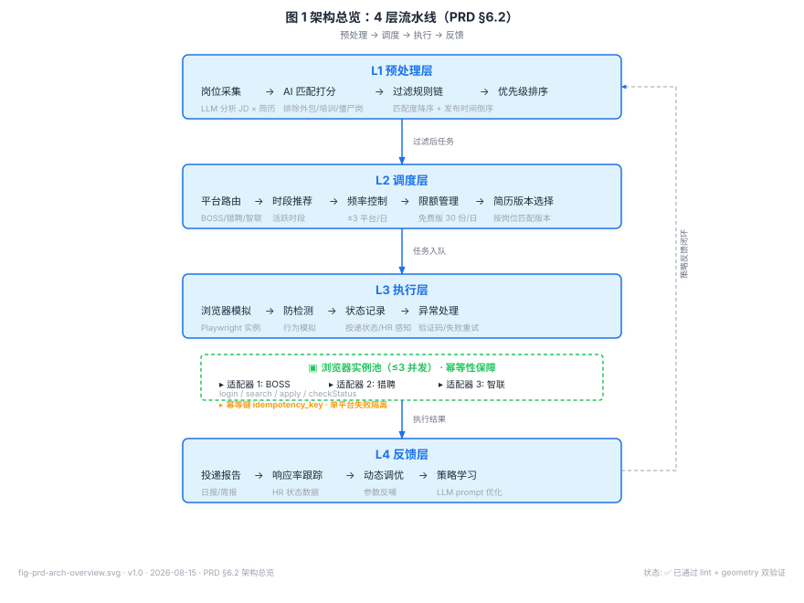

# 产品需求文档：AI 简历助手 — 简历投递与面试模拟

> 2026-08-14 · v4.5（评审稿 · 结构重组版，待评审定稿）  
> 场景路由：0-to-1 产品 + AI 产品 · 深度：中等

---

## 文档阅读指南（v4.0 结构重组）

> **⚠️ 评审提示（假设驱动）**：本 PRD 所有量化基线（耗时、查看率、面试邀请率、单位经济等）凡未标注「[已验证]」者，均为**产品假设**，须在 v0.9 灰度期以真实对照数据回填校准；评审时请按「假设」而非「事实」对待（统一声明见 §2.1）。

### Part 地图（逻辑分组；章节物理顺序保持演进脉络，便于追溯）

| Part | 主题 | 包含章节 |
|------|------|---------|
| **A 战略与范围** | 为什么做、做什么、边界 | §1 分类 · §2 背景（§2.1） · §3 目标 · §4 竞品（§4.1/§4.2） · §5 用户场景（§5.1–§5.4） |
| **B 产品需求** | 功能、AI、路线、指标、验收、定价、引导、激活、北极星与增长 | §6 功能（§6.1–§6.4） · §7 AI（§7.1–§7.5） · §9 路线（§9.1–§9.4） · §10 指标（§10.1–§10.3） · §11 验收 · §12 定价 · §13 引导 · §25 激活（§25.1–§25.7） · §33 北极星与增长模型（§33.1–§33.5） |
| **C 核心设计约束** | 跨章统一的 5 条硬约束（总览/索引） | C. 核心设计约束总览（C.1 本机执行 · C.2 PIPL 最小化 · C.3 不确定就停 · C.4 ToS 红线 · C.5 Cookie/凭证不上云） |
| **D 工程/可靠性/事故预防** | 架构、数据、NFR、基建、韧性、响应、预防、本机、最小化、系统工程、多端、上线前工程补充、发布治理与运营闭环 | §15 架构 · §20 数据模型 · §18 NFR · §21 基建 · §22 缺口 · §23 韧性 · §24 响应 · §28 预防 · §29 本机 · §30 最小化 · §31 系统工程 · §27 多端可观测 · §34 工程补充（上线前具体因素） · §35 发布治理与运营闭环（§35.1–§35.8，部份主题跨 Part B/E） |
| **E 合规/安全/商业化** | 数据安全、合规应急、商业化、AI 可信、商业论证 | §8 数据安全（§8.1–§8.4） · §17 合规应急（§17.1–§17.7） · §16 商业化（§16.1–§16.6） · §32 商业论证与可持续性（§32.1–§32.6） · §26 AI 可信（§26.1–§26.4） |
| **附录** | 待定与术语 | §19 待定 · §14 术语 |

### 目录（按 Part 分组）

**Part A 战略与范围**
- §1 需求分类
- §2 需求背景（§2.1 关键断言来源与假设声明）
- §3 需求目标
- §4 竞品调研（§4.1 竞品概况 · §4.2 竞品方法论提炼）
- §5 用户与场景（§5.1 用户画像 · §5.2 核心使用场景 · §5.3 系统范围边界 · §5.4 多端/多账号/多 OS 边界）

**Part B 产品需求**
- §6 功能需求（§6.1 功能总览 · §6.2 模块详情 · §6.3 异常处理与用户感知 · §6.4 通知中心与消息通道）
- §7 AI 产品专项（§7.1 LLM 使用场景 · §7.2 准确度定义与评估 · §7.3 回退机制 · §7.4 延迟要求 · §7.5 匹配度模型设计与评估）
- §9 依赖、风险与时间线（§9.1 技术依赖 · §9.2 风险清单 · §9.3 时间线 · §9.4 灰度发布/特性开关/回滚）
- §10 数据与指标（§10.1 核心指标 · §10.2 跟踪埋点 · §10.3 指标口径与采集）
- §11 验收标准
- §12 定价模式（建议方案）
- §13 用户引导与新手体验
- §25 新手激活与产品细节补全（§25.1–§25.7）
- §33 北极星指标与增长模型（§33.1–§33.5）

**Part C 核心设计约束（v4.0 新增，去重总览）**
- C. 核心设计约束总览（C.1 本机 Agent 执行模型 · C.2 数据最小化与 PIPL 红线 · C.3「不确定就停」保守默认 · C.4 ToS/平台合规红线 · C.5 Cookie/凭证本地化不上云）

**Part D 工程、可靠性与事故预防**
- §15 系统架构与执行模型决策（§15.1–§15.6）
- §20 系统核心实体与数据模型（§20.1–§20.5）
- §18 非功能需求 NFR（§18.1–§18.5）
- §21 系统基建专项（§21.1–§21.3）
- §22 系统缺口补足（§22.1–§22.6）
- §23 系统韧性、兼容与安全专项（S1–S13，§23.1–§23.13）
- §24 事件响应与韧性运营（P1–P11，§24.1–§24.11）
- §28 生产事故预防补全（§28.1–§28.4）
- §29 本机 Agent 事故预防专项（§29.1–§29.6）
- §30 生产事故最小化专项（Q1–Q12，§30.1–§30.12）
- §31 系统工程补充专项（R1–R12，§31.1–§31.12）
- §27 增长、可观测性与多端细节（§27.1–§27.4）
- §34 资深 PM 工程补充：上线前具体因素（§34.1–§34.9）
- §35 发布治理与运营闭环（§35.1–§35.8）

**Part E 合规、安全与商业化**
- §8 平台合规性与数据安全（§8.1 平台合规性 · §8.2 数据安全 · §8.3 个人信息保护合规 · §8.4 AI 数据处理与个人信息保护）
- §17 合规应急预案与最坏情况处理（§17.1–§17.7）
- §16 商业化测算与单位经济（§16.1–§16.6）
- §26 AI 产品细节补全（§26.1–§26.4）
- §32 商业论证与可持续性（§32.1–§32.6）

**附录**
- §19 范围外与待定项（评审遗留）
- §14 术语表

---

## 0. 文档修订记录

| 版本 | 日期 | 修订人 | 主要变更 |
|------|------|--------|---------|
| v1.0 | 2026-07 | 产品 | 初稿，覆盖核心模块与场景 |
| v2.0 | 2026-07 | 产品 | 补充移动端场景、适配器架构、合规红线 |
| v3.0 | 2026-08-13 | 产品 | 补充 AI 专项、指标埋点、验收标准、定价、新手引导 |
| v3.1 | 2026-08-14 | 产品 + AI 评审 | 修订执行模型归属（本机 Agent）、统一延迟/指标口径；新增 §15 系统架构与执行模型、§16 商业化单位经济、§17 合规应急预案；风险等级上调为"高" |
| v3.2 | 2026-08-14 | 产品 + AI 评审 | 补 §2.1 关键断言来源与假设声明（全文档基线标注）；§8.2 投递记录"永久保留"改为 24 个月期限（PIPL 最小化）；§17 新增 §17.6 分发合规与替代分发预案；新增 §18 非功能需求专章（可用性/并发/可观测性） |
| v3.3 | 2026-08-14 | 产品 + AI 评审 | 补剩余缺口：§5.4 多端/多账号/多OS 边界；§6.3 异常场景与用户感知设计；§7.5 匹配度模型设计与评估；§8.4 AI 数据处理与 PIPL（LLM 委托处理/脱敏/出境）；§9.4 灰度/特性开关/回滚；§10.3 指标口径与采集；§16.5 真实可行性+适配器维护成本、§16.6 获客与 LTV/CAC；§17.4 伦理声明、§17.7 封禁处置与客服 SLA；§19 范围外与待定项；修正 §6.3 引用指向执行层(§6.2) |
| v3.4 | 2026-08-14 | 产品 + AI 评审 | 补 §6.4 通知中心与消息通道架构（双通道分离/渠道降级/消息分级/频率聚合/免打扰/通知中心/去重/隐私）；新增 §20 系统核心实体与数据模型（ER 草稿 + Application/Subscription/Notification 状态机 + 配置与同意审计）；系统层缺口补强 |
| v3.5 | 2026-08-14 | 产品 + AI 评审 | 修 5 处隐性不一致：§18.2 容量标注 DAU3000 为演进目标、§3/§6.1/§10.1 的 80-100 份加 v0.9 验证标记、§15.5 补多平台实例分配策略、§14 术语表补 Secrets/KMS/信封加密/事件_key/Feature Flag/ConsentLog/APNs/FCM、§9.1 推送依赖细化对接 §6.4；新增 §21 系统基建专项（§21.1 岗位采集数据源策略、§21.2 服务端限流与配额、§21.3 本机 Agent 灾备与恢复） |
| v3.6 | 2026-08-14 | 产品 + AI 评审 | 修 C-A~C-D 四处逻辑矛盾：C-A §3/§6.1/§10.1 的 80-100 份标注"专业版及以上（免费版30份/天，见§12）"；C-B §12 定价"移动端可执行"改为"移动端确认/发起，执行在本机Agent（见§15）"；C-D §8/§9.2/§17/§12 注明"备用账号为v1.0后置能力，v1.0封禁不依赖备用账号"；C-C §15.5 澄清"≤3实例(资源上限)"与"≤3平台(套餐权益)"不冲突；§18.2 容量计入采集负载；新增 §22 系统缺口补足（多环境隔离/支付对账掉单/操作审计日志/缓存策略/本机资源限流/采集容量模型） |
| v3.7 | 2026-08-14 | 产品 + AI 评审 | 新增 §23 系统韧性/兼容/安全专项，补齐本机 Agent 架构特有缺口：S1 三端版本兼容与契约管理、S2 本机 Agent 自身安全模型、S3 Schema 演进与数据迁移、S4 服务端 DR 演练与故障切换+Agent 降级、S5 配置中心与远程下发、S6 连接管理(弱网/代理/离线队列)、S7 压测混沌(深化§18.2/§18.5)、S8 日志留存与 trace 采样成本(深化§18.4)、S9 缓存击穿雪崩防护(深化§22.4)、S10 多端配置冲突解决(深化§5.4)、S11 数据导出 schema 细化(深化§8.3)、S12 A/B 实验框架(深化§10)、S13 客服工单系统(深化§17.7) |
| v3.8 | 2026-08-14 | 产品 + AI 评审 | 新增 §24 事件响应与韧性运营，补齐生产事故响应体系：P1 事件分级SEV与Oncall(区分客服P1-P3)、P2 事故Runbook(误投/坏更新/密钥泄露/支付多扣)、P3 误投超量批量撤回+告知+补偿、P4 个人信息泄露应急(PIPL第57条通报)、P5 坏更新/坏配置全网kill switch止血、P6 MTTR/MTTD/错误预算/blameless复盘、P7 状态页与事故沟通、P8 责任边界三维(产品bug/用户操作/平台行为)、P9 依赖中断统一升级、P10 故障域隔离与依赖拓扑、P11 Game day事件响应演练 |
| v3.9 | 2026-08-14 | 产品 + AI 评审 | 新增 §25 新手激活与产品细节补全（§25.1 账号连接引导流/G1、§25.2 高级版多简历版本落地/G3、§25.3 简历解析质量边界/G4、§25.4 退款试用退订/G8、§25.5 本地存储清理/G10、§25.6 数据携带权主动入口/G11、§25.7 用户协议条款/G12）；§26 AI 产品细节补全（§26.1 Prompt版本与回归评测/G5、§26.2 面试评估rubric透明可申诉/G6、§26.3 语音ASR供应商降级/G7、§26.4 LLM输出内容安全/G13升格）；§27 增长与多端细节（§27.1 多设备任务调度冲突/G16、§27.2 向量库选型与检索成本/G17、§27.3 限流提示可解释性/G18、§27.4 激活留存付费漏斗埋点/G19）；§19 待定项标注G2未成年人保护/G9发票税务"已排除"、G13升格已覆盖；§13/§12/§7.5 加交叉引用。未成年人保护与发票税务经用户确认不涉及 |
| v3.10 | 2026-08-14 | 产品 + AI 评审 | 聚焦生产事故预防（法律三块延后）：新增 §28 生产事故预防补全（§28.1 LLM 运行时成本护栏、§28.2 反滥用与风控含投递速率熔断、§28.3 诈骗/虚假岗位预警、§28.4 发布变更门禁与异常检测闭环）；§21.2 加 §28 前向引用；§19 登记法律三块"延后（后期）" |
| v3.11 | 2026-08-14 | 产品 + AI 评审 | 新增 §29 本机 Agent 事故预防专项（§29.1 看门狗与强制终止/防变砖、§29.2 凭证失效与重试风暴防护、§29.3 自更新失败回滚、§29.4 本机侧操作留痕与防篡改/forensic、§29.5 睡眠唤醒调度补偿、§29.6"不确定就停"保守默认原则）；与 §22.5/§23.2/§25.1/§20.2/§28.2 等呼应衔接 |
| v3.12 | 2026-08-14 | 产品 + AI 评审 | 评审描述问题全量修复（14 处）：§22.2 删发票税务尾句（对齐 §19 已排除）；§9.3 MVP 平台对齐 §6.2 首期 5 平台；§11 匹配度验收改引 §7.5（κ≥0.6/错投率≤10%，排序一致性降为辅助观测）；§6.1 投递上限滑块注明受套餐约束；§26.3 修失效引用 §6.6→§6.2；§24.5 安全模式引用 §19→§23.2；§24.1 删不存在的 P13 引用；§9.1/§16.1/§8.4 LLM 供应商统一"境内合规大模型"；§9.2 "Cookie 轮换"改失效即停+引导重登；§7.2 增吻合度≥80% vs 投递阈值>60% 口径区分；§23.13 P1 SLA 补 ≤24h 出方案对齐 §17.7；§13 "已上线"改"计划首期/待上线"；标题版本号 v3.9→v3.12；§6.4 通知引用改"保存期限最小化原则" |
| v3.13 | 2026-08-14 | 产品 + AI 评审 | 新增 §30 生产事故最小化专项（机制级兜底 Q1–Q12）：修正 §23.5 配置 fail-closed（缺失/篡改即最严限流+暂停）、§23.1 安全最低版本 minimum_supported_version（禁用带 bug 旧版自动投递）、§29.5/§21.2 时区统一 UTC+8（本机时钟偏差即暂停）、§23.4↔§27.1 降级锁冲突（宕机期间单设备锁防双投）、§24.5 break-glass 自动止血（无人响应真空）；深化 §29.1 孤儿进程级联回收+OS 级看门狗、§29.3 回滚也失败兜底+更新密钥 CRL、§28.1 max_tokens 硬上限+调用硬超时、§18.4/§22.3/§29.4 脱敏强制拦截层、§28.3 误杀兜底、§29.2 真失效 vs 风控挑战判别、§22.5 前台高负载资源感知 |
| v3.14 | 2026-08-14 | 产品 + AI 评审 | 新增 §31 系统工程补充专项（可行性校验 R1–R12）：§31.1 移动端职责澄清(壳+推送唤醒非执行体，已修 §25.1 常驻限定 PC)、§31.2 offline-first 同步引擎(字段级LWW+版本向量)、§31.3 第三方依赖韧性(支付双源/推送健康/适配器配置热修)、§31.4 API 鉴权(OAuth2短期token+refresh吊销+网关WAF)、§31.5 SLI/SLO+合成监控、§31.6 存储扩展(读写分离/分片/冷归档/恢复演练)、§31.7 密钥轮换与吊销(KMS自动轮换+信封版本化)、§31.8 桌面E2E+平台Mock录制回放、§31.9 自动扩缩容(HPA+定时扩容)+成本护栏、§31.10 分析隐私(抑制/k-匿名/差分隐私)、§31.11 删除可验证性(签名删除凭证)、§31.12 灰度自动回滚guardrail |
| v3.15 | 2026-08-14 | 产品 + AI 评审 | 压实 4 处"弱断言/未验证愿景"（评审提示，非架构变更）：§2.1 加 v0.9 前"假设驱动、按假设评审"总括提示；§3 指标表将 HR 查看率/面试邀请率降级为"v0.9 灰度验证目标"并挂接 §7.5 相关性实测、平台接入 ≤2 人天注明依赖 §31.R8 脚手架前提；§26.4"价值观对齐"改为可测口径（歧视性表述抽检命中率=0 为验收，中立/专业/鼓励性降为设计取向不纳入验收）；标题版本号 v3.14→v3.15 |
| v4.0 | 2026-08-14 | 产品 + AI 评审 | 结构重组（零信息丢失，保留全部 § 编号，未做章节物理重排/编号变更以避免交叉引用破坏）：① 新增"文档阅读指南"——假设驱动声明 + Part 地图（A–E 逻辑分组）+ 完整目录(TOC)；② 新增 §C 核心设计约束总览（C.1 本机执行 / C.2 PIPL最小化 / C.3 不确定就停 / C.4 ToS红线 / C.5 Cookie不上云，抽取自 §8/§15/§17/§20/§23/§26/§28/§29/§30/§31 并保留原章上下文，原章不删）；③ 标题版本号 v3.15→v4.0。原稿备份见 PRD-…-v3.15-备份.md |
| v4.1 | 2026-08-14 | 产品 + AI 评审 | 按用户澄清的产品定位（收集信息+半自动化投递[用户确认]+通知服务，非全自动脚本）补全商业维度：新增 §32 商业论证与可持续性（§32.1 定位重申与风险定级[弱化封杀风险]、§32.2 TAM/SAM/SOM[假设驱动]、§32.3 护城河差异化结论[导出自§4]、§32.4 平台规则适配降级[非灭顶]、§32.5 用户研究证据汇总、§32.6 失败标准/退出红线）与 §33 北极星与增长模型（§33.1 北极星、§33.2 留存模型D1/D7/D30/D90、§33.3 分群差异化、§33.4 冷启动、§33.5 GTM获客与CAC）；同步更新阅读指南 Part 地图与目录；标题版本号 v4.0→v4.1。法务三块(PIPL自动化决策等)按用户决策仍延后 |
| v4.2 | 2026-08-14 | 产品 + AI 评审 | review v4.1 后发现并修复 11 处（🔴3+🟡4+🟢4）：① 删除 §33.5 末尾误植的 §31.12 自动回滚段落；② §17.1 风险定级"高(含生存级)"下调为"高(可控级，非生存级)"并新增与 §32.1/§32.4 定位呼应，解决与 §32 的风险结论矛盾；③ §32.1 新增"半自动口径界定"与"能力闭环(含面试模拟)"，解决与 §5.2/§15/§23/§29 的"多自动"张力；④ 详细目录 Part B 增 §33、Part E 增 §32，消除双导航缺失；⑤ §32.5 删除失效硬行号"L125"；⑥ §32.1/§32.4 将不存在的"§17.7 降级引导/手动引导"改指 §17.5 手动投递引导模式；⑦ §33.4 将不精确的"§27 GTM"改指本节 §33.4；⑧ §33.5 CAC 口径严格对齐 §16.6(月费¥19.9×12月≈LTV¥239)；⑨ §19 待定新增 v0.9 失败标准占位[X][Y][Z]登记；⑩ 一级标题"自动投递"改为"简历投递"合规化命名；标题版本号 v4.1→v4.2 |
| v4.3 | 2026-08-14 | 产品 + AI 评审 | 资深 PM 工程视角补全上线前具体因素，新增 §34（§34.1 桌面 Agent 安全软件误报 / EV 签名加白、§34.2 LLM 主备切换 failover + 平台侧高峰避让、§34.3 功耗电量硬预算[不得阻止睡眠]、§34.4 浏览器/OS 兼容矩阵与 EOL 策略、§34.5 用户端自助帮助中心与错误可解释、§34.6 流失预警与挽回闭环、§34.7 AI 产出内容版权与归属声明、§34.8 LLM 供应商 ToS 边界、§34.9 客服人力与成本模型）；同步更新阅读指南 Part D 地图与目录；标题版本号 v4.2→v4.3。法务三块 / 无障碍 / HLD 对齐仍延后未动 |
| v4.4 | 2026-08-14 | 产品 + AI 评审 | 评审遗留最后一批补全「发布治理与运营闭环」，新增 §35（§35.1 开源许可证合规[分发 blocker]、§35.2 正式 Beta 与 v0.9 验证计划、§35.3 VoC 闭环、§35.4 分析数据管道与 BI、§35.5 定价弹性实验、§35.6 危机公关预案、§35.7 代码质量门禁、§35.8 竞品监测飞轮）；同步更新阅读指南 Part D 地图与目录；评审同步修正 §22.2 掉单风险定级（生存级→高·可控级，对齐 §1/§17.1/§32.1 统一风险定级）；标题版本号 v4.3→v4.4。法务三块 / 无障碍 / HLD 对齐仍延后未动 |
| v4.5 | 2026-08-14 | 产品 + AI 评审 | 针对「系统生产级事故是否还有遗漏」核查后收口 5 项二级缺口：#1 补 §21.3 本地库 corruption 检测（integrity_check + WAL 原子事务）+ 每日快照重建 + 损坏时 fail-safe（受限安全模式 + 显式弹窗 + 不自动续投防重投）；#2 补 §18.4 监控自身失效 deadman 告警（无数据即 P2 告警，避免黑盒）；#3–#5 登 §19 待定（事件驱动突发流量弹性 / 供应链持续动态监控 / 幽灵 Agent 设备回收，均标 v1.1）。均为既有章节内补充、无新章，导航与目录零变动；标题版本号 v4.4→v4.5。核心生产事故面（平台改版/CAPTCHA/静默停摆/供应链/时钟）已于 §30–§31 闭环 |

---

## 1. 需求分类

| 维度 | 分类 |
|------|------|
| 需求类型 | 0-to-1 产品 + AI 产品 |
| 复杂度 | 中等（5-15 页） |
| 受众 | 工程团队、产品评审、设计团队 |
| 行业 | 互联网 / 招聘服务 |
| 风险等级 | 高（可控级，非生存级；平台 ToS、反不正当竞争、PIPL，详见 §17 / §17.1 风险重定性） |

---

## 2. 需求背景

应届生和社招求职者每天需要在多个招聘平台之间切换，手动筛选和投递岗位，耗时 2-3 小时[假设，来源与验证见 §2.1]。投递后被动等待回复，收到面试邀请时往往准备时间不足。市场上已有的开源自动投递工具（GetJobs、JobClaw、Boss Batch Push）均停留在 CLI 脚本层面，无可视化界面、无智能匹配策略、投递后无面试准备联动。

不同平台覆盖的岗位类型各有侧重：BOSS 直聘覆盖互联网社招，应届生求职网和高校就业平台覆盖校招，国聘网覆盖央企国企，猎聘覆盖中高端岗位。求职者需要一套系统，能够统一管理所有这些平台的投递，并随着新平台的出现灵活扩展。

此外，移动端是求职场景中不可忽视的渠道——用户在地铁、课间、午休等碎片时间需要快速浏览岗位、查看投递状态、接收面试通知，甚至进行轻量级的面试准备。现有方案完全没有覆盖移动端。

### 2.1 关键断言来源与假设声明

> 本 PRD 含若干量化基线断言（耗时、查看率、面试邀请率等）。统一声明：凡未标注"[已验证]"者，均为**产品假设**，需在 v0.9 灰度期以真实对照数据回填校准（责任：产品 + 数据分析；截止：上线后 30 天）。

> **⚠️ 评审提示**：在 v0.9 灰度完成前，本文档所有量化基线（§2.1 / §3 指标表 / §16 单位经济）均属**假设驱动**，评审请按"假设"而非"既定事实"对待；涉及对外承诺的结果型目标（查看率 / 邀约率）已统一标注为"灰度验证目标"，不代表承诺值。

| 断言 | 当前取值 | 性质 | 来源 / 验证方式 |
|------|---------|------|---------------|
| 手动筛选投递耗时 | 2–3 小时/天 | 假设 | 团队经验 + 少量用户访谈（n<10）；v0.9 灰度招募 ≥30 名真实求职者采集对照 |
| 手动投递 HR 查看率 | 15–20% | 假设（无公开权威数据源） | v0.9 灰度对照组实测回填 §3 / §10.1 |
| 手动投递面试邀请率 | 5–10% | 假设 | 同上 |
| 竞品"仅 CLI、无可视化 / 无智能匹配 / 无面试联动" | 事实性结论 | 可验证 | 基于 GetJobs / JobClaw / Boss Batch Push 公开仓库与功能体验，评审可抽查 |
| 移动端次日留存 ≥40% / 确认转化率 ≥70% | 目标值 | 产品目标 | 非基线，不需来源；上线 30 天验证 |

**验证计划**：v0.9 内部灰度招募 ≥30 名真实求职者，采集其手动投递基线（耗时、查看率、面试邀请率）作为对照组，回填 §3 与 §10.1，并同步校准 §16 单位经济中的基线假设。

---

## 3. 需求目标

- 将每日多平台投递从手动 2-3 小时缩短为一键确认 + 自动执行
- 投递与面试准备形成闭环，投递成功后自动触发面试题预测和话术建议
- 平台接入架构支持热插拔，新平台可通过适配器扩展
- 移动端覆盖核心场景（浏览、投递确认、状态跟踪、面试准备轻量版）

| 指标 | 目标值 | 说明 |
|------|-------|------|
| 单日投递量（专业版及以上） | 80-100 份（**需 v0.9 灰度验证，见 §16.5**；免费版 30 份/天，见 §12） | 覆盖所有首期支持平台，低于各平台上限保留安全余量 |
| HR 查看率 | **v0.9 灰度验证目标** ≥30%（基线手动 15–20%，即 +10pp 以上；基线为假设，口径见 §10.1 / §2.1；达标依赖 §7.5 匹配度分桶—查看率相关性的实测表现，非对外承诺值） | 仅投递匹配度 > 60% 的岗位 + 投递时段优化 |
| 面试邀请率 | **v0.9 灰度验证目标** ≥15%（基线手动 5–10%，为假设；口径见 §10.1 / §2.1；同上，依赖相关性实测） | 仅投递匹配度 > 60% 的岗位 |
| 投递到面试准备启动间隔 | < 5 分钟 | 投递成功后自动触发 AI 准备 |
| 平台接入扩展耗时 | ≤ 2 人天/新平台 | 通过适配器架构实现（前提：适配器脚手架 + 平台 Mock 录制回放就绪，见 §31.R8；不含平台反爬升级导致的适配器重构） |
| 移动端次日留存率 | ≥ 40% | 上线后第 30 天验证 |
| 移动端投递确认转化率 | ≥ 70% | 用户收到推送后确认投递的比例 |

---

## 4. 竞品调研

### 4.1 竞品概况

| 产品/工具 | 类型 | 界面 | 自动投递 | 智能匹配 | 面试准备 | 移动端 | 平台覆盖 |
|-----------|------|------|---------|---------|---------|-------|---------|
| GetJobs | 开源 CLI | 无 | 部分平台 | 无 | 无 | 无 | 1-2 个 |
| JobClaw | 开源脚本 | 无 | 多平台 | 基础关键词 | 无 | 无 | 3-4 个 |
| Boss Batch Push | 开源脚本 | 无 | BOSS 直聘 | 无 | 无 | 无 | 1 个 |
| 知页简历 | 商业产品 | 有 | 无 | 无 | 基础题库 | 有 | 不适用 |
| 超级简历 | 商业产品 | 有 | 无 | 无 | 模拟面试 | 有 | 不适用 |
| **本产品** | 商业产品 | 有 | 多平台 | AI 匹配 | AI 生成 | 有 | 可扩展架构 |

### 4.2 竞品方法论提炼

所有开源投递工具均采用 Playwright 模拟真人浏览器操作，核心手段包括随机延迟（正态分布）、随机鼠标轨迹（贝塞尔曲线）、Cookie 持久化。共同结论是：**无公开 API，所有平台均需通过浏览器模拟实现投递**。

开源工具停留在"脚本"层面，商业产品（知页、超级简历）聚焦简历制作和面试题库，均未将"自动投递"作为核心功能。"智能投递策略 + 面试准备联动 + 移动端触达"是目前市场的明确空白。

---

## 5. 用户与场景

### 5.1 用户画像

| 角色 | 求职阶段 | 主要设备 | 使用频率 | 核心需求 | 决策权 |
|------|---------|---------|---------|---------|-------|
| 应届毕业生 | 首次求职，海投为主 | 手机为主+电脑为辅 | 每日多次 | 多平台批量投递，快速覆盖校招岗位 | 独立决策 |
| 1-3 年经验者 | 跳槽换工作，目标明确 | 电脑为主+手机查看 | 工作日每日 | 精准匹配，减少无效投递 | 独立决策 |
| 5+ 年资深者 | 被动求职，观望机会 | 电脑为主 | 每周 2-3 次 | 少量高质量投递，深度面试准备 | 独立决策 |
| 跨方向求职者 | 同时投递多个方向 | 电脑为主 | 工作日每日 | 多版本简历管理，按岗位自动匹配 | 独立决策 |
| **移动端碎片用户** | **所有阶段** | **手机为主** | **每日多次** | **快速浏览、投递确认、状态通知、轻量面试准备** | **查看+确认** |

### 5.2 核心使用场景

**PC 端场景**：

- **场景一：每日批量投递** — 用户早晨打开系统，查看 AI 已筛选的岗位列表，一键确认投递队列，系统自动按平台策略分发投递，实时查看进度
- **场景二：简历编辑与优化** — 用户在工作台编辑简历，切换模板，查看 ATS 评分和 AI 建议
- **场景三：投递后自动面试准备** — 投递成功后，系统自动分析 JD 生成面试预测题，推送到面试备战模块
- **场景四：深度面试模拟** — 用户在 PC 端进行完整 AI 面试模拟（含语音输入、摄像头等）
- **场景五：平台适配器管理** — 高级用户或开发者管理首期支持（计划首期 / 待上线，平台清单见 §6.2）的平台适配器

**移动端场景**：

- **场景六：碎片时间浏览** — 用户在通勤/课间打开手机，浏览今日推荐岗位和匹配度，标记感兴趣
- **场景七：投递确认与审批** — 收到投递队列推送，在手机上快速确认或调整后提交；指令下发至用户本机 Agent 异步执行（执行模型详见 §15；要求本机 Agent 在线）
- **场景八：状态通知与跟踪** — 收到 HR 查看、面试邀请等实时推送，查看投递状态看板
- **场景九：轻量面试准备** — 在手机上查看已生成的面试题，语音练习作答
- **场景十：简历快速调整** — 手机端进行简历基础信息修改，或选择投递所用简历版本
- **场景十一：每日日报自动推送** — 系统每天 20:00 自动生成当日投递日报，汇总投递数量、成功/失败统计、HR 查看记录、面试邀请、新增面试题等，通过移动端推送和邮件发送给用户
- **场景十二（端到端串联）：完整的求职日** — 早晨 8:00 收到 AI 筛选的岗位推荐推送 → 通勤途中在手机上确认投递队列 → 上午 PC 端配置投递策略 → 系统自动执行投递 → 下午陆续收到 HR 查看/面试邀请推送 → 投递成功后自动触发面试题生成 → 在面试备战模块查看和练习 → 晚上 20:00 收到当日投递日报推送

### 5.3 系统范围边界（Out of Scope）

**平台范围**：
- 本期不接入海外招聘平台（LinkedIn、Indeed、Glassdoor 等）
- 本期不接入垂直行业平台（如：医疗行业的丁香人才、金融行业的银行招聘系统）
- 本期不接入社交招聘渠道（如：脉脉、知乎招聘等）

**岗位范围**：
- 不自动投递实习岗、兼职岗、劳务派遣岗（用户可手动投递，系统不拦截）
- 不自动投递薪资范围不明确的岗位
- 不自动投递涉及敏感行业（如：成人内容、赌博、加密货币等）的岗位

**合规红线**：
- 系统不绕过验证码——触发验证码时立即暂停所有投递任务，通知用户人工处理
- 系统不违反各平台用户协议的核心条款——投递行为模拟真人操作，但不伪造身份、不批量注册、不爬取非公开数据
- 系统不存储用户在各平台的明文密码，仅存储加密后的 Cookie
- 系统不提供账号租赁、代投等灰色服务
- 系统不向第三方出售或传输用户数据

**功能边界**：
- 系统不提供简历代写服务（仅提供 AI 优化建议）
- 系统不提供职业咨询或求职规划
- 系统不提供薪资谈判建议
- 系统不提供企业内推渠道
- 系统不提供面试陪练真人服务

### 5.4 多端、多账号与多 OS 支持边界

- **操作系统**：v1.0 本机 Agent 支持 Windows 10+ 与 macOS 12+；Linux 列为后续（兼容性测试成本高）。移动端为确认 / 浏览壳，不执行投递。
- **多招聘账号**：v1.0 单用户绑定单套平台账号（各平台 1 个）；多账号切换 / 矩阵管理列为后续，且涉及平台多账号政策风险，需单独评估（§17）。
- **多设备**：同一用户可在 PC（Agent）+ 移动端（确认）协同；PC 离线时移动端仅可浏览与排队，投递待 PC 上线后执行（见 §18.1 可用性约束）。
- **数据同步**：投递队列、状态、日报在用户账号维度跨端同步（服务端），Cookie 仍仅存本机 Agent（§8.2 / §15）。
- 多端配置冲突的解决流程（并发修改、LWW、版本向量）详见 §23.10。

---

## 6. 功能需求

### 6.1 功能总览

| # | 模块 | PC | 移动端 | 优先级 |
|---|------|----|--------|-------|
| 1 | 简历编辑工作台 | 完整功能 | 轻量版（基本信息修改、版本选择） | P0 |
| 2 | 岗位浏览与投递 | 完整功能 | 浏览+投递确认 | P0 |
| 3 | 自动投递策略引擎 | 完整配置面板 | 配置查看、开关控制 | P0 |
| 4 | 平台适配器系统 | 管理界面 | 状态查看 | P0 |
| 5 | 面试模拟备战 | 完整功能 | 查看+语音练习 | P0 |
| 6 | AI 面试模拟 | 完整功能 | 仅查看评估报告 | P1 |
| 7 | 投递与面试准备联动 | 后台自动运行 | 推送通知 | P0 |
| 8 | 用户系统与多端同步 | 全功能 | 全功能 | P0 |
| 9 | 每日日报与推送 | 后台自动生成 | 推送+邮件 | P1 |

### 6.2 模块详情

#### 模块 1：简历编辑工作台

**PC 端布局**：

```
┌─────────────────────────────────────────────────────────────────┐
│ 导航栏：首页 | 简历编辑 | 岗位浏览 | 面试备战 | AI 面试        │
├──────────────┬──────────────────────────────┬──────────────────┤
│  模块管理    │     PDF 实时预览             │  模板滤镜 + AI  │
│              │                              │                  │
│  ☐ 个人信息  │  ┌──────────────────────┐   │  ■ 模板选择      │
│  ☐ 教育背景  │  │  [A4 白纸效果]       │   │  简约/经典/现代  │
│  ☐ 工作经历  │  │                      │   │  ■ 主题色        │
│  ☐ 项目经历  │  │  姓名  电话  邮箱    │   │  ● ● ● ● ● ●   │
│  ☐ 技能标签  │  │  ──────────────────  │   │  ■ ATS 评分      │
│  ☐ 自我评价  │  │  教育背景            │   │  ████████ 78     │
│              │  │  ...                 │   │  ■ AI 建议       │
│  拖拽排序    │  │  工作经历            │   │  ▶ 建议1         │
│  ✦ AI 生成   │  │  ...                 │   │  ▶ 建议2         │
│              │  │  ──────────────────  │   │                  │
│              │  │  75% ○ 100% ● 150%  │   │  导出 ▼          │
│              │  └──────────────────────┘   │                  │
├──────────────┴──────────────────────────────┴──────────────────┤
│  三段式 Footer：品牌信息 | 功能标签 | 版本号                    │
└─────────────────────────────────────────────────────────────────┘
```

**移动端布局**：

```
┌─────────────────────────────────────────────────────────────────┐
│  ← 简历编辑                                  [保存] [预览]    │
├─────────────────────────────────────────────────────────────────┤
│                                                                  │
│  个人信息                                                       │
│  ┌──────────────────────────────────────────────────────┐       │
│  │ 姓名：张三                                    [编辑] │       │
│  │ 电话：138xxxx1234                            [编辑] │       │
│  │ 邮箱：example@email.com                       [编辑] │       │
│  └──────────────────────────────────────────────────────┘       │
│                                                                  │
│  教育背景                                                       │
│  ┌──────────────────────────────────────────────────────┐       │
│  │ 北京大学 · 计算机科学与技术 · 本科 · 2022-2026      │       │
│  └──────────────────────────────────────────────────────┘       │
│                                                                  │
│  [添加模块]                                                    │
│                                                                  │
│  底部 Tab：简历 | 岗位 | 投递 | 面试 | 我的                     │
└─────────────────────────────────────────────────────────────────┘
```

**业务逻辑**：

- 内容与样式分离：简历内容与视觉样式独立存储，切换模板仅替换 CSS 修饰器
- 模板机制：CSS modifier 方案，每个模板定义一组 CSS 变量，切换时通过 JS 替换根元素 class
- ATS 评分：基于简历内容完整度、关键词密度、排版规范性、语义匹配度综合计算

**移动端差异**：
- 不支持 PDF 实时预览和模板主题切换（仅 PC 端）
- 支持基础信息修改、模块增删、简历版本选择
- 编辑后自动同步到服务端，PC 端下次打开时反映最新内容

**边界与异常**：
- 用户无简历内容时，展示空状态引导页，提示新建简历或导入已有简历文件
- ATS 评分为 0 时，展示"请先完善简历内容"提示
- 导出 PDF 时若简历内容为空，阻止导出并提示用户先填写内容
- 移动端编辑内容在网络恢复后自动同步，冲突时以服务端版本为准

---

#### 模块 2：岗位浏览与投递

**PC 端布局**：

```
┌─────────────────────────────────────────────────────────────────┐
│  岗位浏览                                          resume-banner│
│  ┌──────────────────────────────────────────────────────────┐   │
│  │ 建议先完善简历，匹配度计算依赖简历内容。  [去完善]       │   │
│  └──────────────────────────────────────────────────────────┘   │
│                                                                  │
│  关键词: [________] 城市: [▼] 薪资: [▼] 平台: [▼全部▼]        │
│  ☐ 全选    [一键投递] [加入收藏] [忽略]                        │
│                                                                  │
│  ┌──────────────┐  ┌──────────────┐  ┌──────────────┐          │
│  │ 公司A        │  │ 公司B        │  │ 公司C        │          │
│  │ Java 后端    │  │ 前端工程师   │  │ 算法工程师   │          │
│  │ 15-25K       │  │ 18-30K       │  │ 25-40K       │          │
│  │ ██ 匹配度92% │  │ ██ 匹配度78% │  │ ██ 匹配度65% │          │
│  │ BOSS直聘     │  │ 猎聘        │  │ 应届生求职网 │          │
│  │ [未投递]     │  │ [已投递]    │  │ [待投递]     │          │
│  └──────────────┘  └──────────────┘  └──────────────┘          │
└─────────────────────────────────────────────────────────────────┘
```

**移动端布局**：

```
┌─────────────────────────────────────────────────────────────────┐
│  岗位                                                           │
├─────────────────────────────────────────────────────────────────┤
│  [搜索框]                                           [筛选 ▼]  │
│                                                                  │
│  ┌──────────────────────────────────────────────────────┐       │
│  │ 公司A · BOSS直聘              ██ 匹配度 92%        │       │
│  │ Java 后端 · 15-25K · 北京     [投递]               │       │
│  │ 技能匹配度高，缺少微服务经验                          │       │
│  └──────────────────────────────────────────────────────┘       │
│                                                                  │
│  ┌──────────────────────────────────────────────────────┐       │
│  │ 公司B · 猎聘                  ██ 匹配度 78%        │       │
│  │ 前端工程师 · 18-30K · 上海    [已投递]             │       │
│  └──────────────────────────────────────────────────────┘       │
│                                                                  │
│  底部 Tab：简历 | 岗位 | 投递 | 面试 | 我的                     │
└─────────────────────────────────────────────────────────────────┘
```

**业务逻辑**：

- 岗位匹配度计算：LLM 分析岗位 JD 与用户简历的语义匹配度，输出 0-100 分数
- 匹配度标签颜色编码：绿色（≥80%）、蓝色（60-79%）、灰色（<60%）
- 多平台覆盖：岗位来源聚合所有首期支持平台，每条标注来源平台
- 投递状态跟踪：未投递 → 待投递（队列中）→ 投递中 → 已投递 → 投递失败 → HR 已查看 → 面试邀请 → 不合适

**移动端差异**：
- 卡片式列表改为单列纵向流式布局，适配手机屏幕
- 投递操作简化为"一键投递"按钮，不展示批量操作
- 匹配度标签和匹配理由在卡片内直接展示，不展开详情
- 支持左滑收藏、右滑忽略的手势操作

**边界与异常**：
- 用户未创建简历时，展示 resume-banner 提示条
- 用户有多个方向简历时，展示"当前投递所用简历"切换器
- 投递队列为空时，展示空状态
- 移动端投递确认后，投递指令下发至用户本机 Agent 异步执行，不阻塞用户操作（执行模型详见 §15；本机 Agent 离线时任务入队，恢复后执行）

---

#### 模块 3：自动投递策略引擎

**架构总览**：



```
┌─────────────────────────────────────────────────────────────────┐
│                    预处理层                                      │
│  岗位采集 → AI 匹配打分 → 过滤规则链 → 优先级排序              │
└──────────────────────────┬──────────────────────────────────────┘
                           ↓
┌─────────────────────────────────────────────────────────────────┐
│                    调度层                                        │
│  平台路由 → 时段推荐 → 频率控制 → 限额管理 → 简历版本选择      │
└──────────────────────────┬──────────────────────────────────────┘
                           ↓
┌─────────────────────────────────────────────────────────────────┐
│                    执行层                                        │
│  浏览器模拟 → 防检测 → 状态记录 → 异常处理                     │
│  ┌──────────────────────────────────────────────────────┐       │
│  │  浏览器实例池：最多 3 个并发实例                       │       │
│  │  平台适配器 1 (BOSS) │ 适配器 2 (猎聘) │ ...         │       │
│  │  每个适配器实现: login / search / apply / checkStatus │       │
│  └──────────────────────────────────────────────────────┘       │
│  ┌──────────────────────────────────────────────────────┐       │
│  │  幂等性保障：每个投递任务生成唯一 idempotency_key    │       │
│  │  失败恢复：单个平台失败不影响其他平台投递             │       │
│  └──────────────────────────────────────────────────────┘       │
└──────────────────────────┬──────────────────────────────────────┘
                           ↓
┌─────────────────────────────────────────────────────────────────┐
│                    反馈层                                        │
│  投递报告 → 响应率跟踪 → 动态调优 → 策略学习                   │
└─────────────────────────────────────────────────────────────────┘
```

**预处理层**：
- AI 匹配打分：LLM 分析岗位 JD 与简历的匹配度
- 过滤规则链：排除外包/外派、培训公司、僵尸岗（HR 超 7 天未活跃）、薪资范围不符、重复投递
- 优先级排序：按匹配度降序 + 发布时间倒序排列

**调度层**：

| 时段 | 投递数量 | 策略说明 |
|------|---------|---------|
| 09:30-11:30 | 30-40 份 | HR 上午黄金时段 |
| 14:30-16:00 | 30-40 份 | 下午黄金时段，周三周四最佳 |
| 19:00-20:30 | 20-30 份 | 互联网/科技公司 HR 加班时段 |
| **每日合计（专业版及以上）** | **80-100 份**（**需 v0.9 灰度验证，见 §16.5**；免费版 30 份/天，见 §12） | 低于各平台上限，保留安全余量 |

限额策略：单次投递不超过 50 个，两次操作间隔 30 分钟以上；单平台日上限设为平台限制的 70%；同一岗位间隔至少 1 个月且有简历更新后可重新投递。

**执行层**：
- 防检测五重保障：随机延迟（正态分布，3-8 秒）、行为模拟（贝塞尔曲线鼠标轨迹、随机滚动、随机 User-Agent）、验证码检测暂停、Cookie 持久化加密存储、黑名单机制
- **浏览器实例池**：每用户本机最多 3 个并发浏览器实例（非服务端共享），各实例独立隔离；多用户通过各自本机 Agent 横向扩展，无集中式实例瓶颈（详见 §15）
- **幂等性保障**：每个投递任务生成唯一 `idempotency_key`，系统在投递前检查是否已执行，避免重复投递；投递中断后恢复时，通过 idempotency_key 查询实际状态，而非盲目重试
- **部分失败恢复**：单个平台投递失败不影响其他平台；失败任务进入重试队列，按指数退避策略重试（最大 3 次）
- 异常处理：限额已满→暂停该平台次日恢复；验证码触发→暂停所有任务通知用户；账号异常→停止所有任务；网络错误→重试 3 次后跳过

**反馈层**：
- 投递报告自动生成（成功数/失败数/原因/黑名单更新）
- 按平台统计 HR 查看率、回复率、面试邀请率，低于阈值则减少该平台投递量
- 每月复盘各平台响应率，响应率 < 10% 则减少投递频率并优化简历关键词

**策略配置面板**：

| 配置项 | 类型 | 默认值 | 说明 | PC | 移动端 |
|-------|------|-------|------|----|-------|
| 每日投递上限 | 滑块（20–150，实际可设上限受套餐约束：免费版 30 / 专业版及以上 100，见 §12） | 80（免费版受 30 上限） | 所有平台合计 | 完整 | 仅查看 |
| 匹配度阈值 | 滑块（40-90） | 60 | 低于此值不投递 | 完整 | 仅查看 |
| 投递时段 | 多选开关 | 早中晚全开 | 可单独关闭某时段 | 完整 | 开关控制 |
| 启用平台 | 多选开关 | 全部开启 | 可关闭特定平台 | 完整 | 开关控制 |
| 自动简历选择 | 开关 | 开启 | 自动选择匹配度最高的简历版本 | 完整 | 开关控制 |
| 投递后自动面试准备 | 开关 | 开启 | 投递后自动生成面试准备内容 | 完整 | 开关控制 |
| 平台扩展 | 管理入口 | — | 查看/添加/配置平台适配器 | 完整 | 仅查看状态 |

**全局异常场景（浏览器实例池）**：
- 实例池资源耗尽（OOM/内存高水位）：引擎暂停新任务入队，正在执行的投递任务允许完成；展示"资源占用过高，已暂停新任务"提示；监控告警触发后 5 分钟内自动重启空闲实例
- 实例崩溃恢复：崩溃后该实例上的投递任务标记为"执行中断"，通过幂等键 15 分钟内重试，不产生重复投递
- 排队任务超时：队列中任务等待超过 30 分钟标记"已过期"，用户收到通知并可手动重试

---

#### 模块 4：平台适配器系统

**适配器接口契约**：

```
interface PlatformAdapter {
  // 元信息
  platformId: string          // 平台唯一标识，如 "boss", "yingjiesheng"
  platformName: string        // 平台显示名称
  platformType: 'social' | 'campus' | 'state-owned' | 'headhunter' | 'other'
  version: string             // 适配器版本号
  author: string              // 作者（支持社区贡献）
  
  // 认证
  login(credentials: Credentials): Promise<LoginResult>
  checkLoginStatus(): Promise<boolean>
  logout(): Promise<void>
  
  // 岗位操作
  searchJobs(query: JobQuery): Promise<Job[]>
  getJobDetail(jobId: string): Promise<JobDetail>
  
  // 投递操作
  applyJob(jobId: string, resume: Resume, idempotencyKey: string): Promise<ApplyResult>
  checkApplyStatus(applyId: string): Promise<ApplyStatus>
  
  // 状态
  getDailyQuota(): Promise<{ used: number; total: number }>
  isAvailable(): Promise<boolean>
  
  // 健康检查
  healthCheck(): Promise<{ ok: boolean; error?: string }>
}
```

**平台接入清单**：

| 平台 | 类型 | 计划状态 | 优先级 | 说明 |
|------|------|---------|-------|------|
| BOSS 直聘 | 社招 | 首期 | P0 | 互联网社招主力 |
| 猎聘 | 社招/中高端 | 首期 | P0 | 中高端岗位补充 |
| 前程无忧 | 综合 | 首期 | P1 | 传统渠道 |
| 智联招聘 | 综合 | 首期 | P1 | 兜底渠道 |
| 拉勾 | 互联网 | 首期 | P2 | 低频渠道 |
| 应届生求职网 | 校招 | 后续 | P0 | 应届生校招主力 |
| 高校就业指导中心平台 | 校招 | 后续 | P0 | 各高校自有平台，需适配器模板 |
| 国聘网 | 央企国企 | 后续 | P0 | 央企国企招聘主渠道 |
| 牛客网 | 校招/技术 | 后续 | P1 | 技术类校招+笔试面试 |
| 猎聘校园 | 校招 | 后续 | P1 | 校招补充渠道 |

**高校平台适配器模板**：国内高校就业平台大多基于少数几家 SaaS 供应商（就业宝、完美校园、云研科技等），提供"通用高校模板"覆盖 80% 同构平台，剩余 20% 通过自定义适配器扩展。

**全局异常场景（适配器健康）**：
- 健康检查失败：适配器连续 3 次 `healthCheck()` 返回失败后自动停用，不再参与投递调度；用户收到"平台暂时不可用"通知，恢复后需手动重新启用
- 登录态失效：适配器检测到会话过期时自动暂停该平台任务，并推送"需重新登录"提醒（含 Cookie 更新引导）
- 适配器版本冲突：新版本安装失败时自动回滚到上一可用版本，并提示安装错误原因

**适配器管理界面（PC 端）**：

```
┌─────────────────────────────────────────────────────────────────┐
│  平台管理                                                       │
│                                                                  │
│  ┌─────── 首期 ─────────────────────────────────────────────┐   │
│  │  BOSS直聘  v1.2.0  ● 正常  [停用] [更新]              │   │
│  │  猎聘      v1.1.0  ● 正常  [停用]                     │   │
│  │  应届生    v1.0.0  ◐ 需登录  [登录]                   │   │
│  └──────────────────────────────────────────────────────────┘   │
│                                                                  │
│  ┌─────── 后续 ─────────────────────────────────────────────┐   │
│  │  国聘网          [安装适配器]                            │   │
│  │  牛客网          [安装适配器]                            │   │
│  └──────────────────────────────────────────────────────────┘   │
│                                                                  │
│  ┌─────── 适配器市场 ───────────────────────────────────────┐   │
│  │  🔍 搜索适配器...                                       │   │
│  │  ┌──────────────────────────────────────────────────┐    │   │
│  │  │ 高校就业平台 - 就业宝版  v1.0  作者: community   │    │   │
│  │  │ 高校就业平台 - 完美校园版  v1.0  作者: community  │    │   │
│  │  │ 实习僧                    v1.1  作者: community  │    │   │
│  │  └──────────────────────────────────────────────────┘    │   │
│  └──────────────────────────────────────────────────────────┘   │
└─────────────────────────────────────────────────────────────────┘
```

**适配器生态机制**：
- **适配器市场**：用户可浏览、安装社区贡献的适配器；适配器经审核后上架
- **版本管理**：每个适配器有独立版本号，支持自动更新检查
- **社区贡献**：开发者可提交适配器 PR，审核通过后进入适配器市场
- **健康监控**：系统定期执行适配器的 `healthCheck()`，异常时自动停用并通知用户
- **灰度测试**：新适配器默认在"测试模式"下运行，仅处理用户手动指定的少量岗位，验证通过后切换为正式模式

**扩展流程**：
1. 用户通过"平台管理"界面添加新平台
2. 系统检测平台类型：若为已知模板（如"高校就业平台 - 就业宝版"），自动加载对应适配器
3. 若为全新平台，用户填写平台基本信息，系统生成适配器骨架代码
4. 开发者完成适配器实现，通过测试后上线
5. 适配器可通过社区贡献机制共享

---

#### 模块 5：面试模拟备战

**PC 端布局**：

```
┌─────────────────────────────────────────────────────────────────┐
│  面试备战                                                       │
│                                                                  │
│  ┌──────────────────────┐  ┌──────────────────────┐            │
│  │  自我介绍            │  │  项目介绍            │ ← 已展开  │
│  │  1分钟 / 3分钟版本   │  │  STAR 法则组织       │            │
│  │  [展开 ▼]            │  │  [收起 ▲]            │            │
│  │                      │  │  ┌────────────────┐  │            │
│  │                      │  │  │ 项目：电商平台  │  │            │
│  │                      │  │  │ 难度：中级      │  │            │
│  │                      │  │  │ [模拟作答]      │  │            │
│  │                      │  │  └────────────────┘  │            │
│  └──────────────────────┘  └──────────────────────┘            │
│  ┌──────────────────────┐  ┌──────────────────────┐            │
│  │  技术问题            │  │  行为问题            │            │
│  │  [展开 ▼]            │  │  [展开 ▼]            │            │
│  └──────────────────────┘  └──────────────────────┘            │
└─────────────────────────────────────────────────────────────────┘
```

**移动端布局**：

```
┌─────────────────────────────────────────────────────────────────┐
│  ← 面试备战                                                     │
├─────────────────────────────────────────────────────────────────┤
│  自我介绍                                                       │
│  ┌──────────────────────────────────────────────────────┐       │
│  │ 1分钟版本：...                                       │       │
│  │ 3分钟版本：...                                       │       │
│  │ [语音练习]                                          │       │
│  └──────────────────────────────────────────────────────┘       │
│                                                                  │
│  项目介绍                    [展开]                              │
│  技术问题                    [展开]                              │
│  行为问题                    [展开]                              │
│                                                                  │
│  底部 Tab：简历 | 岗位 | 投递 | 面试 | 我的                     │
└─────────────────────────────────────────────────────────────────┘
```

**核心交互**：手风琴模式——同一时刻仅展开一张卡片。网格采用 `align-items: start` 确保卡片高度独立。

**移动端差异**：
- 卡片改为纵向列表，单列布局
- 增加"语音练习"功能，用户可语音作答，系统识别后转文字并评估
- 不支持 PC 端的完整模拟面试对话，仅提供题目查看和语音练习

**边界与异常**：
- 用户无简历或未选岗位时，卡片展示"请先完善简历并选择目标岗位"提示
- 内容为空时展示"AI 正在生成中，请稍后刷新"状态
- 展开内容过多时支持滚动，最大高度限制 2400px
- 移动端语音练习需要麦克风权限，被拒绝时提示切换为文本输入

---

#### 模块 6：AI 面试模拟

**PC 端布局**：

```
┌─────────────────────────────────────────────────────────────────┐
│  AI 面试模拟                    Java 后端开发 · 技术面试       │
├─────────────────────────────────────────────────────────────────┤
│                                                                  │
│  ┌──────────────────────────────────────────────────────┐       │
│  │  AI 面试官：你好，请先做一个简单的自我介绍。         │       │
│  └──────────────────────────────────────────────────────┘       │
│                                                                  │
│  ┌──────────────────────────────────────────────────────┐       │
│  │  我：我在上一家公司主要负责电商平台的后端开发...     │       │
│  └──────────────────────────────────────────────────────┘       │
│                                                                  │
│  ┌──────────────────────────────────────────────────────┐       │
│  │  AI 面试官：你们是如何做服务拆分的？                 │       │
│  └──────────────────────────────────────────────────────┘       │
│                                                                  │
│  ┌──────────────────────────────────────────────────────┐       │
│  │  [___________________________] [🎤] [发送]          │       │
│  └──────────────────────────────────────────────────────┘       │
│                                                                  │
│  开场提示：建议使用电脑端，准备纸笔                          │
└─────────────────────────────────────────────────────────────────┘
```

**摄像头定义（消除歧义）**：摄像头仅提供"自我视角参考"（本地画中画，帮助用户观察自己的仪态），**不参与评估、不录制、不上传任何画面**。面试评估完全基于文本/语音内容。若浏览器拒绝摄像头权限，面试正常进行，不影响任何功能。

**移动端布局**：仅查看评估报告，不提供完整面试模拟。

**面试类型**：通用面试、岗位定制面试、压力面试、英文面试。

**面试流程**：AI 面试官发送开场白+题目 → 用户作答（文本或语音）→ AI 实时评估和追问 → 生成综合评估报告。

**评估维度**：

| 维度 | 说明 | 评分范围 |
|------|------|---------|
| 回答完整性 | 是否覆盖核心要点 | 1-5 |
| 技术准确性 | 技术概念表述是否正确 | 1-5 |
| 结构化表达 | 是否采用 STAR/金字塔结构 | 1-5 |
| 与岗位匹配度 | 回答是否体现岗位所需能力 | 1-5 |

**边界与异常**：
- 用户未完成简历或未选择目标岗位时，提示"请先完善简历和岗位信息"
- 摄像头权限被拒绝时，面试正常进行，仅提供文本/语音输入
- 麦克风权限被拒绝时，自动切换为纯文本输入模式
- LLM 生成面试题超时或失败时，使用题库中的预设题目兜底
- 面试过程中断网，保留对话上下文，恢复后可从断点继续
- 每日面试次数超限时，展示升级提示并引导用户查看已生成的报告

---

#### 模块 7：投递与面试准备联动

| 触发事件 | 联动动作 | 延迟 | 推送渠道 |
|---------|---------|------|---------|
| 岗位投递成功 | 后台分析 JD，生成面试题，标记"可查看"状态 | 投递后立即 | 静默后台 |
| 感知到 HR 已查看（尽力感知，可选增强） | 推送提醒"您的简历已被查看"，提示关注面试准备 | 轮询发现后 | 移动端推送 |
| 收到面试邀请 | 生成完整面试准备包（含公司背景、岗位深度分析、模拟面试题） | 实时 | 移动端推送 + 邮件 |
| 面试已完成 | 收集面试反馈，更新面试题库，优化后续预测 | 面试后 1 小时 | 静默后台 |

**联动数据流**：

```
投递成功 → 后台异步任务：
 1. 提取岗位 JD 全文
 2. 调用 LLM 分析 JD 关键词和技术栈
 3. 匹配用户简历中的对应经历
 4. 生成面试题列表（技术题 + 行为题）
 5. 存入面试备战模块，标记"可查看"状态
 6. 若感知到 HR 已查看或面试邀请 → 推送通知到移动端
```

**HR 已查看状态感知设计（消除歧义）**：外部平台不会向本系统推送"HR 查看了"事件，因此定义为**尽力感知（Best-Effort）能力**，不构成硬依赖：
- 感知通道 1：定时轮询平台"投递记录/沟通过"页面（由适配器实现 `getApplicationStatus()`），平台展示该状态时即可感知
- 感知通道 2：解析平台站内消息/通知页面中的进展事件
- 兜底策略：无法感知的平台，投递面试题在生成后直接标记"可查看"，不等待 HR 事件；HR 查看感知用于额外推送增强而非功能前提
- 状态机中的"HR 已查看"为可达但允许未知（unknown）的状态，未知时不阻塞任何流程

**面试题状态映射（改写）**：原"待完善 → HR 已查看 → 可查看"改为"生成中 → 可查看"；推送通知在感知到 HR 查看/面试邀请时额外触发，感知不到则正常使用。

**边界与异常**：
- 投递任务尚未完成时，面试题生成任务等待投递结果后再触发
- 投递失败时，不生成面试题，标记为"投递失败"状态
- JD 内容为空或无法解析时，生成通用面试题（基于简历和岗位名称）
- HR 状态感知失败时，不阻塞面试题生成流程，仅静默记录日志
- 推送通知发送失败时，下次用户打开应用时通过站内消息展示
- 联动任务队列积压超过 50 个任务时，触发告警并暂停新任务入队

---

#### 模块 8：用户系统与多端同步

**账号体系**：
- 邮箱/手机号注册登录
- 第三方登录（微信扫码）
- 多设备登录态管理

**数据同步机制**：
- 简历数据：服务端存储为主，PC 端编辑后实时同步，移动端编辑后自动同步
- 投递任务：本机 Agent 执行（状态由服务端回收并同步），PC 和移动端均可查看状态
- 面试题：服务端生成，按需同步到客户端缓存
- 离线支持：移动端缓存最近 50 条岗位和已生成的面试题，无网络时可查看

**冲突处理**：
- 简历编辑冲突：以最后保存版本为准，丢弃旧版本（展示冲突提示）
- 投递操作冲突：同一岗位不可同时从 PC 和移动端发起投递，后发者提示"已在投递中"
- 配置冲突：投递策略配置以 PC 端为准，移动端开关控制与其联动

**角色权限矩阵**：

| 功能域 | 免费用户 | 专业版用户 | 高级版用户 | 管理员 |
|--------|---------|-----------|-----------|--------|
| 简历编辑（自己） | 完整功能 | 完整功能 | 完整功能 + 多版本 | 不涉及 |
| 简历编辑（他人） | 无 | 无 | 无 | 查看（仅审核） |
| 岗位浏览 | 浏览 + 收藏 | 浏览 + 收藏 + 忽略 | 同专业版 | 管理（删岗位、处理举报） |
| 投递操作 | PC 端日上限 30 份，≤3 平台（移动端仅查看） | 日上限 100 份，全平台（移动端可确认/发起，实际执行在本机 Agent，见 §15） | 同专业版 | 管理（撤销错误投递） |
| 投递策略配置 | 查看 | 完整配置 | 完整配置 + 优先级 | 全局默认值管理 |
| 平台适配器 | 仅查看状态 | 安装 + 配置 | 安装 + 配置 + 优先支持 | 审核 + 上架 + 下架 |
| AI 面试模拟 | 每日 3 次 | 每日 10 次 | 无限次 | 不涉及 |
| 面试备战内容 | 查看 | 查看 + 语音练习 | 查看 + 语音练习 | 内容管理 |
| 用户数据导出/删除 | 完整 | 完整 | 完整 | 审计（不接触内容） |
| 账号管理 | 自身 | 自身 | 自身 + 备用账号（后续规划） | 全部（禁用违规号） |

> **账号范围说明**：v1.0 单用户仅绑定单套平台账号（各平台 1 个，见 §5.4）；本矩阵中"高级版用户：自身 + 备用账号"为**后续规划能力**，v1.0 不提供——v1.0 封禁应对以暂停+通知+引导解封为主（见 §17.7），不依赖备用账号。

**权限逻辑规则**：
- 数据隔离：所有用户仅能访问自己的简历、投递记录、面试记录；管理员按审计权限只读访问，不可修改用户数据
- 权限判定时机：每次接口调用时校验（服务端强制），前端仅做展示隐藏
- 会员降级处理：过期后自动降级为免费版，已存在的配置保留但不可修改，超出限额的进行中任务允许执行完毕

**"优先支持"定义（消除歧义）**：高级版用户在平台适配器相关的 SLA，具体化为 3 条可量化承诺：
- 适配器故障响应：高级版用户提交的问题 48 小时内给出处理方案（免费/专业版 7 天）
- 适配器更新发布：高级版用户可抢先使用新适配器 beta 版，正式版优先推送
- 新平台接入：高级版用户提名的新平台，排入适配器开发队列的最优先位置

**边界与异常**：
- 用户未登录时，仅展示引导页，不暴露任何业务数据
- 第三方登录失败时，回退到邮箱/手机号注册登录流程
- 多设备同时编辑简历时，以最后保存版本为准，弃用版本展示冲突提示
- 移动端离线状态下提交投递确认，待网络恢复后自动同步到服务端
- 账号注销后，30 天内可申请恢复，超期后数据彻底清除
- 会员降级后已存在的配置保留但不可修改，超限的进行中任务允许执行完毕

---

#### 模块 9：每日日报与推送

**功能描述**：
- 每日 20:00 自动生成投递日报，汇总当日投递数据
- 通过移动端推送和邮件发送给用户
- 用户可在「我的」页面自定义推送时间（默认 20:00）

**日报内容**：

| 数据项 | 说明 |
|-------|------|
| 今日投递总数 | 当日所有平台投递合计 |
| 投递成功/失败数 | 按平台拆分，含失败原因 |
| 各平台投递分布 | 各平台投递量及占比 |
| HR 查看记录 | 新增的 HR 查看事件 |
| 新增面试邀请 | 当日收到的面试邀请 |
| 新增面试题 | 投递联动生成的新面试题 |
| 累计趋势 | 近 7 天投递量、HR 查看率、面试邀请率趋势 |

**边界与异常**：
- 用户当日无投递活动时，生成"今日无投递活动"摘要，不发送空日报
- 推送发送失败时，下次用户打开应用时通过站内消息展示
- 邮件发送失败时，系统自动重试 3 次，仍失败则静默处理
- 用户未设置邮箱时，仅通过移动端推送发送，不发送邮件
- 日报生成任务异常中断时，15 分钟后自动重试 1 次，仍失败则跳过当日

### 6.3 异常处理与用户感知设计（失败 / 离线 / 封禁）

**投递失败**
- 单平台投递失败：任务进入重试队列（指数退避，最大 3 次），失败原因（验证码 / 限额 / 网络 / 账号异常）结构化记录并推送给用户；不影响其他平台。
- 用户感知：移动端 / PC 端投递报告清晰标注"成功 N / 失败 M / 原因"，失败项提供"重试"或"转手动"入口。

**PC 离线（本机 Agent 不可用）**
- 移动端确认后任务进入云端待执行队列，明确提示"PC 离线，将在电脑上线后自动执行"；不视为投递失败。
- PC 重新上线后，Agent 拉取待执行队列按 `idempotency_key` 续跑（§6.2 幂等），避免重复投递。

**账号被封 / 强验证**
- 触发封禁或验证码率突增（>20%）时，自动暂停该平台全部任务并通知用户（§17.2 / §18.4 告警）。
- 用户感知：明确告知"X 平台账号受限，已暂停投递，请按平台指引解封"，恢复前不自动重试、不自动换号。
- 提供"解封后恢复"一键操作，重新扫码后继续。

**兜底原则**：任何异常下，用户始终拥有"查看状态 + 手动接管"的退出通道，系统不替用户做不可逆决策。

---

### 6.4 通知中心与消息通道架构

> 本节约统一模块 7「投递联动推送」、模块 9「每日日报与推送」及 §6.3 异常的推送实现规范，避免各处重复描述、口径不一。

**双通道分离（关键架构约束）**
- **系统信令通道**：调度服务 ↔ 本机 Agent 之间的指令/状态传输（§15.4 长连接/推送），用于下发投递任务、回传状态，**不展示给用户**；失败走 Agent 断线重连与云端待执行队列（§6.3）。
- **用户通知通道**：面向用户的业务通知（状态、面试邀请、日报、系统告警）。两通道在代码与数据上完全隔离，禁止混用——例如"唤醒 Agent 的信令"不得误推送给用户造成骚扰。

**渠道矩阵与降级链**
| 渠道 | 适用 | 失败降级 |
|------|------|---------|
| 移动端推送（iOS APNs / 安卓 FCM + 厂商通道） | 主渠道，实时类 | 失败 → 站内信；L0/L1 额外补发邮件 |
| 邮件 | 重要事件兜底、日报 | 失败 → 标记待站内展示 |
| 站内信（通知中心） | 全量兜底，始终可达 | 无（本地存储） |
| PC 端本地通知（Agent toast） | PC 在线时同步提醒 | PC 离线则仅移动端/站内 |

默认路径：移动端推送 → 失败转站内信 → L0/L1 事件额外邮件兜底。

**消息分级**
- **L0 实时重要（免打扰豁免）**：面试邀请、账号封禁、验证码触发、登录态失效。立即推送。
- **L1 重要（免打扰豁免）**：投递失败需处理、平台适配器失效、续费失败进入宽限。
- **L2 普通（聚合推送）**：单份投递成功、HR 已查看。按频率聚合（见下）。
- **L3 营销（受免打扰约束）**：新功能、续费提醒、活动。

**频率聚合策略（防刷屏）**
- 投递成功：不逐条推送，按"每累计 10 份 或 每 2 小时"发一条摘要「今日已投递 N 份，成功 X / 失败 Y」；仅失败项单独推（L1）。
- HR 已查看：聚合为半日/每日摘要「今日 N 个岗位被 HR 查看」。
- 用户可在「我的」自定义聚合粒度（实时 / 每 N 份 / 每日）。
- 日报（模块 9）独立按设定时间（默认 20:00）推送，不参与上述聚合。

**免打扰与静默**
- 用户可设免打扰时段（默认 22:00–08:00）。
- L0/L1 豁免（可单独设"仅重要不打扰"关闭）。
- L2/L3 在免打扰时段延后，时段结束后批量补推。

**推送授权引导与拒绝挽回**
- 首次安装/登录引导开启推送（iOS 必需授权）；明确告知用途（投递状态、面试邀请）。
- 用户拒绝后：站内信始终可用兜底；在关键节点（首次投递成功、面试邀请）提供"去系统设置开启推送"引导，不阻塞核心功能。

**通知中心**
- 站内统一收件箱：已读/未读、多端已读同步（移动端已读 → PC 同步）。
- 保留 90 天，到期自动归档（呼应 §8.2 保存期限最小化原则）；支持一键全部已读 / 删除。
- 指标：通知中心打开率（补入 §10.2 跟踪）。

**重复去重**
- 同一事件按 `event_key` 去重：如"登录态失效"5 分钟内不重复推；同岗位"HR 已查看"仅首次推。
- 投递失败按平台+日期去重汇总，避免重复轰炸。

**隐私与敏感词规避**
- 通知正文不含身份证号、手机号等敏感字段；锁屏默认显示「你有新的求职动态」，具体岗位/公司名需解锁查看（用户可设"锁屏显详情"）。
- 文案规避平台 ToS 敏感字眼（如"自动投递"），统一用「简历投递助手 / 投递动态」表述（呼应 §17.4 免责）。

---

## 7. AI 产品专项

### 7.1 LLM 使用场景

| 场景 | 能力 | 输入 | 输出 |
|------|------|------|------|
| 岗位匹配度评分 | 语义相似度 + 关键技能匹配 | 岗位 JD + 用户简历 | 匹配分数 (0-100) + 匹配理由 |
| 面试题生成 | 基于上下文的生成 | 岗位 JD + 简历项目经历 | 题目列表 + 参考答案 + 难度标签 |
| 面试作答评估 | 多维度评分 | 作答文本 + 标准答案 | 各维度评分 + 改进建议 |
| ATS 简历评分 | 内容完整性 + 关键词密度 | 简历全文 | 综合评分 + 改进建议列表 |
| 简历内容优化 | 文本润色 + 改写 | 原始内容 + 目标岗位 | 优化后的简历文本 |
| 自我介绍生成 | 结构化摘要 | 简历全文 | 1 分钟 / 3 分钟版本 |

### 7.2 准确度定义与评估体系

**任务成功标准**：

| 场景 | 成功标准 | 质量维度 | 主观/客观 |
|------|---------|---------|-----------|
| 岗位匹配度评分 | 推荐岗位与用户实际投递意愿的吻合度 ≥ 80% | 正确性、相关性 | 可客观验证 |
| 面试题生成 | 题目覆盖 JD 中 80% 以上的技术关键词 | 完整性、相关性 | 半客观 |
| 面试作答评估 | 评估结果与资深面试官评分的偏差 ≤ 1 分 | 正确性、一致性 | 主观 |
| ATS 简历评分 | 评分与 HR 筛选结果的排序一致性 ≥ 70% | 正确性 | 可客观验证 |
| 简历优化 | 用户采纳率 ≥ 60% | 可读性、有效性 | 主观 |

> 口径区分：上表"吻合度 ≥ 80%"衡量"推荐岗位与用户意愿的对齐程度"（推荐质量）；§7.5 的"匹配度 > 60%"是**投递门槛阈值**（决定是否自动投递），二者概念不同、不冲突——吻合度高的岗位未必越过投递门槛，反之亦然。

**评估体系**：
- 离线评估：构建标准样本集（含边界样本和负样本），每轮模型更新后回归测试
- 人工复核：产品经理每周抽样评审生成结果，记录 bad case 并归因
- 在线反馈：通过行为指标（编辑率、复制率、采纳率、重新生成率、废弃率）和用户反馈（点赞/点踩、问题标签）持续监控

**Go/No-go 标准**：

| 维度 | 可上线标准 |
|------|-----------|
| 准确度 | 离线评估通过率 ≥ 90% |
| 体验 | 用户端响应延迟在 §7.4 规定的范围内 |
| 安全 | 不生成违规内容，不泄露用户简历数据 |
| 成本 | 单次 LLM 调用成本在预算范围内 |
| 运维 | 有降级方案和监控告警 |

### 7.3 回退机制

| 场景 | 首选项 | 降级 1 | 降级 2 |
|------|-------|--------|--------|
| 匹配度评分 | LLM 语义匹配 | 规则引擎关键词匹配 | 随机排序 |
| 面试题生成 | LLM 生成 + 题库 | 纯题库匹配 | 预设模板题 |
| 面试评估 | LLM 多维度评分 | 仅提供参考建议 | 不评分 |
| ATS 评分 | LLM + 规则综合 | 纯规则关键词评分 | 仅展示完整度 |
| 简历优化 | LLM 改写 | 提供多个版本 | 语法检查 |

**全局异常场景（LLM 服务不可用）**：
- LLM 全部实例不可用：所有 LLM 相关功能进入降级模式（按上表逐级回退），页面顶栏展示"AI 服务维护中"横幅，不阻塞非 AI 功能（简历编辑、岗位浏览、投递照常）
- 部分模型不可用：自动切换到可用模型，用户无感知；切换后响应延迟略有上升但只要在 §7.4 范围内即可
- 生成结果超时：单次调用超时后自动重试 1 次，仍失败按 7.3 表降级；进行中的面试对话保留上下文，恢复后可从断点继续
- Token 配额耗尽：非紧急任务（简历优化、面试题生成）降级为规则引擎处理，紧急任务（投递联动）标记优先配额

### 7.4 延迟要求

| 场景 | 最大可接受延迟 | 说明 |
|------|---------------|------|
| 匹配度计算 | 5 秒 | 同步展示，需快速响应 |
| 面试题生成 | 30 秒 | 异步后台任务 |
| 作答评估 | 3 秒 | 对话式交互，需及时反馈 |
| 简历优化 | 10 秒 | 用户点击 AI 生成按钮后等待 |
| 投递后联动 | 5 分钟 | 后台异步，用户无需等待 |

### 7.5 匹配度模型设计与评估

**目标**：对"简历 × 岗位 JD"输出 0–100 匹配度，并给出可解释标签，作为"是否投递（>60%）"与"面试准备"的依据。

**方法（v1.0 规则 + 模型混合）**
- 结构化解析：简历与 JD 解析为统一向量（技能栈、行业、城市、经验年限、学历）；技能重叠度用 Jaccard / 加权余弦。
- 规则层（可解释、零样本）：硬性过滤（城市不符、经验年限差距 >3 年、学历不满足硬性要求）→ 直接判低分并说明原因；软性加权（技能重合度、行业相关度、标题相关度）加权求和。
- 模型层（可选 v1.1）：用 LLM 做语义匹配与理由生成（见 §7.1），输出匹配度与"为什么匹配 / 不匹配"的自然语言解释。
- Prompt 版本管理与回归评测（保障匹配/prompt 不回归）见 §26.1。

**Ground Truth 与标定**
- 冷启动：无历史时先用规则层 + 产品默认权重（技能 40% / 行业 20% / 城市 20% / 经验 20%），并在 §2.1 灰度中采集用户"实际是否投递 / 是否收到面试"作为正样本回流。
- 评估：以"用户最终是否投递该岗"与"HR 是否查看 / 邀约"为标签，离线计算匹配度分桶与查看率 / 邀约率的相关性；目标高分桶（>60）查看率显著高于低分桶。

**可解释性（必须）**
- 每次匹配展示 Top-3 匹配点与 Top-1 不匹配点，用户可覆盖（"强制投递 / 排除"），覆盖行为回流为训练信号。

**准确度验收**：匹配度分桶与人工标注一致性（Cohen's κ）≥ 0.6；错投率（用户明确"不应投"占比）≤ 10%（验收见 §11）。

---

## 8. 平台合规性与数据安全

### 8.1 平台合规性

自动投递功能可能违反招聘平台的用户协议。应对策略：

| 风险 | 缓解措施 | 用户告知 |
|------|---------|---------|
| 违反平台 ToS | 投递行为模拟真人操作（随机延迟、鼠标轨迹、自然语言打招呼），降低被识别为脚本的概率 | 用户在首次使用前签署免责声明，明确知悉风险 |
| 账号被封禁 | 单平台日限额设为平台限制的 70%；Cookie 加密存储，避免多次登录触发风控；提供备用账号管理功能（**备用账号为 v1.0 后置能力；v1.0 封禁应对以暂停+通知+引导解封为主，见 §17.7，不自动换号**） | 用户自行承担账号风险，系统提供账号切换功能 |
| 平台协议变更 | 适配器版本管理，平台接口变更时适配器标记为"需更新"，暂停该平台投递 | 通知用户平台适配器需更新 |
| 法律合规 | 系统不存储用户在各平台的账号密码，仅存储加密后的 Cookie | 数据隐私政策中明确说明 |

### 8.2 数据安全

| 数据类型 | 存储方式 | 加密要求 | 保留期限 |
|---------|---------|---------|---------|
| 用户简历内容 | 服务端加密存储 | AES-256 | 用户主动删除或账号注销后 30 天 |
| 平台 Cookie | 本地加密存储 | AES-256，密钥与用户设备绑定 | 每次登录刷新，用户登出时清除 |
| 投递记录 | 服务端存储 | 传输加密 (TLS) | 保留 24 个月，到期自动匿名化归档；满 36 个月删除；用户可随时主动删除（PIPL 保存期限最小化，见 §8.3） |
| 面试记录 | 服务端存储 | 传输加密 (TLS) | 用户主动删除或账号注销后 30 天 |
| 移动端缓存 | 本地存储 | 沙箱隔离 | 随用户登出清除 |

> 注：平台 Cookie 一律存储于用户本机（客户端 Agent），服务端不持久化任何平台登录态。此设计与"投递由本机 Agent 执行"一致，详见 §15。

### 8.3 个人信息保护合规

- 用户可导出全部个人数据（简历、投递记录、面试记录）
- 数据保存期限最小化：投递记录保留不超过 24 个月，到期自动删除或匿名化归档，不永久留存（保留期限详见 §8.2）
- 用户可删除账号及全部关联数据
- 系统不向第三方机构传输用户简历和个人信息
- 隐私政策在首次使用时展示并获得用户确认
- 停服与数据迁移：若产品停止服务，提前 30 天通知，提供全部个人数据导出（标准格式），到期后删除服务端数据（详见 §19）；导出格式与字段 schema 详见 §23.11（含 PIPL 数据携带权一键导出）。

### 8.4 AI 数据处理与个人信息保护（LLM 委托处理）

简历含姓名、手机号、身份证号、教育 / 工作履历等个人信息，在匹配、面试题生成、简历优化等环节会进入 LLM 上下文，属《个人信息保护法》下的"委托处理"，须满足以下要求：

- **受托方协议**：与 LLM 提供方签署数据处理协议（DPA），明确"仅用于本产品功能、不留存、不训练"。优先选用支持"零数据保留 / 不用于训练"的企业版 API。
- **数据最小化与脱敏**：进入 LLM 前对身份证号、手机号等敏感字段做掩码 / 脱敏；仅传递完成任务所必需字段（如技能、行业、城市），不整份明文简历。
- **数据出境**：若使用境外 LLM（如 GPT 系列），触发 PIPL 第 38 条，须走安全评估 / 标准合同 / 认证任一项；v1.0 默认选用境内合规大模型（如通义 / 文心 / 智谱 / DeepSeek 等）以规避出境合规。
- **用户授权**：隐私政策与首次使用授权中明确"简历信息将用于 AI 匹配 / 生成，由本机或境内合规模型处理"，用户可关闭 AI 功能（降级为规则匹配）。
- **留存**：LLM 输入输出日志脱敏后保留 ≤7 天用于排障，不长期留存原文。

---

## 9. 依赖、风险与时间线

### 9.1 技术依赖

| 依赖项 | 说明 | 关键程度 |
|-------|------|---------|
| Playwright 浏览器自动化 | 各平台投递执行 | 核心依赖 |
| LLM 服务（境内合规大模型，如 DeepSeek / 通义 / 智谱等） | 匹配度、面试题、评估等 AI 场景 | 核心依赖 |
| 平台适配器 SDK | 统一接口契约 | 架构依赖 |
| Cookie 加密存储 | 平台登录态持久化 | 安全依赖 |
| 验证码识别/人工处理通道 | 平台反爬应对 | 操作依赖 |
| 移动端推送服务（APNs / FCM / 厂商通道） | 投递状态通知、面试邀请通知（渠道矩阵与降级链见 §6.4） | 运营依赖 |
| 浏览器实例池管理 | 并发投递控制 | 技术依赖 |

### 9.2 风险清单

| 风险 | 概率 | 影响 | 缓解措施 |
|------|------|------|---------|
| 平台反爬升级导致投递失败 | 高 | 高 | 模块化适配器设计，单一平台升级不影响其他平台；预留人工处理通道 |
| LLM 生成面试题质量不稳定 | 中 | 中 | 题库兜底，人工审核机制，用户反馈闭环 |
| 账号被平台封禁 | 中 | 高 | 行为模拟，登录态失效即暂停投递并引导重登（详见 §29.2，不在失效会话上重试），单平台日限额 70%（**备用账号管理为 v1.0 后置能力，见 §5.4**） |
| 高校平台异构化程度高 | 中 | 中 | 通用模板覆盖 80% 同构平台，剩余 20% 通过自定义适配器 |
| 用户隐私与数据安全 | 低 | 高 | 简历数据本地加密存储，平台 Cookie 加密，不向第三方传输 |
| 浏览器实例资源耗尽 | 中 | 中 | 实例池上限 3 个，任务队列排队，超时自动回收 |
| 移动端与 PC 端数据冲突 | 低 | 中 | 服务端作为权威数据源，冲突时提示用户选择版本 |

### 9.3 时间线

| 里程碑 | 时间 | 交付物 |
|-------|------|--------|
| 需求评审 | Day 1 | PRD 定稿 |
| 法务合规初评 | Day 3 | 合规风险清单、免责声明框架、分发合规方案 |
| 设计评审 | Day 5 | 交互稿 + 视觉稿（PC 端） |
| 移动端设计评审 | Day 10 | 移动端交互稿 + 视觉稿 |
| 技术评审 | Day 12 | 架构设计 + 适配器接口定义 + 移动端 API 契约 |
| MVP 开发（PC 端首期 5 平台） | Day 30 | BOSS 直聘 + 猎聘 + 前程无忧 + 智联招聘 + 拉勾（首期平台清单见 §6.2） |
| MVP 开发（移动端 v1） | Day 40 | 岗位浏览、投递确认、状态跟踪、推送通知 |
| AI 模型集成 | Day 40 | 匹配度 + 面试题生成 |
| 集成测试 | Day 50 | 功能测试 + 平台兼容性测试 + 移动端测试 |
| 灰度发布（PC 端） | Day 55 | 内部用户验证 |
| 灰度发布（移动端） | Day 60 | 内部用户验证 |
| 合规终审 | Day 62 | 上线前合规签字（详见 §17.3） |
| 全量发布 v1.0 | Day 65 | PC + 移动端上线 |
| 平台扩展（高校/国聘/牛客） | Day 80 | 第二批平台适配器 |
| 适配器市场功能 | Day 90 | 社区适配器管理和分享功能 |

### 9.4 灰度发布、特性开关与回滚

- **分批灰度**：按 §9.3 时间线，PC 端 Day 55、移动端 Day 60 先内部用户；Day 62 合规终审后扩大至受邀白名单；Day 65 全量。每批观察封号率 / 失败率 24h 无异常再扩。
- **特性开关（Feature Flag）**：投递引擎、AI 匹配、日报推送、新平台适配器均支持服务端远程开关，可单平台 / 单用户群灰度，异常时 5 分钟内全局关停。
- **回滚**：适配器发版支持版本回退（§6.4 版本管理）；后端支持蓝绿 / 灰度流量切回；客户端 Agent 支持静默自更新回滚。全网坏更新 / 坏配置的紧急止血（kill switch）决策见 §24.5。
- **熔断**：单平台失败率 >30% 或验证码触发率 >20% 自动熔断该平台并告警（§18.4），不扩散至其他平台。

---

## 10. 数据与指标

### 10.1 核心指标

| 指标 | 类型 | 基线 | 目标 | 观察周期 |
|------|------|------|------|---------|
| 日投递完成量（专业版及以上） | 过程 | 手动 30-50 份 | 自动 80-100 份（**目标值，需 v0.9 灰度验证，见 §16.5**；免费版 30 份/天，见 §12） | 每日 |
| 投递成功率 | 质量 | — | ≥ 90%（无异常中断） | 每日 |
| HR 查看率 | 业务 | 手动 15-20%（假设，见 §2.1） | ≥ 30% | 每周 |
| 面试邀请率 | 业务 | 手动 5-10% | ≥ 15% | 每月 |
| 面试题用户采纳率 | 质量 | — | ≥ 60% | 每周 |
| 平台适配器接入耗时 | 过程 | — | ≤ 2 人天/平台 | 每次接入 |
| 移动端次日留存率 | 业务 | — | ≥ 40% | 每日 |
| 移动端推送点击率 | 业务 | — | ≥ 30% | 每日 |

### 10.2 跟踪埋点

| 事件 | 触发时机 | 属性 | 决策目的 | 端 |
|------|---------|------|---------|----|
| 投递发起 | 用户点击"一键投递" | 岗位数、平台分布 | 评估投递转化率 | PC+移动 |
| 投递结果 | 单次投递完成 | 成功/失败、失败原因、平台 | 定位高失败率平台 | 服务端 |
| 面试题生成 | 联动触发 | 岗位、题目数、耗时 | 评估 AI 生成质量 | 服务端 |
| 面试题采纳 | 用户点击"模拟作答" | 题目类型、难度 | 评估用户兴趣度 | PC+移动 |
| 移动端投递确认 | 用户在移动端确认投递队列 | 岗位数、确认/修改比例 | 评估移动端投递效率 | 移动端 |
| 移动端推送触达 | 推送到达 | 推送类型、点击率 | 评估推送有效性 | 移动端 |
| 平台适配器注册 | 新适配器上线 | 平台类型、接入耗时 | 评估扩展效率 | 管理端 |
| 移动端页面浏览 | 用户进入各页面 | 页面路径、停留时长 | 评估移动端使用分布 | 移动端 |

### 10.3 指标口径与采集方式

| 指标 | 口径定义 | 采集方式 | 可信度 |
|------|---------|---------|--------|
| HR 查看率 | 被查看岗位数 / 已投递岗位数 | 适配器读取平台"已读"状态（页面 / 消息），非平台 API（多数无公开 API） | 中（依赖页面解析，平台改版需适配） |
| 面试邀请率 | 收到面试邀约岗位数 / 已投递数 | 适配器识别"面试邀请"消息模板 | 中 |
| 投递成功率 | 投递成功数 / 发起数 | 本机 Agent 执行结果回传 | 高 |
| 封号率 | 被封账号数 / 活跃账号数（按平台） | 登录态校验 + 异常检测 | 高 |
| 匹配准确度 | κ / 错投率 | 灰度期人工标注抽样 + 用户覆盖行为 | 待校准（§7.5） |

> 口径说明：查看率 / 邀请率依赖平台页面解析，存在解析误差与平台反爬干扰，标记为"估算值"；与 §2.1 基线（手动 15–20%）对比时注明口径差异。

---

## 11. 验收标准

| 验收项 | 标准 | 适用模块 |
|-------|------|---------|
| 平台适配器接口 | 新增平台适配器可在 2 人天内完成接入并正常运行 | 平台适配器系统 |
| 自动投递成功率 | 单次投递任务成功率 ≥ 90%（排除网络和平台限流因素） | 投递策略引擎 |
| 投递幂等性 | 同一 idempotency_key 的投递请求不会产生重复投递 | 投递策略引擎 |
| 部分失败恢复 | 单个平台投递失败不影响其他平台投递任务 | 投递策略引擎 |
| AI 匹配度 | 匹配度分桶与人工标注一致性（Cohen's κ）≥ 0.6，错投率（用户明确"不应投"占比）≤ 10%（权威口径见 §7.5；"排序一致性 ≥ 70%"作为一致性辅助观测项保留，不单独作为验收门槛） | 岗位浏览 |
| 面试题生成 | 30 秒内返回题目列表（异步生成，详见 §7.4），覆盖 JD 中 ≥ 80% 的技术关键词 | AI 面试模拟 |
| 投递联动 | 投递成功后 5 分钟内完成面试题预生成 | 投递与面试准备联动 |
| 手风琴交互 | 展开一张卡片时自动收起已展开的卡片，响应时间 ≤ 200ms | 面试模拟备战 |
| 简历编辑 | 中栏 contenteditable 编辑后自动保存，切换模板时内容不丢失 | 简历编辑工作台 |
| 移动端数据同步 | 移动端编辑后 30 秒内同步至服务端，PC 端打开时展示最新版本 | 用户系统与多端同步 |
| 移动端推送 | 面试邀请通知从服务端触发到用户收到推送 ≤ 10 秒 | 投递联动 |
| 浏览器实例池 | 并发浏览器实例 ≤ 3，超时自动回收，不泄漏 | 投递策略引擎 |
| 数据安全 | 简历和 Cookie 加密存储，用户可导出和删除全部数据 | 全体 |

---

## 12. 定价模式（建议方案）

| 层级 | 价格 | 核心限制 | 目标用户 |
|------|------|---------|---------|
| 免费版 | 免费 | 最多接入 3 个平台，日投递上限 30 份，移动端仅查看 | 体验用户 |
| 专业版 | ¥19.9/月 | 全部平台，日投递上限 100 份，移动端完整功能，AI 面试模拟 | 核心用户 |
| 高级版 | ¥49.9/月 | 专业版全部 + 优先适配器支持、无限 AI 面试模拟、多简历版本（**多版本创建与平台级绑定见 §25.2**） | 重度用户 |

> 定价为建议方案，需在 v1.0 上线后根据用户反馈和成本数据调整。

**全局异常场景（支付与会员）**：
- 支付失败/中断：支付订单 24 小时内有效，用户可回到"我的会员"页继续支付；支付成功但回调未到账时，展示"订单处理中"，系统自动对账兜底
- 重复支付：同一订单禁止重复创建，已支付订单再次发起时直接返回成功状态和原有权益
- 扣款失败（自动续费）：续费前 3 天发通知提醒；扣款失败后仍保留 7 天宽限期，宽限期内功能不受影响，过期按权限逻辑规则降级
- 订单状态不一致：以支付平台回调为准，本地状态通过定时对账任务 15 分钟内自动修正

---

## 13. 用户引导与新手体验

**首次使用流程**：

1. 注册/登录 → 选择求职方向（社招/校招/国企/综合）
2. 创建或导入简历（引导用户填写基本信息）
3. 连接招聘平台账号（引导用户登录各平台并授权 Cookie，**完整连接引导流见 §25.1**）
4. 配置投递策略（引导用户设置匹配度阈值、投递时段、每日上限）
5. 浏览推荐岗位 → 确认投递队列 → 开始第一次自动投递
6. 引导用户下载移动端，开启推送通知

**新手引导提示点**：
- 首次进入简历编辑页：展示三栏布局功能介绍
- 首次进入岗位浏览页：展示匹配度标签含义
- 首次生成面试题：展示如何查看和练习
- 首次投递成功：展示投递联动效果和移动端推送

---

## 14. 术语表

| 术语 | 说明 |
|------|------|
| 匹配度 | 根据岗位 JD 与用户简历的语义相似度计算得出的 0-100 分数 |
| 模板滤镜 | 简历样式切换机制——内容不变，仅通过 CSS 修饰器切换视觉风格 |
| ATS 评分 | 简历系统对简历内容的自动评分，评估完整度、关键词密度和排版规范性 |
| 投递策略引擎 | 负责岗位匹配、投递调度、浏览器执行和结果反馈的四层系统 |
| 平台适配器 | 实现 PlatformAdapter 接口的插件，负责单个招聘平台的登录、搜索、投递操作 |
| 手风琴模式 | 同一时间仅展开一个面板的交互模式 |
| 僵尸岗 | HR 超过 7 天未活跃的岗位 |
| 幂等性 | 同一投递请求多次执行不产生重复投递的保障机制 |
| 浏览器实例池 | 管理并发浏览器实例的机制，控制资源使用上限 |
| 客户端 Agent | 安装在用户本机的轻量守护进程，持有平台 Cookie 并运行浏览器实例执行投递（详见 §15） |
| PIPL | 《个人信息保护法》，规范个人信息处理活动的法律，本产品据此设计数据最小化与可删除机制 |
| SLA | 服务等级协议（Service Level Agreement），本产品用于定义高级版适配器支持的量化承诺（模块 8） |
| ToS | 平台服务条款（Terms of Service），自动投递可能与其冲突，为本产品主要合规风险来源（§8.1、§17） |
| Secrets | 密钥与凭证（如 Cookie 加密密钥、API Key），本产品通过 KMS 管理，Cookie 不落服务端（见 §20.5） |
| KMS | 密钥管理服务（Key Management Service），负责密钥的安全存储与轮换 |
| 信封加密 | 用数据密钥加密数据、再用 KMS 主密钥加密数据密钥的双层加密方式，本产品用于简历/日志落库（§20.5） |
| 事件_key（幂等键） | 每个投递任务生成的唯一标识，用于幂等与断点续投（§6.2 执行层） |
| Feature Flag | 特性开关，用于控制功能灰度发布与快速回滚（§9.4） |
| ConsentLog | 同意与授权审计日志，记录用户每次隐私授权（如 AI 处理、Cookie 存储），满足 PIPL 留痕（§20.3） |
| APNs | Apple Push Notification service，iOS 推送通道（§6.4 渠道矩阵） |
| FCM | Firebase Cloud Messaging，安卓推送通道（§6.4 渠道矩阵） |

---

## C. 核心设计约束总览（v4.0 抽取 · 跨章统一引用锚点）

> 本节为全文档 5 条硬约束的**统一总览与引用锚点**。各原章节（§8 / §15 / §17 / §20 / §23 / §26 / §28 / §29 / §30 / §31 等）保留各自上下文与细化，本节仅用于统一口径、防止各章各自表述导致漂移；求细则仍回原章节。

### C.1 本机 Agent 执行模型（唯一执行体）
- **约束**：投递、采集、面试模拟等**实际执行动作只发生在用户本机 Agent（PC 桌面守护进程）**，服务端不代执行、不持有用户登录态。
- **来源**：§15.1（核心决策：本机 Agent）、§15.2（否决服务端集中式）、§15.3–§15.5（架构/时序/实例池）、§25.1（移动端仅壳 + 推送唤醒，非执行体）、§31.1（移动端职责澄清）。
- **推论**：Cookie/凭证本地加密存储不上云（见 C.5）；服务端宕机时 Agent 纯本地降级不卡死（§23.4）；多设备执行以单设备锁防双投（§27.1 / §30.4）。

### C.2 数据最小化与 PIPL 红线
- **约束**：个人信息收集遵循最小化；投递记录等保存期限 **≤24 个月**后删除（PIPL 保存期限最小化）；敏感字段脱敏；跨境/出境需单独评估（PIPL 第 38 条）；提供数据导出与注销入口（PIPL 第 45 条）。
- **来源**：§8.2（数据安全 / 24 个月）、§8.3（个人信息保护）、§8.4（AI 数据处理 / 委托处理 / 脱敏）、§2.1（假设声明）、§25.6（数据携带权主动入口）。
- **禁止**：不得「永久保留」（v3.2 已修正）；不得明文存储凭证 / PII 于日志（§18.4 / §22.3 / §29.4 / §30.9 强制脱敏层）。

### C.3「不确定就停」保守默认原则
- **约束**：任何自动化决策 / 执行在**异常、失效、配置缺失或不确定时，默认优先暂停并提示用户，而非盲目重试或放行**。用户可显式授权「仍要继续」，但默认姿态是停。
- **来源**：§23.4（服务端 DR + Agent 降级）、§28.2（投递速率熔断）、§29.6（本原则立章）、§30（fail-closed 配置、break-glass 自动止血、安全最低版本等机制级兜底）。
- **串联**：本原则是 §28.2 熔断 / §29.2 凭证失效停手 / §30.1 配置 fail-closed / §30.5 break-glass 的统一哲学。

### C.4 ToS / 平台合规红线
- **约束**：不伪造身份、不代用户做虚假陈述、不破解平台、不绕过付费；行为模拟须控制在平台 ToS 灰区可解释范围内；账号封禁风险由用户知情承担（产品定位为求职者工具，非招聘经营）。
- **来源**：§8.1（平台合规性）、§17（合规应急预案 / 最坏情况 / 分发合规）、§26.4（不伪造身份、不代投、AI 不替代专业判断）、§9.2（风险清单）。
- **边界**：备用账号为 v1.0 后置能力，v1.0 封禁处置不依赖备用账号（§17.7 / §19）。

### C.5 Cookie / 凭证本地化与不上云
- **约束**：用户登录态 Cookie 与平台凭证**仅存于本机 Agent、本地加密（信封加密），不上传服务端、不备份至云端、不集中轮换**；失效即暂停投递并引导用户重登，禁止在失效会话上重试。
- **来源**：§8.2、§15（执行模型）、§20.5（密钥与凭证管理）、§29.2（凭证失效与重试风暴防护）、§29.4（本机操作留痕，不含明文密钥）。
- **关联**：与 C.1（本机执行）、C.2（最小化 / 脱敏）互为支撑。

---

## 15. 系统架构与执行模型决策

> 本章为「执行模型」**决策层**。架构图、端到端时序、实例池规格、安全威胁模型等**设计实现见 HLD §2.2 / §2.3 / §3.7 / §6.7 / §6.14**；本处仅保留决策结论、被否决备选与验收标准（需求文档本职，机制细节前移 HLD）。

### 15.1 核心决策：投递执行放在用户本机 Agent
**决策结论**：采用客户端 Agent 执行模型——用户本机（Windows / macOS 桌面）守护进程持有平台 Cookie、运行浏览器实例、落地执行投递；Web / 移动端为瘦客户端仅做配置、确认、查看；服务端负责账号、简历加密存储、岗位聚合与 AI 匹配、调度编排、状态回收、日报与推送（详见 HLD ADR-003 / §2）。
**验收标准**：① Cookie 永不出本机（§C.5）；② 各用户从各自 IP / 设备发起投递，无共享出口 IP（反封禁）；③ 用户协议 / 引导流 / 隐私中心三处可见责任边界声明，且法务确认边界文档归档（B 类，评审 + 归档，待合规专家复核）；④ 浏览器算力下沉用户机器，服务端无浏览器集群瓶颈。

### 15.2 被否决的备选：服务端集中式
**结论**：否决服务端集中式浏览器池。
**否决理由**：与 §8.2 本地存储矛盾；共享出口 IP 易被平台风控团灭；集中存储 Cookie 触发重大合规与单点泄露风险；实例池「≤3」在海量用户下不可行。
**验收标准**：未来若做「托管投递」增值服务，须独立合规评估并改隔离容器 + VPC 出口，不在 v1.0 范围（登记 §19 待定）。

### 15.3 端到端架构图
**需求**：须呈现「瘦客户端 / 服务端 / 本机 Agent」三方协作拓扑，且不得出现「服务端执行投递」表述。
**设计实现**：架构图与图注见 HLD §2.2（C4 容器图）；逻辑拓扑见 HLD §2.2 ASCII。
**验收标准**：图须与本机 Agent 执行模型（§15.1）、Cookie 本地化（§C.5）一致。

### 15.4 执行时序（移动端确认投递）
**需求**：移动端确认 → 服务端生成任务（幂等键）→ 唤醒本机 Agent → 取本地 Cookie 执行 → 回写状态 → 聚合 → 推送；离线时任务入队、上线后拉取执行（与 §6.2 边界一致），不出现服务端代执行。
**设计实现**：详细时序见 HLD §2.3。

### 15.5 实例池与扩展
**需求**：每用户本机 ≤3 并发浏览器实例（资源上限）；与 §12 免费版「≤3 平台」套餐权益（平台数量）含义不同，不冲突；单平台至少保障 1 实例；高优先级（L0）可抢占空闲实例；横向扩展由用户数自然分摊。
**设计实现**：实例分配策略、优先级抢占见 HLD §3.7 / §6.7。

### 15.6 原稿矛盾澄清汇总

| 原稿位置 | 原表述 | 修订后 |
|---------|--------|--------|
| §5.2 场景七 | 服务端执行 | 本机 Agent 异步执行 |
| §6.2 模块 2 边界 | 服务端执行 | 本机 Agent 异步执行 |
| §6.2 执行层 | 实例池≤3（归属不明） | 每用户本机≤3 |
| §8.2 Cookie | 本地存储（与执行矛盾） | 与执行模型一致，无需改动 |

---

## 16. 商业化测算与单位经济（Unit Economics）

> 原 §12 定价为"建议方案，待校准"。本章补充成本结构与盈亏平衡测算，作为定价校准依据。

### 16.1 成本结构（单活跃用户 / 月估算，含假设）

| 成本项 | 估算逻辑 | 月成本（¥） |
|--------|---------|------------|
| LLM 匹配度评分 | 80–100 岗/日 × ~3k token ≈ 9M token/月，境内大模型（如 DeepSeek）~¥1–2/M | 9–18 |
| LLM 面试题生成 | 每日联动 ~20–40 岗 × ~2k token | 4–10 |
| LLM 简历优化 / ATS / 面试评估 | 按使用频次估算 | 2–7 |
| 基础设施 | 存储、API、推送、Agent 分发 | 2–5 |
| **合计** | | **≈ 17–40 / 活跃用户** |

- 免费版（30 份/天）占用约 30% 的 LLM 成本却零收入，需靠付费转化覆盖。

### 16.2 收入与盈亏平衡

- 定价：专业版 ¥19.9/月、高级版 ¥49.9/月（§12）。
- 假设付费结构 免费:专业:高级 = 70%:25%:5%，则 **ARPPU ≈ ¥7.2 / 总用户**。
- 单付费用户毛利：专业版 ¥19.9 − 成本（含免费用户摊薄）后偏紧，存在 **单位经济为负** 的风险敞口。

### 16.3 敏感性结论

- 若 LLM 单价下降 50%，或匹配改为"规则引擎为主 + LLM 兜底"（见 §7.3），成本可压至 ¥10–20，专业版转正。
- **付费转化率需 ≥35%** 才能覆盖含免费用户的混合成本。
- 当前定价在 LLM 成本高位下单位经济偏紧，建议：① 对免费 / 低活用户限制 LLM 调用频次；② 匹配度评分批量异步化 + 结果缓存；③ 上线后按真实成本刷新 §12。

### 16.4 待补充

- 上线后 30 天实测单用户 LLM token 消耗与 infra 成本，回填本节并校准定价。
- 投递记录保存期限（§8.2）与 PIPL 最小必要原则的一致性，在合规终审（§17.3）确认。

### 16.5 真实可行性与适配器维护成本（补全 §16 假设）

- **真实通过率假设需验证**：§16 单位经济建立在"自动投递可稳定跑通"上。需在 v0.9 灰度实测各平台真实投递成功率与日均可投上限（受反爬 / 验证码 / 限额制约），回填 §3 的"80–100 份 / 天"目标——若该值显著低于目标，单位经济与定价需重估。
- **适配器维护是持续成本**：主流平台 DOM / 风控频繁变动，单个适配器平均维护 0.5–1 人天 / 月（首期 4 平台 ≈ 2–4 人天 / 月；扩展至 10 平台后 ≈ 5–10 人天 / 月），须计入 §16.1 的"工程人力"，当前测算低估。
- **嵌入 / 向量与解析成本**：匹配与简历解析若引入向量库 embedding，按单用户日解析 ~100 份估算，embedding 成本约 ¥0.5–2 / 月，计入 §16.1 LLM / 推理项。

### 16.6 获客与 LTV / CAC（补全商业闭环）

- **CAC 假设（v1.0）**：应届生 / 求职群体获客以内容种草（小红书 / 知乎 / B 站）+ 校园渠道 + 口碑为主，假设 CAC ≈ ¥8–15 / 注册，付费转化 25% 下[CAC / 付费用户] ≈ ¥32–60。
- **LTV**：按 §16.2 ARPPU ≈ ¥7.2 / 总用户、付费用户月费 ¥19.9 × 留存（假设 12 个月生命周期）≈ ¥239 / 付费用户。
- **健康线**：LTV / CAC ≥ 3 才健康。当前粗略 LTV（¥239）/ CAC（¥32–60）≈ 4–7.5，表面可行，但**高度依赖 CAC 假设与付费转化**；若 CAC 升至 ¥30 / 注册 或 转化 <15%，则不打平。
- **结论**：§16 原测算只覆盖留存用户经济，补齐 CAC / LTV 后，商业成立性取决于获客效率，建议在 v0.9 灰度同步测 CAC 与付费转化，作为定价 / 投放决策输入。

---

## 17. 合规应急预案与最坏情况处理（需求层）

> 本章为**合规与业务连续性需求层**。规定平台风险定性、最坏情况预案、法务里程碑、用户告知与免责、业务连续性、替代分发、封禁处置 SLA 的**需求与验收标准**。本产品定位为半自动化投递（用户确认）+ 数据不上云的求职者辅助工具（§32.1 / §32.4），平台风险为「可控级」非「生存级」；相关设计实现见 §15 本机执行模型与 §8 数据安全，本章仅规定必须达成的合规与连续性目标，不展开内部机制。

### 17.1 风险定性（需求）
**需求**：产品须将自动投递的合规风险明确定性为「高（可控级，非生存级）」——单平台受限即降级、不触发全域归零，极端情形下仍可保留简历管理与面试备战价值（§17.5）；个人信息泄露的法定通报流程（PIPL 第 57 条）专项见 §24.4。
**约束**：风险定性须随适配器重大版本更新触发合规复审。
**验收标准**：风险登记表中自动投递风险等级 = 高（可控级）；单平台受限时其他平台与核心价值（简历管理 / 面试备战）不受影响。

### 17.2 最坏情况预案（需求）
**需求**：须针对以下最坏情况具备可执行预案（概率 / 影响 / 预案需求）：
| 场景 | 概率 | 影响 | 预案需求 |
|------|------|------|------|
| 平台发律师函 / 停止函 | 中 | 极高 | 法务 48h 内响应；暂停涉事平台投递；准备"本机 Agent = 用户本人操作"申辩材料；公关口径统一 |
| 平台升级反爬 / 强验证（每次登录需短信） | 高 | 高 | 适配器快速迭代；Cookie 失效检测自动暂停；引导用户本机重新扫码；无法突破时该平台降级为"仅手动" |
| 账号批量被封 | 中 | 高 | 单平台日限额 70%（§6.2）；行为模拟；封禁后暂停并通知，不自动换号（**备用账号为 v1.0 后置能力，见 §5.4**） |
| 应用商店以"违反第三方 ToS"拒审 / 下架 | 中 | 高 | 分发改用官网 / TestFlight / 企业分发（§17.6）；App 内不展示"自动投递"字眼，改用"简历投递助手"；准备合规说明 |
| 监管约谈 / 数据安全举报 | 低 | 极高 | Cookie 本机存储（§15）降低责任面；准备数据最小化与可删除证明（§8.3）；配合整改 |
**验收标准**：上述五类场景均有书面预案；账号批量被封场景不触发自动换号；监管举报场景能在 PIPL 时限内出具数据最小化证明。

### 17.3 法务评审里程碑（需求）
**需求**：须在时间线内完成法务合规初评（Day 3，含合规风险清单 / 免责声明框架 / 分发合规方案）与合规终审（上线前签字）；适配器重大版本更新触发合规复审。
**验收标准**：上线前持有法务合规终审签字；重大适配器版本发布前完成复审记录。

### 17.4 用户告知与免责（需求）
**需求**：首次使用前须签署免责声明，明确账号风险自担、平台政策变动可能导致功能受限；产品内对"自动投递"字样做合规化表述，避免明示规避平台风控；伦理声明须明确系统仅替用户向本人账号投递真实简历、不伪造身份 / 不代写 / 不谎称"真人主动沟通"，面试准备中生成的作答仅为练习、不替代用户真实表达（避免对 HR 构成误导）。
**验收标准**：未签署免责声明的用户无法进入投递流程；伦理声明在面试模拟入口可见；产品文案静态扫描命中规避关键词集（如「绕过 / 破解 / 防封」等）数 = 0（可测：文案正则扫描 + 人工抽检）。

### 17.5 业务连续性（需求）
**需求**：单一平台失效不得中断其他平台（适配器健康熔断）；若核心平台（BOSS / 猎聘）同时受限，须启动"手动投递引导模式"保留简历 / 面试备战价值、维持留存。
**验收标准**：单平台熔断不影响其他平台投递；核心平台同时受限时产品仍可保留简历管理与面试备战功能、维持留存。

### 17.6 分发合规与替代分发（需求）
**需求**：应用商店敏感词（"自动投递 / 批量 / 爬虫"）不得出现在 App 名称与商店描述；须具备官网 / TestFlight / 企业分发 / 安卓官网 APK 等替代分发矩阵，商店驳回不阻塞发布。
**约束**：iOS 企业分发仅限 B 端 / 内部团队（需 DUNS 资质）；安卓官网 APK 需引导安装信任。
**验收标准**：商店文案通过审核指南 5.2.3 类审查；首期分发路径为"官网 + TestFlight + 桌面端官网"，商店驳回时 24h 内切换替代矩阵；安装引导明示"应用来自官网 / TestFlight、操作对象为用户本人账号、需自担平台政策风险"（呼应 §17.4 免责）。

### 17.7 账号封禁处置与客服 SLA（需求）
**需求**：账号被封须自动暂停该平台 → 推送通知 → 提供解封指引 → 用户解封后一键恢复，期间不自动换号 / 重试；封禁 / 无法投递类问题 P1 须工作日 ≤4h 首响、≤24h 处置，普通咨询 ≤1 工作日；责任边界须明确账号风险由用户自担、平台封禁导致的求职机会损失不在赔付范围；封禁话术 / 解封指引 / 常见平台风控规则沉淀为运营知识库随适配器版本更新；用户申诉工单与操作审计关联（§23.13）。
**验收标准**：封禁处置流程端到端可用；P1 首响 SLA 达标率 ≥ 95%；用户申诉工单与操作审计关联可追溯。

---

## 18. 非功能需求（NFR，需求层）

> 本章为**非功能需求层**，规定可用性、容量、性能、可观测性、安全韧性的目标值与约束。相关设计实现见 HLD §6（容量 / 性能 / 可观测性 / 韧性专项）；本章仅规定必须达成的 NFR 目标与验收标准。

### 18.1 可用性目标（需求）
**需求**：须达成以下可用性目标——
| 对象 | 目标 | 口径 |
|------|------|------|
| 本机 Agent 进程存活 | ≥ 99.5%（7×24 常驻，崩溃 30s 内自重启） | 投递能力可用性，依赖用户 PC 在线（§15 约束） |
| 后端 API / 调度服务 | ≥ 99.9% | 月度可用时间 |
| 每日日报推送准时率 | ≥ 99%（在用户设定推送时间 [默认 20:00] 后 30 分钟内送达） | 见模块 9 日报 |
| 移动端投递确认可达 | ≥ 99.9%（推送通道） | 依赖厂商推送通道 |
**约束**：投递依赖用户 PC 在线（本机 Agent 模型），PC 关机 / 离线时投递暂停，不视为服务不可用，但须在移动端明确提示"PC 离线，投递待执行"。
**验收标准**：月度 Agent 存活率 ≥ 99.5%、后端 API ≥ 99.9%、日报准时率 ≥ 99%；PC 离线时移动端正确提示待执行。

### 18.2 容量与并发预估（需求）
**需求**：v1.0 须按小规模灰度（DAU < 200）设计，但 infra 容量模型须以演进目标（MAU 1 万 / DAU 3000 / 单用户日投递峰值 ~100 份）为上限规划；投递 Worker 执行在本机 Agent，无集中式瓶颈，每用户本机 ≤3 并发实例（§6.2 / §15.5）；后端 QPS 峰值约 30–50，预留 2× 余量；采集负载须计入容量模型。
**约束**：扩容阈值为 DAU 突破 1 万 或 后端 CPU 持续 >70%。
**验收标准**：上线后以真实 DAU 回填并校准容量模型（§16.4）；压测不过禁止发布（§23.7 / §28.4）。

### 18.3 性能与延迟（需求）
**需求**：须对齐 §7.4：匹配度计算 ≤5s、面试题生成 ≤30s（异步）、作答评估 ≤3s、简历优化 ≤10s、投递后联动 ≤5min；日报单次生成 ≤2min（用户设定推送时间前完成）。
**验收标准**：P95 延迟达上述口径；日报在默认 20:00 前完成率 ≥ 99%。

### 18.4 可观测性与监控（需求）
**需求**：须具备结构化日志（含 `idempotency_key`、平台、状态、耗时，敏感字段脱敏）、核心指标（投递成功率 / 封号率 / HR 查看率 / 面试邀请率 / 任务延迟 P50P95 / Agent 在线率）、告警（封号率突增 >5%/日、反爬升级验证码 >20%、Agent 离线异常、后端错误率 >1% 自动暂停并通知）、链路追踪（确认 → 唤醒 → 投递 → 联动 TraceId 贯通）、Oncall（封号 / 反爬类 P1 响应）；监控自身失效须有 deadman's switch（无数据告警）。
**验收标准**：关键告警自动暂停相关投递并通知；Agent 在线率 / 投递成功率等看板缺失数据触发 P2 告警而非默认正常；oncall 升级路径写入运维手册。

### 18.5 安全与韧性补充（需求）
**需求**：Agent 进程须自愈（崩溃自重启）、断网续投（按 `idempotency_key` 续跑 §6.2）；投递幂等（§6.2）与部分失败隔离（单平台失败不影响其他 §17.5）；服务端投递 / 面试记录每日增量备份 RPO ≤ 24h、RTO ≤ 4h，Cookie 不备份（本机 §15）。
**验收标准**：断网恢复后无重复投递；单平台失败不影响其他；备份 RPO / RTO 达标。

---

## 19. 范围外与待定项（评审遗留）

以下问题经评估暂不入 v1.0 范围，记录以备后续决策：

| 项 | 说明 | 状态 |
|----|------|------|
| 细分 persona 策略差异（应届 / 社招 / 中高端） | 三类用户匹配权重与渠道偏好不同，v1.0 用统一模型，后续按群体校准 | 待定（v1.1） |
| 国聘 / 政企渠道特殊性 | 编制、政审、材料要求特殊，自动投递适配成本高且风险不同，第二批平台评估 | 待定 |
| 无障碍 / 兼容性（读屏、低版本系统） | v1.0 不做专项无障碍，后续视用户构成补充 | 待定 |
| 人力资源服务资质 | 本产品为求职者"信息收集 + 简历投递"工具，不涉及招聘经营 / 职业中介，不触发《人力资源市场暂行条例》许可要求（用户确认排除） | 已排除 |
| 未成年人保护（PIPL 第 31 条） | 用户确认产品不涉及 14–18 岁未成年人场景，年龄门槛与监护人同意机制暂不设计 | 已排除 |
| 发票税务细节 | 用户确认不涉及企业报销 / 专票场景，发票税务细化暂不设计（§22.2 仅保留基础退款对账） | 已排除 |
| LLM 输出内容安全（原 §19 待定 G13） | 已升格为正式设计，见 §26.4 | 已覆盖 |
| PIPL 法律合规三块（第24条自动化决策 / DSAR 全流程 / 安全威胁模型与漏洞管理） | 用户决策延后至后期，v3.10 暂不处理；本次聚焦生产事故预防（§28） | 延后（后期） |
| v0.9 失败标准 / 退出红线占位目标（[X] 付费转化率 / [Y] D30 留存 / [Z] CAC 回收期） | 见 §32.6 止损机制，v0.9 灰度结束后回填定值，作为产品止损评估输入 | 待定（v0.9 回填） |
| 事件驱动突发流量 / 热点弹性（毕业季、平台突发开放岗位） | §18.2 为稳态容量模型，缺突发热点的弹性预案 + 服务端推送风暴防护；后续按真实流量形态补弹性与限流策略 | 待定（v1.1） |
| 供应链持续动态监控（运行期依赖漏洞扫描 + 紧急锁定版本止血） | §23.2 为发布时静态 SBOM（固定版本 + 哈希 + 签名），缺运行期持续扫描与一键锁定止血，后续接入依赖漏洞监控 | 待定（v1.1） |
| 幽灵 Agent 回收（设备显式注销即回收任务 + 心跳超时判定设备失效回收） | §23.10 / §31.2 已有设备冲突解决，但缺「注销即回收 + 心跳超时失效回收」的显式机制，后续补设备生命周期管理 | 待定（v1.1） |

---

## 20. 系统核心实体与数据模型（草稿，供 LLD / 工程评审）

> 本章为**数据模型需求层**。实体定义、字段、状态机、索引与分库策略等**设计实现见 HLD §5（ER 图 / 核心表 / 一致性规则）、§6.8（密钥）、§6.13.2（幂等键）、§6.16（面试域）**；本处仅保留实体职责摘要、关键约束与验收标准，机制细节前移 HLD。

### 20.1 实体与关系（摘要）
核心实体：User（用户）、Resume / ResumeVersion（简历与版本快照）、Job（岗位，外部去重）、Application（投递单，幂等键枢纽）、ApplicationTask（执行单元）、ApplicationEvent（事件溯源）、DailyReport（日报）、Notification（通知）、Subscription（订阅）、PlatformAccount（平台账号，仅存元信息，Cookie 密文留本机）、AdapterConfig（适配器）、ConsentLog（同意留痕）、InterviewQuestionSet / InterviewSession（面试域，详见 HLD §6.16）。
关系：User 1—N Resume / Application / Notification / Subscription；Job 1—N Application；User 1—1 DailyReport / 日。
**验收标准**：14 个核心实体及关系须与 HLD §5.1 一致；平台账号 Cookie 密文不得落服务端（§C.5）。

### 20.2 关键状态机（需求）
- **Application**：须含 pending / queued / running / success / failed 等态；failed 经重试（指数退避 ≤3，§6.3）可回 running，超次置 failed 并推 L1；PC 离线停在 queued（云端待执行队列不计失败）。
- **Subscription**：trial → active →（grace 7 天，§12）→ expired → downgraded；续费回 active。
- **Notification**：sent → read / deleted；到期 archived。
- **AdapterConfig**：enabled ⇄ disabled（healthCheck 连续 3 次失败自动 disabled，§6.2）；平台协议变更标记 need_update。
**验收标准**：状态机无回退边、服务端最终裁决 HR 感知态（HLD ADR-008）；Application 幂等键为 `(user_id, platform, job_id, apply_date)` 四元组唯一索引（HLD §6.13.2）。

### 20.3 配置与同意审计（需求）
- **UserConfig**：投递策略（日限额 / 平台偏好）、匹配阈值、推送时间、免打扰、聚合粒度（§6.4）；多端同步，存服务端、本机 Agent 拉取。
- **ConsentLog**：每次同意 / 授权变更留痕（隐私政策 / AI 委托处理 / 推送授权），支持监管核查与用户查询（§8.3 / §8.4）。
**验收标准**：同意留痕为合规强制，不可跳过（PIPL）。

### 20.4 待细化（入 LLD）
索引与分库策略、embedding 存储选型、加密字段密钥管理、数据导出标准格式（§8.3）见 HLD §5.3 / §6.8。

### 20.5 密钥与凭证管理（Secrets，需求）
- 服务端密钥（LLM API Key、推送证书、加密主密钥）统一经 KMS 存储，禁硬编码 / 入仓 / 打日志。
- 信封加密：主密钥与数据密钥分离、定期轮换、不影响已加密数据读取。
- 本机 Agent Cookie 不离开设备（§8.2 / §15），不上云、不进 Secrets 管理。
- 证书 / 密钥泄露支持远程吊销与秒级轮换（呼应 §18.4 / §17）。
**设计实现**：密钥工程细节见 HLD §6.8（KMS 信封加密 + 轮换 / CRL / API token 短期化）。
**验收标准**：密钥零硬编码；Cookie 与 API token 分层（HLD §6.8）。

---

## 21. 系统基建专项（采集 / 限流 / 灾备）

> 本章为**基建需求层**。采集节奏、限流配额、Agent 灾备等**设计实现见 HLD §6.7（Agent 灾备/资源/分发）、§6.12 G1（采集策略）、§6.14.1（进程模型）、§6.14.3（速率整形）、§6.8（密钥）**；本处仅保留关键约束与验收标准，机制细节前移 HLD。

### 21.1 岗位采集与数据源策略（需求）
- 采集以平台内搜索结果页为主（适配器 Playwright 抓取）+ 用户订阅关键词触发；主流平台无公开官方 API，不依赖 API 渠道。
- 每用户任务每 6h 增量刷新、每日全量刷新；跨平台按「公司名 + 岗位名 + 城市」指纹去重；HR 超 7 天未活跃岗位不进队列；超 48h 未刷新标记「可能失效」并二次确认。
**设计实现**：采集频率、去重、反爬耦合、新鲜度 SLA 见 HLD §6.12 G1。
**验收标准**：采集节奏与投递节奏共用一套频控（§6.1）；灰度期平台封号率 / 风控挑战率 ≤ 基线阈值（建议 ≤2% / 周），超出自动降速（可测：封号率 / 风控率监控指标断言，§16.5）。

### 21.2 服务端限流与配额（需求）
- 用户 API 调用令牌桶限流（默认 10 req/s，突发 20）；调度信令全局平滑；套餐配额见 §12，超限返 429 不影响在途；单账号异常高频触发风控 + 二次验证；LLM 每日 token 预算上限，超限降级规则匹配。
**设计实现**：限流/配额/防滥用/LLM 配额见 HLD §6.14.3（速率整形）+ §6.5 L（成本护栏）。
**验收标准**：单客户端 QPS 超过令牌桶（10 req/s 突发 20）时被 429 限流，后端 CPU 不因单客户端突增超 70%（可测：限流集成测试 + 压测单客户端断言）；单位经济可控（§16）。

### 21.3 本机 Agent 灾备与恢复（需求）
- 不备份原则：Cookie、本机在途进度不落服务端（§8.2 / §15 / §20.5）。
- PC 损坏/重装：拉非敏感配置 + 用户重登各平台；投递/日报历史由服务端持有（§8.2 保留 24 月）可恢复查看；未完成任务以 idempotency_key 去重避免重投。
- 进程自愈：崩溃自重启；本地队列持久化磁盘，断网续跑不丢任务。
- 本地库 corruption：启动 + 每 30min 跑 `PRAGMA integrity_check`，WAL + 原子事务；每日轻量快照；损坏进受限安全模式 + 显式弹窗，**绝不静默**；去重丢失时宁可重登重确认也不自动续投。
- 降级边界：无可用 PC 时投递暂停并通知（§6.3），不转服务端执行。
**设计实现**：Agent 灾备/进程模型/本地库恢复见 HLD §6.7 + §6.14.1。
**验收标准**：重装/崩溃后不重复投递（幂等键兜底）；本地库 integrity_check 失败时进入受限安全模式并显式弹窗提示用户，不自动续投（可测：注入损坏 DB，断言进入安全模式 + 弹窗事件）。

---

## 22. 系统缺口补足（环境 / 支付 / 审计 / 缓存 / 资源 / 容量）

> 本章为**系统缺口需求层**。多环境隔离、支付对账、审计日志、缓存、资源限流、容量模型等**设计实现见 HLD §6.5（缓存/配置/资源）、§6.7（资源限流）、§6.9（测试/质量）、§6.12 G2–G4（缓存/审计/容量）、§5.3（分片键）**；本处仅保留关键约束与验收标准，机制细节前移 HLD。

### 22.1 多环境隔离（需求）
- dev / staging / prod 后端、DB、Secrets、消息通道相互隔离；Agent 构建注入环境 tag，仅 prod 版连真实平台；非 prod 一律禁止连真实招聘平台（mock / 沙箱）；灰度用户独立租户标签。
**验收标准**：prod 凭证不进 dev / staging；CI / 自测触发投递时被目标平台校验拦截真实域名（防误投）。

### 22.2 支付对账与掉单（需求）
- 订单状态机：待支付 → 已支付 → 已开通 → 已过期 → 已退款（对齐订阅实体 §20.3）。
- 掉单：定时对账每 15min 拉支付商流水比对，差额自动补单 / 退款并通知；兜底原路退回 + T+3 到账，不产生不可逆资损。
- 自动续费失败：3 天宽限期并提醒；期满未恢复降级免费版（不立即停服、不删数据）。
- 退款 SLA：功能不可用或 7 天无理由退款，原路退回 T+3 内到账。
**设计实现**：支付对账 / 双源校验见 HLD §6.5 O（第三方依赖韧性）+ §31.2 同步。
**验收标准**：同一订单重复支付请求返回既有权益，计费流水无重复 debit 记录（可测：重复支付混沌测试 + 对账断言）；资损可控（与 §17.1 / §32.1 风险定级一致）。

### 22.3 操作审计日志（非同意类，需求）
- 与 ConsentLog（PIPL 同意留痕）区分，记录操作溯源（谁 / 何时 / 对何对象 / 做了什么）。
- 范围：策略变更、投递触发、封禁/解封、账号绑定/解绑、权限变更、配置导出、关键通知。
- append-only（WORM），保留 24 个月（满 36 月删除）；敏感字段脱敏；用户可在「账号 → 安全」查看自己的关键操作日志。
**设计实现**：审计字段 schema 见 HLD §6.12 G3。
**验收标准**：纠纷举证 / 封禁申诉可一键拉取时间线（呼应 §17.7）。

### 22.4 缓存策略（需求）
- 岗位列表缓存 TTL 6h（对齐采集频率）；匹配结果按「简历版本 + 岗位 ID + 匹配阈值」缓存，更新即失效；UserConfig 本机内存 + 磁盘双缓存；缓存层级本地 + Redis；写失效（write-invalidate），命中率目标 ≥ 80%。
**设计实现**：缓存全貌见 HLD §6.12 G2。
**验收标准**：脏数据（缺字段 / 错位）经校验拦截，因脏数据导致的错投率 = 0（golden set 校验）；降低 LLM / 采集调用控成本（§16，可测：脏数据注入 + 错投率断言 = 0）。

### 22.5 本机 Agent 本地资源限流（需求）
- 资源上限（默认）：单 Agent CPU ≤ 15% 单核持续 / 峰值 ≤ 40%；常驻内存 ≤ 300MB；网络吞吐 ≤ 2Mbps，与前台错峰；单实例 OOM 不影响他实例，超时自动回收；低端机可下调并发；后台低优先级，前台高负载主动让出。
**设计实现**：资源限流见 HLD §6.7 + §6.14.1（进程模型）。
**验收标准**：不拖垮用户电脑（§15 核心体验承诺）；§30.12 前台高负载可量化感知。

### 22.6 采集容量与容量模型（需求）
- 采集并发 ≤ 2（与投递错峰），失败指数退避 ≤3；总峰值（采集 + 投递）约 35–60 QPS（DAU 3000），预留 2× 余量；上线后以真实日志回填 §18.2 / §16.4 校准。
**设计实现**：容量模型见 HLD §6.12 G4 + §6.5 Q（弹性扩容）。
**验收标准**：容量并入总模型选型；成本已纳入 §16 单位经济。

---

## 23. 系统韧性、兼容与安全专项（S1–S13）

> 本章为**系统韧性/兼容/安全需求层**。S1–S13 的全部机制设计已落成 HLD §6.5（A–Q 设计决策表，逐项标注 [Data-backed] 证据）；本处仅保留各专项的**需求要点与验收标准**，机制细节前移 HLD，避免重复。

### 23.1 三端版本兼容与契约管理（S1，需求）
- 本机 Agent（A）/ 移动端壳（M）/ 后端 API（S）各自语义化版本 + 独立 `contract_version`；后端对最近 2 主版本向后兼容；启动时协商握手返回 `negotiated_capabilities`；落后 > 2 主版本强制更新、**过渡期禁自动投递**；CI 接 consumer-driven contract test 作门禁。
**设计实现**：HLD §6.5 A。
**验收标准**：破坏性变更经双写/双读过渡 ≥1 周期；迁移期错投率、误封率不高于迁移前基线（± 容差）（可测：迁移前后错投 / 误封率对比指标）。

### 23.2 本机 Agent 自身安全模型（S2，需求）
- 独立威胁模型：本地提权/沙箱逃逸、内容注入、供应链投毒、远程滥用。Agent 普通用户权限运行、文件系统仅限自身目录、网络出向白名单；禁止 `innerHTML`；Playwright/浏览器二进制固定版本 + SBOM 哈希校验；仅执行用户明确确认任务、远程信令只"唤醒"；启动自校验完整性。
**设计实现**：HLD §6.5 B。
**验收标准**：Agent 不可被远程强制注入投递；自身二进制/配置被篡改时拒绝运行。

### 23.3 Schema 演进与数据迁移（S3，需求）
- 持久化表带 `schema_version`；迁移版本化、幂等、可回滚；字段变更先双写 ≥1 周期再切读；大表分批限流迁移；提供 `backfill`（含 dry-run）；迁移失败一键回滚。
**设计实现**：HLD §6.5 C。
**验收标准**：迁移期零停机、不丢投递/面试记录；旧 Agent 可读旧 schema 保兼容窗口。

### 23.4 服务端 DR 演练与故障切换 + Agent 降级（S4，需求）
- 后端跨 AZ 部署，有状态 DB 异步复制（RPO≤24h）；故障切换 RTO≤30min；每季度 chaos/DR 演练；**后端宕机时本机 Agent 纯本地降级**——已确认投递照常执行、仅查看/同步/推送受损、不卡死不重复投递，恢复后增量重连。
**设计实现**：HLD §6.5 D。
**验收标准**：后端宕机不阻断已确认投递；降级是 §15 本机模型核心韧性承诺。

### 23.5 配置中心与远程下发（S5，需求）
- 配置中心（Nacos/Apollo/自研 KV）与 Feature Flag 共用通道；可热更限流/匹配权重/熔断/采集频率/文案；Agent 启动拉全量 + 增量（≤5min）；后端不可达用最后已知配置不阻塞投递；配置灰度；传输加密 + 签名校验。
**设计实现**：HLD §6.5 E（fail-closed）。
**验收标准**：配置校验失败/缺失/签名不符时**默认最严限流 + 暂停自动投递**（fail-closed，非 fail-open）。

### 23.6 连接管理：弱网 / 代理 / 离线队列上限（S6，需求）
- 心跳 30s、连续 3 次丢失判断线、指数退避重连（加 jitter）；重要操作先本地落盘再异步上报；支持系统代理、公司网络屏蔽时提示切网不自动翻墙；离线队列上限 500 条，关键投递优先。
**设计实现**：HLD §6.5 F。
**验收标准**：弱网/离线不丢关键任务；公司网络 / 系统代理屏蔽时，Agent 不发起任何 VPN / 代理绕过连接，仅提示用户切换网络（合规红线 §17，可测：阻断直连后断言无代理绕过请求）。

### 23.7 压测与混沌工程（S7，需求）
- 上线前按容量模型 1.5× 压测（P99/错误率门禁）；混沌注入（后端宕/DB延迟/Agent崩溃/网络分区）；压测/关键混沌不过不发布；季度 DR 演练复用。
**设计实现**：HLD §6.5 G。
**验收标准**：压测不过禁止发布。

### 23.8 日志留存与 trace 采样成本（S8，需求）
- 应用日志 30 天、审计 24 月、trace 7 天；trace 默认 10% 采样 + 错误 100%；高成本日志仅记 token 计数；超预算降采样。
**设计实现**：HLD §6.5 H + §6.9（可观测性）。
**验收标准**：日志/监控成本受 §16 单位经济约束。

### 23.9 缓存击穿 / 雪崩防护（S9，需求）
- TTL 加随机抖动；热点 key singleflight 回源；多级缓存（本地+Redis），Redis 不可用降级本地并限流；与写失效联动。
**设计实现**：HLD §6.5 I + §6.12 G2。
**验收标准**：缓存脏数据（失效 / 错位）不导致错投——缓存命中但数据校验失败时回源而非直投；缓存命中率 ≥ 80%（可测：注入脏缓存，断言回源 / 拦截）。

### 23.10 多端配置冲突解决（S10，需求）
- 服务端为配置权威；冲突按 LWW + 版本向量；PC/移动端同改以带时间戳后者覆盖并推送"配置已更新"，不静默；用户可感知。
**设计实现**：HLD §6.5 J + §5.4。
**验收标准**：冲突解决后两端一致；配置 / 数据冲突时向用户弹窗提示「X 在手机改了、Y 在电脑改了，请选择」，而非后台静默覆盖（可测：制造冲突，断言弹窗事件存在）。

### 23.11 数据导出 schema 细化（S11，需求）
- 格式 JSON（主）+ CSV（子集），UTF-8，zip；字段含脱敏 Resume/Application/DailyReport/InterviewRecord/ConsentLog；PIPL 数据携带权（第 45 条）一键导出 ≤24h 可下载，与 §8.3 停服导出共用 schema。
**设计实现**：HLD §6.5（数据导出）+ §8.3。
**验收标准**：导出格式一致；满足 PIPL 第 45 条。

### 23.12 A/B 实验框架（S12，需求）
- 用途：匹配权重/推送文案/日报模板科学归因；用户级随机分流（user_id hash）；实验配置走配置中心灰度；指标口径对齐 §10.3；护栏：实验不影响核心安全（自动投递仍需用户确认）。
**设计实现**：HLD §6.5 K。
**验收标准**：实验不影响自动投递安全红线。

### 23.13 客服工单系统（S13，需求）
- 入口：App 内"帮助 → 联系我们"、封禁通知一键申诉；轻量工单系统（自建/SaaS）与通知中心联动；SLA：P1≤4h 首响/≤24h 处置，P2≤1 工作日，P3≤3 工作日；工单与操作审计关联一键拉时间线。
**设计实现**：HLD §6.5（关联 §17.7）。
**验收标准**：封禁/支付类 P1 首响 ≤4h。

---

## 24. 事件响应与韧性运营（P1–P11，需求层）

> 本章为**事件响应与韧性运营需求层**。§17 是合规最坏情况预案、§23.4 是基础设施 DR 演练，本章规定"事故真的发生后如何分级、谁响应、怎么止血、怎么对外说、怎么复盘"的需求与验收标准。相关设计实现见 HLD §6（事件响应 / 韧性专项）；本章仅规定必须达成的运营能力与验收标准。

### 24.1 事件分级与 Oncall 体系（P1，需求）
**需求**：须将"生产事故 SEV"与"用户支持 P1–P3"明确区分（后者是服务台工单分级 §23.13，前者是工程 / 运营事故分级）；SEV 分级须覆盖——
| 级别 | 定义 | 典型场景 | 响应时限 | 升级路径 |
|------|------|---------|---------|---------|
| SEV1（致命） | 影响大量用户核心功能或触碰合规 / 法律红线 | 误投超量全网、Cookie / 密钥泄露、PIPL 数据外泄、支付多扣、配置中心推错权重致全网异常 | 5min 内确认，15min 内止血 | Oncall → 技术负责人 → 业务负责人 / 法务（并行） |
| SEV2（严重） | 单平台 / 单区域核心功能受损，有降级方案 | 某平台适配器大面积失效、Agent 坏更新、推送通道中断 | 15min 内确认，1h 内止血 | Oncall → 技术负责人 |
| SEV3（一般） | 局部 / 非核心功能受损，用户无感或弱感 | 日报延迟、非核心指标异常、缓存命中率下降 | 30min 内确认，当日处理 | Oncall 自行闭环 |
须具备 7×24 Oncall 轮值（单一故障域 ≥2 人备份）、SEV1/SEV2 唯一事故指挥（IC）、专用事故群 / 桥且动作留痕（对接操作审计 §22.3）。
**验收标准**：SEV 与 P1–P3 不混用；SEV1 5min 确认 / 15min 止血达成率 ≥ 90%；IC 机制在演练中可验证。

### 24.2 事故响应 SOP / Runbook（P2，需求）
**需求**：须有通用处置流程（发现 → 定级 → 止血 → 诊断 → 恢复 → 用户告知 → 复盘）；须针对最致命专属事故有标准 Runbook——
| 事故类型 | 止血需求（第一优先） | 恢复需求 | 关联 |
|---------|-------------------|---------|-----|
| 误投 / 超量投递 | 全局暂停投递队列 + 触发撤回（§24.3） | 定位异常策略 / 坏配置修正后小流量验证 | §6.2 / §24.3 |
| 坏更新全网（Agent 二进制） | kill switch 回滚上一稳定版（§24.5） | 修复构建 + 灰度重推 | §9.4 / §24.5 |
| 密钥 / Cookie 泄露 | 远程吊销密钥 + 强制重登（§20.5） | 轮换 + 排查泄露面 | §20.5 / §24.4 |
| 支付多扣 | 暂停计费 + 触发对账补单 / 退款（§22.2） | 修复计费 + 用户补偿 | §22.2 / §24.8 |
Runbook 须随版本更新，纳入 onboarding 与 Game day（§24.11）。
**验收标准**：四类致命事故均有 Runbook；Runbook 在 Game day 中可被执行验证。

### 24.3 误投 / 过量投递事后止血与撤回（P3，需求）
**需求**：须具备事故级批量撤回 + 告知 + 补偿能力：立即全局暂停投递队列；按 `idempotency_key` + 时间窗圈定范围；平台支持撤回的调用撤回接口，不支持的标记"异常投递"置顶提醒；受影响用户经 App 内 + 推送（L0 免打扰豁免 §6.4）收到标准化通知（含发生了什么 / 影响范围 / 已采取动作 / 如何申诉）；补偿须按成因区分（产品 bug 担责、用户误设引导自查、平台行为协助申诉）；撤回动作须留痕（§22.3）并遵守平台 ToS。
**验收标准**：误投事故可在 SEV1 时限内全局暂停 + 圈定范围；受影响用户全部收到标准化通知；撤回不留伪造身份。

### 24.4 个人信息泄露应急（PIPL 第 57 条）（P4，需求）
**需求**：发生或可能发生个人信息泄露 / 篡改 / 丢失，须立即补救（≤1h 启动：吊销凭证 §20.5、隔离系统、封堵路径、评估影响面）、向主管部门报告（PIPL 第 57 条）、及时告知受影响个人（发生了什么 / 可能危害 / 已采取 / 自护建议，不得隐瞒）；全过程入事件档案与审计（§22.3）。
**验收标准**：泄露事件 ≤1h 启动补救；主管部门报告与用户告知在 PIPL 时限内完成；演练验证通报链路时效（§24.11）。

### 24.5 坏更新 / 坏配置全网止血（kill switch）（P5，需求）
**需求**：须有紧急止血通道——Agent 二进制经配置中心（§23.5）下发"冻结更新 + 回滚上一稳定版"并进入受限安全模式（§23.2）；远程配置支持"一键熔断"回退至上一已知良好快照（§23.5 本地缓存兜底）；全局 / 单平台投递急停（与 §24.3 共用）；kill switch 仅限 SEV1 IC（§24.1）+ 技术负责人双授权触发，动作入审计（§22.3）；止血后须小流量灰度验证（§9.4）方可全量。
**验收标准**：kill switch 可在 SEV1 双授权下触发；止血后灰度验证达标方可放开；非授权人员无法触发。

### 24.6 事故指标与复盘（MTTR / MTTD / 错误预算 / postmortem）（P6，需求）
**需求**：须度量 MTTD / MTTR（SEV1 MTTR ≤ 1h、SEV2 ≤ 4h、SEV3 ≤ 1 工作日）、事故数 / 复发率 / 自动化止血率；以可用性目标（§18.1）为基线设错误预算，超出则冻结非必要变更；SEV1/SEV2 强制 blameless postmortem（时间线 + 根因 + 改进项 + 责任人 + 期限，入 backlog）。
**验收标准**：MTTR 分档达标；错误预算超支时变更冻结机制生效；SEV1/SEV2 复盘 100% 产出改进项并跟踪。

### 24.7 状态页与事故透明沟通（P7，需求）
**需求**：须有独立状态页展示核心依赖实时状态；事故期 App 内顶部横幅统一播报（含影响范围与预计恢复）；SEV1/SEV2 每 30min 更新进展；对外口径统一由 IC / 公关发布。
**验收标准**：状态页覆盖后端 / LLM / 推送 / 支付；SEV1/SEV2 30min 播报达成；技术细节不外泄。

### 24.8 责任边界三维细化（P8，需求）
**需求**：补偿与告知政策须按成因区分——
| 成因 | 责任归属 | 告知义务 | 补偿政策 |
|------|---------|---------|---------|
| 产品自身 bug（误投 / 多扣 / 坏更新） | 平台 | 主动告知（§24.3 / §24.7） | 担责：延长会员 / 退款 / 协助向平台说明 |
| 用户操作（误设策略 / 误确认） | 用户 | 引导自查，不强告知 | 不补偿，提供自助撤销（§12） |
| 平台行为（封禁 / 限流 / 改版） | 第三方 | 告知现状 + 规避建议 | 不担责，协助申诉（§17.7） |
边界判定以操作审计（§22.3）+ 配置版本（§23.3）+ 通知日志（§6.4）为证据链。
**验收标准**：三类成因的告知与补偿策略均可执行；判定有证据链支撑。

### 24.9 第三方依赖中断统一升级（P9，需求）
**需求**：各依赖中断（LLM 宕 §7.3、推送宕 §6.4、支付宕 §22.2）须纳入统一 SEV 分级与对外口径，通过状态页（§24.7）+ 应用内横幅统一播报，依赖恢复后自动解除降级。
**验收标准**：依赖中断统一分级并对外播报；恢复后自动回切。

### 24.10 故障域隔离与依赖拓扑（P10，需求）
**需求**：须有依赖拓扑图（标注后端 API / LLM / 推送网关 / 支付 / 本机 Agent / 招聘平台适配器依赖关系与故障传播路径，HLD §15）；须定义 Blast Radius 分级（后端宕 → 本机 Agent 纯本地降级 §23.4；单平台适配器失效 → 隔离该平台 §15.5；单用户 Agent 异常 → 不影响其他用户）；须有故障域清单。
**验收标准**：事故时可快速判定影响面与止血范围；单平台 / 单用户故障不扩散。

### 24.11 Game day / 事件响应演练（P11，需求）
**需求**：须区分于 §23.4 基础设施 DR 演练（练系统切换），Game day 练人的响应流程：SEV1 关键剧本每季度 ≥1 次；新 Runbook 上线后 1 个月内首练；覆盖误投超量 / 密钥泄露 / 坏更新 kill switch / 支付多扣剧本；产出验证 Oncall 升级 / Runbook 可用性 / 通报时效，复盘入 §24.6。
**验收标准**：季度 Game day 执行；新 Runbook 首练达成；演练产出闭环入复盘。

---

## 25. 新手激活与产品细节补全（需求层）

> 本章补齐上一轮评审梳理、且用户确认需落地的产品细节缺口（G1/G3/G4/G8/G10/G11/G12）。未成年人保护（PIPL 第 31 条）与发票税务细节经用户确认不涉及，已列入 §19「已排除」。相关设计实现见 HLD §6（账户连接 / 简历 / 存储专项）；本章规定**需求与验收标准**。

### 25.1 账号连接引导流（Connect Flow，G1，需求）
**需求**：本机 Agent 首次接入须独立设计引导流——唤起登录（受控浏览器上下文打开平台登录页，非系统浏览器）、安全抓取回写（登录成功后抓取会话 Cookie 经本地信封加密 §20.5 写入本机密钥库，不上云不展示明文）、常驻授权请求（仅 PC Agent 请求开机自启动 + 后台常驻，移动端仅开启推送）、预期管理（醒目告知"投递在本机执行，PC 离线 / Agent 未运行期间投递暂停"）、连接健康检查（轻量握手失败给分因指引不静默卡死）、多平台串联（一次引导连多个，单平台失败不阻断其他）。
**约束**：接入引导文案与流程图须在 §13 新手体验引用本节，确保"装 → 连 → 首投"一气呵成。
**验收标准**：新用户可在引导流内完成多平台连接；PC 离线提示明确；Cookie 不上云、不展示明文；单平台失败不影响其他平台连接。

### 25.2 高级版"多简历版本"落地（G3，需求）
**需求**：Resume 实体须支持多版本（ResumeVersion[]，含 version_id / name / target_role / created_at / is_default）；支持克隆 / 差异编辑 / 设默认；可按平台或岗位类型绑定特定版本（AdapterConfig.preferred_resume_version）；免费 / 专业版单版本，高级版多版本 + 平台级绑定；投递时按选定版本取简历原文记入 Application.resume_version_id（§20.2）。
**验收标准**：高级版可创建并绑定多简历版本；投递记录可追溯所用版本；权益边界（免费 / 专业单版本）强制执行。

### 25.3 简历导入解析质量与边界（G4，需求）
**需求**：须支持 PDF / DOCX / TXT；图片简历走 OCR 降级，OCR 不可用提示上传可编辑文本版；乱版式（表格 / 多栏）采用布局解析 + 规则兜底，缺失字段标记"待补"不臆造；解析置信度低于阈值引导手工补全关键字段不阻断使用，结果可预览编辑；质量 SLA：结构化字段填充率 ≥ 95%、关键信息准确率 ≥ 98%（需 v0.9 灰度实测回填）；解析成本计入 §16.4 单位经济。
**验收标准**：解析失败有明确兜底路径；质量 SLA：结构化字段填充率 ≥ 95%、关键信息准确率 ≥ 98%（v0.9 灰度实测达标，未达标则拦截发布，可测：golden set 实测达标）；解析成本计入单位经济。

### 25.4 退款 / 试用 / 退订政策（G8，需求）
**需求**：须有商业侧退出政策——专业 / 高级版 7 天试用（试用期内未达套餐日投递上限 50% 可退）；付费后 7 天内且自动投递完成量 < 10 份（产品问题导致）支持无理由退款，超量按天折算；订阅页提供"关闭自动续费"入口，到期前 3 天推送提醒，到期后权益收缩至免费版、用户数据保留（§8.2）；高级降专业版多出版本冻结不删；退款经 §22.2 对账通道执行并记录 Refund 状态机。
**验收标准**：试用 / 退款 / 退订流程端到端可用；退款经对账无掉单 / 重复退。

### 25.5 本机 Agent 本地存储膨胀与清理（G10，需求）
**需求**：须定义存储分类与上限——岗位缓存（≤ 500MB，TTL 7 天自动淘汰）、投递 / 面试记录（按 §8.2 保留 24 个月、满 36 个月删）、运行日志（≤ 200MB 环形缓冲、30 天）、临时解析文件（任务完成即清）；Agent 启动与每日空闲时段执行清理，磁盘超阈值（如 1GB）触发主动回收并通知（§6.4）；设置页提供"清理缓存 / 清理日志"按钮；Cookie 不在清理范围（§8.2 需重新连接）。
**验收标准**：各类存储不超限；磁盘超阈值触发清理 + 通知；Cookie 不被误清。

### 25.6 数据携带权主动入口（PIPL 第 45 条，G11，需求）
**需求**：须提供随时导出个人数据的主动入口（设置 → "我的数据" 一键导出，复用 §23.11 JSON + CSV + zip schema），范围含简历 / 投递 / 面试 / 配置（不含 Cookie / 密钥 §20.5）；同账号 ≤ 1 次 / 24h 防滥用，导出包本地加密可设访问口令；同页提供"注销账号并删除全部数据"入口（§8.3）。
**验收标准**：导出入口可用且 ≤ 24h 可下载；不含 Cookie / 密钥；注销删除链路完整。

### 25.7 用户协议关键条款清单（G12，需求）
**需求**：用户协议须明示——自动投递风险告知（账号限制风险用户自担）、禁止账号共享 / 转售（违者封号，与 §12 / §17.7 一致）、AI 建议 disclaimer（不替代专业判断，§17.4 伦理）、数据使用授权（简历经脱敏用于 LLM 匹配 §8.4，可关闭降规则模式）、免责边界（平台政策 / 网络 / 用户操作导致失败不担责，与 §24.8 一致）。
**验收标准**：协议含上述全部条款；与 §17.4 / §24.8 口径一致。

---

## 26. AI 产品细节补全（需求层）

> 本章补齐 AI 能力侧工程化与可信细节（G5/G6/G7/G13）。相关设计实现见 HLD §6（AI 专项 / 内容安全）；本章规定**需求与验收标准**。

### 26.1 Prompt 版本管理与回归评测（G5，需求）
**需求**：所有面向用户的 prompt（匹配 / 面试题 / 评估 / 话术）须入库版本管理（prompt_version / author / changelog / 生效时间）；须维护 golden set（标注"岗位—简历—应得匹配度"样本对），每次 prompt 变更跑回归，匹配度 κ 与错投率不得劣于上一版本（阈值 §7.5）；回归不达标禁止发布，可与 §23.12 A/B 结合小流量验证；线上 prompt 版本号随 Application 记录便于追溯（§20.2 / §22.3）。
**验收标准**：prompt 变更 100% 过回归门禁；回归不达标无法发布；线上 prompt 版本可审计追溯。

### 26.2 面试评估报告 rubric 透明性与可申诉（G6，需求）
**需求**：评估报告须公开 rubric（维度与权重可见）、每条评分附关键引用（哪句回答触发该分）、用户可对单题申请"换角度重问"或标记"评估偏差"（反馈进入 §26.1 golden set 校准）；报告为练习辅助不构成录用结论（§17.4）。
**验收标准**：rubric 与打分依据在报告中可见；申诉 / 重测入口可用；偏差反馈进入校准样本库。

### 26.3 语音 ASR 供应商与降级（G7，需求）
**需求**：语音练习须默认接入国内合规 ASR（讯飞 / 火山引擎），音频本机采集仅必要片段上传转写、敏感内容不留存；ASR 成本计入 §16.4 单位经济；ASR 不可用或用户关麦时自动降级为文本输入模式（§6.2 模块 5/6），不阻断练习。
**验收标准**：ASR 供应商合规、音频不留存敏感内容；降级路径默认可用。

### 26.4 LLM 输出内容安全 / 价值观对齐（G13，需求）
**需求**：须有内容安全层拦截政治敏感 / 违法 / 歧视 / 骚扰类输出，面试话术不鼓励造假 / 夸大（§17.4 伦理）；输出不得含歧视性（性别 / 年龄 / 地域）表述，以 §26.1 golden set 中"歧视性表述抽检命中率 = 0"为验收标准；触发审核内容不展示并提示"内容不可用，请换种问法"且记审计（§22.3）；内容安全在 §8.4 脱敏 / 授权框架内执行。
**验收标准**：歧视性表述抽检命中率 = 0；触发审核内容不展示且记审计；中立 / 专业 / 鼓励性为设计取向不纳入硬验收。

---

## 27. 增长、可观测性与多端细节（需求层）

> 本章补齐增长闭环与多端细节（G16/G17/G18/G19）。相关设计实现见 HLD §6（多端调度 / 向量检索 / 通知 / 埋点专项）；本章规定**需求与验收标准**。

### 27.1 多设备同账号 Agent 任务调度冲突（G16，需求）
**需求**：同账号多 Agent 在线时，投递任务须以 `idempotency_key`（用户×平台×岗位×日期 §6.2）为唯一键由服务端协调，同一 key 仅一个 Agent 认领执行；非主 Agent 仅做状态同步不抢任务；若两 Agent 同时认领（脑裂），以 `idempotency_key` 幂等保障不重复投递（§6.2 / §24.3）。
**验收标准**：同账号双设备不重复投递；脑裂场景由幂等兜底无双投。

### 27.2 向量库选型与相似度检索成本 / 延迟（G17，需求）
**需求**：v1.0 须采用本地向量存储（随 Agent 或后端 SQLite + 向量扩展），避免简历向量上云（PIPL §8.4）；岗位—简历匹配检索 ≤ 500ms（单用户规模，计入 §18.3）；embedding 调用成本计入 §16.4，本地检索零边际成本；简历 / 岗位变更触发增量重算（与 §21.1 采集节奏一致）。
**验收标准**：向量不上云；检索延迟 ≤ 500ms；成本计入单位经济。

### 27.3 限流提示可解释性（G18，需求）
**需求**：用户见"今日已达上限"须能区分原因——套餐日上限（如免费版 30 份）提示"今日免费额度已用完，升级专业版解锁 100 份/天 §12"；平台侧 70% 安全线（§6.2）提示"平台今日投递上限已近，明日可继续"；投递页展示"今日已投 X / 上限 Y（套餐）"并标注平台侧余量；免费版请求投 >3 平台明确拦截并引导升级（§12）。
**验收标准**：两类上限提示文案区分明确；进度可视化可用；免费版超平台数拦截生效。

### 27.4 激活 / 留存 / 付费转化漏斗埋点（G19，需求）
**需求**：须补全增长漏斗——激活漏斗（安装 Agent → 连接首个平台 §25.1 → 完成首次投递，三步转化率单独追踪）；留存 cohort（按周 / 月 DAU 留存，区分免费 / 付费，与 §18.2 口径一致）；付费转化（试用激活 → 付费 → 续费，对接 §16.6 LTV / CAC）；结合 §23.12 A/B 实验区分功能改动与运营活动影响。
**验收标准**：三类漏斗可独立追踪；归因可与 A/B 实验区分。

---

## 28. 生产事故预防补全（N4 / N6 / N7 + 发布门禁）

> 本章为**事故预防需求层**。LLM 成本护栏、反滥用/风控、诈骗预警、发布门禁等机制设计已落成 HLD §6.5 L（事故预防护栏）；本处仅保留需求要点与验收标准。法律合规三块（PIPL 第 24 条、DSAR、安全威胁模型）按用户决策延后，见 §19。

### 28.1 LLM 运行时成本护栏（需求）
- 单用户「实时调用速率 + 日预算」双闸；日耗 70%/90% 内/外告警，100% 自动降级规则匹配；单会话最大调用轮次防死循环；全局成本突增 +300% 告警。
**设计实现**：HLD §6.5 L（§28.1）。
**验收标准**：单用户日 LLM 成本达预算 100% 时自动降级规则匹配，月成本不超过单位经济上限（可测：注入异常调用，断言降级 + 成本上限，财务型事故预防）。

### 28.2 反滥用与风控（需求）
- 账号共享/多设备异常 → 二次验证或冻结；黑产评分拦截；本机 Agent 连续失败/平台风控 → 自动暂停该平台并冷却，不无限重试；平台风控升级时全局降速 + 暂停新投递待适配。
**设计实现**：HLD §6.5 L（§28.2）。
**验收标准**：投递速率熔断前置；熔断生效后封号率周环比不上升、且不超基线阈值（可测：熔断前后封号率对比指标，呼应 §17.7 / §24.3）。

### 28.3 诈骗 / 虚假岗位预警（需求）
- 识别收费/高薪异常/私下转账岗并打风险标签；高风险默认不投，需二次确认；批量诈骗岗触发 §24.3 撤回。
**设计实现**：HLD §6.5 L（§28.3）。
**验收标准**：诈骗岗拦截率 ≥ 95% 且因诈骗岗导致的客诉率环比降 ≥ X%（X 待填，可测：拦截率 + 客诉率指标）；用户可对拦截申诉。

### 28.4 发布变更门禁与异常检测闭环（需求）
- 涉及投递/限流/配置中心的变更须过灰度门禁 + 自动化回归 + 配置校验方可进 prod；对投递量/错误率/成本/Cookie失效率/封禁率设动态基线告警，异常自动升 SEV；与 §24 响应闭环。
**设计实现**：HLD §6.5 L（§28.4）+ §6.5 N（guardrail）。
**验收标准**：预防优先于响应；门禁不过禁止进 prod。

---

## 29. 本机 Agent 事故预防专项（A–F）

> 本章为**本机 Agent 事故预防需求层**。看门狗、凭证失效、自更新回滚、本地留痕、睡眠补偿、"不确定就停"等机制设计已落成 HLD §6.5 M（本机 Agent 事故预防）+ §6.7（Agent 安全/资源）+ §6.14.1（进程模型）；本处仅保留需求要点与验收标准。

### 29.1 Agent 看门狗与强制终止（A，需求）
- 内置心跳 + 关键线程自检，超时自愈；资源限流失效兜底强制降级/终止；用户一键强杀（普通权限、无防杀）；启动做 OS/依赖/磁盘自检，不达标拒绝运行。
**设计实现**：HLD §6.5 M（§29.1/§30.6）+ §6.14.1。
**验收标准**：限流失效 / 进程 hang / 自愈失败时，Agent 单核 CPU ≤ §22.5 阈值（≤15% 持续 / ≤40% 峰值）、内存 ≤300MB 且可恢复；自愈 / 回滚均失败时进入受限安全模式并显式报错，用户可手动启动，不进入不可恢复态（可测：注入 hang / 限流失效，资源监控断言 + 恢复断言；连续失败断言受限模式 + 报错事件）。

### 29.2 凭证失效与重试风暴防护（B，需求）
- 每次请求前校验会话；失效立即停该平台所有重试 + 推重登；连续 401/403/风控设退避上限转"待人工"；区分真失效/风控挑战/临时失败三类状态；批量失效全局暂停。
**设计实现**：HLD §6.5 M（§29.2/§30.11）。
**验收标准**：失效后重试次数 ≤ 退避上限（如 ≤5 次）且转「待人工」，封号率不因重试上升（可测：注入失效，断言重试上限 + 封号率，呼应 §17.7）。

### 29.3 Agent 自更新失败回滚（C，需求）
- 更新走"下载→签名校验→保留上一版→切换"；启动失败自动回滚上一版；错峰灰度；连续回滚失败进受限安全模式 + 显式报错；更新密钥 CRL；更新不丢本地任务。
**设计实现**：HLD §6.5 M（§29.3/§30.7）。
**验收标准**：新 Agent 起不来时自动回退上一版；连续回滚失败进入受限安全模式并显式报错，而非无声退出（可测：注入回滚失败，断言报错事件）。

### 29.4 本机侧操作留痕与防篡改（D，需求）
- 关键动作写本地 append-only 日志（时间戳+平台+jobId+结果），只读+校验和；不含明文 Cookie/密钥；与服务端审计互补。
**设计实现**：HLD §6.5 M（§29.4）+ §6.9。
**验收标准**：误投/过量/封禁可本地溯源（支撑 §24.3/§24.6）。

### 29.5 睡眠 / 唤醒调度补偿（E，需求）
- 检测睡眠/合盖错过的调度窗口；唤醒后补投（仍有效期）；补投前按 idempotency_key 去重；计入当日限额不突破，超量顺延次日。
**设计实现**：HLD §6.5 M（§29.5）。
**验收标准**：睡眠期间不重复投递；不突破日上限。

### 29.6 "不确定就停"保守默认原则（F，需求）
- 任意不确定场景下默认暂停并提示用户，而非盲目重试/继续；用户可显式覆盖（如高风险岗）。
**设计实现**：HLD §6.5 M（§29.6）+ §6.5 N（权威时钟/离线锁）。
**验收标准**：本条为所有自动化决策安全兜底，串联 §28.2/§29.2/§23.4。

---

## 30. 生产事故最小化专项（机制级兜底，Q1–Q12）

> 本章为**事故最小化需求层**。fail-closed、权威时钟、离线锁、break-glass、脱敏拦截等机制设计已落成 HLD §6.5 E/N（配置 fail-closed、权威时钟、离线多设备锁、break-glass、LLM 硬上限、脱敏拦截、诈骗误杀兜底、前台资源感知）；本处仅保留各兜底的需求要点与验收标准。

### 30.1 配置中心改为 fail-closed（需求）
- 本地配置校验失败/缺失/签名不符时，默认最严限流 + 暂停自动投递（非沿用旧值）；校验先于执行；仅后端可达且配置通过校验才恢复。
**设计实现**：HLD §6.5 E（修正 §23.5）。
**验收标准**：配置校验失败 / 缺失 / 签名不符时自动暂停自动投递并提示用户（fail-closed，与 §29.6 一致，可测：注入坏配置，断言暂停 + 提示）。

### 30.2 安全最低版本 minimum_supported_version（需求）
- 后端下发 `minimum_supported_version`；低于此的 Agent 拒绝其自动投递信令，仅允许手动/查看，强制安全更新。
**设计实现**：HLD §6.5 A（修正 §23.1）。
**验收标准**：发现安全 bug 的旧版可被远程禁用自动投递，不等数月的兼容窗口。

### 30.3 日限额与定时以服务端 UTC+8 为准（需求）
- 日限额/日预算/定时调度以服务端 UTC+8 为准；本机偏差 >5min 暂停自动投递并提示；时区不影响服务端日界。
**设计实现**：HLD §6.5 N（权威时钟）。
**验收标准**：本机时钟偏差 >5min 时暂停自动投递并提示用户，不突破平台日限额 70% 安全线（可测：注入时钟漂移，断言暂停 + 限额不破）。

### 30.4 后端宕机时多设备锁不失效（需求）
- 后端不可达时同账号多 Agent 走本地选举 + 单设备自动投递；恢复后按 idempotency_key 幂等去重收敛。
**设计实现**：HLD §6.5 N（离线多设备锁）。
**验收标准**：宕机窗口内不双投（前移为单设备限制，非仅恢复后兜底）。

### 30.5 break-glass 自动止血（需求）
- 量化条件（全网误投率>X%/同版本崩溃率>Y%/成本突增>Z 倍）命中即自动 kill + 全网暂停，无需等人工；事后补授权 + 审计，与双授权并存。
**设计实现**：HLD §6.5 N（break-glass）。
**验收标准**：深夜/周末无人响应时止血不被双授权卡死。

### 30.6 强杀级联回收 + OS 级看门狗（需求）
- 强杀级联回收 Playwright 子进程树 + 释放端口/临时文件；注册系统级守护（launchd/任务计划/systemd）兜底失联；用户主动退出优先。
**设计实现**：HLD §6.5 M（§30.6）+ §6.14.1。
**验收标准**：强杀不留泄漏进程；异常崩溃后上报崩溃事件 / 写本地日志并提示用户，而非无记录消失（可测：注入崩溃，断言事件 / 日志 + 提示）。

### 30.7 回滚也失败兜底 + 更新密钥吊销（需求）
- 连续回滚 N 次失败进受限安全模式 + 显式报错；更新签名密钥设 CRL 即时吊销；新旧两版构建隔离。
**设计实现**：HLD §6.5 M（§30.7）。
**验收标准**：同源 bug 不新旧版同时中招；连续回滚 N 次失败时显式报错并进入受限安全模式（可测：注入连续回滚失败，断言报错事件 + 受限模式）。

### 30.8 LLM 单次输出硬上限 + 调用硬超时（需求）
- 单次 `max_tokens` 硬上限（匹配<512/面试题<1024/评估<2048）+ 总超时 15s + 重试≤2；超时降级规则匹配；连续异常对该场景熔断。
**设计实现**：HLD §6.5 N（§30.8）。
**验收标准**：单次 max_tokens ≤ 硬上限（匹配 <512 / 面试题 <1024 / 评估 <2048）且总超时 ≤15s，超时降级规则匹配（可测：注入畸形 prompt，断言 token / 超时硬限）。

### 30.9 脱敏强制拦截层（需求）
- 日志写入统一经脱敏过滤器（Cookie/token/身份证/手机号正则掩码）；落盘日志 PII 扫描告警；本地日志同走过滤器。
**设计实现**：HLD §6.5 N（§30.9）。
**验收标准**：任一代码改动误打明文 Cookie/简历即被拦截（PIPL 合规）。

### 30.10 诈骗识别误杀兜底（需求）
- 诈骗识别误判率上限（正常岗被拦≤0.5%）纳入指标；用户可"仍要投递"覆盖并反哺样本；拦截后明确提示数量。
**设计实现**：HLD §6.5 N（§30.10）。
**验收标准**：诈骗识别拦截时明确提示「已拦截 N 个风险岗及原因」，非静默无提示（可测：拦截场景断言提示文案含数量 + 原因）。

### 30.11 凭证"真失效" vs "风控挑战"判别（需求）
- 失败分三类：真失效（停+重登）/ 风控挑战（转待人工验证）/ 临时失败（退避重试）；待验证状态不自动重试，验证后恢复。
**设计实现**：HLD §6.5 M（§30.11）。
**验收标准**：风控挑战态转「待人工验证」，既不全局停摆也不自动重试，状态机显式可查（可测：注入风控挑战，断言状态 = 待人工 + 无重试）。

### 30.12 前台高负载资源感知（需求）
- 以 CPU/前台活跃进程/电源状态/勿扰模式判定高负载；命中降速或暂停非紧急任务，结束后恢复；阈值对用户透明。
**设计实现**：HLD §6.5 N（§30.12）+ §6.7。
**验收标准**：高负载降速 / 暂停非紧急任务时显式提示用户「因高负载已暂停采集」（阈值对用户透明），不暗中静默停摆（可测：注入高负载，断言提示事件）。

---

## 31. 系统工程补充专项（可行性校验，R1–R12）

> 本章为**系统工程需求层**。移动端职责、离线同步、第三方依赖韧性、API 鉴权、SLI/SLO、存储扩展、密钥轮换、测试体系、容量弹性、分析隐私、删除可验证性、灰度回滚 guardrail 等机制设计已落成 HLD §6.5 / §6.7–§6.10 / §6.15 / §6.16；本处仅保留需求要点、验收标准与可行性判断，机制细节前移 HLD。

### 31.1 移动端职责澄清（需求）
- PC Agent 是唯一执行体（可常驻）；移动端仅为"壳"——查看/确认/发起投递/接收推送唤醒，不在后台自动执行投递或看门狗；移动端文案明确"实际投递由您电脑上的 Agent 执行"。
**设计实现**：HLD §6.5（§31.1，修正 §25.1）+ §15。
**验收标准**：iOS/Android 不请求后台常驻；不误导用户以为手机能自动投。
**可行性**：纯文档澄清 + 引导文案调整，零技术风险。

### 31.2 通用离线数据同步与冲突解决（需求）
- 每条用户数据带 version + updated_at + device_id；字段级 LWW + 版本向量；简历多版本为不可变快照、仅 active 切换可变；本地变更入待同步队列，恢复后 delta 同步；冲突弹"X 在手机改了、Y 在电脑改了，请选择"。
**设计实现**：HLD §6.5（§31.2）+ §23.10。
**验收标准**：离线改后双向冲突时弹窗让用户选择（X 在手机改了、Y 在电脑改了），无后台静默覆盖 / 丢失（可测：制造双向冲突，断言弹窗 + 无丢失）。
**可行性**：字段级 LWW + 版本向量为成熟做法（Obsidian/Notion）；工作量中等；首版可仅"设置/收藏"双向同步。

### 31.3 第三方依赖专项韧性（需求）
- 支付：状态双源校验（轮询+webhook），超时转"待确认"不重复扣；推送：送达率监控跌破阈值切备用通道；**招聘适配器健康分=DOM 解析成功率，失败率>20% 持续 5min 自动降级该平台，选择器走配置中心热更无需发版**。
**设计实现**：HLD §6.5 O（§31.3）+ §6.14.5（SelectorBundle 热更）。
**验收标准**：适配器失效可检测—降级—热修，不依赖发版。
**可行性**：支付双源/推送监控成熟；关键可行点是适配器配置化热修；工作量中等。

### 31.4 API 层安全与鉴权模型（需求）
- 本机 Agent/移动端用 OAuth2 客户端凭证 + 短期 access token（15min）+ 可轮换 refresh token；每设备一会话，单账号并发设备数受限；refresh token 支持服务端吊销；API 网关统一限流+WAF+bot 防护，可选 mTLS。
**设计实现**：HLD §6.5 P（§31.4）+ §6.8。
**验收标准**：长期凭证（Cookie）本地、API token 仅信令/同步，两类分层清晰。
**可行性**：OAuth2/JWT + API 网关标准实践；工作量中等、风险低。

### 31.5 SLI / SLO 体系与合成监控（需求）
- SLI：API p99 延迟/可用性/错误率/队列积压/Agent 心跳存活率；SLO 分组件（API 可用性 99.9%、匹配 p99≤5s）接错误预算；服务端定时经推送通道发探活 probe 度量用户侧实际可用。
**设计实现**：HLD §6.9（§31.5）。
**验收标准**：可度量"本机 Agent 实际可用性"（被动心跳补充主动探测）。
**可行性**：SLI/SLO 是 SRE 标准；合成监控复用推送通道；工作量小–中；probe 低频（15–30min）避免耗电。

### 31.6 存储扩展与归档 / 冷热分离（需求）
- 起步单主 + 只读副本（读写分离）；用户规模上来按 user_id 哈希分片；时序表按时间分区；>24 月数据匿名化转对象存储冷层；每季度备份恢复演练。
**设计实现**：HLD §6.15（分片键预留）+ §5.3。
**验收标准**：分片键 user_id 首列预留，后期零迁移；备份恢复演练实测 RTO/RPO。
**可行性**：读写分离 + 时间分区标配；分片常规水平扩展；风险在后期大改，须 §20 schema 预留分片键。

### 31.7 密钥轮换与泄露全量吊销工程（需求）
- KMS 主密钥自动轮换（90 天）+ 数据密钥版本化；泄露时吊销该数据密钥版本并重加密；服务端 Secrets 即时轮换废止；高敏感主密钥可选 HSM。
**设计实现**：HLD §6.8（§31.7）。
**验收标准**：轮换不影响已加密数据读取；泄露可全量吊销。
**可行性**：KMS 自动轮换 + 信封密钥版本化是云厂商标准能力；工作量小、风险低。

### 31.8 测试体系（桌面端 E2E + 环境保真）（需求）
- 桌面 E2E 用 Playwright 驱动 Agent 自身 UI 跑"连接→匹配→投递→撤回"全链路；建录制/回放层（真实 DOM fixtures）避免依赖真实平台；CI 含 E2E 门禁。
**设计实现**：HLD §6.9（§31.8）。
**验收标准**：不依赖真实平台也能回归适配器；CI 门禁拦回归。
**可行性**：Playwright 驱动自家 UI + 录制回放可行主流；工作量中等；风险在 mock 与真实 DOM 漂移需持续维护。

### 31.9 容量自动扩缩容与成本联动（需求）
- 无状态服务上 K8s + HPA（CPU + 自定义 QPS）；有状态纵向扩容 + 只读副本；秋招峰值用定时扩容预案；扩缩上限接 §16 单位经济预算。
**设计实现**：HLD §6.5 Q（§31.9）。
**验收标准**：突发靠缓存+限流兜底；预测扩容依赖历史数据回填。
**可行性**：HPA + 定时扩容 K8s 标准；工作量小–中。

### 31.10 分析数据隐私（防重识别）（需求）
- 聚合报表小组（如某城市 < k=50 人）直接抑制不展示；小计数值加 Laplace/Gaussian 噪声（ε 可控）；默认不产细粒度 per-user 统计。
**设计实现**：HLD §6.9（§31.10，关联分析隐私）。
**验收标准**：对外/分析报表防反推个人。
**可行性**：cell suppression 零成本最稳；差分隐私有成熟库；工作量小。

### 31.11 数据删除可验证性（被遗忘权工程化）（需求）
- 注销/单条删除后生成签名删除凭证（删除记录 ID 哈希 + 时间戳 + 服务端签名）供用户下载；操作审计保留最小元数据（不含明文）；级联清理关联数据 + 本地 Agent 清除。
**设计实现**：HLD §6.5（§31.11，关联 §8.3/§25.6）+ §22.3。
**验收标准**：可向用户/监管证明"已删除"。
**可行性**：签名删除凭证是标准合规实践（类 GDPR erasure confirmation）；工作量小。

### 31.12 灰度发布回滚决策信号（guardrail）（需求）
- 错误率 >2% 持续 5min / p99 > 基线 2 倍 / 误投率 >0.1% / 成本突增 >3 倍 / Agent 崩溃率 >1% → 自动回滚上一良好版；与 break-glass 协同；信号源 §31.5 SLI + §28.4 动态基线。
**设计实现**：HLD §6.6（§31.12）+ §6.5 N（break-glass）。
**验收标准**：异常自动回滚，无需等人工。
**可行性**：guardrail 阈值明确，可落地。

---

## 32. 商业论证与可持续性（v4.1 新增）

> 本章补全「产品商业成立性 + 可持续性」论证。所有市场数字与转化假设均为**产品假设**，须在 v0.9 灰度期以真实数据回填（呼应 §2.1 假设驱动声明）。法律合规细节（PIPL 自动化决策等）按用户决策延后，不在本章展开，见 §19 待定。

### 32.1 产品定位重申与风险定级
本产品为**求职者辅助工具**，核心能力三步：① 收集信息（简历 / 意向 / 账号本地化）② **半自动化投递**（候选岗位经 AI 匹配后，**由用户显式确认 / 发起**执行，非全自动无人值守脚本）③ 通知服务（投递结果 / 面试邀约 / 风险预警推送）。
- **「半自动」口径界定**：用户确认的是「策略 + 投递队列」（批量确认），Agent 在已确认队列范围内自动执行；睡眠唤醒补投（§29.5）、后端不可达时的单设备自动投递（§23.4）均属「已确认队列的延迟执行」，不构成新的发起动作，与 §5.2 / §15 本机执行模型一致。
- **能力闭环**：三步之外含**面试模拟闭环**（§7 / §26），提供「投递 → 备战 → 复盘」完整求职助手价值，亦为差异化卖点（见 §32.3）。
- **合规姿态**：执行以用户主动确认为前提，平台容忍度显著高于全自动模拟器；§17 合规应急中「账号封禁」是按最严情景设定的极端预案，对本产品实际主要表现为**单平台风控挑战 / 误伤**（已由 §17.5 降级引导 + §28.2 投递速率熔断 + §29.2 凭证失效保护覆盖）。
- **与「全自动脚本」的核心区别**：本机 Agent + 用户确认 + Cookie 不上云（§C），不构成对平台服务的替代性滥用，故不存在「单一平台封杀即全域归零」的灭顶风险。

### 32.2 市场论证（TAM / SAM / SOM，假设驱动）
| 层级 | 定义 | 测算框架（首年假设，待 v0.9 回填） |
|------|------|------|
| **TAM** 总市场 | 中国年度活跃求职人群 | 城镇新增就业 + 存量流动求职 + 应届生 ≈ 数千万 / 年（引用国家统计局 / 教育部公开口径，取保守值） |
| **SAM** 可服务市场 | 使用数字化求职工具、有付费意愿的细分 | TAM × 数字化求职渗透率(~60%) × 付费意愿(~15–25%) |
| **SOM** 可获取市场 | 首年靠获客预算可触达并转化的用户 | SAM × 首年渠道触达率（按获客预算 ÷ 预计 CAC 反推） |

- 所有数字标注「假设」，v0.9 灰度以真实投放 + 问卷校准（§32.5）。

### 32.3 护城河 / 差异化结论（导出自 §4 竞品）
- **差异化锚点**：本机隐私 Agent（数据不上云，§C.5）+ 半自动可控（用户确认，非盲投）+ 面试模拟闭环（§7 / §26）——竞品多为「纯信息聚合」或「违规全自动」，两不占。
- **招聘平台不自建的理由**：平台定位为双边市场，不做「帮用户绕过 / 自动化投递」的第三方工具（合规与中立性冲突），且不碰用户隐私托管。
- **大厂复制成本**：垂类招聘投递 know-how + 合规姿态 + 本机架构（非服务端爬虫），复制需重构数据归属模型，非简单功能拷贝。

### 32.4 平台规则适配与降级预案（非灭顶）
- 单平台规则 / 反爬变化 → 适配器配置热修（§31.3）+ 投递速率熔断（§28.2），不阻断其他平台。
- 多平台同时受限（极端）→ 维持「简历管理 + 面试备战」价值（§17.5 手动投递引导模式），产品核心价值未归零。
- **结论**：本产品可持续性风险主要来自**长期获客成本与留存**（见 §33），而非平台封堵。

### 32.5 用户研究证据汇总（汇总自 §2.1）
- 探索期：少量用户访谈 n<10（§2.1 来源标注），结论用于假设生成，证据等级**低**。
- 验证期：v0.9 灰度计划招募 ≥30 名真实求职者采集对照（§2.1）；待补：结构化问卷（付费意愿 / 痛点强度）、用户旅程地图(CJM)、分群焦点小组（§33.3）。
- **立项提示**：当前证据不足以独立支撑「强付费意愿」结论，须在 v0.9 前补问卷数据。

### 32.6 失败标准 / 退出红线（止损机制）
v0.9 灰度结束后，若以下任一红线未达，启动产品止损评估（而非无限投入）：
- 付费转化率 < [X]%（假设目标，待 §33.5 / §16 回填）
- 次月留存（D30）< [Y]%（假设，见 §33.2）
- CAC 回收期 > [Z] 个月（单位经济为负，§16）
- 遭遇平台**确定性**封禁（非灰色地带）→ 触发 §17 应急 + 法律评估（法务范畴，本版不展开，见 §19 待定）

---

## 33. 北极星指标与增长模型（v4.1 新增）

> 本章定义统领性指标与增长 / 留存机制，呼应 §3 目标、§10 指标、§27 增长。所有目标值为假设，v0.9 回填。

### 33.1 北极星指标（North Star）
- **建议北极星**：**「月度成功投递（用户确认）并收到平台反馈的岗位数」**。
  - 为何：直接度量产品核心价值（帮用户把简历送出去且拿到结果），避免「注册数 / 下载量」等虚荣指标；与营收（§16）、留存（§33.2）正相关。
  - 备选：激活用户周留存（若早期更关注黏性）。
- 计算口径：去重岗位数（按 `idempotency_key` §23.10）+ 用户显式确认 + 平台返回成功 / 反馈状态。

### 33.2 留存模型
| 层级 | 目标（假设） | 留存机制 |
|------|------|------|
| D1 | ≥ [A]% | 新手激活闭环（§25）、首投成功即时反馈 |
| D7 | ≥ [B]% | 投递结果通知召回（§6.4）、面试备战价值 |
| D30 | ≥ [Y]% | 周期性岗位匹配推送、免费 → 付费钩子（§12） |
| D90 | ≥ [C]% | 求职周期持续价值（面试模拟复用、新岗位订阅） |

- 与 §18.2 DAU 口径、§27.4 留存 cohort 对齐；区分免费 / 付费留存。

### 33.3 用户分群差异化（待 v0.9 细化）
| 分群 | 核心诉求 | 方案侧重（引用 §6，不重写） |
|------|------|------|
| 应届生 | 海量海投、经验少、面试紧张 | 批量半自动投递 + 面试模拟高频（§26） |
| 社招 | 精准、保密、在职悄悄看 | 低调匹配 + 隐私强化（§C.2）+ 时段隐蔽 |
| 转行 | 跨岗匹配难、需包装 | 匹配度解释（§7.5 可解释）+ 简历优化建议 |

### 33.4 冷启动策略
- **首批用户**：校园合作 / 求职社群种子用户（§33.4 本节冷启动）；空产品靠口碑 + 内容引流。
- **空匹配数据**：无历史时先用规则层 + 产品默认权重（§7.5 冷启动），避免冷启动即低质。
- **岗位数据来源**：公开岗位聚合 + 用户导入 / 订阅，不依赖单一平台授权。
- **首批激活路径**：引导完成「简历收集 → 首份确认投递 → 收到反馈」最小闭环（§25）。

### 33.5 GTM 获客渠道与 CAC（呼应 §16）
- **渠道**：应用商店（ASO）、社媒 / 短视频求职内容、校园 / 社群、SEO 内容矩阵。
- **CAC 目标**：按 §16.6 单位经济反推（付费用户月费 ¥19.9 × 平均生命周期 12 月 ≈ LTV ¥239，CAC 须 < [阈值] 才成立）；v0.9 实测各渠道 CAC，关停低效渠道。
- **与北极星协同**：获客质量以「激活后首月北极星贡献」而非单纯安装量考核。

## 34. 资深 PM 工程补充：上线前具体因素（需求层）

> 本章为资深 PM 工程补充的需求层，覆盖上线前具体工程 / 运营 / 增长因素；各项设计的实现分散在 HLD 对应章节（如 §29 本机 Agent 安全模型、§31 测试与发布、§23 安全与客服、§22.5 资源约束 等，各子节已保留跨章引用），本章仅规定需求与验收标准。凡含量化目标者标注「待 v0.9 实测回填」。

### 34.1 桌面 Agent 被安全软件误报（需求，High）
- **需求**：本机 Agent 驱动浏览器自动操作（Playwright，§15/§29），须避免被 Windows Defender / 360 / 火绒 等判为木马 / PUA，导致安装被拦或用户信任崩塌。须具备：① 经 **EV 代码签名证书**签名（比普通签名更易过 SmartScreen）；② 上线前完成主流安全软件云查杀加白并留存工单号；③ 误报响应机制——用户报误报后 1 工作日内提交样本复核，并提供官网「为何被报毒」说明页。
- **约束**：仅 PC 执行体需满足（移动端不执行，§31.1）；自更新包同样须保持签名有效（§29.3）；部分国内软杀可能无正式加白通道，须以「官网数字签名 + 说明页」兜底，不得因此阻断合法分发。
- **验收标准**：① 安装包经 EV 签名且 SmartScreen 不拦截；② 主流安全软件加白工单号齐全可查；③ 误报响应 SOP 文档与说明页上线，1 工作日复核时效达标。

### 34.2 LLM 主备切换与可用性 failover（需求，High）
- **需求**：主 LLM 供应商（境内合规大模型，§8.4/§9.1）不可用时须自动 failover，避免匹配度、面试题、评估全线降级或停摆。须具备：① 1 主 + 1–2 备用境内供应商，主不可达（超时 / 5xx 比例超阈值）自动切备；② 切换时 prompt 适配层做供应商差异归一（模板参数化，§26.1）；③ 切备后跑 **golden set 质量回归**（§26.1）确认评分一致性，偏差超 κ 容差则降级为规则匹配（§7.3）。
- **约束**：failover 不得影响 §28.1 成本护栏（速率 / 预算 / 超时仍生效）；招聘平台高峰期平台侧 429 / 限流须被主动识别避让退避（与 §28.2 投递速率熔断 / §29.2 失效保护同源），避免被平台误判滥用。
- **验收标准**：① 主供应商宕机 / 限流时自动切备且切换耗时 ≤ [阈值] 秒；② 切备后 golden set 回归通过或正确降级为规则匹配；③ 平台侧 429 识别与退避策略生效，无滥用误判。

### 34.3 功耗与电量硬预算（需求，Medium-High）
- **需求**：桌面守护进程须有明确功耗预算，避免被投诉「耗电 / 发烫 / 阻止睡眠」。需定义硬预算：空闲态 CPU < [X]%、内存常驻 < [Y] MB、磁盘 I/O 限流；仅电池且电量 < [Z]% 时暂停非紧急采集；投递任务在系统唤醒后补投（§29.5）。目标值待 v0.9 实测回填。
- **约束**：**绝不阻止系统睡眠**为硬约束（§22.5 资源限流）；预算阈值须写入 §22.5。
- **验收标准**：① §22.5 含明确功耗预算阈值；② 实测空闲态 CPU / 内存 / 磁盘 I/O 在预算内；③ 系统可正常睡眠，唤醒后补投不丢失任务；④ 仅电池低电量时非紧急采集自动暂停。

### 34.4 浏览器 / OS 兼容支持矩阵与终止支持策略（需求，Medium）
- **需求**：须发布兼容支持矩阵与终止支持策略，界定受支持范围。建议：支持 Windows 10 22H2+ / Windows 11 / macOS 12+；浏览器内核 Chromium 110+（Chrome/Edge 同核）；Playwright 绑定版本随 Agent 发布。对 EOL 系统提前 [N] 月公告并停止新功能（保留旧版冷修）。
- **约束**：启动 OS 版本自检（§29.5）须与兼容矩阵一致；本机执行边界（§31.1）不变。
- **验收标准**：① 公开发布兼容矩阵文档；② 启动自检对 EOL 系统给出明确提示而非静默失败；③ EOL 公告与功能冻结流程就位。

### 34.5 用户端自助帮助中心与错误可解释（需求，Medium）
- **需求**：须提供用户侧自助排障能力以降低客诉成本。需具备：① in-app 错误码 → 帮助中心文章映射；② 高频场景（Cookie 失效、平台验证码、网络异常）一键排障指引；③ 空状态 / 失败态文案说人话 + 下一步动作。
- **约束**：与 §25 新手激活、§23.13 客服工单 SLA 衔接；不得仅弹「失败」而无解释。
- **验收标准**：① 帮助中心上线且错误码可映射到文章；② 高频场景一键排障覆盖；③ 失败态文案含下一步动作指引。

### 34.6 流失预警与挽回闭环（需求，Medium）
- **需求**：须在 §33.2 留存分层基础上增加干预闭环。定义 at-risk 信号（D7 未激活 / 连续 [N] 天 0 投递 / 通知全关）→ 触发干预（召回推送 / 限时权益 / 新功能提示）；干预本身计入北极星（§33.1）与 §28.4 异常检测，避免骚扰。
- **约束**：干预频率受 §6.4 通知约束；信号数据依赖 §33.2 留存分层数据。
- **验收标准**：① at-risk 信号定义与干预策略文档化；② 干预触发且不重复骚扰（接入 §28.4 异常检测）；③ 干预对北极星度量可归因。

### 34.7 AI 产出内容版权与归属声明（需求，Medium）
- **需求**：须明确 AI 产出内容（简历优化建议、面试反馈，§7/§26）的版权归属与使用授权，以及用户上传简历素材的授权范围，避免纠纷。
- **约束**：在用户协议中明确——AI 产出内容仅供参考、版权归用户、平台不主张权利；用户上传素材授予「为提供服务所必需的处理授权」，不转授权第三方；不触碰延后的 PIPL 三块（§19、§17.4 伦理免责语境）。
- **验收标准**：① 用户协议含版权归属与不主张权利条款；② 素材处理授权范围清晰、无第三方转授权；③ 法务确认声明合规。

### 34.8 LLM 供应商 ToS 与合理使用边界（需求，Low-Medium）
- **需求**：上线前须逐一核对主备 LLM 供应商 ToS 的「允许用途」条款，若受限须切到允许用途的供应商（§34.2 备用链复用）；产品定位「辅助建议、非代写」（§26.4/§17.4）须贯穿文案。
- **约束**：数据合规仍由 §8.4 约束；供应商 ToS 核对须在产品定位允许范围内。
- **验收标准**：① 主备供应商 ToS 允许用途核对清单完成并存档；② 受限供应商已切换或排除；③ 产品文案与定位一致（辅助非代写）。

### 34.9 客服人力与成本模型（需求，Low-Medium）
- **需求**：客服人力成本 / 单工单成本 / 自助分流目标须纳入 §16 单位经济模型。建议：首年人效目标（1 客服 / [M] 活跃付费用户）、自助分流率 ≥ [K]%（靠 §34.5 帮助中心）、单工单成本计入 LTV 扣减（§16.6）。目标值待 v0.9 实测。
- **约束**：依赖 §23.13 工单系统 + SLA、§34.5 帮助中心分流。
- **验收标准**：① 单位经济模型含客服人力与单工单成本；② 自助分流率目标设定并监测；③ 单工单成本计入 LTV 扣减闭环。

---

## 35. 发布治理与运营闭环（需求层）

> 本章为发布治理与运营闭环的需求层，覆盖开源许可证合规、Beta 验证计划、VoC 闭环、数据管道与 BI、定价弹性实验、危机公关、代码质量门禁、竞品监测飞轮；各项机制的设计实现分散在 HLD 对应章节（如 §23 安全模型、§24 事件响应、§31 测试与发布、§28.4 发布门禁 等，各子节已保留跨章引用），本章仅规定需求与验收标准。凡含量化目标者标注「待 v0.9 实测回填」。

### 35.1 开源许可证合规（需求，🔴 High，分发 blocker）
- **需求**：本机 Agent 重度依赖开源组件（Playwright MIT、捆绑 Chromium BSD 类、Python PSF、requests/pyinstaller 等），须确保再分发不触发 copyleft 冲突。须具备：① 上线前跑 SBOM + 许可证扫描（pip-licenses/FOSSA/ScanCode）产出清单；② 建立许可白名单——仅允许 MIT/BSD/Apache-2.0/PSF 等 permissive，LGPL 隔离使用，禁止 AGPL 与未声明许可证进入分发包；③ pyinstaller 打包的 Chromium/Playwright 单独确认分发授权（保留 NOTICE）；④ v0.9 前法务出具「开源合规确认」结论。
- **约束**：§23.2 SBOM 须覆盖许可证维度；与 §34.1 分发信任同源。
- **验收标准**：① SBOM + 许可证清单产出且全在白名单内；② 无 AGPL / 未声明许可证组件进分发包；③ Chromium/Playwright 分发授权确认（NOTICE 保留）；④ 法务合规确认结论归档。

### 35.2 正式 Beta 用户测试与 v0.9 验证计划（需求，🔴 High）
- **需求**：须有正式 Beta 测试与验证执行计划回填 §2.1/§3 的全部量化假设。需定义：① 招募 [N] 名代表性用户（应届/社招、Win/macOS、首期 5 平台）；② 准入（完成 §25 激活、≥[M] 天使用）/ 退出标准（HR 查看率 / 面试邀请率取得首样、错投率 ≤10%、误报加白完成、崩溃率 <[X]%）；③ 假设回填清单（每条假设→验证方式→负责人）；④ 缺陷分级与 triage SLA（接 §23.13）；⑤ 数据隐私与知情同意（§8.3/§8.4）。
- **约束**：§11 验收标准不等于测试执行计划，须独立成文；Beta 数据优化使用须知情同意。
- **验收标准**：① Beta 计划文档含准入/退出标准发布；② 假设回填清单逐条闭环；③ 退出标准达成方可 GA；④ 隐私知情同意就位。

### 35.3 VoC 闭环（需求，🟡 Medium）
- **需求**：须建立「用户之声」从收集 → 归并 → 排优先级 → 落入路线图 → 闭环告知全链路。需具备：① 统一 VoC 入口（应用内反馈、工单、应用商店评论、社群）汇聚单一看板；② 主题聚类 + 严重度标记，周会排期；③ 已采纳/已修复反馈闭环告知提交者（接 §6.4 通知）；④ 季度 VoC 洞察报告反哺 §4 竞品与 §32 商业论证。
- **约束**：依赖 §23.13 工单与 §34.5 帮助中心、§6.4 通知。
- **验收标准**：① VoC 看板与入口上线；② 反馈聚类排期流程运行；③ 闭环告知机制生效；④ 季度报告输出并反哺路线图。

### 35.4 分析数据管道与 BI（需求，🟡 Medium）
- **需求**：须设计「埋点事件 → 采集 → 数仓 → 看板/BI」的数据管道，使 §10/§33 指标可实时观测。需具备：① 埋点事件经 SDK → 消息队列 → 数仓（ODS→DWD→DWS），指标在 DWS 层物化；② BI 看板覆盖 §10.1 核心指标 + §33.2 留存分层 + §16.6 单位经济；③ 隐私合规（§31.10 抑制/差分隐私 + §8.3 最小化）嵌入管道；④ 管道自身 SLA 与数据质量监控（接 §18.4）。
- **约束**：§10.2 事件 schema 须先行冻结（呼应 §20 数据模型）；管道须满足 §18.4 可观测性。
- **验收标准**：① 事件 schema 冻结且管道贯通；② 核心指标看板实时可用；③ 隐私合规机制嵌入；④ 管道 SLA 与质量监控生效。

### 35.5 定价弹性实验（需求，🟡 Medium）
- **需求**：须有机制验证 §12 定价是否最优。需具备：① 用 §23.12 A/B 实验框架跑定价弹性实验（不同档位价、年付折扣、首月优惠）；② 结合定性（付费意愿访谈，接 §35.3 VoC）与定量（PSM 模型）确定价格带；③ 实验设护栏（§31.12 自动回滚 guardrail）防收入异常；④ 结论回填 §12/§16。
- **约束**：依赖 §23.12 实验框架与 §35.4 数据管道；护栏须防收入异常。
- **验收标准**：① 定价弹性实验设计与护栏就位；② PSM + 定性结论产出；③ 结论回填 §12/§16 定价与单位经济。

### 35.6 危机公关预案（需求，🟡 Medium）
- **需求**：须有品牌/舆情级危机对外沟通预案（区别于 §24 技术事件响应）。需具备：① 危机分级（与 §24.1 SEV 对应但面向公众）与唯一发言人机制；② 预置 holding statement 模板（误报、数据传闻、服务中断各一套）；③ 明确对外渠道（官网公告/状态页 §24.7/社媒）与审批链；④ 与 §24 技术响应联动（技术定级→对外口径同步）；⑤ 不承诺未验证信息（呼应 §17.4）。
- **约束**：§24.7 状态页是透明沟通而非对外 PR，二者协同；对外口径须与技术定级一致。
- **验收标准**：① 危机分级与发言人机制文档化；② holding statement 模板齐备；③ 对外渠道与审批链明确；④ 与 §24 联动流程生效。

### 35.7 代码质量门禁（需求，🟢 Low-Medium）
- **需求**：须在 CI 设强制质量门禁（§31.8 有测试体系但无卡点）。需具备：① 分级门禁——静态检查（lint/类型）+ 单测覆盖率 ≥[阈值]% + 集成/E2E 冒烟（§31.8）+ 依赖与密钥扫描；② 主干保护（trunk 强制 review + 门禁通过方可合入）；③ 门禁失败阻断发布（接 §24.5 kill switch / §28.4 发布门禁）；④ 覆盖率/门禁指标纳入 §18.4 可观测性看板。
- **约束**：初期阈值过严易误伤，首版宽松后收紧；门禁须接 §28.4 发布门禁。
- **验收标准**：① CI 分级门禁配置生效；② 门禁失败阻断合入与发布；③ 覆盖率/门禁指标入看板；④ 首版阈值设定后有计划收紧。

### 35.8 竞品监测飞轮（需求，🟢 Low-Medium）
- **需求**：须建持续竞品监测机制（§4 是静态一次性调研）。需具备：① 季度竞品雷达：功能 parity 矩阵、定价变动、用户口碑、平台政策（反爬升级 §21.1/§28.2 自我保护）跟踪；② 差异化监控（本机执行/半自动确认/隐私相对优势是否仍在，导出自 §32.3）；③ 季度简报反哺 §32 商业论证与路线图。
- **约束**：依赖 §4 竞品调研、§32.3 护城河差异化。
- **验收标准**：① 季度竞品雷达机制运行；② 差异化监控指标定义；③ 季度简报产出并反哺路线图。